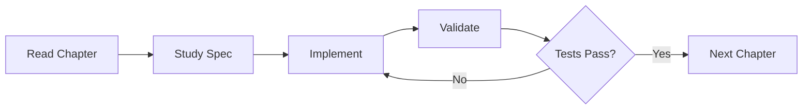

# Chapter 0: Setup

> **This chapter is optional.** If you want to read without building, skip to [Chapter 1](ch01-the-llm-inference-problem.md). Every concept is explained with diagrams, traces, and full expected output — you never need to run code to understand.

---

## The Workflow

Every chapter follows the same loop (Figure 0.3):


**Figure 0.3** — The read-study-implement-validate workflow loop.

1. **Read the chapter** — understand the concept, the why, the tradeoffs
2. **Study the spec** (`spec/chNN/`) — interface definitions, component diagrams, expected behavior
3. **Implement it** — in your language of choice, or paste the prompt template into an LLM
4. **Validate** — run `pytest spec/chNN/validation/` to check your implementation
5. **Move on** — the next chapter builds on what you just built

---

## If You Get Stuck

Every chapter includes a `prompt-template.md` — a ready-to-paste prompt that gives an LLM everything it needs to generate a working implementation. This is not cheating. It is the workflow this book is designed for. The learning happens when you read the spec, understand the constraints, and then evaluate whether the generated code is correct.

---

## Prerequisites

- **A language you know well** — the specs are language-agnostic. Use whatever you are productive in.
- **Python 3.10+ with pytest** — for running the validation tests
- **Basic ML knowledge** — you should know roughly what a neural network is, what tensors are, and have heard the word "attention" before. We will explain everything else.
- **For Chapter 4+** — a machine that can run GPT-2 (CPU works, GPU is faster)

---

## Spec Structure

Each chapter's spec lives in `spec/chNN/`:

```
spec/chNN/
├── prompt-template.md      What to implement (language-agnostic)
├── interface-spec.md       API contracts and types
├── expected-output.txt     What the program should produce
├── component-diagram.md    Architecture diagram
├── sequence-diagram.md     Data flow diagram
└── validation/
    └── test_chNN.py        Automated tests your code must pass
```

---

## Using Claude Code?

Install The Builder's Handbook (TBH) plugin for a guided build-along experience — specs, hints, validation, and progress tracking right inside your terminal:

```bash
/plugin marketplace add tbhbooks/tbh-skill
/plugin install tbh@the-builders-handbook
/tbh:setup
```

---

*Next: [Chapter 1 — The LLM Inference Problem](ch01-the-llm-inference-problem.md)*
