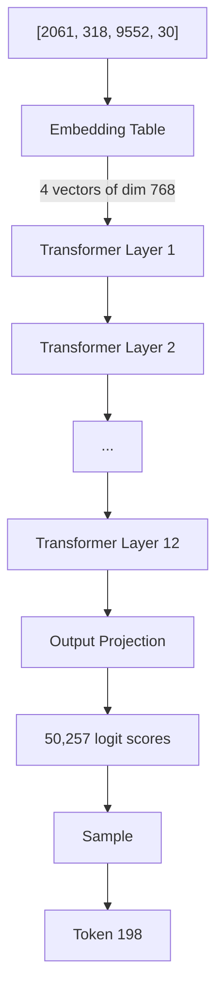
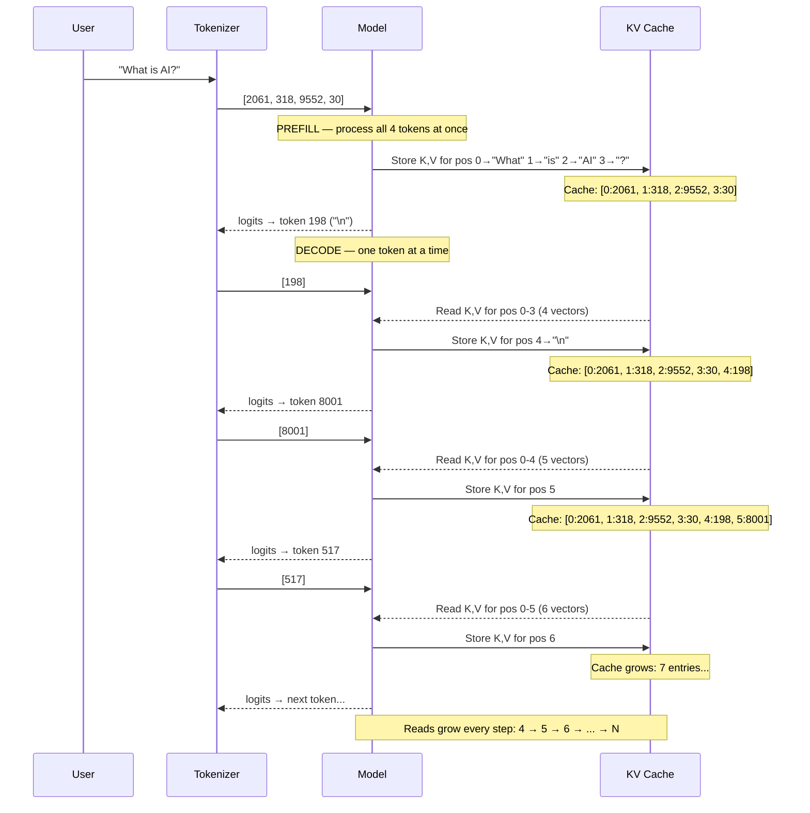
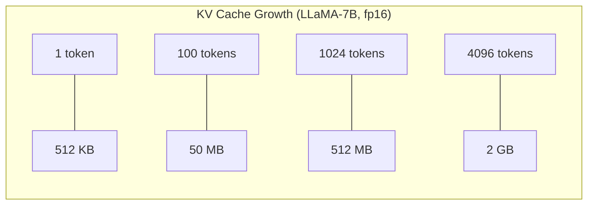
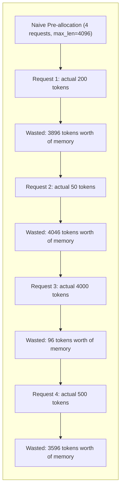

# Chapter 1: The LLM Inference Problem

---

## Four Integers Walk Into a Model

You type three words and a question mark into a chat interface:

> "What is AI?"

Simple enough. But the model behind that interface does not see words. It does not see characters. It does not see a question. It sees this:

```
[2061, 318, 9552, 30]
```

Four integers. That is all. A tokenizer — a lookup table with rules — has carved your sentence into pieces and replaced each piece with an integer ID. "What" became `2061`. " is" (with the leading space) became `318`. " AI" became `9552`. "?" became `30`.

Pause on this. Every prompt, every conversation, every hundred-page document pasted into a chat window — all of it enters the model as a flat array of integers. And every response leaves the same way: one integer at a time, decoded back into text by the same tokenizer.

The tokenizer's vocabulary is fixed at training time. GPT-2 has 50,257 tokens. LLaMA uses 32,000. Each token maps to a fragment of text — sometimes a whole word ("the"), sometimes a subword ("understanding" might split into "under" + "standing"), sometimes a single character. The word " Hello" (with a leading space) is a different token than "Hello" (without one). Punctuation gets its own tokens. Common phrases sometimes merge into single tokens.

You do not need to understand the internals of byte-pair encoding right now. What matters is this: **the model's entire world is sequences of integers.** Everything that follows — the computation, the memory, the engineering challenges — operates on these integer sequences.

Our four tokens are about to go on a journey. Let's follow them.

---

## The Forward Pass

Your four token IDs `[2061, 318, 9552, 30]` enter the model. Here is what happens, as shown in Figure 1.1:


**Figure 1.1** — A single forward pass from token IDs to sampled output.

**Embedding.** Each integer looks up a dense vector — a list of floating-point numbers. For GPT-2, each vector has 768 dimensions. For LLaMA-70B, each vector has 8,192 dimensions. Your four tokens become a matrix of shape `[4, 768]` (in the GPT-2 case). Four rows, one per token, each row a 768-dimensional vector.

**Transformer layers.** That matrix flows through a stack of identical layers. GPT-2 has 12 layers. LLaMA-7B has 32. LLaMA-70B has 80. Each layer does roughly the same thing:

1. **Self-attention** — each token looks at every other token in the sequence, computing "how relevant is position j to position i?" The result is a weighted combination of information from all positions.
2. **Feed-forward network** — each token passes through a small neural network independently. Two matrix multiplications with a nonlinearity in between.

The matrix goes in, gets transformed, and comes out the other side — same shape, different values. Layer after layer.

**Logits.** After the final layer, the model projects the last token's representation into a vector of scores — one score for every token in the vocabulary. For GPT-2, that is 50,257 scores. These are called *logits*. Higher score means the model thinks that token is more likely to come next.

**Sampling.** You pick a token from the logits. The simplest strategy is greedy: take the argmax. More sophisticated strategies (temperature scaling, top-k, top-p) add controlled randomness. Either way, you get a single integer: the next token ID.

That is one forward pass. One token generated. The model looked at `[2061, 318, 9552, 30]` and decided the next token should be, say, `198`.

Now here is the part that changes everything.

---

## One Token at a Time

The model generates tokens **one at a time**.

To produce the second token, you feed the first generated token back into the model, along with all the context that came before it. To produce the third, you feed the second back in, again with all prior context. Each token depends on every token before it. This is **autoregressive decoding**.

Watch it unfold in Figure 1.2:


**Figure 1.2** — Prefill and decode phases with KV cache growth.

The KV cache is a running ledger. Position 0 always holds the K,V vectors computed from token `2061` ("What"). Position 1 holds those from `318` (" is"). As generation continues, the cache grows by one entry per step — and every step must read *the entire ledger* to compute attention.

At position 5, the model reads 5 sets of K,V vectors. At position 100, it reads 100. At position 4096, it reads 4096.

This is not optional. It is how self-attention works. To decide what the next token should be, the model computes attention scores between the new token and *every token that has come before*. The attention mechanism demands access to the full history.

Now consider: what if you did not cache those keys and values? Every time you generate a token, you would have to reprocess the *entire sequence from scratch*. Generating 1024 tokens would require processing `1 + 2 + 3 + ... + 1024 = 524,800` token-layer computations. That is quadratic growth. For 4096 tokens, it is over 8 million passes.

Clearly, you cache them. But that cache has a cost.

---

## Two Phases, One Cache

LLM inference is not one thing. It is two completely different operations stitched together.

### Phase 1: Prefill

When your prompt arrives — `[2061, 318, 9552, 30]` — the model processes all four tokens at once. Not one by one. All four flow through every layer simultaneously.

This works because you already have the entire input. Token at position 3 can attend to positions 0, 1, and 2. Token at position 2 can attend to 0 and 1. All of these attention computations are independent and can execute in parallel. The hardware loves this. Every compute unit is busy. The matrix multiplications are large and efficient.

Prefill is **compute-bound**. The bottleneck is how fast the hardware can multiply matrices.

### Phase 2: Decode

After prefill, generation begins. Now you produce one token per forward pass. The input is a single token. The matrices are tiny — one row instead of many. The hardware's compute units sit mostly idle.

But the model still needs to read the full KV cache — every key and value vector, at every layer, for every previous position. The data must stream from memory into the compute units before anything useful happens.

Decode is **memory-bound**. The bottleneck is memory bandwidth — how fast data can flow from memory to compute.

### The comparison

| Characteristic | Prefill | Decode |
|---|---|---|
| **Input size** | Full prompt (N tokens) | Single token |
| **Parallelism** | All tokens processed in parallel | Strictly sequential |
| **Bottleneck** | Compute (matrix multiply speed) | Memory (bandwidth for KV cache reads) |
| **Hardware utilization** | High — large matrix ops | Low — tiny ops, waiting on memory |
| **KV cache** | Writes K,V for all prompt positions | Reads all prior K,V; writes one new K,V |
| **Latency** | Proportional to prompt length | Roughly constant per token |
| **User perception** | "Time to first token" (TTFT) | "Time between tokens" (inter-token latency) |

This two-phase structure is not an implementation detail. It shapes the entire user experience. A user sending a long prompt waits for prefill to finish before seeing the first token. Then tokens stream out at a roughly constant rate during decode. Optimizing TTFT means optimizing prefill. Optimizing throughput means optimizing decode. They require different strategies.

### The KV Cache

Here is the key insight that makes autoregressive decoding practical: **cache the keys and values**.

During prefill, as each token passes through each layer, the model computes a key vector (K) and a value vector (V) for that position. Instead of discarding them, you store them. This is the KV cache.

During decode, when processing the new token at position `t`:
1. Compute K and V for position `t` only (not for all prior positions)
2. Read the cached K and V for positions `0` through `t-1`
3. Compute attention using all the K,V pairs
4. Store the new K,V pair in the cache for future steps

The KV cache transforms generation from quadratic compute to linear compute. It trades **memory** for **computation**. And as we are about to see, the memory cost is staggering.

---

## The Memory Wall

Let's do the math. In each transformer layer, each token stores a key vector and a value vector. Each vector has size `num_kv_heads x head_dim`. We store two of them (K and V). So the per-token, per-layer storage is:

```
KV per token per layer = 2 x num_kv_heads x head_dim x bytes_per_element
```

For a sequence of length `seq_len` across all layers:

```
KV cache size = seq_len x num_layers x 2 x num_kv_heads x head_dim x bytes_per_element
```

Let's calculate for three real models, using fp16 (2 bytes per element):

### GPT-2 (124M parameters)

- **Layers:** 12
- **KV heads:** 12 (standard multi-head attention)
- **Head dimension:** 64
- **Bytes per element:** 2 (fp16)

Per token per layer:
```
2 x 12 x 64 x 2 = 3,072 bytes (3 KB)
```

Per token across all layers:
```
3,072 x 12 = 36,864 bytes (36 KB)
```

For a 1024-token sequence:
```
36,864 x 1,024 = 37,748,736 bytes ≈ 36 MB
```

For a 4096-token sequence:
```
36,864 x 4,096 = 150,994,944 bytes ≈ 144 MB
```

Manageable. GPT-2 is a small model. But watch what happens as we scale up.

### LLaMA-7B

- **Layers:** 32
- **KV heads:** 32 (multi-head attention)
- **Head dimension:** 128
- **Bytes per element:** 2 (fp16)

Per token per layer:
```
2 x 32 x 128 x 2 = 16,384 bytes (16 KB)
```

Per token across all layers:
```
16,384 x 32 = 524,288 bytes (512 KB)
```

For 1024 tokens: **512 MB**

For 4096 tokens: **2 GB**

Half a megabyte per token. Two gigabytes for a single request at LLaMA's default context length. And LLaMA-7B is considered a *small* model by today's standards.

### LLaMA-70B

- **Layers:** 80
- **KV heads:** 8 (grouped-query attention — a compression technique)
- **Head dimension:** 128
- **Bytes per element:** 2 (fp16)

Per token per layer:
```
2 x 8 x 128 x 2 = 4,096 bytes (4 KB)
```

Per token across all layers:
```
4,096 x 80 = 327,680 bytes (320 KB)
```

For 1024 tokens: **320 MB**

For 4096 tokens: **1.28 GB**

Notice something: LLaMA-70B actually uses *less* KV cache per token than LLaMA-7B, thanks to grouped-query attention (8 KV heads instead of 32). This is not an accident — it is an architectural decision specifically designed to reduce KV cache memory at scale. But even with this optimization, the numbers are enormous.

### The full picture

| Model | Per Token | 1024 Tokens | 4096 Tokens |
|-------|-----------|-------------|-------------|
| GPT-2 (124M) | 36 KB | 36 MB | 144 MB |
| LLaMA-7B | 512 KB | 512 MB | 2 GB |
| LLaMA-70B | 320 KB | 320 MB | 1.28 GB |


**Figure 1.3** — KV cache memory scaling for LLaMA-7B.

As Figure 1.3 makes viscerally clear, the growth is linear in sequence length. But linear in *hundreds of kilobytes* per token. And we have not even talked about serving multiple requests yet.

---

## The Concurrency Ceiling

Now the critical question. You are not serving one request. You are serving many. How many can you handle?

Let's do the scenario. You have a high-end GPU with 80 GB of memory. You are serving LLaMA-70B, whose model weights consume about 140 GB in fp16. You use two GPUs with tensor parallelism — 70 GB of weights per GPU. That leaves roughly **10 GB free per GPU** for KV cache and other overhead.

At 4096 token context length, each LLaMA-70B request needs 1.28 GB of KV cache.

```
Available memory:    10 GB
Per request:         1.28 GB
Max concurrent:      10 / 1.28 = 7.8
```

**Seven requests.** On a flagship GPU that costs tens of thousands of dollars. Seven.

Let's look at the full concurrency table:

| Model | KV @ 4096 tokens | Max Requests in 10 GB |
|-------|-------------------|-----------------------|
| GPT-2 | 144 MB | 71 |
| LLaMA-7B | 2 GB | 5 |
| LLaMA-70B | 1.28 GB | 7 |

And it gets worse. These numbers assume perfect memory utilization — every byte of that 10 GB is packed tight with KV cache data, no gaps, no waste, no fragmentation. In practice, naive memory allocation is far less efficient (Figure 1.4).

### Why naive allocation fails

Here is the problem. When a request arrives, you do not know how long the response will be. It might generate 10 tokens. It might generate 4096. If you pre-allocate memory for the maximum possible sequence length for every request, you waste enormous amounts of memory on tokens that have not been generated yet.


**Figure 1.4** — Naive pre-allocation wastes most of the memory budget.

In this example, the four requests together use memory for `4 x 4096 = 16,384` tokens, but only `200 + 50 + 4000 + 500 = 4,750` tokens are actually needed. That is **71% waste**. Your 10 GB of KV cache budget is really only 2.9 GB of useful storage.

And that is not even the worst problem. When requests finish at different times, their memory gets freed, leaving gaps. New requests arrive with different lengths, and those gaps may not be the right size. The memory fragments. Utilization drops further.

This is the same problem operating systems solved decades ago with virtual memory and paging. And it is exactly the insight vLLM will apply to KV cache management.

But we are getting ahead of ourselves.

---

## Build It Yourself

Time to make this concrete. Build a program that calculates KV cache memory for different model configurations and displays the results.

Everything you need is in [`spec/ch01/`](../spec/ch01/):

| Artifact | What It Contains |
|----------|-----------------|
| `component-diagram.md` | The ModelConfig structure and its methods |
| `sequence-diagram.md` | Program flow from config to output |
| `interface-spec.md` | Type definitions, formulas, exact constraints |
| `expected-output.txt` | The exact output your program should produce |
| `prompt-template.md` | Paste into an LLM to generate an implementation |

### Quick Start

1. Read `spec/ch01/interface-spec.md` for the full contract
2. Implement it in your language of choice (or use the prompt template with an LLM)
3. Validate: `cd spec/ch01/validation && pytest`

### What correct looks like

Your program should output five sections:

1. **KV Cache Memory** — per-token and per-token-per-layer sizes for GPT-2, LLaMA-7B, and LLaMA-70B
2. **Sequence Scaling** — memory for 1024 and 4096 token sequences
3. **Concurrency Ceiling** — max concurrent requests given 10 GB of free memory
4. **Memory Wall** — total memory needed for 1, 2, 4, 8, 16, 32 concurrent requests at 4096 tokens
5. **Prefill vs Decode** — summary of the two phases and their bottlenecks

---

## Pencil, Paper, Calculator

Work through the KV cache calculation by hand before running your program. The formula is:

```
KV cache (bytes) = seq_len x num_layers x 2 x num_kv_heads x head_dim x bytes_per_element
```

**Exercise 1: Verify GPT-2**

Parameters: `seq_len=1024`, `num_layers=12`, `num_kv_heads=12`, `head_dim=64`, `bytes=2` (fp16)

```
1024 x 12 x 2 x 12 x 64 x 2 = ?
```

Break it down: `1024 x 12 = 12,288`. Then `12,288 x 2 = 24,576`. Then `24,576 x 12 = 294,912`. Then `294,912 x 64 = 18,874,368`. Then `18,874,368 x 2 = 37,748,736 bytes` = approximately **36 MB**.

**Exercise 2: Verify LLaMA-70B**

Parameters: `seq_len=4096`, `num_layers=80`, `num_kv_heads=8`, `head_dim=128`, `bytes=2` (fp16)

```
4096 x 80 x 2 x 8 x 128 x 2 = ?
```

Step by step: `4096 x 80 = 327,680`. Then `327,680 x 2 = 655,360`. Then `655,360 x 8 = 5,242,880`. Then `5,242,880 x 128 = 671,088,640`. Then `671,088,640 x 2 = 1,342,177,280 bytes` = approximately **1.28 GB**.

One request. 1.28 GB. On a GPU with only 10 GB free.

**Exercise 3: The "How Many Requests?" Question**

You have 10 GB free for KV cache. Each LLaMA-70B request at 4096 tokens needs 1.28 GB.

- How many concurrent requests? `10 / 1.28 = 7.8` -- so **7**.
- What if the context is 8192 tokens? Each request needs 2.56 GB. Max concurrent: `10 / 2.56 = 3.9` -- so **3**.
- What if you could magically eliminate 50% of the waste from fragmentation? You still only get 14 requests at 4096 tokens.

The problem is not fragmentation. The problem is that KV cache memory is fundamentally enormous.

**Exercise 4: At what sequence length does a single LLaMA-7B request consume all 10 GB?**

```
10 GB = seq_len x 32 x 2 x 32 x 128 x 2
10,737,418,240 = seq_len x 524,288
seq_len = 20,480
```

A single request generating 20,480 tokens (about 15,000 words) would consume all 10 GB. That is about 30 pages of text. One request. All the memory.

---

## What You Have Learned

- The model sees integers, not words. Tokenization converts text to token IDs and back.
- A forward pass goes: embedding → transformer layers → logits → sample → one token.
- Autoregressive decoding generates one token at a time, each depending on all previous tokens.
- The KV cache stores key and value vectors to avoid recomputation. It trades memory for compute.
- Prefill is compute-bound (parallel, large matrices). Decode is memory-bound (sequential, massive reads).
- KV cache memory scales linearly with sequence length, number of layers, and number of KV heads.
- On a flagship GPU, you might only serve seven concurrent LLaMA-70B requests. Memory -- not compute -- is the bottleneck.

---

## Seven Requests on a Flagship GPU

Seven concurrent requests on a flagship GPU.

The KV cache for a single LLaMA-70B request at full context length consumes over a gigabyte. Multiply that by a hundred concurrent requests and you need 128 GB just for cached keys and values — more memory than the model weights themselves.

And here is the kicker: most of that memory is wasted. Requests arrive at different times, generate different numbers of tokens, and finish unpredictably. Pre-allocated memory sits idle. Freed memory fragments into unusable gaps. Real utilization might be 30-40% of theoretical capacity.

This is the problem vLLM was invented to solve. Not by using more GPUs. Not by compressing the model. By borrowing an idea that operating systems have used since the 1960s: **virtual memory with paging**.

Instead of allocating one giant contiguous block of memory per request, what if you split the KV cache into small, fixed-size *blocks*? Allocate them on demand as tokens are generated. Free them instantly when a request finishes. Share them between sequences that have common prefixes. Pack them tight, with no fragmentation.

This is **PagedAttention**. Seven concurrent requests becomes seventy. The same GPU, the same model, ten times the throughput.

That is where we are headed. Turn the page.

---

*Next: [Chapter 2 -- vLLM Architecture Overview](ch02-vllm-architecture-overview.md)*
