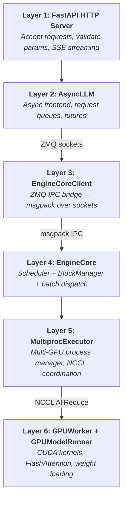
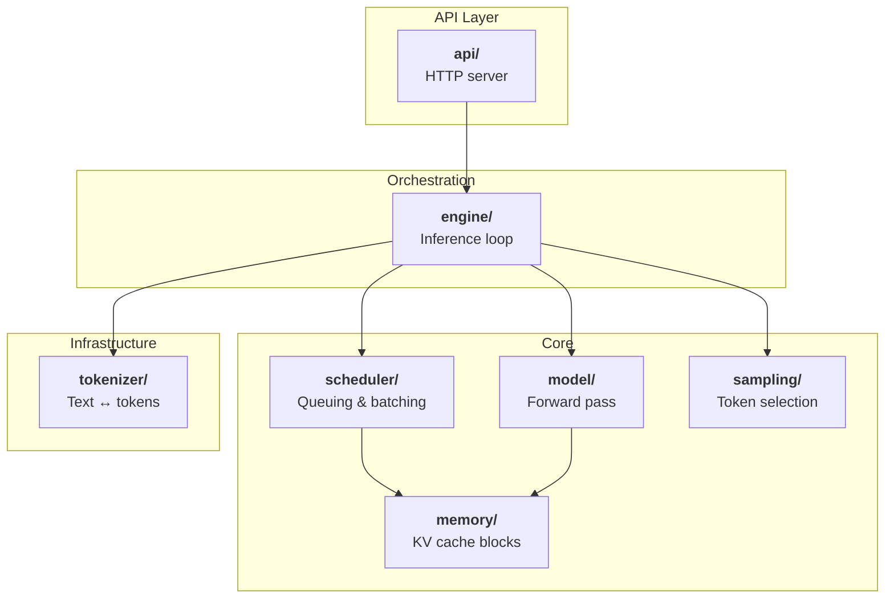
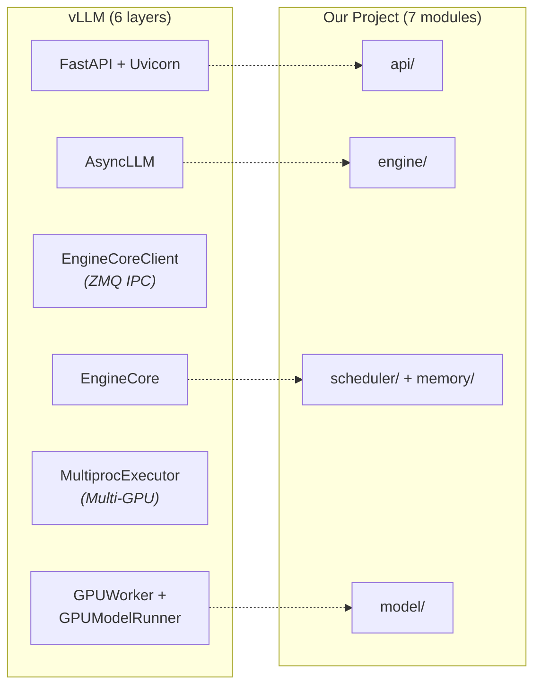
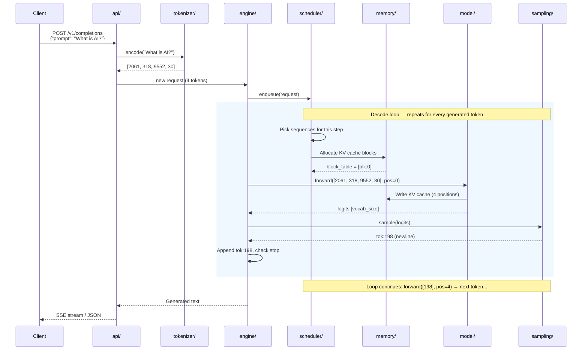

# Chapter 2: vLLM Architecture Overview

> *"A complex system that works is invariably found to have evolved from a simple system that worked."*
> -- John Gall, *General Systemantics*

---

## The Spaceship Control Panel

Open the vLLM source tree.

Six layers deep. ZMQ push/pull sockets shuttling msgpack-serialized messages between processes. CUDA graphs recording entire forward passes for replay. NCCL collectives synchronizing tensor shards across eight GPUs. A multi-process executor spawning workers, each with its own CUDA context, its own memory pool, its own error recovery path.

It looks like a spaceship control panel.

You count the layers between an HTTP request arriving and a single token being produced: API server, async frontend, IPC bridge, engine core, executor, GPU workers. Six layers. Each one has its own process boundary, its own serialization format, its own failure modes.

And somewhere in the middle of all this machinery, a scheduler is deciding which sequences get to run. A block manager is playing Tetris with GPU memory. A sampler is turning floating-point scores into words.

Take a breath.

This chapter is your map.

---

## Every Layer Is Load-Bearing

Here is the thing about vLLM's complexity: every single layer exists for a reason.

The ZMQ IPC boundary between AsyncLLM and EngineCore? Python's Global Interpreter Lock would otherwise prevent the scheduler from running while the API layer processes requests. Separate processes solve that.

The MultiprocExecutor spawning one worker per GPU? Multi-GPU inference requires one process per device rank, each with its own memory context, communicating through NCCL collectives for tensor parallelism.

CUDA graph capture in GPUModelRunner? It eliminates kernel launch overhead by recording an entire forward pass as a replayable graph. Production workloads demand it.

Three different EngineCoreClient variants? They serve three deployment modes: embedded synchronous, embedded asynchronous, and full server mode.

Every layer is load-bearing. vLLM serves hundreds of thousands of requests per second at companies running fleets of H100s. This is not accidental complexity. This is the scar tissue of solving real problems at real scale.

But you do not need all of it to understand how LLM inference works.

Minimal reimplementations have shown the core loop -- schedule, allocate, execute, sample -- fits in roughly 1,200 lines. The architecture matters more than the production plumbing. You need to understand the bones, not the deployment scaffolding.

---

## Strip It to the Bones

Strip it down to the bones. Same skeleton, fewer layers.

### vLLM's Six Layers

Here is what vLLM looks like in production:

**Figure 2.1** — vLLM's six-layer production architecture.

Each layer adds a capability:

**Layer 1 -- FastAPI HTTP Server.** The front door. OpenAI-compatible endpoints receive chat completions, raw completions, and embedding requests. SSE streams tokens back to clients.

**Layer 2 -- AsyncLLM.** The receptionist. Takes raw prompts, tokenizes them through an InputProcessor, hands them to the engine, runs an OutputProcessor that detokenizes results and streams them back.

**Layer 3 -- EngineCoreClient.** The courier. Serializes requests with msgpack, sends them over ZMQ sockets to a separate engine process, deserializes the responses. Exists entirely to dodge the GIL.

**Layer 4 -- EngineCore.** The brain. A tight loop: call the scheduler, build batches, hand them to the executor, process results. Also manages grammar-guided generation and KV cache transfer for disaggregated architectures.

**Layer 5 -- MultiprocExecutor.** The dispatcher. Spawns one worker process per GPU, broadcasts scheduler output to all of them, collects results. Workers coordinate through NCCL.

**Layer 6 -- GPUWorker + GPUModelRunner.** The muscle. Runs the actual neural network forward pass. Manages CUDA graphs, PagedAttention, FlashAttention kernels.

The red layers in Figure 2.1? Those are the ones we drop. They solve problems we are choosing not to have.

### Our Seven-Module Architecture

We collapse those six layers into seven flat modules:

**Figure 2.2** — Our seven-module flat architecture.

Seven modules. Each maps to a concept you can study, build, and test independently.

| Module | Responsibility |
|--------|---------------|
| `api/` | HTTP API layer (OpenAI-compatible endpoints) |
| `engine/` | Inference loop orchestration -- the heartbeat |
| `scheduler/` | Request queuing, batching, preemption decisions |
| `model/` | Transformer forward pass, weight loading |
| `memory/` | KV cache block management (PagedAttention) |
| `sampling/` | Token selection (greedy, top-k, top-p, temperature) |
| `tokenizer/` | Text-to-tokens and tokens-to-text conversion |

No process boundaries between them. No serialization. Direct function calls. The scheduler calls the memory manager. The engine calls the model. Simple.

### The Mapping

How do vLLM's six layers become our seven modules?

**Figure 2.3** — Mapping vLLM's six layers to our seven modules.

Two vLLM layers vanish entirely. Here is the full mapping with book chapters:

| vLLM Component | What It Does | Our Module | Chapter |
|---|---|---|---|
| FastAPI + Uvicorn | HTTP server, OpenAI-compatible API | `api/` | Ch 10 |
| AsyncLLM | Async frontend, tokenization, detokenization | `engine/` | Ch 11 |
| EngineCoreClient | ZMQ IPC bridge | *(removed -- single process)* | -- |
| EngineCore | Scheduler loop, batch assembly | `engine/` | Ch 11 |
| Scheduler | Batch selection, preemption, priorities | `scheduler/` | Ch 05 |
| BlockManager + BlockPool | Block allocation, prefix caching | `memory/` | Ch 06 |
| MultiprocExecutor | Multi-GPU worker management | *(removed -- single GPU)* | -- |
| GPUWorker | Per-rank GPU process | *(removed -- single GPU)* | -- |
| GPUModelRunner | Forward pass, CUDA graphs | `model/` | Ch 07-08 |
| SamplingParams + Sampler | Logit processing, token selection | `sampling/` | Ch 09 |
| TokenizerGroup | Tokenization and detokenization | `tokenizer/` | Ch 04 |

Notice the two rows marked "removed." The EngineCoreClient disappears because we run in a single process -- no GIL to dodge, so no need for IPC. The MultiprocExecutor and GPUWorker disappear because we target a single GPU -- no tensor parallelism, no NCCL. Two entire layers of vLLM's architecture, gone. Not because they are wrong, but because they solve problems we are choosing not to have yet.

### What We Drop and Why

| Dropped Feature | Why It Exists in vLLM | Why We Skip It |
|----------------|----------------------|----------------|
| ZMQ IPC (EngineCoreClient) | Dodges Python's GIL | Single process, no GIL -- direct function calls |
| Multi-GPU (MultiprocExecutor) | Tensor parallelism for large models | Single GPU keeps memory management simple |
| CUDA graphs | Eliminates kernel launch overhead | An optimization, not needed to understand the core |
| Speculative decoding | Generates multiple tokens per step | An optimization on top of the base loop |
| LoRA adapters | Serve multiple fine-tuned models | Adds memory management complexity |

The goal: understand every component. No "this talks to another process somewhere." No "this calls into a CUDA graph captured earlier." Just seven modules doing exactly what you would expect.

---

## Following "What is AI?" Through Nine Steps

Now the fun part. Let us trace a real request through the system.

A user types: **"What is AI?"**

Those four words become four token IDs: `[2061, 318, 9552, 30]`. Watch what happens to them.

**Figure 2.4** — The nine-step token journey from prompt to response.

Figure 2.4 traces the full lifecycle. Nine steps. Let us walk through each one.

### Step 1: ARRIVE

An HTTP POST hits the `api/` module. The request body contains a prompt -- `"What is AI?"` -- and sampling parameters: temperature, max tokens, maybe a stop sequence. The API validates the parameters. Bad request? Return a 400. Good request? Pass it inward.

### Step 2: TOKENIZE

The `tokenizer/` module converts the raw text into token IDs.

`"What is AI?" → [2061, 318, 9552, 30]`

Four tokens. Four integers. This is the language the model speaks. From this point forward, the system works entirely in token space. Text is gone.

### Step 3: ENQUEUE

The `engine/` creates a sequence object -- an internal representation of this request with its token IDs, sampling parameters, and lifecycle state. It hands the sequence to the `scheduler/`, which places it in the **WAITING** queue.

From the scheduler's point of view, a new sequence just appeared. It does not care where it came from. It only knows: here is a sequence with 4 prompt tokens that wants up to 128 generated tokens. It sits in WAITING until the scheduler decides it is time to run.

### Step 4: SCHEDULE

On the next engine step, the scheduler examines all sequences. WAITING queue? One sequence. RUNNING set? Empty (or maybe already occupied by other requests).

The scheduler asks the memory manager: "How many free KV cache blocks do we have?" If enough blocks exist to accommodate the new sequence's prompt, the scheduler promotes it from WAITING to RUNNING. If memory is tight, the scheduler might preempt a lower-priority running sequence -- swap its blocks to CPU, move it to a SWAPPED queue -- to make room.

This is the core decision loop. Every single engine step, the scheduler re-evaluates: who runs, who waits, who gets preempted.

### Step 5: ALLOCATE

The `memory/` module assigns KV cache blocks. Our prompt has 4 tokens. With a block size of 16, that fits in a single block. The block table for this sequence becomes `[blk:0]`. Free blocks drop from 254 to 253.

Meanwhile, the memory manager is thinking ahead. As the model generates tokens, this sequence will grow. When it hits token 17, it will need a second block. The memory manager does not allocate that block yet -- it waits until it is needed. Lazy allocation. Every block counts.

### Step 6: EXECUTE

The `model/` module takes the batch of scheduled sequences, assembles input tensors -- token IDs, position indices, block tables -- and runs the transformer forward pass.

Twelve layers of attention and feed-forward networks (for a small model like GPT-2). Each attention layer reads from the KV cache for past tokens and writes new key-value pairs for the current tokens. The block table tells the attention kernel where to find and store those values.

Out the other end: a tensor of logits. One score for every token in the vocabulary. For GPT-2, that is 50,257 floating-point numbers.

### Step 7: SAMPLE

The `sampling/` module takes those 50,257 logits and picks one token.

Greedy decoding? Take the argmax. Temperature sampling? Divide the logits by a temperature value, apply softmax, sample from the resulting probability distribution. Top-k? Zero out everything except the top k logits. Top-p (nucleus)? Keep the smallest set of logits whose cumulative probability exceeds p.

The result: a single token ID. Say `tok:198` -- a newline character. The sampler does not care what it means. It just picked a number.

### Step 8: UPDATE

The `engine/` appends `tok:198` to the sequence. The token list grows from `[2061, 318, 9552, 30]` to `[2061, 318, 9552, 30, 198]`.

Is the sequence done? Check: Is the new token the EOS (end-of-sequence) token? Have we hit `max_tokens`? Did the client disconnect? If none of those, the sequence stays RUNNING for the next iteration.

### Step 9: RESPOND

The `api/` module takes the new token, detokenizes it, and streams it back to the client. In streaming mode, each token goes out as a Server-Sent Event the moment it is produced. In non-streaming mode, all tokens accumulate until the sequence finishes.

### The Loop

Steps 4 through 8 repeat. Every iteration generates one token (in standard decoding). For `max_tokens=100`, the loop runs up to 100 times. Each iteration, the scheduler re-evaluates. Each iteration, the model processes one more token position. Each iteration, the KV cache grows by one slot.

This is continuous batching in action. While our sequence is decoding at position 5, a new request might arrive and get scheduled into the same batch at position 0. The scheduler does not wait for one sequence to finish before starting another. They run together, sharing GPU compute in the same forward pass.

---

## Your Blueprint

Everything you need to implement the Chapter 2 program -- a CLI that prints these architecture diagrams and the request lifecycle in ASCII art -- lives in [`spec/ch02/`](../spec/ch02/):

| Artifact | What It Contains |
|----------|-----------------|
| `component-diagram.md` | vLLM and our architecture diagrams |
| `sequence-diagram.md` | Request lifecycle flow |
| `interface-spec.md` | Program structure, content requirements |
| `expected-output.txt` | Exact output format to match |
| `prompt-template.md` | Paste into an LLM to generate an implementation |

Quick start:
1. Read `spec/ch02/interface-spec.md` for the full contract
2. Implement (or use `prompt-template.md`)
3. Validate: `cd spec/ch02/validation && pytest`

---

## The Architecture Printer in Action

When implemented, the architecture printer outputs six sections of structured text: the vLLM six-layer diagram, our seven-module diagram, the mapping table, the full nine-step request lifecycle trace with "What is AI?" as the running example, a simplifications table, and a footer teasing what comes next.

It is a print-and-understand exercise. The code is trivial -- string formatting and stdout. But the content is the foundation for every chapter that follows.

You should be able to answer these questions after studying the output:

- How many layers does a request pass through in vLLM? In our project?
- Which two vLLM layers do we remove, and why?
- What are the nine steps in the request lifecycle?
- Which steps repeat in the decode loop?
- What does the scheduler check before admitting a new sequence?

---

## Map the Layers Yourself

For each vLLM component below, find our equivalent module and name the chapter that builds it:

1. **AsyncLLM's InputProcessor** -- Where does prompt preprocessing live in our project?
2. **EngineCoreClient's ZMQ transport** -- Why don't we need this? What language/runtime feature makes it unnecessary?
3. **The Scheduler's interaction with KVCacheManager** -- Which two of our modules correspond to this relationship?
4. **GPUModelRunner's CUDA graph management** -- What do we do instead, and why?
5. **The OutputProcessor's incremental detokenization** -- Where does streaming token output live in our module map?

Bonus: Look at a minimal vLLM reimplementation (like nano-vllm). Count its modules. Compare them to our seven. What did it skip that we keep? What maps directly to one of our modules?

---

## Pouring the Foundation

You now have the map. Six layers of vLLM. Seven modules in our project. A clear mapping between them. A nine-step request lifecycle you can trace with your eyes closed. You know what we keep, what we drop, and why.

But a map is not the territory.

Now you know the destination. Let us start building. But first -- the project needs structure. An empty directory, a set of module boundaries, three interface definitions, and a CLI that compiles.

Chapter 3: we pour the foundation.
