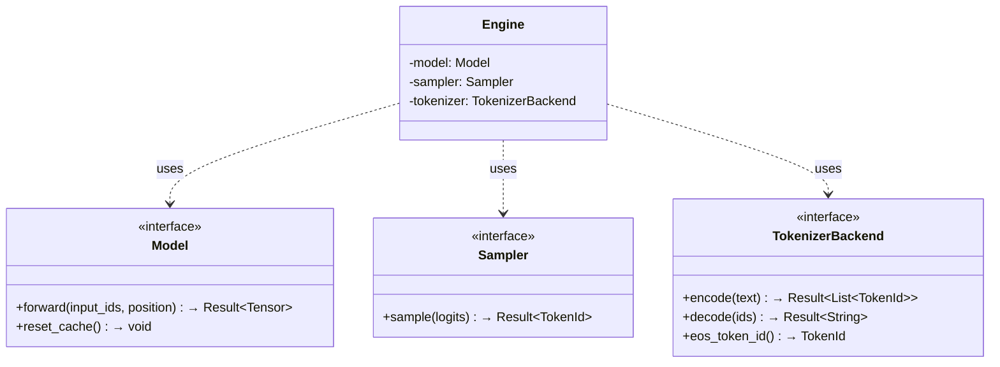
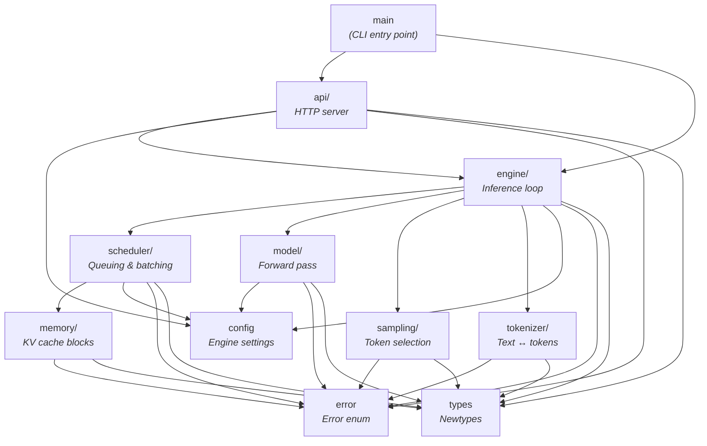

# Chapter 3: Setting Up the Project

> *"Plans are worthless, but planning is everything."*
> -- Dwight D. Eisenhower

---

## An Empty Directory

An empty directory. A blinking cursor.

```
~/project $ ls
~/project $
```

Nothing. No code. No dependencies. No build system.

You know the architecture from Chapter 2: seven modules, three core interfaces, a nine-step request lifecycle. You can trace "What is AI?" through the entire system in your head.

But knowing the architecture and having a project are two different things. Time to make the skeleton real.

By the end of this chapter, that empty directory will contain a compiling project with seven domain modules, three interface definitions, four newtypes, a centralized error type, and a CLI with two subcommands. Most of the modules will be empty stubs. That is the point. You are pouring the foundation, not installing the kitchen faucet.

---

## How Projects Die

Inference engines touch everything. HTTP handling. Tensor math. Memory management. Scheduling algorithms. Tokenization. Without boundaries, code entangles fast.

The scheduler starts importing model internals. The API layer knows about tensor shapes. The sampling module reaches into the memory manager. Testing anything requires loading a real model, allocating GPU memory, and spinning up the whole system.

This is how projects die. Not from hard problems, but from soft boundaries.

Look at vLLM's source tree: `vllm/engine/`, `vllm/core/scheduler.py`, `vllm/worker/`, `vllm/model_executor/`, `vllm/attention/`. Each directory owns a single concern. The scheduler does not know how attention works. The model executor does not know how requests are queued. These boundaries are load-bearing walls that allow hundreds of contributors to work on the same codebase without constant collisions.

We have the advantage of starting fresh. We draw those boundaries on day one, before a single line of business logic exists.

The fix: **define interfaces first.** Every module communicates through interfaces. Implementations come later. Tests can mock anything.

---

## Seven Modules, Three Contracts, Zero Business Logic

Seven modules. Three core interfaces. Four newtypes. One error enum. A CLI with two subcommands.

Nothing works yet. But everything compiles, and the architecture is visible in the directory tree.

### The Three Core Interfaces

These are the contracts between modules. The engine talks to the model through an interface. The engine talks to the sampler through an interface. The engine talks to the tokenizer through an interface. No concrete types leak across boundaries.


**Figure 3.1** — The three core interfaces and the engine that depends on them.

The contracts in Figure 3.1 are deliberately minimal.

**Model** -- "Give me token IDs and a position, I will give you logits." That is its entire contract. GPT-2, LLaMA, Mistral -- they all look the same from the engine's perspective. Token IDs in, logits out. The `reset_cache()` method clears KV state between independent requests.

**Sampler** -- "Give me logits, I will give you a token ID." One method. The simplest implementation is argmax (greedy). A sophisticated one applies temperature, top-k, top-p, repetition penalties. The engine does not care which. Logits in, token out.

**TokenizerBackend** -- "Give me text, I will give you token IDs. Give me token IDs, I will give you text." Plus one critical method: `eos_token_id()`, so the engine knows when generation is complete.

Three interfaces. Three contracts. The engine is just a loop that calls all three in sequence until a stop condition is met.

Why does this matter? Because the scheduler does not need to know about tensors. The API layer does not need to know about logits. The sampling module does not need to know about HTTP. Each module sees only the interface it depends on. Everything else is invisible.

### Module Dependencies

Here is what depends on what:


**Figure 3.2** — Module dependency graph showing one-way data flow.

Notice in Figure 3.2 what is NOT connected.

- `model/` does not depend on `scheduler/`. The model does not care who decided it should run.
- `sampling/` does not depend on `model/`. The sampler does not care where the logits came from.
- `scheduler/` does not depend on `model/`. The scheduler decides what to run, not how to run it.
- `tokenizer/` depends on nothing except `types/` and `error/`. It is standalone utility code.

Data flows one direction through the pipeline. No circular dependencies. The engine is the hub -- it connects the scheduler to the model to the sampler to the tokenizer. But those four never talk to each other directly.

### Domain Newtypes

A token ID is an integer. A request ID is an integer. A block ID is an integer. A sequence length is an integer. You could pass raw integers everywhere and the code would compile just fine.

Until the day you accidentally pass a block ID where a request ID is expected. The compiler says nothing. The system silently corrupts state. You spend an afternoon debugging why the KV cache returns garbage.

Newtypes prevent this:

| Name | Inner Type | Display | Purpose |
|------|-----------|---------|---------|
| `TokenId` | u32 | `tok:50256` | A token in the model vocabulary |
| `RequestId` | u64 | `req:42` | Unique client request identifier |
| `SeqLen` | usize | `len:128` | Length of a token sequence |
| `BlockId` | u32 | `blk:7` | KV cache block identifier |

Without newtypes:
```
allocate_block(request: 42, block: 7, seq_len: 128)
```
Did you just pass the arguments in the right order? Are you sure?

With newtypes:
```
allocate_block(request: RequestId(42), block: BlockId(7), seq_len: SeqLen(128))
```
Now the compiler checks. You cannot accidentally pass `BlockId(7)` where `RequestId` is expected. The type system catches the bug before it compiles.

The display format -- `tok:50256`, `req:42`, `blk:7` -- matters for debugging. When you are staring at log output trying to understand why the scheduler made a particular decision, you need to instantly distinguish `req:42` from `blk:42`.

### Centralized Error Handling

Every module can fail. Model loading: corrupt weights, missing files, out of memory. Tokenization: invalid input, unknown tokens. Inference: tensor shape mismatches, device errors. Configuration: missing fields, invalid values.

Rather than letting each module invent its own error handling, we define a single error enum:

```
enum RvllmError:
    ModelLoad(detail)    -- Weight file missing, architecture mismatch
    Tokenizer(detail)    -- Encoding failure, missing tokenizer file
    Inference(detail)    -- Shape mismatch, NaN, OOM during forward pass
    Config(detail)       -- Invalid parameter, missing field
    Io(inner)            -- File system or network I/O failure
```

With a convenience alias: `Result<T>` means `Result<T, RvllmError>`.

Every function that can fail returns this type. One error enum. One propagation mechanism. One place to add new variants as the project grows. A bad request should never crash the engine -- typed errors make that guarantee enforceable.

### The CLI

Two subcommands. Both stubs. Both ready for wiring in later chapters.

**`generate`** -- Takes a model identifier, a prompt, and a max token count. In Chapter 3, it prints "not yet implemented" and exits cleanly. By Chapter 4, it will load GPT-2's weights and inspect them. By Chapter 7, it will generate text. By Chapter 11, it will run the full inference loop with scheduling and memory management.

**`inspect`** -- Takes a model identifier. In Chapter 3, it prints "not yet implemented." Later, it will print architecture details, parameter counts, memory estimates, and configuration.

Both commands default to GPT-2 (`openai-community/gpt2`) because that is our reference model for the MVP chapters.

---

## Your Blueprint

Everything you need to implement the Chapter 3 skeleton lives in [`spec/ch03/`](../spec/ch03/):

| Artifact | What It Contains |
|----------|-----------------|
| `component-diagram.md` | Module structure, traits, newtypes, relationships |
| `sequence-diagram.md` | CLI flow, error propagation paths |
| `interface-spec.md` | Full type definitions, interface signatures, CLI spec |
| `expected-output.txt` | CLI help output, stub command responses |
| `prompt-template.md` | Paste into an LLM to generate an implementation |

Quick start:
1. Read `spec/ch03/interface-spec.md` for the full contract
2. Implement (or use `prompt-template.md`)
3. Validate: `cd spec/ch03/validation && pytest`

The spec defines every detail: which newtypes exist, what their display format is, which interface methods are required, what the CLI help text looks like. The book gives you the "why." The spec gives you the "what, exactly."

---

## It Compiles, It Responds, It Does Nothing

When everything compiles, here is what you get.

### The `--help` output

```
$ rvllm --help
A minimal vLLM implementation

Usage: rvllm <COMMAND>

Commands:
  generate  Generate text from a prompt
  inspect   Inspect a model's configuration and architecture
  help      Print this message or the help of the given subcommand(s)

Options:
  -h, --help  Print help
```

### The `generate` stub

```
$ rvllm generate --prompt "What is AI?"
generate: not yet implemented
```

Clean exit. No crash. No stack trace. The argument was parsed -- `"What is AI?"` was accepted as a valid prompt. The command dispatched to the generate handler. The handler printed its stub message and exited with code 0.

### The `inspect` stub

```
$ rvllm inspect
inspect: not yet implemented
```

Same pattern. Argument parsing works (the default model ID is used). The handler fires. Clean exit.

### The source tree

```
rvllm/
  main           -- CLI entry point (argument parsing + dispatch)
  lib            -- Module declarations
  error          -- RvllmError enum + Result alias
  types          -- TokenId, RequestId, SeqLen, BlockId
  config         -- EngineConfig, DeviceKind
  model/         -- Model interface (defined, not implemented)
  tokenizer/     -- TokenizerBackend interface (defined, not implemented)
  sampling/      -- Sampler interface (defined, not implemented)
  engine/        -- (stub)
  memory/        -- (stub)
  scheduler/     -- (stub)
  api/           -- (stub)
```

Twelve files. Three interface definitions. One error enum. Four newtypes. A CLI with two subcommands. And a clear, visible architecture that matches the diagram from Chapter 2 exactly.

The four stub modules -- `engine/`, `memory/`, `scheduler/`, `api/` -- each contain a single doc comment stating their responsibility. Nothing else. When we come back to fill them in over the next eight chapters, the comment is already there telling us what belongs and, just as importantly, what does not.

---

## Extend the Skeleton

Two additions to cement what you have built.

**Exercise 1: Add a `health` subcommand.**

It should take no arguments and print a JSON object:

```json
{"status": "ok", "version": "0.1.0"}
```

This foreshadows the `/health` endpoint we will add to the HTTP API later. The exercise requires changes to the CLI entry point only. If you find yourself editing any other file, step back -- you are overcomplicating it.

**Exercise 2: Add a `--version` flag.**

When the user runs `rvllm --version`, it should print the version string and exit. Most CLI frameworks make this a one-line addition.

Both exercises are intentionally small. The goal is not to write interesting code. The goal is to confirm you understand the CLI structure well enough to extend it.

---

## A Skeleton That Does Not Think

The skeleton is ready. Seven modules with names. Three interfaces with contracts. A CLI that compiles and responds. An error type that catches failures at every boundary. Newtypes that make the compiler your ally.

But a skeleton does not think.

It does not read weights. It does not multiply matrices. It does not turn prompts into paragraphs. The `Model` interface is defined but unimplemented. The `forward()` method exists as a contract, waiting for someone to fill in 124 million parameters worth of computation.

In Chapter 4, we put a brain in it --- downloading GPT-2's 124 million parameters from the internet, loading every weight tensor, and verifying the tokenizer. Not running the model yet. Just understanding exactly what we are holding.
