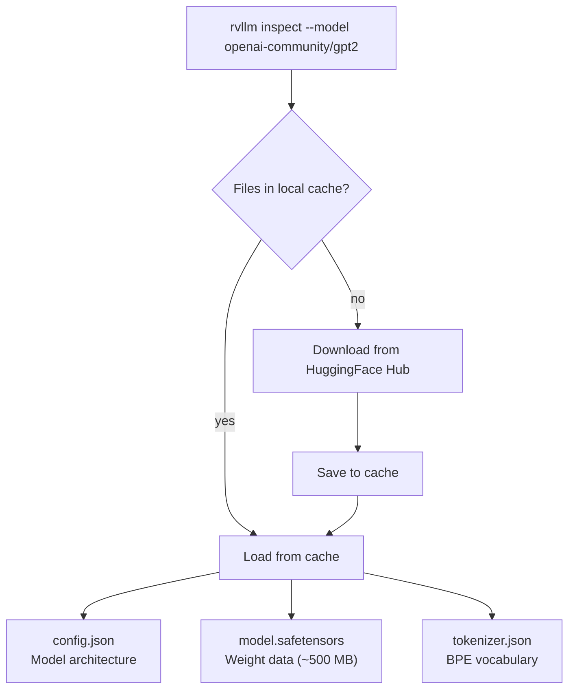
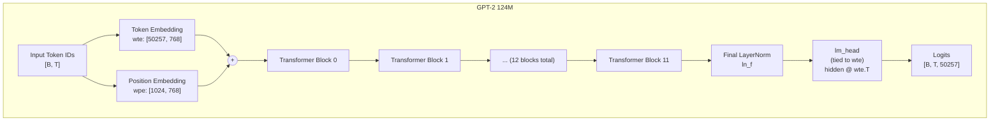
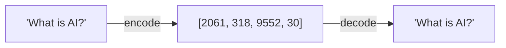

# Chapter 4: Downloading a Brain

## 124 Million Numbers From the Internet

You have a skeleton. Seven modules, three traits, a CLI that prints "not yet implemented." Time to put a brain in it.

By the end of this chapter, you will download GPT-2 124M from the internet, load every one of its 148 weight tensors into memory, verify the tokenizer works, and understand exactly what you are holding --- every weight name, every shape, every quirk. You will not run the model yet. You will not see it generate text. But you will know its anatomy like a surgeon knows a patient before the first incision.

The target: GPT-2 124M. Small enough to run on a laptop CPU. Well-documented. Freely available on [HuggingFace Hub](https://huggingface.co/openai-community/gpt2). And architecturally identical to the massive models --- LLaMA, Qwen, Phi --- just smaller. If you can understand GPT-2's structure, you understand the transformer. Everything after this is scale.

---

## Three Files, One Brain

Here is what happens when you point your program at `openai-community/gpt2` on HuggingFace Hub:


**Figure 4.1** — Model files download once and cache locally for future runs.

Three files. That is the entire model:

- **config.json** --- A small JSON file with the architecture parameters: how many layers, how wide, how many heads. This is the blueprint.

- **model.safetensors** --- The actual learned weights. About 500 MB of floating-point numbers in SafeTensors format. SafeTensors is a simple, memory-mappable binary format --- no arbitrary code execution (unlike Python pickle files), no overhead. Open the file, and the weight data is right there.

- **tokenizer.json** --- The BPE (Byte Pair Encoding) vocabulary and merge rules. This is what converts text to token IDs and back. The tokenizer is a separate artifact from the model --- it was trained independently and has its own logic.

The first run downloads everything. Subsequent runs load from cache. Your program should handle both cases transparently.

---

## The Architecture at a Glance

Before diving into the weights, let's see what we are building toward. Figure 4.2 shows the full GPT-2 architecture --- every component from input to output. You will not implement any of this yet. But knowing the destination makes the weight map meaningful.


**Figure 4.2** — GPT-2 full architecture. Token IDs go in, logits come out. We will build each component over the next three chapters.

Token IDs go in. Logits (a score for every word in the vocabulary) come out. Everything interesting happens inside those 12 transformer blocks. But right now, we are focused on step zero: getting the raw data.

### Key Numbers

| Parameter | Value | Notes |
|-----------|-------|-------|
| `vocab_size` | 50,257 | BPE vocabulary (50000 merges + 256 bytes + 1 EOS) |
| `n_embd` | 768 | Hidden dimension / embedding size |
| `n_head` | 12 | Number of attention heads |
| `head_dim` | 64 | `n_embd / n_head` |
| `n_layer` | 12 | Number of transformer blocks |
| `block_size` | 1,024 | Maximum sequence length (context window) |
| `intermediate_size` | 3,072 | MLP hidden dim: `4 * n_embd` |
| `layer_norm_epsilon` | 1e-5 | LayerNorm stability constant |
| `eos_token_id` | 50,256 | `<|endoftext|>` token |
| **Total parameters** | **~124M** | |

Where those 124 million parameters live:

- Token embedding: 50,257 x 768 = **38.6M**
- Position embedding: 1,024 x 768 = **0.8M**
- 12 transformer blocks: 12 x ~7.1M = **85.1M**
- Final LayerNorm: 2 x 768 = **0.002M**
- lm_head: **tied** (no additional parameters)

The embedding table and the 12 blocks account for virtually everything.

---

## Dissecting the Weight Map

You have downloaded `model.safetensors`. Open it up. Inside are 148 named tensors --- every learned parameter in the model. This is the most important table in the book. When your model eventually produces garbage (and it will), you will come back here and check every name, every shape, every transpose.

### Embedding Weights

| Weight Name | Shape | What It Is |
|-------------|-------|-----------|
| `transformer.wte.weight` | [50257, 768] | Token embedding --- one 768-dim vector per vocabulary word |
| `transformer.wpe.weight` | [1024, 768] | Position embedding --- one 768-dim vector per context position |

These two tables are the model's first contact with input. Token IDs index into `wte` to get "what this word means." Position indices index into `wpe` to get "where this word sits." The two vectors get added together --- identity and position fused --- and that is what flows into the transformer blocks.

### Per-Layer Weights (i = 0..11)

Before looking at the table, here is what you need to know. A transformer block is a repeating unit --- like a floor in a building. GPT-2 has 12 identical floors stacked on top of each other. Data flows in at the bottom, gets transformed on each floor, and comes out the top. Every floor has the same blueprint but different learned values (different numbers in its weight matrices).

Each floor does two things:

1. **Attention** --- each token looks at the tokens before it and decides what context is relevant. "?" looks back at "What is AI" and gathers information. (Chapter 6 covers this in detail.)

2. **MLP** (Multi-Layer Perceptron) --- a feed-forward network that transforms each token's representation independently. Think of it as "digesting" the information that attention gathered. (Chapter 5 covers this.)

Before each of those operations, there is a **LayerNorm** (Layer Normalization) --- a quick cleanup step that stabilizes the numbers so they do not grow too large or too small as data flows through 12 floors.

Now the table makes sense. Read the "Purpose" column --- the technical names in the "Component" column will become familiar as you build each piece.

| Weight Name | Shape | Component | Purpose |
|-------------|-------|-----------|---------|
| `transformer.h.{i}.ln_1.weight` | [768] | Pre-attention LayerNorm scale | Stabilizes values before attention |
| `transformer.h.{i}.ln_1.bias` | [768] | Pre-attention LayerNorm shift | (paired with scale above) |
| `transformer.h.{i}.attn.c_attn.weight` | [768, 2304] | QKV projection | Splits each token into a query, key, and value for attention |
| `transformer.h.{i}.attn.c_attn.bias` | [2304] | QKV projection bias | (paired with weight above) |
| `transformer.h.{i}.attn.c_proj.weight` | [768, 768] | Attention output projection | Combines the attention results back into one vector |
| `transformer.h.{i}.attn.c_proj.bias` | [768] | Attention output projection bias | (paired with weight above) |
| `transformer.h.{i}.ln_2.weight` | [768] | Pre-MLP LayerNorm scale | Stabilizes values before the MLP |
| `transformer.h.{i}.ln_2.bias` | [768] | Pre-MLP LayerNorm shift | (paired with scale above) |
| `transformer.h.{i}.mlp.c_fc.weight` | [768, 3072] | MLP up-projection | Expands the vector to 4x size for processing |
| `transformer.h.{i}.mlp.c_fc.bias` | [3072] | MLP up-projection bias | (paired with weight above) |
| `transformer.h.{i}.mlp.c_proj.weight` | [3072, 768] | MLP down-projection | Compresses back to original size |
| `transformer.h.{i}.mlp.c_proj.bias` | [768] | MLP down-projection bias | (paired with weight above) |

**How to read the names.** `transformer.h.{i}` means "transformer, block number i" where i goes from 0 to 11. So `transformer.h.0.ln_1.weight` is "block 0's first LayerNorm scale" and `transformer.h.11.mlp.c_proj.bias` is "block 11's MLP down-projection bias." The naming is hierarchical --- like a file path.

**How to read the shapes.** A shape like [768, 2304] means a matrix with 768 rows and 2304 columns --- that is 768 x 2304 = 1,769,472 numbers. A shape like [768] is a simple vector of 768 numbers. Weight matrices do the heavy computation (matrix multiplication); bias vectors are small adjustments added afterward.

**What are weights, exactly?** Every weight is a number the model learned during training. Before training, these were random. After training on billions of words, each number has been tuned so that the overall computation transforms "What is AI?" into a prediction like " The" or " It." No one programmed these values --- the training process found them through gradient descent. You are loading the result of that search.

Notice the pattern: every block has the same structure. `h.0` through `h.11` --- twelve copies, same blueprint, different learned values.

### Final Weights

| Weight Name | Shape | Component |
|-------------|-------|-----------|
| `transformer.ln_f.weight` | [768] | Final LayerNorm scale |
| `transformer.ln_f.bias` | [768] | Final LayerNorm bias |
| `lm_head.weight` | **tied** with `transformer.wte.weight` | Output projection |

After all 12 blocks, one final LayerNorm stabilizes the output. Then the **LM head** (language model head) converts the 768-dimensional vectors back into scores over the vocabulary --- one score per word, 50,257 scores total.

**Weight tying**: the LM head does not have its own weight matrix. It reuses the token embedding matrix from the very beginning of the model. The embedding maps tokens to vectors; the LM head maps vectors back to tokens. Same matrix, used in both directions. This saves 38.6M parameters.

### Counting Up

```
Embeddings:          2 tensors
Per-layer:          12 weights × 12 layers = 144 tensors
Final LayerNorm:     2 tensors
lm_head:            tied (0 additional)
                    ─────────
Total:              148 tensors, ~124M parameters
```

If your loader reports a different count, something went wrong.

---

## The Conv1D Gotcha

Four of the weight matrices in each block are stored in an unusual format. This will not bite you today --- we are only loading weights, not computing with them. But it is worth understanding now, because it will be the single most common source of bugs in Chapter 5.

**What is a weight matrix?** When the model processes data, the core operation is matrix multiplication: take an input vector and multiply it by a weight matrix to get an output vector. The weight matrix is like a transformation rule --- it defines *how* the input gets reshaped into the output.

There is a standard convention for how weight matrices are stored: rows represent outputs, columns represent inputs. Most ML frameworks use this layout. But GPT-2 was trained using OpenAI's `Conv1D` layer, which stores weights **transposed** --- rows are inputs, columns are outputs. Same numbers, different arrangement.

| Convention | Weight shape | How the math works |
|-----------|-------------|-------------|
| Conv1D (GPT-2 on disk) | `[in_features, out_features]` | `output = input @ weight + bias` |
| Standard Linear (most frameworks) | `[out_features, in_features]` | `output = input @ weight.T + bias` |

The four Conv1D weights per block are the ones that do the heavy computation --- the attention projections and the MLP projections:

```
c_attn.weight: [768, 2304]   ← Conv1D: 768 inputs, 2304 outputs
c_proj.weight: [768, 768]    ← Conv1D: 768 inputs, 768 outputs
c_fc.weight:   [768, 3072]   ← Conv1D: 768 inputs, 3072 outputs
mlp.c_proj:    [3072, 768]   ← Conv1D: 3072 inputs, 768 outputs
```

When you load these weights in Chapter 5, you will need to transpose them (flip rows and columns) --- or adjust your math to match. Get it wrong, and the model produces grammatically plausible word salad. Nothing crashes. Shapes match. The output is just completely wrong. This is the most insidious kind of bug because nothing *obviously* breaks.

For now, just print the shapes as they appear on disk. Note which ones are Conv1D. That awareness will save you hours of debugging later.

---

## The Tokenizer

The model has never seen text. It sees integers. The tokenizer bridges the gap.

GPT-2 uses Byte Pair Encoding (BPE) with a vocabulary of 50,257 tokens. The `tokenizer.json` file contains the merge rules and vocabulary mapping. Loading it with a tokenizer library gives you three operations:

- **encode**: text → list of token IDs
- **decode**: list of token IDs → text
- **eos_token_id**: returns 50256, the "end of text" marker

### The Round-Trip Test

The simplest proof that your tokenizer works:

```
encode("What is AI?") → [2061, 318, 9552, 30]
decode([2061, 318, 9552, 30]) → "What is AI?"
```

Four tokens. Each one is an index into the 50,257-row embedding table. "What" is row 2061. " is" (note the leading space --- BPE treats spaces as part of tokens) is row 318. " AI" is row 9552. "?" is row 30.

This is our running example for the rest of the book. Every time we need concrete numbers, we will use "What is AI?" → `[2061, 318, 9552, 30]`.


**Figure 4.3** — Tokenizer round-trip. Encode converts text to integer IDs; decode converts back. The round-trip should be lossless.

If the round-trip fails --- if the decoded text does not match the original --- your tokenizer is broken, and nothing downstream will work.

---

## The Spec

Everything described above is formalized in [`spec/ch04/`](../spec/ch04/):

| Artifact | What It Contains |
|----------|-----------------|
| `interface-spec.md` | Weight names, tensor shapes, tokenizer contract |
| `component-diagram.md` | Architecture overview, weight structure map |
| `sequence-diagram.md` | Loading and inspection flow |
| `expected-output.txt` | Output format and validation rules |
| `prompt-template.md` | Paste into an LLM to generate an implementation |

### Quick Start

1. Read `spec/ch04/interface-spec.md` --- the weight names and shapes
2. Implement the loader and tokenizer (or use `spec/ch04/prompt-template.md` with an LLM)
3. Validate: `pytest spec/ch04/validation/`

---

## See It: The Brain on the Table

You run your program:

```
rvllm inspect --model openai-community/gpt2
```

The output:

```
Loading model: openai-community/gpt2
  Model files downloaded/cached
  Tokenizer loaded (vocab_size: 50257)
  Model config: 12 layers, 768 dim, 12 heads

Weights: 148 tensors, ~124M parameters
  transformer.wte.weight: [50257, 768]
  transformer.wpe.weight: [1024, 768]
  transformer.h.0.ln_1.weight: [768]
  transformer.h.0.ln_1.bias: [768]
  ... (148 tensors total)
  transformer.ln_f.weight: [768]
  transformer.ln_f.bias: [768]

Tokenizer check:
  "What is AI?" → [2061, 318, 9552, 30] → "What is AI?" ✓
```

That is it. No forward pass. No generated text. Just: "I have the data, I have verified it, I understand what I am holding."

148 tensors, 124 million parameters, all accounted for.

---

## Explore Further

### Exercise 1: Count the Parameters

Manually calculate the total parameter count by multiplying out each weight's shape:

```
wte:   50257 * 768   = 38,597,376
wpe:   1024  * 768   =    786,432
Per block (x12):
  ln_1:  768 + 768   =      1,536
  c_attn: 768*2304 + 2304 = 1,771,776
  c_proj: 768*768  + 768  =   590,592
  ln_2:  768 + 768   =      1,536
  c_fc:  768*3072 + 3072  = 2,362,368
  mlp_proj: 3072*768 + 768 = 2,360,064
  Block total:            = 7,087,872
12 blocks:                = 85,054,464
ln_f:  768 + 768     =      1,536
lm_head: tied         =          0
                       -----------
Total:                 = 124,439,808
```

Does your `inspect` output match? This is a good sanity check that all weights loaded.

### Exercise 2: Try a Bigger Model

Change the model ID to `openai-community/gpt2-medium`. Run `inspect` again. What changed? How many layers now? What is the hidden dimension? How does the parameter count compare?

### Exercise 3: Examine the Tokenizer

Try encoding different strings:
- `"Hello, world!"` --- how many tokens?
- `"antidisestablishmentarianism"` --- does BPE split it?
- `"   "` (three spaces) --- how are whitespace-only strings handled?

---

## What's Next

You have the raw weights. 148 tensors, 124 million numbers. But weights are just numbers in matrices. They do not *do* anything yet.

How does token 2061 ("What") turn into a 768-dimensional vector? What transforms that vector? How does the model decide which earlier tokens are relevant to which later tokens?

Next chapter: we take those weight matrices and build the first layers --- embedding, normalization, the feed-forward network. By the end, you will watch "What is AI?" enter as four integers and emerge as four rich 768-dimensional vectors, transformed through a LayerNorm and an MLP. Not the full model yet --- but the first proof that the weights are alive.
