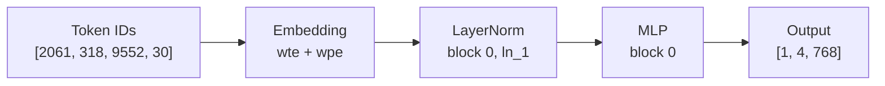
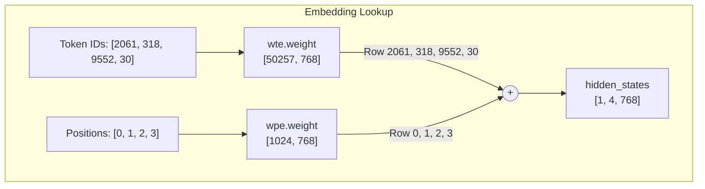
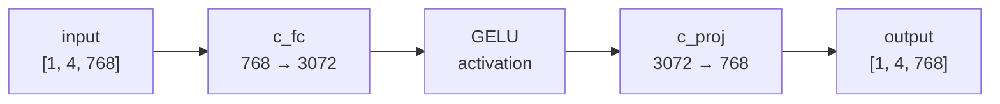
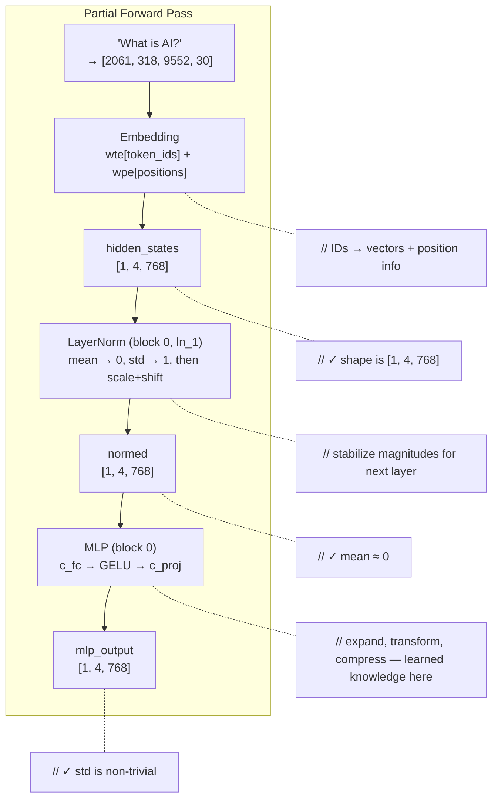

# Chapter 5: The Building Blocks

## A Number Walks Into a Neural Network

Token ID `2061`. That is all the model has. A single integer. "What" to us --- a row index to the model.

In the last chapter, you loaded 148 weight tensors into memory and verified every name and shape. You know the anatomy. But anatomy is not physiology. A brain on a table does not think.

This chapter brings the weights to life. By the end, you will watch `[2061, 318, 9552, 30]` --- "What is AI?" --- enter as four bare integers, become four 768-dimensional vectors, pass through a LayerNorm and an MLP, and emerge transformed. Not the full model. Not attention. Not generation. But the first proof that the weights are *doing something* --- and that something is mathematically correct.

Here is the route:


**Figure 5.1** --- The partial forward pass we will build in this chapter. Four integers in, four transformed 768-dimensional vectors out.

Four layers. Four mathematical contracts. Let's build them bottom-up.

---

## Two Tables and a Sum

An embedding is a lookup table. Nothing more. Token ID `2061` means "go to row 2061 and grab the 768 numbers sitting there." No multiplication, no learned function --- just an array index.

But GPT-2 has *two* embedding tables:

| Table | Weight Name | Shape | What It Encodes |
|-------|-------------|-------|-----------------|
| Token embedding | `transformer.wte.weight` | [50257, 768] | What this token *means* |
| Position embedding | `transformer.wpe.weight` | [1024, 768] | Where this token *sits* |

Why two? Consider these sentences:

> "the cat chased the dog"
> "the dog chased the cat"

Same words. Same token IDs. Completely different meaning. Without position information, the model cannot distinguish them. The token embedding tells the model *what* each token is. The position embedding tells it *where* each token appears. The two get added together --- identity and location fused into a single vector.


**Figure 5.2** --- Token and position embeddings are separate lookup tables. Their outputs are added element-wise to produce the initial hidden states.

### Shape Transformations, Step by Step

Follow the shapes through the lookup:

```
Input:     token_ids             [1, 4]          (batch=1, seq_len=4)
           positions             [1, 4]          (0, 1, 2, 3)

Step 1:    wte lookup            [1, 4, 768]     (each ID → 768-dim row)
Step 2:    wpe lookup            [1, 4, 768]     (each position → 768-dim row)
Step 3:    element-wise add      [1, 4, 768]     (token meaning + position info)

Output:    hidden_states         [1, 4, 768]
```

The `[1, 4, 768]` shape will follow us for the rest of this chapter --- and most of the book. It means:

- **1** --- batch size (one prompt)
- **4** --- sequence length (four tokens: "What", " is", " AI", "?")
- **768** --- hidden dimension (the model's working width)

Every layer that follows takes `[B, T, 768]` in and produces `[B, T, 768]` out. The shapes never change. Only the values do.

### The Pseudocode

```
function embed(token_ids, positions):
    token_vecs  = wte_weight[token_ids]     // gather rows
    pos_vecs    = wpe_weight[positions]      // gather rows
    return token_vecs + pos_vecs             // element-wise add
```

That is the entire embedding layer. No matrix multiply. No nonlinearity. Just two table lookups and a sum.

---

## The Reset Button: LayerNorm

The four vectors that emerge from embedding are noisy. Each dimension has a different scale --- some values might be around 0.01, others around 5.0. If you fed this directly into a matrix multiplication, the large values would dominate and the small values would vanish. Training becomes unstable. Inference becomes unreliable.

LayerNorm is the reset button. It takes each vector and normalizes it --- forces the mean to 0 and the standard deviation to 1 --- then applies a learned scale and shift. Every vector gets the same treatment, every time.

### The Formula

For a single 768-dimensional vector **x**:

```
mean     = (1/768) * sum(x)                        // find the "center" so we can shift values to zero
variance = (1/768) * sum((x - mean)^2)             // measure the spread so we know how much to shrink/stretch
x_norm   = (x - mean) / sqrt(variance + epsilon)   // remove center, equalize scale — now every vector "looks the same" to the next layer
output   = weight * x_norm + bias                   // let the model learn which dimensions to amplify or dampen
```

Four steps:

1. **Mean** --- the average value across all 768 dimensions.
2. **Variance** --- how spread out the values are.
3. **Normalize** --- subtract mean, divide by standard deviation. Now the vector has mean 0, std 1. Notice the `epsilon` in the formula --- a tiny number (1e-5 for GPT-2) added to the variance before taking the square root. It looks insignificant, but it prevents a catastrophic edge case: if all 768 values happen to be identical, the variance is exactly zero, and you divide by zero. The result is NaN, which silently poisons every downstream computation. Epsilon is a one-line safety net against that.
4. **Scale and shift** --- multiply by learned `weight[768]` and add learned `bias[768]`. This lets the model undo the normalization partially if it wants to.

### Parameters

| Parameter | Shape | Description |
|-----------|-------|-------------|
| `weight` (gamma) | [768] | Learned per-dimension scale |
| `bias` (beta) | [768] | Learned per-dimension shift |

In GPT-2's weight map, you will find these as `transformer.h.{i}.ln_1.weight`, `transformer.h.{i}.ln_1.bias` (pre-attention LayerNorm) and `transformer.h.{i}.ln_2.weight`, `transformer.h.{i}.ln_2.bias` (pre-MLP LayerNorm). Plus `transformer.ln_f.weight` and `transformer.ln_f.bias` for the final LayerNorm after all blocks.

### The Proof It Works

After LayerNorm, the mean of each vector should be approximately 0 and the standard deviation approximately 1 (before the learned scale and shift). If you print the mean and it is 0.0003 or -0.0001, LayerNorm is working. If it is 2.7, something is broken.

This is your first runtime diagnostic: **LayerNorm mean near zero = correct implementation.**

---

## Handling the Conv1D Weights

Chapter 4 flagged the Conv1D gotcha: GPT-2 stores four weight matrices per block transposed compared to the standard convention. Now it is time to actually deal with it.

You have two options:

1. **Transpose at load time** --- flip the Conv1D weights to standard Linear format when you load them, then always compute `input @ weight.T + bias`.
2. **Use Conv1D convention as-is** --- keep the weights in their on-disk layout, compute `input @ weight + bias`.

Either works. What does *not* work is mixing them: loading in Conv1D format but computing as standard Linear (or vice versa).

### Why This Bug Is Evil

Consider `c_proj`, whose weight on disk is `[3072, 768]` (Conv1D format: in=3072, out=768). If you accidentally compute `input[1,4,3072] @ weight.T[768,3072]`, the shapes match --- but the semantics are wrong. The output looks like plausible floating-point numbers. Reasonable magnitudes, no NaN, no infinity. The model produces grammatically structured text. But it is *wrong* text. Confident nonsense.

This is the most insidious class of bug: **plausible-looking garbage.** You will spend hours checking attention masks, position encodings, sampling code --- everything except the one transposition that is silently scrambling every projection.

### The Takeaway

Choose a convention. Be explicit about it. Document it. When debugging, check it first.

---

## The MLP: Expand, Activate, Compress

The MLP (Multi-Layer Perceptron) is the workhorse of each transformer block. It takes each token's 768-dimensional vector, expands it to 3072 dimensions, applies a nonlinear activation, then compresses it back to 768. Each position is processed independently --- token 0's MLP computation does not see token 1's values.


**Figure 5.3** --- The MLP pipeline. Expand 4x, activate, compress back. The 4x expansion gives the model more capacity to learn complex transformations.

### Step by Step

```
input:     [1, 4, 768]

c_fc:      input @ c_fc.weight + c_fc.bias     → [1, 4, 3072]   // expand: more dimensions = more room to represent features
GELU:      gelu(above)                          → [1, 4, 3072]   // activate: without this, stacking layers collapses to one linear transform
c_proj:    above @ c_proj.weight + c_proj.bias  → [1, 4, 768]   // compress: squeeze back so the next layer gets the same shape

output:    [1, 4, 768]
```

(Using Conv1D convention: `input @ weight + bias`. If you transposed at load time, substitute `input @ weight.T + bias`.)

### The 4x Expansion

Why expand to 3072? It is exactly `4 * 768`. This 4x ratio is a design choice baked into GPT-2's architecture (and shared by most transformer models). The expansion gives the network a wider space to compute intermediate features before compressing back. Think of it as: 768 dimensions is the communication channel between layers, but each layer internally uses 3072 dimensions of scratch space.

### GELU: The Smooth Gate

Between the two linear projections sits GELU --- the Gaussian Error Linear Unit. Unlike ReLU (which hard-clips negative values to zero), GELU smoothly gates values based on their magnitude:

```
GELU(x) = x * 0.5 * (1 + erf(x / sqrt(2)))
```

where `erf` is the Gauss error function.

Why not ReLU? ReLU creates a hard boundary at zero --- values are either passed through unchanged or killed entirely. GELU is smoother: small negative values get reduced but not zeroed, large positive values pass nearly unchanged. This smooth gating means gradients never abruptly vanish to zero the way they do with ReLU's dead zone, so neurons keep learning instead of going permanently silent --- and that adds up to slightly better performance across billions of training steps.

Some implementations use a tanh approximation:

```
GELU_approx(x) = 0.5 * x * (1 + tanh(sqrt(2/pi) * (x + 0.044715 * x^3)))
```

GPT-2 uses the exact `erf` version, not the tanh approximation. If you use the wrong one, the outputs will differ slightly --- typically in the 4th or 5th decimal place. Close enough for generation, but your validation tests will fail if they check for exact precision.

### MLP Parameters

| Weight | Shape on Disk | Conv1D? | What It Does |
|--------|---------------|---------|-------------|
| `c_fc.weight` | [768, 3072] | Yes | Up-projection (expand) |
| `c_fc.bias` | [3072] | No | Up-projection bias |
| `c_proj.weight` | [3072, 768] | Yes | Down-projection (compress) |
| `c_proj.bias` | [768] | No | Down-projection bias |

The MLP adds 4,722,432 parameters per block (multiply out the shapes). Across 12 blocks, that is 56.7M --- nearly half of GPT-2's total 124M parameters. The model's knowledge is stored largely in these MLP weights.

---

## Wiring It Up: The Partial Forward Pass

Time to connect the pieces. We are not building the full model yet --- no attention, no residual connections, no looping through all 12 blocks. Just the partial path from Figure 5.1: embed, LayerNorm block 0, MLP block 0.


**Figure 5.4** --- The partial forward pass with verification checkpoints at each stage.

### The Pseudocode

```
// Load the model weights (Chapter 4)
model = load_model("openai-community/gpt2")

// Tokenize
token_ids = [2061, 318, 9552, 30]
positions = [0, 1, 2, 3]

// Step 1: Embedding
hidden = model.wte[token_ids] + model.wpe[positions]
print("After embedding:", shape(hidden), mean(hidden), std(hidden))

// Step 2: LayerNorm (block 0, pre-attention)
normed = layer_norm(hidden, model.h[0].ln_1.weight, model.h[0].ln_1.bias)
print("After LayerNorm:", shape(normed), mean(normed), std(normed))

// Step 3: MLP (block 0)
fc_out  = normed @ model.h[0].mlp.c_fc.weight + model.h[0].mlp.c_fc.bias
activated = gelu(fc_out)
mlp_out = activated @ model.h[0].mlp.c_proj.weight + model.h[0].mlp.c_proj.bias
print("After MLP:", shape(mlp_out), mean(mlp_out), std(mlp_out))
```

Three stages. Three print statements. Three checkpoints.

---

## See It: Tensor Stats at Every Stage

Run your program:

```
rvllm inspect --model openai-community/gpt2
```

The output now includes a partial forward pass:

```
Loading model: openai-community/gpt2
  Model files downloaded/cached
  Tokenizer loaded (vocab_size: 50257)
  Model config: 12 layers, 768 dim, 12 heads

Weights: 148 tensors, ~124M parameters

Partial forward pass: "What is AI?" → [2061, 318, 9552, 30]

  After embedding:   shape=[1, 4, 768]  mean=-0.0117  std=0.5765
  After LayerNorm:   shape=[1, 4, 768]  mean= 0.0003  std=1.0247
  After MLP:         shape=[1, 4, 768]  mean=-0.0012  std=0.1085
```

Three lines. Three proofs:

1. **Embedding** --- shape is `[1, 4, 768]`. Four tokens, each now a 768-dimensional vector. The mean and std are whatever the learned embeddings happen to produce. No right or wrong here --- just a baseline.

2. **LayerNorm** --- mean is approximately 0 (0.0003). This is the signature of a working LayerNorm. If this number were 2.7 or -1.5, something is wrong. The std near 1.0 is the other half of the signature. (The learned weight and bias shift it slightly, so it won't be exactly 1.0.)

3. **MLP** --- the output has a non-trivial standard deviation (0.1085). This proves the weights loaded correctly and the Conv1D handling is right. If you got the transpose wrong, this number would be wildly different --- or the shapes would not have matched at all.

Your exact numbers may differ slightly depending on floating-point precision (f32 vs f64, different hardware). The key patterns are: LayerNorm mean near 0, MLP std non-zero and in a reasonable range (roughly 0.05 to 0.5).

---

## The Spec

Everything described above is formalized in [`spec/ch05/`](../spec/ch05/):

| Artifact | What It Contains |
|----------|-----------------|
| `interface-spec.md` | Embedding, LayerNorm, Linear, MLP contracts and signatures |
| `component-diagram.md` | Layer structure and data flow |
| `sequence-diagram.md` | Partial forward pass execution flow |
| `expected-output.txt` | Output format with tensor metric ranges |
| `prompt-template.md` | Paste into an LLM to generate an implementation |
| `validation/` | `pytest spec/ch05/validation/` --- 8 tests |

### Quick Start

1. Read `spec/ch05/interface-spec.md` --- the layer contracts
2. Implement Embedding, LayerNorm, Linear (with Conv1D handling), MLP
3. Wire the partial forward pass into your `inspect` command
4. Validate: `pytest spec/ch05/validation/`

---

## Explore Further

### Exercise 1: Skip the Transpose

This is the most instructive exercise in the chapter. Take whichever Conv1D weight handling you implemented and deliberately break it:

- If you transposed at load time, remove the transpose.
- If you used Conv1D convention (`input @ weight`), switch to `input @ weight.T`.

Now run the partial forward pass. What happens?

If the shapes are incompatible, you get an error --- that is the easy case. But for some weight shapes, both conventions produce valid shapes. The output will be floating-point numbers in a plausible range. No NaN. No infinity. You might even think it is correct. But compare the stats to the correct run --- they will be different. This is what "plausible-looking garbage" looks like.

### Exercise 2: Inspect the Embedding Vectors

After the embedding step, extract the four individual vectors (one per token). Compute the cosine similarity between each pair:

```
cos_sim(a, b) = dot(a, b) / (norm(a) * norm(b))
```

Which tokens have the most similar embeddings? Which are the most different? Does it match your intuition about word meaning?

### Exercise 3: GELU vs ReLU

Replace GELU with ReLU in your MLP:

```
ReLU(x) = max(0, x)
```

Run the partial forward pass. How do the output stats change? The model was trained with GELU, so using ReLU produces incorrect results --- but how different are they? This illustrates why activation function choice matters, even though both are "nonlinearities."

### Exercise 4: Try a Bigger Model

Run the same partial forward pass on `openai-community/gpt2-medium`. The hidden dimension is 1024 instead of 768. How do the shapes change? How do the tensor stats compare?

---

## The Lonely Positions

Look back at the partial forward pass. The MLP processed each of the four token positions completely independently. Position 0 ("What") has no idea what position 1 (" is") contains. Position 3 ("?") does not know it follows "What is AI". Each vector was embedded, normalized, expanded, activated, and compressed --- alone.

But language is not independent. Consider: "Apple released a new model." Is that a tech company unveiling a phone, or a fruit company launching a product line? The token "Apple" is the same ID either way — only the surrounding tokens tell you which world you are in. The meaning of a token depends on the tokens around it.

The MLP adds capacity --- it can transform each vector in complex ways. But it cannot add *context*. For that, each position needs to look at every other position and decide what is relevant.

That is attention. And that is the next chapter.
