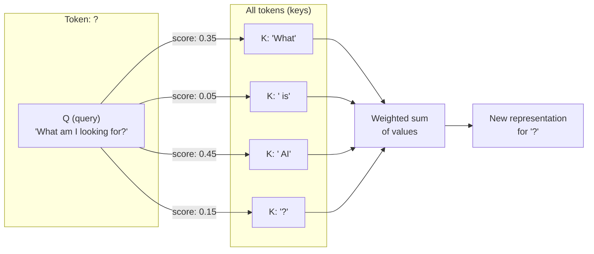
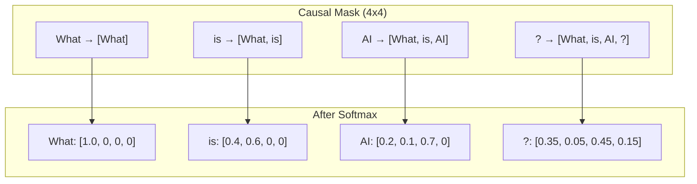
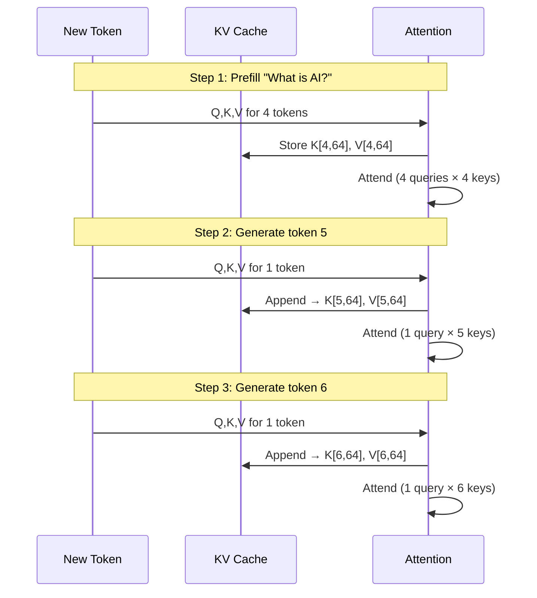
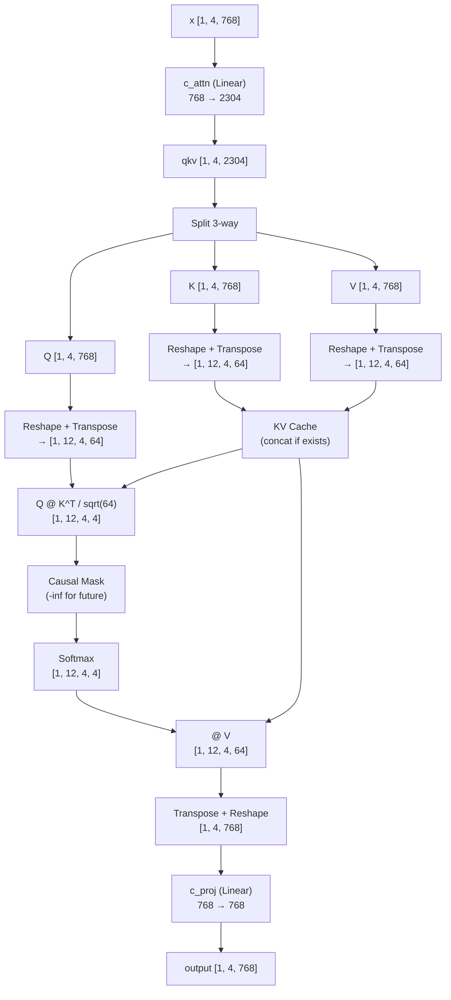
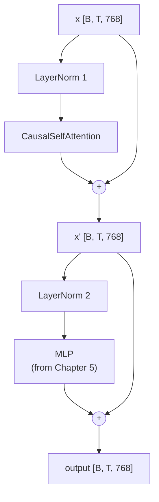
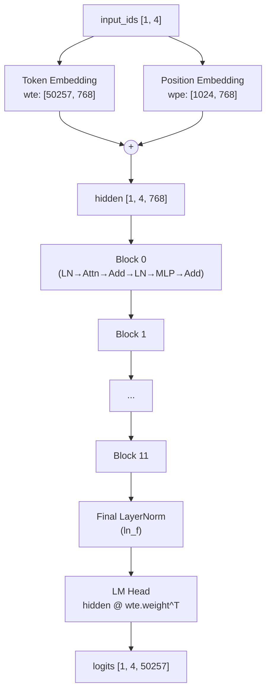

# Chapter 6: Where the Model Learns to Look Back

## Four Tokens Walk Into a Sequence

Four tokens sit in a row: "What" (2061), " is" (318), " AI" (9552), "?" (30). After Chapter 5, each one has been embedded into a 768-dimensional vector, normalized, and squeezed through an MLP. Each token was processed *independently*. The MLP saw "?" and thought: here is a punctuation mark. It had no idea that three tokens earlier, someone asked a question about artificial intelligence.

This is the fundamental limitation of everything we have built so far. Embedding, LayerNorm, MLP --- they are all *pointwise* operations. They transform each token in isolation. Token 3 ("?") receives the exact same transformation whether the preceding tokens are "What is AI" or "I like pizza" or "asdf jkl;". The context is right there in the sequence, but no component has looked at it.

That changes now.

Attention is the mechanism that lets each token look backward through the sequence and decide what context matters. After attention, "?" will *know* it follows "What is AI." And that knowledge will reshape its representation --- pulling it toward vectors that predict reasonable continuations like " The" or " It" rather than random garbage.

By the end of this chapter, you will implement multi-head causal self-attention with a KV cache, assemble complete transformer blocks, wire up the full GPT-2 model, and run a forward pass on "What is AI?" that produces real, plausible next-token predictions. This is the hardest chapter in the book. It is also the most important. Everything before this was setup. Everything after this is iteration.

---

## One Token at a Time --- And It Gets Worse

Here is the problem in concrete terms. We have four tokens. Each needs to build a representation that accounts for its position in the sequence. But not all tokens get the same view.

"What" is at position 0. It is the first word. It can only see itself --- there is nothing before it.

" is" is at position 1. It can see "What" and itself. That is two tokens of context.

" AI" is at position 2. It sees "What", " is", and itself. Three tokens.

"?" is at position 3. It sees everything: "What", " is", " AI", and itself. Four tokens.

This is the **causal constraint**. Each token can attend to itself and all *previous* tokens, but never to tokens that come after it. Why? Because during generation, future tokens do not exist yet. When the model is predicting what comes after "?", there is no token at position 4 to peek at. The constraint during training must match the constraint during inference.

So attention needs to compute something like a relevance score: for each pair of tokens (i, j) where j <= i, how much should token i care about token j? For our four-token sequence, that is 1 + 2 + 3 + 4 = 10 pairwise comparisons. For a 1,024-token context window, it is over half a million. This is O(n^2) in sequence length --- and it is one of the fundamental costs of transformer inference.

But it gets worse. We do not just need *one* notion of relevance. "?" might care about "What" because it signals a question. It might care about " AI" because it is the topic. These are different *kinds* of relevance. GPT-2 runs 12 parallel attention computations --- 12 heads --- each looking for different patterns. So the real cost is 12 times those pairwise comparisons.

The model needs a clever mechanism to compute all this efficiently. Enter: queries, keys, and values.

---

## The Search Engine Inside the Transformer

Here is the best analogy for attention. Imagine a search engine.

You type a query: "What topics are relevant to me?" Every document in the index has a key --- a summary of what it contains. The search engine scores your query against every key, ranks the results, and returns a weighted blend of the document contents (the values).

That is exactly what attention does, except the "documents" are the other tokens in the sequence.

Each token produces three vectors:

- **Q (Query):** "What am I looking for?" --- a 64-dimensional vector describing what information this token needs from the context.
- **K (Key):** "What do I contain?" --- a 64-dimensional summary of what this token offers, used for matching against queries.
- **V (Value):** "What do I deliver?" --- a 64-dimensional vector of the actual content that gets passed along when this token is deemed relevant.

Token "?" generates a query. Tokens "What", " is", " AI", "?" all have keys and values. The query from "?" is compared against every key. High-scoring keys contribute their values more strongly. Low-scoring keys contribute almost nothing. The result is a weighted sum of values --- a new representation for "?" that incorporates exactly the context it needs.


**Figure 6.1** --- Token "?" queries all previous tokens. The scores (shown as hypothetical attention weights) determine how much each token's value contributes to the output. Here, " AI" contributes most --- it is the topic of the question.

The scores are not hand-picked. They emerge from the learned weight matrices. After training on billions of tokens of text, the model has learned Q and K projections that make question marks attend strongly to the subject of the question, articles attend to their nouns, verbs attend to their subjects. All of this is implicit in the weights.

---

## The Core Formula, Stripped Bare

All of attention reduces to one equation:

```
Attention(Q, K, V) = softmax(Q @ K^T / sqrt(d_k)) @ V
//                          ↑ match queries to keys  ↑ scale to prevent softmax saturation
//                    ↑ convert raw scores to probabilities     ↑ blend values by relevance
```

Three matrix operations. That is it. Let's unpack each piece.

**Q @ K^T** --- The dot product between every query and every key. If Q is [T, 64] and K is [S, 64], then Q @ K^T is [T, S]. Each entry (i, j) is the raw relevance score of query i with key j. High dot product means the query and key point in similar directions --- they "match."

**/ sqrt(d_k)** --- Scale the scores by the square root of the key dimension (sqrt(64) = 8). Without this, the dot products grow large as the dimension increases, pushing softmax into saturation where one token gets all the weight and the rest get nothing. Dividing by sqrt(d_k) keeps the scores in a well-behaved range. This is the "scaled" in "scaled dot-product attention."

**softmax(...)** --- Convert raw scores to probabilities. Each row sums to 1. The highest-scoring key gets the most weight, but even low-scoring keys contribute a little. This is differentiable and smooth --- important for training.

**@ V** --- Multiply the attention probabilities by the value matrix. This produces a weighted average of value vectors for each query position. If "?" attended 45% to " AI" and 35% to "What", the output for "?" is 0.45 * V(" AI") + 0.35 * V("What") + ... and so on.

---

## Why Divide by Eight?

The scaling factor deserves a closer look because it is the kind of detail that seems arbitrary until you understand the numerics.

Each element of Q and K is roughly drawn from a distribution with mean 0 and variance 1 (after proper initialization). The dot product of two 64-dimensional vectors, each with unit-variance elements, has variance proportional to 64. So the raw scores Q @ K^T have standard deviation around sqrt(64) = 8.

Feed scores with standard deviation 8 into softmax, and you get extremely peaky distributions --- one position gets 0.999 weight and the rest get dust. The model cannot learn nuanced attention patterns because gradients vanish for all but the top-scoring position.

Dividing by sqrt(64) = 8 brings the standard deviation back to roughly 1. Now softmax produces smooth distributions where multiple positions can contribute meaningfully. The model can learn to attend to "What" and " AI" simultaneously.

---

## Twelve Perspectives at Once

One attention head is good. Twelve are better.

Each head has its own Q, K, and V projection matrices. Head 0 might learn to track syntactic dependencies (verbs attending to subjects). Head 3 might learn positional patterns (nearby tokens attending to each other). Head 7 might specialize in long-range topic tracking. No one tells them what to learn --- the training process discovers useful patterns.

GPT-2 uses 12 heads, each operating on 64-dimensional vectors. Together: 12 x 64 = 768, which is the full hidden dimension. Each head sees 1/12th of the representation but computes its own independent attention pattern.

In practice, this is implemented as a single large projection, not 12 separate ones. The input [B, T, 768] is projected to [B, T, 2304] (that is 3 x 768, for Q, K, and V combined), then split and reshaped.

**How to read 4D tensor shapes.** You are about to see shapes like `[B, 12, T, 64]` for the first time. Here is what each dimension means:

- **B** (batch) --- how many prompts are being processed at once (1 for us).
- **12** (heads) --- the 12 parallel attention heads, each with its own perspective.
- **T** (time / sequence) --- the number of token positions (4 for "What is AI?").
- **64** (head dimension) --- each head's slice of the 768-dim hidden state (768 / 12 = 64).

Reading left to right: "for each prompt in the batch, for each of the 12 heads, for each token position, a 64-dimensional vector." This 4D layout keeps each head's data contiguous so the batch matrix multiplications that follow are efficient.

```
[B, T, 768]  --(c_attn)--> [B, T, 2304]        // one big projection is faster than three separate ones
                            split 3 ways
              Q: [B, T, 768] → reshape → [B, 12, T, 64]  // carve 768 into 12 heads of 64
              K: [B, T, 768] → reshape → [B, 12, T, 64]
              V: [B, T, 768] → reshape → [B, 12, T, 64]
```

After attention, the 12 heads are merged back:

```
[B, 12, T, 64] → reshape → [B, T, 768] --(c_proj)--> [B, T, 768]
//                          ↑ concatenate 12 heads back into one vector
//                                                     ↑ mix across heads so they can share what they found
```

The output projection (c_proj) mixes the heads' outputs, allowing the model to combine their different perspectives into a single representation.

---

## The Causal Mask --- No Peeking

During the initial pass (prefill), all four tokens are processed simultaneously. But "What" at position 0 must not see " is", " AI", or "?" --- they do not exist yet from "What"'s perspective. The causal mask enforces this.

For our running example "What is AI?", the mask looks like this:

| | What (j=0) | is (j=1) | AI (j=2) | ? (j=3) |
|---|---|---|---|---|
| **What (i=0)** | yes | -- | -- | -- |
| **is (i=1)** | yes | yes | -- | -- |
| **AI (i=2)** | yes | yes | yes | -- |
| **? (i=3)** | yes | yes | yes | yes |

"yes" means the query at row i can attend to the key at column j. "--" means the score is set to negative infinity *before* softmax, which makes softmax assign it a weight of zero.

This is a lower-triangular matrix --- the classic staircase pattern. Row 0 has one "yes." Row 3 has four. Each row sees exactly one more token than the row above it.


**Figure 6.2** --- The causal mask creates a staircase pattern. Each token attends only to itself and predecessors. After softmax, the masked positions receive zero weight. Values shown are illustrative.

The negative-infinity trick is elegant. We do not need to remove entries from the matrix or change the softmax implementation. Just set forbidden scores to -infinity. Softmax of negative infinity is zero. The masked positions vanish naturally.

**During decode** (generating one token at a time, T = 1), there is only one query position, and it attends to all cached keys. No mask is needed --- a single query has no future positions to hide.

---

## The KV Cache --- Don't Redo Old Work

Here is an observation that will become critical in later chapters. When generating text, the model produces one token at a time. After predicting the first new token (say, " The"), it must predict the next one. To do that, it runs a forward pass for the new token. But that new token needs to attend to *all* previous tokens --- "What", " is", " AI", "?", " The".

Without caching, we would recompute Q, K, and V for all five tokens, even though we already computed K and V for the first four on the previous step. That is wasted work. The KV cache solves this: store the K and V tensors from previous steps, and on each new step, only compute Q, K, V for the *new* token, then concatenate the new K and V onto the cache.


**Figure 6.3** --- The KV cache grows with each generation step. Only the new token's Q, K, V are computed fresh; previous K and V are retrieved from cache.

Per layer, per head, the cache stores:
- **K cache:** [B, 12, S, 64] where S grows by 1 each step
- **V cache:** [B, 12, S, 64]

Across 12 layers and 12 heads, this adds up. Managing this memory efficiently is what later chapters (PagedAttention, block management) are all about. For now, we simply store the cache and concatenate.

---

## The Full Attention Data Flow

Let's trace the complete path through CausalSelfAttention, with exact shapes for our running example: batch size 1, sequence length 4, hidden dimension 768.


**Figure 6.4** --- Complete CausalSelfAttention data flow. Input enters at top, flows through QKV projection, multi-head split, cached attention computation, and output projection.

---

## Building Attention, Step by Step

Let's walk through each operation with exact shapes and pseudocode.

### Step 1: QKV Projection

The input x has shape [B, T, 768]. A single linear layer projects it to [B, T, 2304]:

```
qkv = linear(x, c_attn_weight, c_attn_bias)    // [B, T, 2304] — one fused projection instead of three separate ones (fewer kernel launches)
```

Then split along the last dimension into three equal chunks:

```
q = qkv[:, :, 0:768]       // [B, T, 768] — "what am I looking for?"
k = qkv[:, :, 768:1536]    // [B, T, 768] — "what do I contain?"
v = qkv[:, :, 1536:2304]   // [B, T, 768] — "what do I deliver when matched?"
```

Why one big projection instead of three separate ones? Efficiency. One matrix multiplication of [B, T, 768] x [768, 2304] is faster than three multiplications of [B, T, 768] x [768, 768]. Same math, fewer kernel launches.

### Step 2: Reshape to Multi-Head

Each of Q, K, V is [B, T, 768]. We need [B, 12, T, 64] --- splitting the 768 hidden dimension into 12 heads of 64 dimensions each:

```
q = reshape(q, [B, T, 12, 64])    // split 768 into 12 heads of 64 — each head gets its own slice
q = transpose(q, 1, 2)            // [B, 12, T, 64] — put heads before positions so each head's data is contiguous for batch matmul
// same for k and v
```

The transpose swaps the T and head dimensions so that each head's data is contiguous in memory. This makes the subsequent batch matrix multiplication efficient.

### Step 3: KV Cache Update

If this is not the first forward pass, we have cached K and V from previous steps:

```
if kv_cache exists:
    k = concat(k_cache, k, dim=2)   // [B, 12, S_prev + T, 64] — prepend old keys so new queries can attend to all history
    v = concat(v_cache, v, dim=2)   // [B, 12, S_prev + T, 64] — same for values
store (k, v) as new kv_cache        // save for next decode step — avoids recomputing K,V for old tokens
S_total = k.shape[2]                // total sequence length including cached positions
```

On the first pass (prefill), there is no cache. S_total = T. On subsequent decode steps, S_total = S_prev + 1.

### Step 4: Scaled Dot-Product

Compute the raw attention scores:

```
scores = (q @ transpose(k, -2, -1)) / sqrt(64)    // [B, 12, T, S_total] — each entry = how much query i cares about key j, scaled to prevent softmax saturation
```

For prefill: T = 4, S_total = 4, so scores is [1, 12, 4, 4]. Each head has a 4x4 matrix of pairwise scores.

### Step 5: Causal Masking

Only during prefill (T > 1). Build a mask where position i can attend to positions 0 through offset + i:

```
for each query position i (0..T):
    for each key position j (0..S_total):
        if j > offset + i:                     // future token — doesn't exist yet during generation
            scores[:, :, i, j] = -infinity     // softmax(-inf) = 0, so this position contributes nothing
```

With offset = 0 and T = 4, this gives the staircase pattern we saw earlier. The first query can see 1 key, the last query can see all 4.

During decode (T = 1), there is a single query attending to all S_total keys. Every key is at a position less than or equal to the query's position. No masking needed.

### Step 6: Softmax and Value Aggregation

```
attn_weights = softmax(scores, dim=-1)   // [B, 12, T, S_total] — normalize each row to sum to 1; masked positions become 0
attn_output = attn_weights @ v           // [B, 12, T, 64] — weighted average of value vectors: high-scoring keys contribute most
```

Softmax normalizes each row to sum to 1. Masked positions (set to -infinity) become 0 after softmax. The matrix multiplication with V produces a weighted average of value vectors for each query position.

### Step 7: Merge Heads and Output Projection

```
attn_output = transpose(attn_output, 1, 2)    // [B, T, 12, 64] — move heads back next to their dimension
attn_output = reshape(attn_output, [B, T, 768]) // merge 12×64 back into 768 — undo the multi-head split
output = linear(attn_output, c_proj_weight, c_proj_bias)  // [B, T, 768] — mix across heads so they can combine their findings
```

The 12 heads are concatenated back into a single 768-dimensional vector, then projected through c_proj to mix information across heads.

---

## The Transformer Block --- Two Residual Streams

Attention is only half of a transformer block. The other half is the MLP from Chapter 5. They are connected through a specific wiring pattern called **pre-norm residual**.


**Figure 6.5** --- Pre-norm residual block. The "+" nodes are residual connections. LayerNorm precedes each sublayer. The residual adds the **original** input, not the normalized version.

The pseudocode is deceptively simple:

```
attn_out = attention(layer_norm_1(x))    // normalize first, then let tokens look at each other
x = x + attn_out                        // first residual — add context info without losing the original signal
mlp_out = mlp(layer_norm_2(x))          // normalize again, then transform each position independently
x = x + mlp_out                         // second residual — add learned features while preserving the gradient highway
```

Two details matter enormously here.

### Pre-Norm vs. Post-Norm

The original "Attention Is All You Need" paper put LayerNorm *after* each sublayer (post-norm). GPT-2 puts it *before* (pre-norm). The difference:

- **Post-norm:** x = LayerNorm(x + sublayer(x))
- **Pre-norm:** x = x + sublayer(LayerNorm(x))

Pre-norm is more stable during training. The residual stream carries raw, unnormalized values. Each sublayer receives a clean, normalized input but adds its contribution directly to the raw stream. This means the residual connection provides a direct gradient path --- gradients flow backward through the addition without being distorted by normalization.

Get this wrong and the model still produces *something*, but the outputs will be subtly wrong. This is one of those bugs where shapes all match and nothing crashes, but the predictions are off.

### Why Residual Connections?

A 12-layer transformer is a deep network. Without residual connections, the signal must pass through 24 nonlinear transformations (12 attention + 12 MLP). Gradients degrade exponentially. By layer 12, the network would have forgotten its inputs.

Residual connections provide a highway. The original input x threads straight through every block, with each sublayer adding a small modification. Think of it as the main narrative of a story (the residual stream) with footnotes that add detail (the sublayers). The story is never lost.

---

## Stacking Twelve Blocks Into a Model

A single transformer block is interesting. Twelve stacked together are powerful. The full GPT-2 model:


**Figure 6.6** --- Full GPT-2 forward pass. Token IDs enter at the top, pass through embeddings, 12 transformer blocks, a final LayerNorm, and the LM head to produce logits over the entire vocabulary.

The forward pass pseudocode:

```
function forward(input_ids, position_offset):
    // Step 1: Embed — convert bare integers into rich vectors (as Chapter 5 explained)
    token_emb = wte(input_ids)                    // [B, T, 768] — what each token means
    positions = [offset, offset+1, ..., offset+T-1]
    pos_emb = wpe(positions)                      // [B, T, 768] — where each token sits
    hidden = token_emb + pos_emb                  // [B, T, 768] — fuse identity and position

    // Step 2: Transform — 12 blocks of attention + MLP, each refining the representation
    for block in blocks[0..11]:
        hidden = block.forward(hidden)            // [B, T, 768] — same shape in and out; only values change

    // Step 3: Project to vocabulary — map vectors back to word scores
    hidden = layer_norm_f(hidden)                 // [B, T, 768] — stabilize before final projection
    logits = hidden @ transpose(wte.weight)       // [B, T, 50257] — reuse embedding matrix (weight tying saves 38.6M params)

    return logits
```

**Weight tying** at the end: as Chapter 4 noted, the LM head reuses wte.weight transposed --- the same matrix that maps token IDs to vectors now maps vectors back to token scores. No additional parameters.

The `position_offset` parameter will matter in Chapter 7 when we implement the generation loop. During prefill, offset is 0. During decode, offset is the number of tokens already processed, so the position embedding picks up where it left off.

---

## See It: The Model Speaks

You run:

```
rvllm inspect --model openai-community/gpt2
```

And for the first time, the model does something *useful*:

```
Loading model: openai-community/gpt2
  Model files downloaded/cached
  Tokenizer loaded (vocab_size: 50257)
  Model config: 12 layers, 768 dim, 12 heads

Weights loaded: 148 tensors, ~124M parameters
  Token embedding: [50257, 768]
  Position embedding: [1024, 768]

Full model assembled: 12 transformer blocks + final LayerNorm + LM head (weight-tied)

--- Forward Pass: "What is AI?" ---
  Input tokens: 4
  Logits shape: [1, 4, 50257]

Top-5 next token predictions for "What is AI?":
  1. " The"     (logit: 12.34)
  2. " It"      (logit: 11.56)
  3. " A"       (logit: 10.89)
  4. "\n"       (logit: 10.45)
  5. " What"    (logit: 10.12)
--- End ---
```

Look at those predictions. " The", " It", " A" --- these are exactly the kind of tokens you would expect after a question. The model is not generating Shakespeare, but it is *coherent*. It understands that after "What is AI?" a common continuation starts a new sentence. If your top-5 includes common English words like these, attention is working. If you see random tokens, garbage characters, or NaN --- something broke.

The logits have shape [1, 4, 50257]. That is: 1 batch, 4 positions, 50,257 vocabulary scores. We only care about the *last* position (index 3, which corresponds to "?"), because that is where the model predicts what comes *next*. We take logits[0, 3, :], a vector of 50,257 scores, find the five highest, and decode them.

---

## The Spec

Everything in this chapter is formalized in [`spec/ch06/`](../spec/ch06/):

| Artifact | What It Contains |
|----------|-----------------|
| `interface-spec.md` | Contracts for CausalSelfAttention, TransformerBlock, Gpt2Model, Model trait |
| `component-diagram.md` | Architecture diagram, attention data flow, pre-norm residual block |
| `sequence-diagram.md` | Full forward pass sequence, prefill vs. decode comparison |
| `expected-output.txt` | Output format and validation rules |
| `prompt-template.md` | Paste into an LLM to generate an implementation |

### Quick Start

1. Read `spec/ch06/interface-spec.md` --- the layer contracts and exact shapes
2. Implement CausalSelfAttention, TransformerBlock, Gpt2Model (or use `spec/ch06/prompt-template.md` with an LLM)
3. Validate: `pytest spec/ch06/validation/`

---

## Common Failure Modes

This is the chapter with the most ways to go wrong. Here is the field guide:

| Symptom | What Broke |
|---------|-----------|
| Same prediction at every position | Causal mask not applied during prefill |
| NaN in logits | Missing epsilon in LayerNorm, or attention scores overflowing before softmax |
| Shape mismatch at c_attn | Not splitting the 2304 dimension into 3 x 768 correctly |
| Random nonsense in top-5 | Conv1D weights not transposed (from Chapter 4's warning) |
| Logits shape [1, T, 768] instead of [1, T, 50257] | Missing the LM head projection |
| Crash after attention reshape | Multi-head reshape dimensions in wrong order |

The Conv1D gotcha from Chapter 4 often surfaces here. As Chapter 5 explained, the symptom is "plausible-looking garbage" --- correct shapes, reasonable magnitudes, but wrong predictions. If your top-5 looks random, check your Conv1D transpose handling first.

---

## Explore Further

### Exercise 1: Print Attention Weights for Head 0

After the forward pass, extract the attention weight matrix for head 0, layer 0. It should be a [4, 4] matrix (for our 4-token input). Print it:

```
Attention weights (layer 0, head 0):
         What    is      AI      ?
What  [ 1.00   0.00   0.00   0.00 ]
is    [ 0.42   0.58   0.00   0.00 ]
AI    [ 0.18   0.09   0.73   0.00 ]
?     [ 0.31   0.07   0.48   0.14 ]
```

Which previous tokens does "?" attend to most? Does the pattern make intuitive sense? Try different prompts and see how the attention patterns change.

### Exercise 2: Causal vs. Non-Causal

Temporarily remove the causal mask. Run the forward pass again. How do the predictions change? (They should get worse --- the model was trained with the mask, so removing it violates its assumptions.)

### Exercise 3: Layer-by-Layer

Print the top-5 predictions at different points in the forward pass --- after block 0, after block 6, after block 11. How do the predictions evolve as the input passes through more layers? You should see them become more coherent. The early layers produce noisy predictions; the later layers refine them.

---

## The Generation Loop, Just Out of Reach

The model can predict the next token. Given "What is AI?", it says " The" is the most likely continuation. But one prediction is not generation. To actually *speak*, the model needs to:

1. Predict the next token (" The")
2. Append it to the input
3. Run another forward pass (but only for the new token, using the KV cache)
4. Predict the *next* next token
5. Repeat until done

That loop --- and the sampling strategies that make it interesting (temperature, top-k, top-p) --- is Chapter 7. The KV cache you just built will pay off immediately: without it, each step would reprocess the entire growing sequence from scratch.

The model has a voice. Next chapter, we let it speak.
