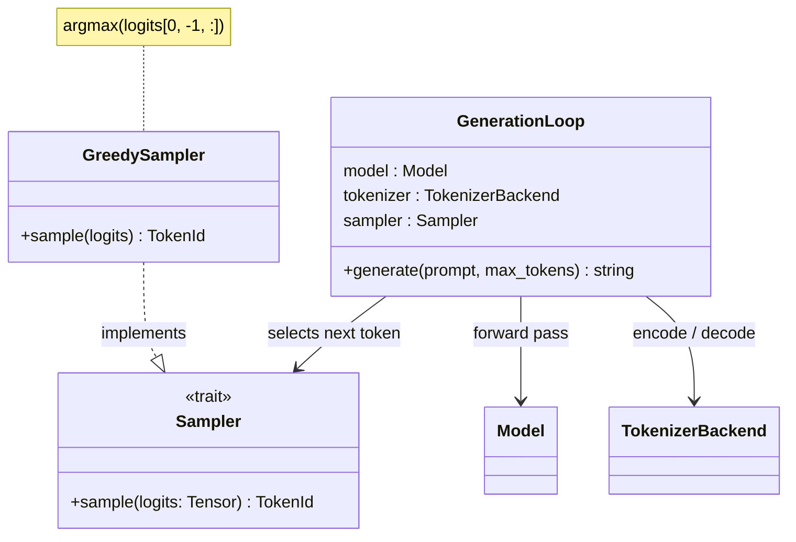
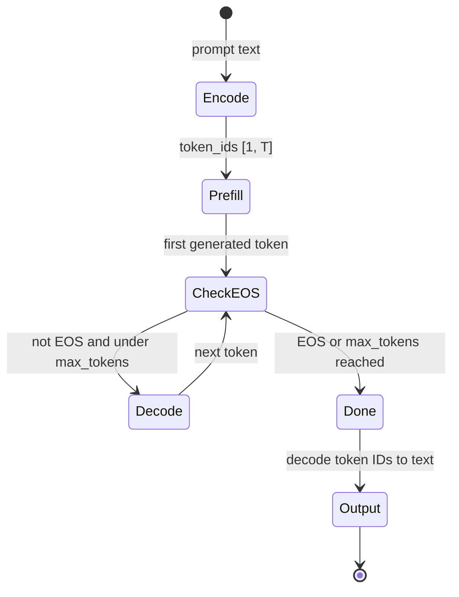
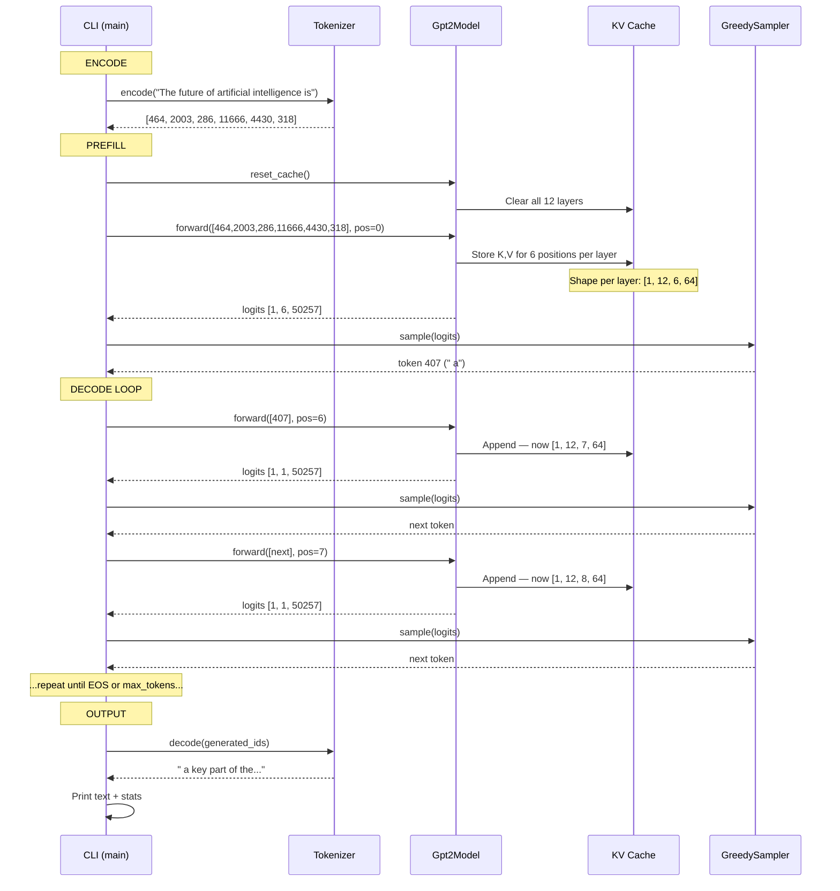
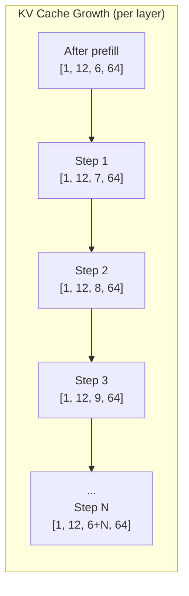

# Chapter 7: The Skeleton Speaks

## Three Chapters of Silence

You have been running `inspect` for three chapters. Load the model, feed it a prompt, look at the top-5 predictions, nod approvingly, and exit. The model has been whispering single words through a keyhole.

Time to open the door.

In this chapter, you will build the generation loop — the machinery that turns a one-shot predictor into something that *talks*. You will implement a sampler, wire up the prefill-decode pipeline, and run `generate` for the first time. Coherent English will come out the other end.

This is the payoff. Everything you built in chapters 4 through 6 — weight loading, embeddings, attention, the KV cache — exists for this moment. One new component (the sampler), one loop, and the skeleton speaks.

---

## The Simplest Sampler in the World

After the forward pass, you have logits — the raw, unnormalized scores from the LM head (chapter 6) — a vector of 50,257 values, one per token in the vocabulary. Higher score means the model thinks that token is more likely to come next. You need to pick one.

The greedy sampler does this:

```
function greedy_sample(logits):
    last_logits = logits[0, -1, :]     // only the last position predicts the next token
    return argmax(last_logits)          // highest score = model's best guess; deterministic, no randomness
```

That is it. One line of real logic. No temperature scaling. No top-k filtering. No randomness. Always pick the token with the highest probability. The same prompt always produces the same output.

The sampler implements a trait:

```
trait Sampler:
    sample(logits: Tensor) -> Result<TokenId>  // trait, not concrete type — swap strategies without touching the loop
```

Why a trait for something this simple? Because greedy is chapter 7. Later chapters will add temperature sampling, top-k, top-p, repetition penalties. The trait boundary means swapping strategies without touching the generation loop. But right now, `argmax` is all you need.


**Figure 7.1** — The generation pipeline. GreedySampler is new; Model and TokenizerBackend were built in chapters 4-6.

Greedy decoding has a reputation for producing bland, repetitive text. That is true for large-scale creative tasks. But for a 124M parameter model generating 200 tokens? Greedy is perfect. It is deterministic (great for testing), fast (no sorting or probability math), and good enough to prove the pipeline works.

---

## Two Phases, Same Model

Here is the thing about generation that trips people up the first time: the model runs twice in fundamentally different ways. Same weights, same architecture, but two distinct phases — and confusing them is the source of most generation bugs.

### Prefill: The Opening Salvo

Your prompt is "The future of artificial intelligence is" — six tokens: `[464, 2003, 286, 11666, 4430, 318]`. During **prefill**, all six tokens go through the model in a single forward pass. The input tensor is `[1, 6]`. The model processes all positions in parallel using a causal attention mask (so token 3 cannot attend to token 5, but can attend to tokens 0-3).

Two things come out of prefill:

1. **Logits** with shape `[1, 6, 50257]` — a prediction at every position. You only care about the last one: the model's prediction for what comes after token 6.
2. **A populated KV cache** — every attention layer has stored its key and value projections for all 6 positions (the caching mechanism from chapter 6). This is the memory of the prompt.

The sampler takes `logits[0, 5, :]` (the last position), runs argmax, and produces the first generated token.

### Decode: One Token at a Time

Now the loop begins. You have one new token. You feed *just that token* into the model — input shape `[1, 1]`. The model runs a forward pass on that single token, but during attention, it reads from the **entire KV cache** (all 6 prompt tokens plus any previously generated tokens). The new token's key and value get appended to the cache. You get logits of shape `[1, 1, 50257]`. Sample. Repeat.

Each decode step adds exactly one row to the KV cache. No causal mask needed — with a single query token attending to all cached keys, there is nothing to mask.

| | Prefill | Decode |
|---|---|---|
| **Input tokens** | All prompt tokens at once | One new token |
| **Input shape** | `[1, T]` where T = prompt length | `[1, 1]` |
| **Causal mask** | Yes — prevent future-peeking | No — single query, all keys visible |
| **KV cache before** | Empty | Has T + (step-1) entries |
| **KV cache after** | Populated with T entries | Grows by 1 entry |
| **Output logits** | `[1, T, 50257]` — use last position | `[1, 1, 50257]` |
| **Runs** | Once | Up to max_tokens times |

**Figure 7.2** — Prefill vs. decode: same model, different jobs.

This two-phase design is *the* key insight of modern LLM serving. Without the KV cache you built in chapter 6, every decode step would need to reprocess the entire sequence from scratch — quadratic cost. With the cache, each step is constant-time in the model's computation (though attention still reads the full cache, so it grows linearly). For a 200-token generation with a 6-token prompt, the naive approach runs 206 * 200 / 2 = ~20,600 token-positions through the model. The cached approach runs 6 + 200 = 206. That is a 100x difference.

---

## The Position Counter Trap

Here is a bug you will encounter. It will not crash. It will not throw an error. It will produce output that looks almost right — maybe coherent for two or three tokens — then devolve into nonsense.

The bug: using position 0 for every decode step.

During prefill, positions are `[0, 1, 2, 3, 4, 5]`. The model uses these to look up positional embeddings (and in models with rotary embeddings, to compute rotation angles). After prefill, the first decode step should use position `6`. The next, position `7`. And so on.

If you forget to advance the position counter — or worse, reset it to 0 each step — the model computes correct attention over the cached keys but with *wrong positional information*. The model thinks every generated token is the first token. The positional signal says "beginning of sequence" while the KV cache says "you are 50 tokens deep." The model gets confused. Output degrades.

You will spend an afternoon debugging attention masks before realizing the bug is in a single counter variable.

```
// WRONG — position stuck at 0
for step in 1..max_tokens:
    logits = model.forward([next_token], pos_offset=0)    // Bug! model thinks every token is the first token
    ...

// RIGHT — position advances each step
position = prompt_length                                   // resume where the prompt left off
for step in 1..max_tokens:
    logits = model.forward([next_token], pos_offset=position)  // correct positional embedding for this token's place in the sequence
    ...
    position += 1                                          // each new token occupies the next slot
```

The fix is trivial. Finding it is not. Treat position tracking as sacred. Test it explicitly: after generating N tokens, the position counter must equal `prompt_length + N`.

---

## The Generation Loop

With the sampler built and the two phases understood, here is the complete generation algorithm:

```
function generate(model, tokenizer, sampler, prompt, max_tokens):
    // --- Encode ---
    token_ids = tokenizer.encode(prompt)       // text → integer IDs the model understands
    prompt_len = len(token_ids)

    // --- Clear prior state ---
    model.reset_cache()                        // stale cache from a previous generation would corrupt attention

    // --- Prefill ---
    logits = model.forward(token_ids, pos_offset=0)      // process entire prompt in one parallel pass
    next_token = sampler.sample(logits)                   // only the last position's logits matter

    // --- Decode loop ---
    generated = [next_token]
    position = prompt_len                      // resume position counter where the prompt ended

    for step in 1..max_tokens:
        if next_token == EOS_TOKEN:            // model says "I'm done" — respect it
            break

        logits = model.forward([next_token], pos_offset=position)  // one token in, full cache read
        next_token = sampler.sample(logits)    // pick the next token from the vocabulary

        generated.append(next_token)
        position += 1                          // advance so positional embeddings stay correct

    // --- Decode output ---
    text = tokenizer.decode(generated)         // integer IDs → human-readable text
    return text
```

Five stages: encode, clear, prefill, decode loop, decode output. The loop body is three lines — forward, sample, append. The complexity is not in the logic. It is in getting every shape, every position, and every cache operation exactly right in the layers below.


**Figure 7.3** — Generation loop as a state machine. Prefill runs once; decode loops until a stop condition.

---

## The Full Sequence

Let's trace a complete generation from start to finish. The prompt is `"The future of artificial intelligence is"` — our running example.


**Figure 7.4** — Complete generation flow: encode, prefill, decode loop, output.

Notice how the KV cache grows by exactly one position per decode step. After prefill it holds 6 positions. After 200 decode steps it holds 206. The model's query on each decode step is a single token, but the attention mechanism reads keys and values from the *entire* cache — all 206 positions.


**Figure 7.5** — KV cache grows by one position per decode step. Each step, the query attends to all cached keys. Only new K,V are computed — past entries are reused.

For GPT-2 124M, each cache entry per layer is `2 * 12 * 64 * 4 bytes` (K and V, 12 heads, 64 dim, float32) = 6,144 bytes. With 12 layers, each new position adds about 72 KB to the cache. After 200 tokens, the cache holds roughly 15 MB. Small for GPT-2. For a 70B model with 80 layers and 8,192 dimensions? The cache is the memory bottleneck. That story comes later.

---

## The Moment of Truth

Wire the generation loop into the `generate` subcommand:

```
rvllm generate --prompt "The future of artificial intelligence is"
```

Default parameters: max 200 tokens, greedy sampling, GPT-2 124M.

Here is what you should see:

```
Loading model: openai-community/gpt2
  Model files downloaded/cached
  Tokenizer loaded (vocab_size: 50257)
  Model weights loaded (12 layers, 768 dim, 12 heads)

Prompt: "The future of artificial intelligence is"
Prompt tokens: 6
Generating up to 200 tokens...

--- Generated Text ---
The future of artificial intelligence is not just about the technology,
but about the people who use it.

"The future of AI is not just about the technology, but about the
people who use it," said Dr. Andrew Ng, a professor at Stanford
University and co-founder of Google Brain. "It's about the people
who are building it, and the people who are using it."
--- End ---

--- Stats ---
Tokens generated: 87
Time: 14.32s
Speed: 6.07 tokens/sec
```

The exact text will depend on your implementation's precision, weight loading, and GELU variant. The stats will vary by hardware. But the structure should match.

If your output is coherent English — grammatically plausible sentences that continue the prompt in a reasonable direction — congratulations. You have built a working language model from scratch. Not a wrapper around someone else's library. Not a fine-tuning script. A program that loads raw weights, runs matrix multiplications through twelve transformer blocks, and produces human-readable text.

Take a moment with that.

---

## What "Correct" Looks Like

Greedy decoding is deterministic. Same model, same weights, same prompt, same float precision — same output, every time. This gives you a powerful testing tool: run it twice and diff the results. If they differ, something is nondeterministic in your implementation (uninitialized memory, floating-point ordering issues, a random seed leaking in).

Here is what to check:

- **Coherence.** The text should be grammatically plausible English for at least 20-30 tokens. GPT-2 124M is not a brilliant writer, but it can form sentences.
- **No degenerate repetition.** If the same word repeats 10+ times in a row ("the the the the the the..."), something is wrong — likely a weight transposition bug from chapter 5 or a KV cache issue from chapter 6.
- **Prompt echo.** The generated text should logically continue the prompt. If the prompt is about AI and the output is about medieval farming, check your positional embeddings.
- **EOS handling.** Generation should stop if the model outputs token 50256 (GPT-2's end-of-text token) or when max_tokens is reached.
- **Speed.** On a modern laptop CPU, expect 2-10 tokens/sec for GPT-2 124M. On a GPU, much faster. If you are getting less than 1 token/sec, you may not be using the KV cache (recomputing the full sequence every step).

### Common Failure Modes

| Symptom | Likely Cause |
|---------|-------------|
| Same token repeated endlessly | Conv1D weights not transposed (ch05 bug) |
| Coherent first token, then garbage | KV cache not appended correctly (ch06) |
| Crash on second decode step | KV cache concat dimension wrong |
| Empty output | Sampler returning EOS immediately |
| Very slow (< 1 tok/sec) | Not using KV cache — recomputing full sequence |
| Output differs from HuggingFace | Using approximate GELU instead of exact |

If you hit one of these, go back to `inspect`. Check that the top-5 predictions for a known prompt match what HuggingFace produces. The single-step prediction from chapter 6 is your ground truth — if that works but generation does not, the bug is in the loop, not the model.

---

## The Spec

All the implementation details for this chapter live in `spec/ch07/`:

| Artifact | Path | What it contains |
|----------|------|-----------------|
| Interface spec | `spec/ch07/interface-spec.md` | GreedySampler contract, generation loop algorithm, CLI args, output format |
| Component diagram | `spec/ch07/component-diagram.md` | Class diagram, state machine, data flow |
| Sequence diagram | `spec/ch07/sequence-diagram.md` | Full generation trace with KV cache growth |
| Expected output | `spec/ch07/expected-output.txt` | Output structure and validation rules |
| Prompt template | `spec/ch07/prompt-template.md` | Copy-paste prompt for LLM-assisted implementation |
| Validation tests | `spec/ch07/validation/` | Automated checks for correctness |

To verify your implementation:

```
pytest spec/ch07/validation/
```

The tests check: loading output present, generated text section exists and is non-empty, at least 20 words generated, no degenerate repetition, prompt echoed, no NaN in output, speed/timing/count stats reported, and clean exit.

---

## Try It Yourself

You have a talking model. Play with it.

**Change the prompt.** Try creative writing:

```
rvllm generate --prompt "Once upon a time in a land far away"
```

**Try code generation.** GPT-2 was trained on a lot of internet text, including code:

```
rvllm generate --prompt "def fibonacci(n):"
```

Do not expect working code from a 124M model — but you should see something that *looks* like a function body. The fact that the model even attempts code structure, despite being trained on raw text with no special code instruction, tells you something about what those 124 million parameters learned.

**Try the running example.** Remember "What is AI?" from chapter 1? Those four tokens `[2061, 318, 9552, 30]` that started this whole journey:

```
rvllm generate --prompt "What is AI?"
```

Watch the model answer the question. It went in as four integers. It comes out as a paragraph.

**Push the limits.** Set `--max-tokens 500` and see when the output starts to degrade. GPT-2 was trained with a 1,024-token context window — what happens as you approach it?

---

## Where the Time Goes

Look at the stats line. On a laptop CPU, you are probably seeing somewhere between 2 and 10 tokens per second. That is one token every 100-500 milliseconds. Each token requires a full forward pass through 12 transformer layers, each with attention and MLP computations.

Is that fast? For a single user typing into a terminal, it is fine — about reading speed. For a production service handling hundreds of concurrent requests, it is nowhere near enough. And GPT-2 124M is *tiny*. LLaMA-70B has 560 times more parameters. The same generation loop on a 70B model, on a single GPU, might give you 20-40 tokens/sec with heavy optimization. Without it? Minutes per response.

This is why everything after this chapter exists. PagedAttention, continuous batching, tensor parallelism, speculative decoding — all of it is in service of making this loop faster, for more users, on bigger models.

But that is later. Right now, the skeleton speaks.

---

## The Road to a Real Engine

You have a working end-to-end inference pipeline. Load a model from HuggingFace, tokenize a prompt, run prefill, loop through decode steps, and produce coherent text. That is a genuine language model inference engine.

It is also the slowest, most memory-wasteful, single-user version possible. No batching — one request at a time. No memory management — the KV cache grows without bound until you run out of RAM. No streaming — the user waits until all tokens are generated before seeing anything. No API — just a CLI.

Next chapter, we polish the MVP. Measure where the time actually goes. Profile memory usage. Add proper error messages and edge case handling. Make it something you could hand to another developer and say "run this." Because before we start optimizing, we need to know exactly what we are optimizing *from*.

The skeleton speaks. Now let's teach it manners.
