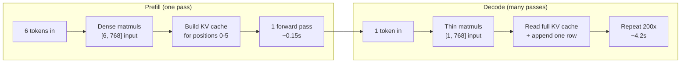
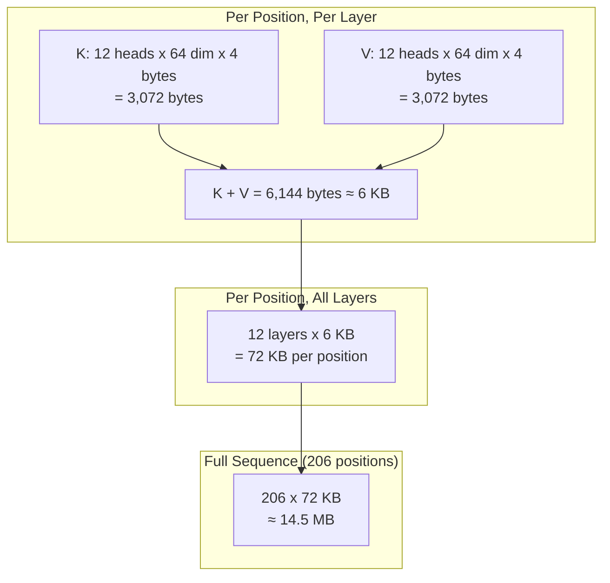
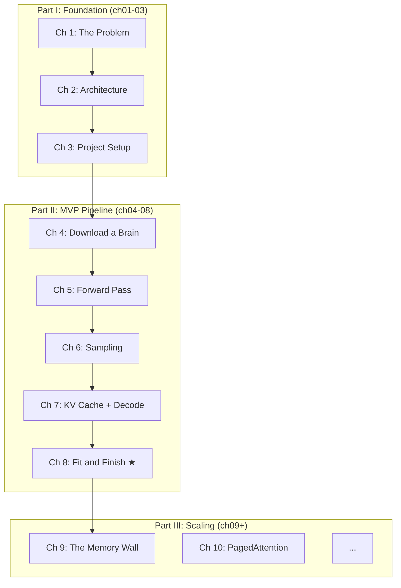

# Chapter 8: Fit and Finish

## Generation Works. Now Make It Talk.

Your inference engine generates text. You type a prompt, wait a few seconds, and coherent English comes back. That is a real achievement --- you built this from an empty directory.

But run it right now and here is what you get:

```
The future of artificial intelligence is a topic of much debate...
Done in 4.32s
```

Text and a wall clock. That is it.

How much of that 4.32 seconds was processing the prompt? How much was generating tokens? Is it getting slower as it generates more? How much memory is the KV cache eating? If you wanted to run a bigger model, would it even fit?

You cannot answer any of these questions. Your engine is a black box that happens to produce text. A professional tool tells you *what it is doing* and *how fast it is doing it*. This chapter adds that transparency.

By the end, both `inspect` and `generate` will produce polished, informative output. This is the MVP milestone --- the point where your engine is not just functional but *finished*.

---

## Two Phases, Two Personalities

As Chapter 1 introduced and Chapter 7 implemented, generation is two fundamentally different operations: **prefill** (all prompt tokens in one compute-bound pass) and **decode** (one token per memory-bound pass). The distinction matters for what we are about to do --- because lumping both phases into a single "total time" hides everything interesting about your engine's performance.


**Figure 8.1** --- Prefill processes all prompt tokens at once (compute-bound). Decode generates one token per forward pass (memory-bound). (See Chapter 1, Figure 1.2 for the full breakdown.)

Instrumenting them separately is straightforward. Wrap the prefill forward pass in a timer. Wrap the decode loop in another. Report both:

```
--- Stats ---
Tokens generated: 200
Prefill: 0.15s (6 prompt tokens)
Decode:  4.17s (200 tokens, 47.96 tokens/sec)
Total:   4.32s
```

Now you can see that decode dominates. You know your throughput. You can experiment: does a longer prompt increase prefill time linearly? Does decode speed degrade as the sequence gets longer? (Spoiler: yes, because the KV cache grows and attention has more to read.)

---

## The Math of KV Cache Memory

As Chapter 7 showed, the KV cache grows by one position per decode step --- every layer storing a key and value vector for every position seen so far. But how much memory does that actually cost?

Let's calculate exactly for GPT-2.

**Per token, per layer:**

Each attention head produces a key and a value, both of dimension `head_dim` (the hidden size divided by the number of heads --- 768 / 12 = 64 for GPT-2):

```
K per head = head_dim * sizeof(float32) = 64 * 4 = 256 bytes   // each head stores one key vector per position
V per head = head_dim * sizeof(float32) = 64 * 4 = 256 bytes   // ...and one value vector (same size)

All heads = n_head * (K + V) = 12 * (256 + 256) = 6,144 bytes  // every head needs its own K,V — they attend independently

Or equivalently:
  2 * n_head * head_dim * sizeof(float32)                       // factor of 2 = one K + one V
  2 * 12 * 64 * 4
  = 6,144 bytes per token per layer
  ≈ 6 KB
```

**Per token, all layers:**

```
12 layers * 6,144 bytes = 73,728 bytes ≈ 72 KB per token       // each layer maintains its own cache — they don't share
```

**For a full generation (6 prompt + 200 generated = 206 positions):**

```
206 positions * 72 KB = 14,832 KB ≈ 14.5 MB                    // prompt + generated tokens — the cache never shrinks
```


**Figure 8.2** --- KV cache memory breakdown for GPT-2 124M with a 206-token sequence.

For GPT-2, 14.5 MB is nothing. Your laptop has gigabytes of RAM to spare. But let's play this forward.

| Model | Layers | Heads | Head Dim | KV per Token | 1024 Tokens | 100 Requests |
|-------|--------|-------|----------|-------------|-------------|-------------|
| GPT-2 124M | 12 | 12 | 64 | 72 KB | 72 MB | 7.2 GB |
| LLaMA-7B | 32 | 32 | 128 | 32 KB | 32 MB | 3.2 GB |
| LLaMA-70B | 80 | 64 | 128 | 160 KB | 160 MB | 16 GB |

Wait --- GPT-2 at 1,024 tokens per request, 100 concurrent requests: **7.2 GB just for the KV cache.** That is separate from the model weights, the activations, the framework overhead. And that is the *smallest* model in the table.

Here is the deeper problem: most of that memory is wasted. If you allocate a 1,024-position cache for each request but the average request only uses 150 tokens, you have reserved 874 positions worth of memory that sits empty. Multiply by 100 requests and the waste is staggering.

Report the KV cache in your stats output:

```
KV cache: 14.5 MB (206 positions x 12 layers x 6 KB/pos/layer)
```

This plants a seed. The reader sees the number now, remembers the scaling table, and wonders: how do production systems handle this? That answer --- PagedAttention --- is coming.

---

## The Polished Inspect

Your `inspect` subcommand has grown organically across chapters. Chapter 4 added model loading and config. Chapter 5 added layer details. Chapter 6 added a forward pass. Now consolidate everything into a single, clean report:

```
=== Model: openai-community/gpt2 ===

Config:
  Layers: 12, Hidden dim: 768, Heads: 12, Vocab: 50257
  Context window: 1024, Head dim: 64

Weights:
  148 tensors, ~124M parameters
  Memory: ~497 MB (float32)

Layers:
  2 embeddings, 24 LayerNorms, 12 MLPs, 12 attention blocks

Tokenizer:
  "What is AI?" → [2061, 318, 9552, 30] → "What is AI?" ✓

Quick prediction (forward pass on "What is AI?"):
  1. " The"   (logit: 10.24)
  2. "\n"     (logit:  9.87)
  3. " It"    (logit:  8.45)
  4. " A"     (logit:  7.93)
  5. " In"    (logit:  7.61)
```

This is a one-command health check. Download the model, verify the config, count the weights, test the tokenizer, run a forward pass --- all in one invocation. If anything is broken, you find out immediately.

The format is deliberate:

- **Config** up top --- the architectural identity of the model.
- **Weights** next --- did everything load? How much memory?
- **Layers** --- structural confirmation that the weight map makes sense.
- **Tokenizer** --- round-trip proof that encoding and decoding are consistent.
- **Quick prediction** --- end-to-end smoke test. If the top-5 predictions are reasonable English, the model is working.

---

## Structured Logging: Say Goodbye to Print

Up to now, your program likely sprinkles `print` statements everywhere. Loading the model? Print. Processing a token? Print. Something went wrong? Print to standard error, maybe.

This works until it doesn't. You want to see debug output during development but hide it in production. You want loading messages but not per-token noise. You want to pipe generated text to a file without it being cluttered with status messages.

The fix is structured logging with severity levels:

| Level | What goes here | Example |
|-------|---------------|---------|
| ERROR | Something broke, cannot continue | "Failed to load model: file not found" |
| WARN | Something is off, but recoverable | "Model has no EOS (end-of-sequence) token, using fallback" |
| INFO | User-visible lifecycle events | "Model loaded (12 layers, 768 dim)" |
| DEBUG | Internal decisions and data | "Token 42 sampled with logit 8.73" |
| TRACE | Hot-path detail, per-token/per-layer | "Layer 5 attention: [6, 12, 6, 6]" |

The default should show INFO and above. A `--verbose` flag drops to DEBUG. Generated text goes to stdout; everything else goes to stderr through the logging framework.

The key insight: **logging is not just for debugging. It is part of your user interface.** The INFO-level output *is* the user experience. When someone runs `generate`, the loading messages, the stats, the timing --- those are all structured log output at INFO level. The generated text itself is the only thing that goes directly to stdout.

---

## Error Messages That Actually Help

Your engine has several failure modes. Each one should produce a message that tells the user what happened and what to do about it.

**Model not found:**
```
Error: Model "opanai-community/gpt2" not found on HuggingFace Hub.
  Hint: Check the model ID for typos. Try browsing https://huggingface.co/models
```

**Network failure:**
```
Error: Cannot reach HuggingFace Hub (connection timed out).
  Hint: Check your internet connection. If the model was previously
        downloaded, it may be available in ~/.cache/huggingface/
```

**Shape mismatch (during development):**
```
Error: Weight shape mismatch for "h.0.attn.c_attn.weight"
  Expected: [768, 2304]
  Got:      [768, 768]
  Hint: This model may use a different attention layout than expected.
```

**Out of memory:**
```
Error: Cannot allocate KV cache (estimated 14.5 MB required).
  Model requires ~497 MB for weights + ~14.5 MB for KV cache.
  Hint: Try a shorter max_tokens or a smaller model.
```

Notice the pattern: **what happened**, then **why it might have happened**, then **what to try**. Never leave the user staring at a raw stack trace or a cryptic error code.

---

## The MVP Moment

Take stock.

Eight chapters ago, you had an empty directory. Now you have a working LLM inference engine that:

- Downloads models from HuggingFace Hub
- Loads 148 weight tensors into memory
- Tokenizes arbitrary text into token IDs and back
- Runs a full transformer forward pass with 12 layers of multi-head attention
- Generates coherent text one token at a time with KV caching
- Reports timing breakdowns for prefill and decode phases
- Estimates KV cache memory consumption
- Provides a consolidated model inspection report
- Uses structured logging instead of raw print statements
- Gives helpful error messages when things go wrong

Here is what the polished `generate` output looks like:

```
Loading model: openai-community/gpt2
  Tokenizer loaded (vocab_size: 50257)
  Model loaded (12 layers, 768 dim, 12 heads, ~124M params)

Prompt: "The future of artificial intelligence is"
Prompt tokens: 6
Generating up to 200 tokens...

--- Generated Text ---
The future of artificial intelligence is a topic that has been
discussed for decades. The idea of a machine that can think, learn,
and make decisions on its own has captured the imagination of
scientists, engineers, and the public alike...
--- End ---

--- Stats ---
Tokens generated: 200
Prefill: 0.15s (6 prompt tokens)
Decode:  4.17s (200 tokens, 47.96 tokens/sec)
Total:   4.32s
KV cache: 14.5 MB (206 positions × 12 layers × 6 KB/pos/layer)
```

That is a professional tool. It tells you what it loaded, what it generated, how fast it did it, and how much memory it used. You could hand this to another developer and they would understand exactly what they are looking at.


**Figure 8.3** --- You are here. The MVP is complete. Part III tackles what happens when this approach hits its limits.

---

## The Spec

This chapter's implementation details live in `spec/ch08/`:

| Artifact | What it contains |
|----------|-----------------|
| `spec/ch08/interface-spec.md` | Timing breakdown API, KV cache calculation, polished output formats |
| `spec/ch08/component-diagram.md` | MVP architecture with TimingStats and KvCacheStats |
| `spec/ch08/sequence-diagram.md` | Generate flow with prefill/decode timing instrumentation |
| `spec/ch08/expected-output.txt` | Exact output format for both `generate` and `inspect` |
| `spec/ch08/prompt-template.md` | Implementation guidance for an LLM agent |
| `spec/ch08/validation/` | Test suite: `pytest spec/ch08/validation/` |

Validate your implementation:

```bash
pytest spec/ch08/validation/
```

The tests check that:
- Prefill and decode are timed and reported separately
- KV cache memory is estimated and displayed
- `inspect` produces a consolidated report with config, weights, and predictions
- Parameter count and memory footprint are mentioned

---

## Try It Yourself

**Exercise 1: The 500-Token Run.**
Generate 500 tokens instead of 200. Look at the decode speed --- is it still the same tokens/sec? It should be slightly slower, because each decode step reads a larger KV cache. Measure the KV cache memory too: 506 positions should be about 35.5 MB.

**Exercise 2: Decode Speed Over Time.**
If your implementation allows it, print the decode speed every 50 tokens. You should see a gradual decline:

```
Tokens   1-50:   52.1 tokens/sec
Tokens  51-100:  50.8 tokens/sec
Tokens 101-150:  49.3 tokens/sec
Tokens 151-200:  47.9 tokens/sec
```

This is the KV cache growing. Each attention computation reads more data. The effect is subtle on GPT-2 but dramatic on larger models.

**Exercise 3: Different Models.**
Try `openai-community/gpt2-medium` (355M parameters, 24 layers, 1024 hidden dim). How does the timing change? How much more memory does the KV cache use? The formulas you built in this chapter should predict it exactly.

---

## The Problem Lurking Beneath the Surface

You built a working inference engine. It is polished. It is informative. It generates coherent text. For a single user on a single machine, it is genuinely useful.

But there is a problem lurking.

Go back to that scaling table. GPT-2 with 1,024-position sequences and 100 concurrent requests: 7.2 GB of KV cache alone. LLaMA-70B at the same scale: 16 GB. And that is with the *naive* approach --- pre-allocating the full context window for every request.

The waste is the real killer. A request that uses 150 tokens out of a 1,024-position cache has 85% of its allocated memory sitting empty. Multiply that waste by hundreds of concurrent requests and you hit the memory wall long before you run out of compute.

This is the gap between "inference engine" and "inference *server*." A server has to handle many requests simultaneously, share memory efficiently, and avoid the catastrophic waste of fixed-size allocation. Everything you have built so far works beautifully for one request. What about one hundred?

Next chapter: the memory wall --- and why the naive KV cache approach breaks down the moment you try to scale.
