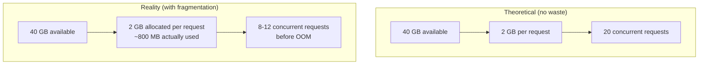

# Chapter 9: The Memory Problem

---

## One Hundred Users Walk Into a GPU

Your inference engine works. One user, one prompt, coherent text streaming back. The KV cache sits neatly in memory, growing one token at a time. Life is good.

Now imagine a hundred users hit your server at the same time.

Each one needs a KV cache. Chapter 1 showed us the math: GPT-2 at 1,024 tokens costs 36 MB per request. One hundred requests: 3.6 GB just for KV storage. That is manageable --- GPT-2 is small.

But your engine does not allocate 36 MB per request. It allocates for the *worst case*. If your maximum sequence length is 1,024 tokens, every request gets a 1,024-position buffer --- even the request that only generates 47 tokens.

A request that uses 47 out of 1,024 positions wastes 95% of its allocated memory. Multiply that across a hundred users, and you are burning gigabytes on empty slots.

This is not a hypothetical. This is how every naive inference engine works, including the one you just built.

---

## Two Flavors of Waste

Memory waste in KV caches comes in two distinct flavors. Both are familiar to anyone who has studied operating systems --- and both are devastating at GPU scale.

### Internal Fragmentation: The Empty Seats

You reserve a row of 30 seats in a theater for your group. Only 10 people show up. The other 20 seats sit empty, but nobody else can use them --- they are *yours*.

This is **internal fragmentation**. The space is allocated but unused. In KV cache terms: you allocate a buffer for `max_seq_len` tokens, but the request only fills a fraction of it.

How bad does it get? Consider three requests hitting your engine:

| Request | Allocated | Actually Used | Wasted |
|---------|-----------|---------------|--------|
| A | 30 slots | 10 tokens | 20 slots |
| B | 30 slots | 25 tokens | 5 slots |
| C | 30 slots | 8 tokens | 22 slots |
| **Total** | **90 slots** | **43 tokens** | **47 slots (52.2%)** |

More than half the allocated memory is empty. Not free --- *allocated but empty*. No other request can touch it.

```
GPU Memory (30 slots per request)
┌──────────────────────────────────────────────────────────────┐
│ Request A  ████████████████████░░░░░░░░░░░░░░░░░░░░░░░░░░░░ │
│             10 used            20 wasted                     │
├──────────────────────────────────────────────────────────────┤
│ Request B  ██████████████████████████████████████████████░░░░ │
│             25 used                                5 wasted  │
├──────────────────────────────────────────────────────────────┤
│ Request C  ██████████████████░░░░░░░░░░░░░░░░░░░░░░░░░░░░░░ │
│             8 used             22 wasted                     │
└──────────────────────────────────────────────────────────────┘
              ████ = used tokens    ░░░░ = allocated but empty
```
**Figure 9.1** --- Internal fragmentation. Dark blocks are used tokens; light blocks are allocated-but-empty space. Over half the memory does nothing.

### External Fragmentation: The Scattered Gaps

Internal fragmentation wastes space *inside* allocations. External fragmentation wastes space *between* them.

Picture a 100-slot memory pool. Five requests arrive and pack it nearly full:

```
Step 1 — Five requests fill the pool:

 ┌──A (20)──┬──B (15)──┬─────C (25)─────┬──D (15)──┬──E (10)──┬─free (15)─┐
 │▓▓▓▓▓▓▓▓▓▓│▓▓▓▓▓▓▓▓▓▓│▓▓▓▓▓▓▓▓▓▓▓▓▓▓▓│▓▓▓▓▓▓▓▓▓▓│▓▓▓▓▓▓▓▓▓▓│...........│
 └──────────┴──────────┴───────────────┴──────────┴──────────┴───────────┘
                                                          85 used, 15 free
```

Now requests B and D finish and release their slots:

```
Step 2 — B and D depart, freeing 30 more slots:

 ┌──A (20)──┬─gap (15)─┬─────C (25)─────┬─gap (15)─┬──E (10)──┬─free (15)─┐
 │▓▓▓▓▓▓▓▓▓▓│...........│▓▓▓▓▓▓▓▓▓▓▓▓▓▓▓│...........│▓▓▓▓▓▓▓▓▓▓│...........│
 └──────────┴──────────┴───────────────┴──────────┴──────────┴───────────┘
                                                          55 used, 45 free
```
**Figure 9.2** --- External fragmentation. The memory exists. You just cannot use it.

45 free slots. A new request arrives needing 25 contiguous slots. Can you serve it?

No. The free space is split into three gaps of 15 slots each. The largest gap is only 15 --- twenty-five contiguous slots do not exist, even though 45 slots are free.

This is worse than internal fragmentation. Internal waste is predictable --- you know how much you are losing. External fragmentation is *chaotic*. It depends on which requests arrive and depart in what order. The same total free memory can be usable or useless depending on how it is scattered.

---

## The Scaling Wall

Combine both types of waste and watch what happens as you try to serve more requests.

Take a GPU memory pool of 100 slots and requests that each need up to 30 tokens. How many fit?

```
Request 1: slots  0-29   [OK]
Request 2: slots 30-59   [OK]
Request 3: slots 60-89   [OK]
Request 4: needs 30, only 10 remain   [FAILED]
```

Three requests. The remaining 10 slots --- 10% of your total memory --- are permanently unusable. Not because they are occupied, but because they are the wrong shape.

Now scale the numbers to a real model. LLaMA-7B at 4,096 tokens: each request needs 2 GB of KV cache. On an 80 GB GPU (with ~40 GB available for KV after loading model weights), you can serve **20 concurrent requests** --- if every single one uses the full 4,096 tokens. In practice, most requests are shorter. The waste compounds. You might serve 20 requests in theory but only 8-12 in practice, with the rest of the memory sitting in allocated-but-empty buffers.


**Figure 9.3** --- The scaling wall. Theoretical capacity assumes every byte is used. Reality includes fragmentation waste, cutting effective concurrency by 40-60%.

This is the memory wall. Not a hardware limitation --- a *software* limitation. The memory is there. The allocation strategy cannot use it.

---

## An Old Solution to a New Problem

Operating systems solved this exact problem fifty years ago.

In the early days of computing, processes requested contiguous blocks of physical memory. Sound familiar? The same two problems emerged: internal fragmentation (processes allocated more than they used) and external fragmentation (gaps between allocations that nothing could fill).

The solution was **paging**. Instead of giving each process a contiguous block, the OS divides physical memory into fixed-size pages (typically 4 KB). A process that needs 10 KB gets three pages --- and those pages can be *anywhere* in physical memory. A **page table** maps the process's virtual addresses to physical locations.

The analogy to KV caches is almost exact:

| Concept | OS Virtual Memory | Naive KV Cache | Paged KV Cache |
|---------|------------------|----------------|----------------|
| Allocation unit | Page (4 KB) | Contiguous buffer | Block (16 tokens) |
| Fragmentation | Solved by paging | Internal + external | Solved by paging |
| Waste | < 1 page per alloc | Up to max_seq_len - 1 | < 1 block per alloc |
| Address mapping | Page table | None (direct) | Block table |
| Concurrent users | Thousands | Single digits | Hundreds |

**Figure 9.4** --- The OS analogy. Every column in the "Paged KV Cache" row mirrors the OS solution.

The insight is simple: **if you stop requiring contiguous allocation, both fragmentation problems vanish.**

A request that needs 10 tokens does not need a 30-slot contiguous buffer. It needs one block. A block is, say, 16 tokens. One block, partially filled. When the request generates more tokens and fills that block, allocate another block --- anywhere in memory. A **block table** (the KV cache's page table) tracks which blocks belong to which request.

---

## What Paging Would Fix

If we split the KV cache into fixed-size blocks, everything changes:

**Internal waste** drops from ~52% to less than one block per request. A request using 10 tokens in a 16-token block wastes 6 slots --- not 20. And the waste is bounded: at most `block_size - 1` slots per request, regardless of `max_seq_len`.

**External fragmentation** is eliminated entirely. Blocks do not need to be contiguous. A request's blocks can be scattered across the entire memory pool. There are no "gaps too small to use" because every free block is exactly the right size.

**Memory utilization** jumps from 50-60% to near 100%. Almost every slot holds useful data.

**Concurrent requests** increase 3-10x with the same GPU memory. The memory that was locked up in waste is now available for more requests.

Instead of this:

```
Request A → [30 contiguous slots]     (20 wasted)
Request B → [30 contiguous slots]     (5 wasted)
Request C → [30 contiguous slots]     (22 wasted)
```

You get this:

```
Request A → [block 7][block 2]                    (6 wasted in last block)
Request B → [block 0][block 5]                    (7 wasted in last block)
Request C → [block 3]                             (8 wasted in last block)
```

Same three requests. Same tokens. But now the pool has room for many more requests because each one only takes what it actually needs.

---

## The Simulator

This chapter's program builds a memory fragmentation simulator. No model, no GPU --- just an array of slots and an allocator. You will watch contiguous allocation fail in real time:

1. **Internal fragmentation**: allocate three requests, see 52.2% waste
2. **External fragmentation**: fill memory, free two requests, watch a new request fail despite 45 free slots
3. **The scaling wall**: count how many requests fit (spoiler: fewer than you think)
4. **The OS analogy**: a side-by-side comparison table

The visualizer renders memory as ASCII art --- dots for free slots, letters for allocated requests. You will *see* the fragmentation.

---

## The Spec

Everything in this chapter is formalized in [`spec/ch09/`](../spec/ch09/):

| Artifact | What It Contains |
|----------|-----------------|
| `interface-spec.md` | MemoryPool API, Request type, simulation scenarios with exact numbers |
| `component-diagram.md` | Fragmentation types, OS analogy mapping, paged solution comparison |
| `sequence-diagram.md` | External fragmentation step-by-step, contiguous vs paged allocation |
| `expected-output.txt` | Representative output with ASCII memory visualization |
| `prompt-template.md` | Paste into an LLM to generate an implementation |

### Quick Start

1. Read `spec/ch09/interface-spec.md` --- the MemoryPool contract and simulation scenarios
2. Implement (or use `spec/ch09/prompt-template.md` with an LLM)
3. Validate: `pytest spec/ch09/validation/`

---

## Try It Yourself

**Exercise 1: Vary the Block Size.**
The paged solution uses blocks of 16 tokens. What happens with blocks of 4? Of 64? Smaller blocks mean less internal waste but more metadata (more entries in the block table). Larger blocks mean more waste per request but simpler bookkeeping. Find the sweet spot for your workload.

**Exercise 2: Random Workloads.**
Modify the simulator to generate random requests with sequence lengths drawn from a distribution (e.g., uniform between 5 and 100). Run 1,000 requests with random arrivals and departures. Measure average utilization over time. How does contiguous allocation compare to a simple block allocator?

**Exercise 3: The Fragmentation Index.**
Define a "fragmentation index" as `1 - (largest_free_block / total_free)`. A value of 0 means all free memory is in one contiguous block (no fragmentation). A value near 1 means free memory is highly scattered. Track this metric through scenario 2. When does it spike?

---

## The Page Table Is the Key

You have a working inference engine from Part II. It handles one request beautifully. But the moment you try to serve many requests, the naive contiguous KV cache becomes the bottleneck --- not because of compute, not because of bandwidth, but because of *allocation strategy*.

The fix has been known since the 1960s. Split memory into fixed-size blocks. Map them with a table. Let allocations be non-contiguous.

In LLM inference, this idea has a name: **PagedAttention**. It is the single most important architectural innovation in vLLM, and it is why vLLM can serve 10-20x more concurrent requests than naive engines on the same hardware.

Next chapter: we build it.
