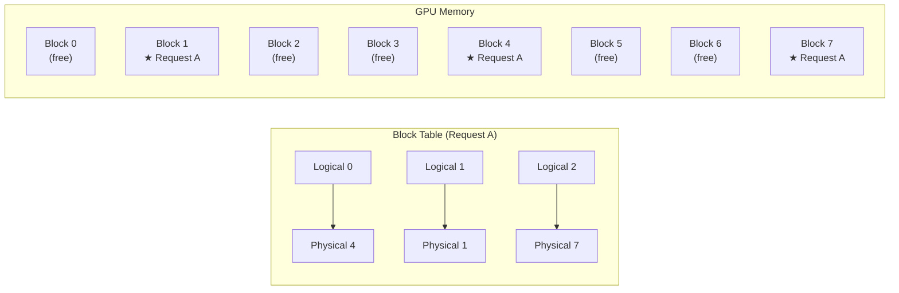
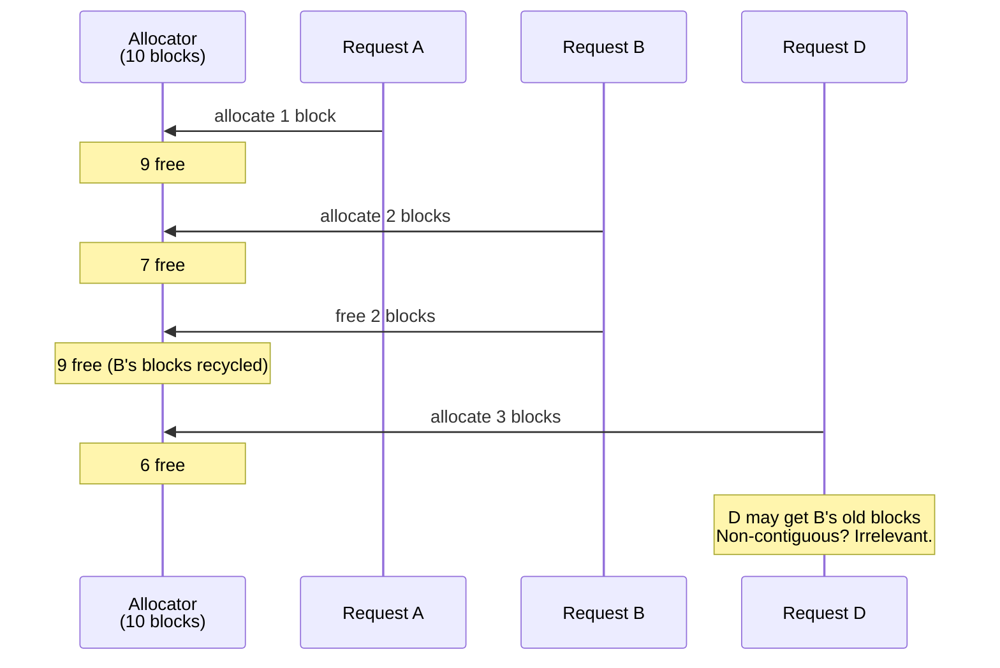

# Chapter 10: PagedAttention

---

## The Page Table for GPU Memory

Chapter 9 showed us the problem: contiguous KV cache allocation wastes memory through internal and external fragmentation. The solution has been known since the 1960s --- paging. This chapter builds it.

The idea is disarmingly simple. Instead of giving each request a single contiguous buffer, divide GPU memory into fixed-size **blocks** (say, 16 tokens each). Each request gets as many blocks as it needs, and those blocks can be *anywhere* in memory. A **block table** --- the KV cache's page table --- maps each request's logical token positions to physical block locations.

That is the entirety of PagedAttention. The rest is details. Important details, but the core idea fits in one sentence: **replace contiguous allocation with block-based allocation and a mapping table.**

---

## Blocks: The New Unit of Memory

A block is a fixed-size chunk of KV cache storage. In vLLM, the standard block size is 16 tokens. Every block has the same capacity, regardless of which request it belongs to.

```
Block 0: [slot 0..15]     ← 16 token positions
Block 1: [slot 16..31]
Block 2: [slot 32..47]
...
Block 9: [slot 144..159]
```

**How to read block layouts.** Each block holds `block_size` token slots. A "slot" stores one token's Key and Value vectors across all attention heads and all layers. For GPT-2, one slot is about 3 KB (Chapter 1's math). For LLaMA-7B, one slot is about 512 KB. The block is the allocation unit --- you allocate whole blocks, never individual slots.

A block has four properties:

| Property | What it means |
|----------|--------------|
| `block_id` | Physical identifier (0, 1, 2, ...) |
| `block_size` | Slots per block (e.g., 16) |
| `ref_count` | How many sequences point to this block (usually 1) |
| `num_filled` | How many slots actually hold data (0 to block_size) |

When `ref_count` drops to zero, the block is free. When `num_filled` equals `block_size`, the block is full --- time to allocate another one.

---

## The Block Allocator

The allocator manages a pool of blocks. It has a simple job: hand out free blocks and take them back.

```
allocator = FreeListAllocator(num_blocks=10, block_size=16)

// Initially: free_queue = [0, 1, 2, 3, 4, 5, 6, 7, 8, 9]

block_a = allocator.allocate()     // returns 0, free_queue = [1..9]
block_b = allocator.allocate()     // returns 1, free_queue = [2..9]

allocator.free(block_a)            // free_queue = [2..9, 0]
block_c = allocator.allocate()     // returns 2, free_queue = [3..9, 0]
```

Notice: `block_c` got block 2, not block 0. The freed block 0 went to the *back* of the queue (FIFO). This is a minor detail with a major consequence for prefix caching (Chapter 16) --- recently freed blocks stay in the pool longer, increasing the chance their cached KV data can be reused.

The allocator's interface is minimal:

```
allocate() -> block_id          // pop a free block, error if none
free(block_id)                  // return block to pool
can_allocate(n) -> bool         // are n free blocks available?
num_free_blocks() -> int        // how many blocks are available?
```

No fragmentation is possible. Every block is the same size. A free block can serve any request. There are no "gaps too small to fill" because there are no gaps --- only blocks, free or occupied.

---

## The Block Table: A Page Table for KV Caches

Each request maintains a **block table** --- an ordered list of physical block IDs that hold its KV data. This is the direct equivalent of an OS process's page table.

A request with 37 tokens and a block size of 16 needs `ceil(37/16) = 3` blocks. If the allocator hands out blocks 4, 1, and 7 (not contiguous --- and it does not matter), the block table looks like:

```
block_table.block_ids = [4, 1, 7]
                         ↑  ↑  ↑
                    logical block 0, 1, 2
```

Logical block 0 maps to physical block 4. Logical block 1 maps to physical block 1. Logical block 2 maps to physical block 7. The physical blocks can be scattered anywhere.


**Figure 10.1** --- Block table maps logical blocks to physical locations. Request A's three blocks are scattered across the pool, but the block table provides seamless access.

---

## The Slot Mapping Formula

Here is where theory meets implementation. During the attention computation, the model needs to read the Key and Value vectors for a specific token. With contiguous allocation, token position `p` maps directly to memory offset `p`. With paging, the mapping goes through the block table.

**How to read the slot mapping.** Given a token position, the formula produces a physical slot index where that token's KV data lives in the flat KV cache array.

```
slot_for_token(position):
    block_index = position / block_size       // which logical block?
    offset      = position % block_size       // where within that block?
    block_id    = block_table[block_index]    // logical → physical
    physical_slot = block_id * block_size + offset

    // This is OS address translation:
    // virtual_address → (page_number, offset) → frame → physical_address
```

Worked example for token position 37 with block table `[4, 1, 7]` and block_size 16:

| Step | Computation | Result |
|------|------------|--------|
| Block index | 37 / 16 | 2 (third logical block) |
| Offset | 37 % 16 | 5 (sixth slot in block) |
| Block ID | block_table[2] | 7 (physical block 7) |
| Physical slot | 7 × 16 + 5 | **117** |

Token 37's KV data lives at physical slot 117. The attention kernel reads `kv_cache[117]` instead of `kv_cache[37]`. One extra lookup, one multiplication, one addition. That is the entire cost of paging.

Here is the mapping for every 8th token:

| Token | Block Index | Block ID | Offset | Physical Slot |
|-------|-------------|----------|--------|---------------|
| 0 | 0 | 4 | 0 | 64 |
| 8 | 0 | 4 | 8 | 72 |
| 16 | 1 | 1 | 0 | 16 |
| 24 | 1 | 1 | 8 | 24 |
| 32 | 2 | 7 | 0 | 112 |
| 36 | 2 | 7 | 4 | 116 |

**Table 10.1** --- Physical slots jump around: 64, 72, 16, 24, 112, 116. Not contiguous. The block table makes the non-contiguity invisible to the model.

---

## Multiple Requests Sharing the Pool

With contiguous allocation, three requests at `max_seq_len=50` need 150 slots. In a 160-slot pool, only two fit (Chapter 9 showed the third getting rejected).

With paging, each request allocates only what it needs:

| Request | Tokens | Blocks Needed | Slots Used | Waste |
|---------|--------|---------------|------------|-------|
| A | 10 | 1 | 16 | 6 |
| B | 25 | 2 | 32 | 7 |
| C | 50 | 4 | 64 | 14 |
| **Total** | **85** | **7 / 10** | **112** | **27** |

All three requests fit. Seven blocks used, three free. The waste is only in the last block of each request --- at most 15 slots per request (block_size - 1), compared to up to 49 (max_seq_len - 1) with contiguous allocation.

---

## Arrival and Departure: The Fragmentation Test

Chapter 9's external fragmentation scenario was devastating: 45 free slots, but the largest contiguous block was only 15. A request needing 25 slots failed.

Watch the same scenario with paging:

```
Step 1: Allocate A (10 tokens, 1 block)     → 9 free blocks
Step 2: Allocate B (25 tokens, 2 blocks)    → 7 free blocks
Step 3: Allocate C (50 tokens, 4 blocks)    → 3 free blocks
Step 4: Free B (return 2 blocks)            → 5 free blocks
Step 5: Allocate D (40 tokens, 3 blocks)    → 2 free blocks  ✓
```

Step 5 succeeds. D needs 3 blocks; 5 are free. It does not matter that the free blocks are "scattered" --- with paging, there is no such thing as scattered. Every free block is equivalent. D might receive B's old blocks, mixed with blocks from the end of the pool. The block table handles the mapping.


**Figure 10.2** --- Block reuse after deallocation. D's three blocks may include B's recycled blocks. No fragmentation concern.

---

## Head-to-Head: The Numbers

Take a pool of 160 slots (10 blocks of 16) and five requests of varying lengths. For contiguous allocation, use `max_seq_len=40`.

| Metric | Contiguous | Paged |
|--------|-----------|-------|
| Requests served | 4 | **5** |
| Slots used | 160 | 96 |
| Waste % | 63.8% | **26.0%** |
| Free slots | 0 | **64** |

Paged serves all five requests with 64 slots still free. Contiguous rejects one request with zero slots free.

At real scale (LLaMA-7B, 80 GB GPU), the difference is not 4-vs-5 requests. It is 10-vs-100. PagedAttention is why vLLM serves 10-20x more concurrent requests than naive engines on identical hardware.

---

## The Spec

Everything in this chapter is formalized in [`spec/ch10/`](../spec/ch10/):

| Artifact | What It Contains |
|----------|-----------------|
| `interface-spec.md` | BlockAllocator trait, FreeListAllocator, BlockTable, slot mapping formula |
| `component-diagram.md` | Class structure, slot mapping flow, contiguous vs paged comparison |
| `sequence-diagram.md` | Allocation lifecycle, block reuse after deallocation |
| `expected-output.txt` | Demo output with 5 scenarios and head-to-head comparison |
| `prompt-template.md` | Paste into an LLM to generate an implementation |

### Quick Start

1. Read `spec/ch10/interface-spec.md` --- the BlockAllocator and BlockTable contracts
2. Implement `src/memory/block_allocator` and `src/memory/block_table`
3. Build the demo: `examples/ch10_paged_attention`
4. Validate: `pytest spec/ch10/validation/`

---

## Try It Yourself

**Exercise 1: Block Size Tradeoffs.**
Run the head-to-head comparison with block sizes of 4, 8, 16, 32, and 64. Smaller blocks mean less waste per request but more blocks to manage (larger block tables, more metadata). Plot waste percentage vs block size. Where is the sweet spot?

**Exercise 2: Copy-on-Write.**
Two requests share the same system prompt (500 tokens). With contiguous allocation, each needs its own copy. With paging, the first 32 blocks (500/16 = 31.25, round up) can be *shared* --- both block tables point to the same physical blocks with `ref_count=2`. Only when one request diverges do you copy the affected block. Implement `ref_count` tracking and a `copy_on_write(block_id)` method that duplicates a block when its `ref_count > 1`.

**Exercise 3: Utilization Tracker.**
Add a method that prints memory utilization over time as requests arrive and depart. Generate 100 random requests (lengths 5-100, arrivals and departures at random). Compare utilization curves for contiguous vs paged.

---

## Blocks Are Not Enough

You have a block allocator and a block table. You can allocate, map, and free KV cache memory with near-zero waste and zero fragmentation. This is a huge win.

But paging solves the *memory* problem. It does not solve the *scheduling* problem.

Right now, your engine runs one request at a time. To serve a hundred concurrent requests, you need to decide: which requests get GPU time? Can you mix prefill (new requests) with decode (ongoing generation)? What happens when memory runs out mid-generation --- do you kill the request or pause it?

This is the scheduling problem. vLLM's answer is **continuous batching** --- a scheduler that makes these decisions every single iteration of the generation loop.

Next chapter: we build it.

---

## References

### PagedAttention

1. **"Efficient Memory Management for Large Language Model Serving with PagedAttention"** — Kwon, Li, Zhuang, Sheng, Zheng, Yu, Gonzalez, Zhang, Stoica (2023). The foundational paper for this chapter. Introduces the block table, physical block allocation, and the paged attention kernel that makes non-contiguous KV cache work without performance loss. Our block allocator and block table design follow their approach directly. [arxiv.org/abs/2309.06180](https://arxiv.org/abs/2309.06180)

### Memory-Efficient Attention

2. **"FlashAttention: Fast and Memory-Efficient Exact Attention with IO-Awareness"** — Dao, Fu, Ermon, Rudra, Ré (2022). Fuses the attention computation into a single kernel to avoid materializing the full attention matrix. Complementary to PagedAttention --- FlashAttention optimizes the *compute*, PagedAttention optimizes the *storage*. [arxiv.org/abs/2205.14135](https://arxiv.org/abs/2205.14135)

3. **"FlashAttention-2: Faster Attention with Better Parallelism and Work Partitioning"** — Dao (2023). Improves on FlashAttention with better GPU occupancy. The paged variant (FlashAttention + PagedAttention) is how production vLLM achieves both memory efficiency and compute efficiency. [arxiv.org/abs/2307.08691](https://arxiv.org/abs/2307.08691)
