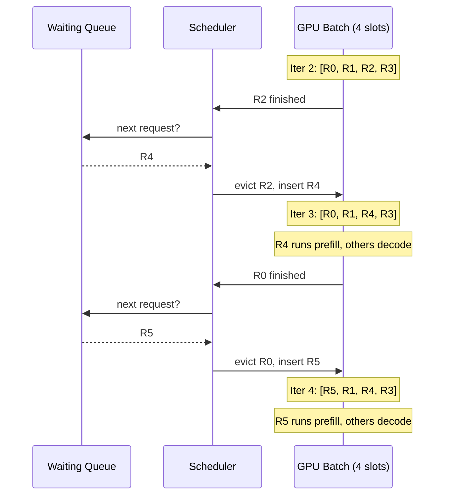
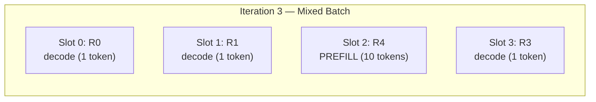
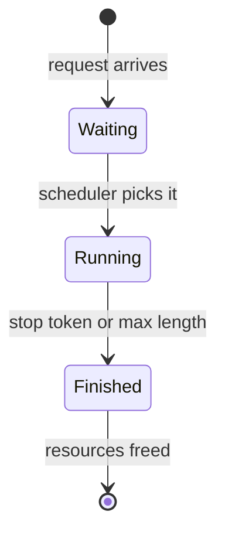

# Chapter 11: Continuous Batching

---

## Four Requests Walk Into a GPU

Your inference engine can now serve requests without wasting memory. PagedAttention (Chapter 10) solved the allocation problem --- blocks instead of contiguous buffers, near-zero fragmentation, dynamic growth. Memory is no longer the bottleneck.

But watch what happens when four requests arrive at the same time.

| Request | Output tokens needed |
|---------|---------------------|
| R0      | 3                   |
| R1      | 8                   |
| R2      | 2                   |
| R3      | 10                  |

You batch them together --- four requests, four GPU slots --- and start generating.

Two iterations in, Request 2 is done. It hit its stop token. Its output is ready.

But it cannot leave. The batch is still running. Request 3 has eight more tokens to go. Request 2 sits in its GPU slot, doing nothing, burning compute cycles on a finished sequence while four more requests wait in the queue.

Eight iterations later, Request 0 has been idle for seven iterations. Request 1 has been idle for two. Only Request 3 is still working. Three out of four GPU slots are wasted --- and four new requests are still waiting.

This is **static batching**. Form a batch. Run it to completion. Form the next batch. It is simple, and it is terrible.

---

## The Idle Slot Problem

Here is what static batching looks like across two batches of four:

```
Batch 1: Requests [0, 1, 2, 3]

Iteration:   1    2    3    4    5    6    7    8    9    10
Slot 0 (R0): ██   ██   ██   ·    ·    ·    ·    ·    ·    ·    done at 3
Slot 1 (R1): ██   ██   ██   ██   ██   ██   ██   ██   ·    ·    done at 8
Slot 2 (R2): ██   ██   ·    ·    ·    ·    ·    ·    ·    ·    done at 2
Slot 3 (R3): ██   ██   ██   ██   ██   ██   ██   ██   ██   ██   done at 10
             ──   ──   ──   ──   ──   ──   ──   ──   ──   ──
GPU active:  4/4  4/4  3/4  2/4  2/4  2/4  2/4  2/4  1/4  1/4

██ = doing work    · = idle (finished, but slot is locked until batch ends)
```
**Figure 11.1** --- Static batching, Batch 1. By iteration 4, half the GPU is idle. Request 2 finishes at iteration 2 and wastes 8 slot-iterations. Request 0 wastes 7. Request 1 wastes 2. Total: **17 idle slot-iterations** out of 40. Utilization: 57.5%.

The second batch has the same problem. Requests 4–7 need 4, 6, 5, and 7 tokens respectively. The batch runs for 7 iterations, with similar idle patterns.

**Total across both batches: 17 iterations, 23 idle slot-iterations, 66.2% utilization.**

The math is brutal. The GPU is doing useful work barely two-thirds of the time. And the requests in the queue? They wait for *all* of Batch 1 to finish --- including the eight iterations where Request 2 was already done.

---

## What If Nobody Had to Wait?

Here is the idea from the Orca paper (Yu et al., 2022): **do not wait for the batch to finish. Check every single iteration.**

When a request finishes, remove it from the batch *immediately*. When a slot opens, pull the next waiting request *immediately*. The batch is a living thing --- requests flow in and out at every iteration of the generation loop.

This is **continuous batching**, also called **iteration-level scheduling**.

Watch the same eight requests under continuous batching. Slots refill the moment a request finishes:

```
Continuous Batching: Requests [R0–R7]

Iteration:   1    2    3    4    5    6    7    8    9    10   11  ··  15
Slot 0:      R0   R0   R0   R5   R5   R5   R5   R5   R5   ·    ·       ·
Slot 1:      R1   R1   R1   R1   R1   R1   R1   R1   R7   R7   R7  ··  R7
Slot 2:      R2   R2   R4   R4   R4   R4   R6   R6   R6   R6   R6      ·
Slot 3:      R3   R3   R3   R3   R3   R3   R3   R3   R3   R3   ·       ·
             ──   ──   ──   ──   ──   ──   ──   ──   ──   ──   ──      ──
GPU active:  4/4  4/4  4/4  4/4  4/4  4/4  4/4  4/4  4/4  3/4  2/4     1/4
                       ↑              ↑         ↑
                    R2 done→R4     R4 done→R6  R1 done→R7
                    R0 done→R5

Rn = active request in slot    · = empty (no queued requests left)
```
**Figure 11.2** --- Continuous batching, same eight requests. Compare with Figure 11.1: the GPU stays at 4/4 for nine straight iterations. Slots refill immediately --- no idle bands while requests wait in the queue.

**Result: 15 iterations, 15 idle slot-iterations, 75.0% utilization.** Same 45 tokens generated, but in fewer iterations with less waste.

---

## The Iteration-Level View

Let's zoom into three consecutive iterations to see exactly what the scheduler does.

**Iteration 2.** The batch is [R0, R1, R2, R3]. All four generate one token. R2 reaches its target length --- it is done. The scheduler marks R2 as finished, frees its slot, and checks the waiting queue. R4 is next. R4 enters the batch.

**Iteration 3.** The batch is [R0, R1, R4, R3]. But R4 is *new* --- it has not been processed yet. Its prompt tokens need to run through the model (prefill). Meanwhile, R0, R1, and R3 are mid-generation (decode). The GPU runs all four. R0 hits its target --- done. The scheduler evicts R0, pulls R5 from the queue.

**Iteration 4.** The batch is [R5, R1, R4, R3]. R5 is new (prefill). R1, R4, and R3 are decoding. Four slots, all active. No waste.


**Figure 11.3** --- Three iterations of continuous batching. The scheduler checks *every* iteration, immediately replacing finished requests with waiting ones.

The key insight: **the scheduling decision happens at every iteration, not per batch.** There is no "batch boundary." There is only the current iteration, the current set of active requests, and the queue.

---

## When Prefill Meets Decode

At iteration 3, something interesting happens. The batch contains:

| Slot | Request | Phase | Work |
|------|---------|-------|------|
| 0 | R0 | decode | Generate token 3 of 3 |
| 1 | R1 | decode | Generate token 3 of 8 |
| 2 | R4 | **prefill** | Process 10 prompt tokens |
| 3 | R3 | decode | Generate token 3 of 10 |

Three requests are decoding (generating one token each). One request is prefilling (processing its entire prompt). They share the same GPU iteration.

This is a **mixed batch** --- and it is the norm under continuous batching, not the exception. Every time a new request enters a running batch, it brings a prefill into a sea of decodes.


**Figure 11.4** --- A mixed batch. Blue slots are decoding (one new token each). The yellow slot is prefilling (processing all prompt tokens). Both phases run in the same GPU pass.

Why does this matter? Because prefill and decode have very different compute profiles:

- **Decode** processes 1 token per sequence. It is memory-bound --- the bottleneck is reading KV cache data, not computation.
- **Prefill** processes *all* prompt tokens at once. It is compute-bound --- the bottleneck is the matrix multiplications over the full prompt.

Mixing them in one batch means the scheduler must balance compute budgets. Too many prefills in one iteration? The decode requests stall, latency spikes. Too few prefills? New requests queue up, time-to-first-token climbs.

This balancing act is exactly what the scheduler handles. Chapter 12 builds it.

---

## The New Types: SequenceStatus and SequenceGroup

Look at Figure 11.2 again. At iteration 2, the scheduler *knew* R2 was done, *knew* R4 was waiting, and *knew* which slot to fill. At iteration 3 it did it again — R0 out, R5 in. How? What data told it all that?

Two small types. They carry every piece of state the scheduler needs to make those per-iteration decisions.

### SequenceStatus

An enum with three states:

```
SequenceStatus:
    Waiting    // queued, not yet scheduled for any GPU work
    Running    // actively being processed (prefill or decode)
    Finished   // generation complete (stop token or max length)
```

The transitions are one-directional:


**Figure 11.5** --- SequenceStatus state machine. Transitions only move forward. Chapter 12 adds a `Swapped` state for when memory runs out and the scheduler must preempt a running request.

### SequenceGroup

A SequenceGroup bundles related sequences under a single user request. For simple greedy generation, each group has exactly one sequence. For beam search, a group might have four or eight --- one per beam.

```
SequenceGroup:
    group_id: unique identifier
    sequences: list of Sequence     // usually 1 for greedy
    arrival_time: when the request arrived
    status: SequenceStatus

Sequence:
    seq_id: unique identifier
    prompt_tokens: [2061, 318, 9552, 30]    // immutable
    output_tokens: [464, 2159, ...]          // grows each decode step
    status: SequenceStatus
```

Two helper methods that the scheduler will use constantly:

```
num_tokens():
    return len(prompt_tokens) + len(output_tokens)
    // total tokens determines KV cache size needed

is_prefill():
    return len(output_tokens) == 0
    // true if prompt hasn't been processed yet — affects scheduling decisions
```

Tracing a request through the system with our running example --- "What is AI?" with tokens `[2061, 318, 9552, 30]`:

```
[Arrive]   group_id=1, status=Waiting
           seq: prompt=[2061, 318, 9552, 30], output=[]
           num_tokens()=4, is_prefill()=true

[Schedule] status → Running
           Scheduler adds to GPU batch

[Prefill]  Process all 4 prompt tokens, generate first output token
           seq: output=[464]
           num_tokens()=5, is_prefill()=false

[Decode]   Generate tokens one at a time...
           output=[464, 2159]        → num_tokens()=6
           output=[464, 2159, 286]   → num_tokens()=7

[Finish]   Stop token reached
           status → Finished
           Scheduler frees the slot, pulls next from queue
```

These types are small --- an enum and two structs. But they carry all the state the scheduler needs to make iteration-level decisions. Status determines which queue a request belongs to. Token count determines memory requirements. The prefill flag determines compute cost.

---

## The Throughput Multiplier

Here is the head-to-head comparison for our eight-request workload:

| Metric | Static | Continuous |
|--------|--------|------------|
| Total iterations | 17 | 15 |
| GPU idle slot-iterations | 23 | 15 |
| Overall utilization | 66.2% | 75.0% |
| Tokens generated | 45 | 45 |
| Throughput (tok/iter) | 2.65 | 3.00 |

Same 45 tokens. Fewer iterations. Higher utilization. And this is with just 8 requests and mild variance in output lengths.

The advantage compounds with scale. Consider what happens with 100 requests and high variance (some requests generate 5 tokens, others generate 500):

- **Static batching**: each batch runs for 500 iterations (the maximum), even though most requests finish in 50. Utilization drops below 20%.
- **Continuous batching**: fast requests leave immediately, their slots refill from the queue. The batch stays full. Utilization stays above 90%.

At this scale, continuous batching delivers **2-3x higher throughput** on the same hardware. Not through faster computation --- the GPU does the same math per token --- but by eliminating the dead time.

This is why every production inference engine uses continuous batching. Not as an optimization. As a *requirement*.

---

## The Spec

Everything in this chapter is formalized in [`spec/ch11/`](../spec/ch11/):

| Artifact | What It Contains |
|----------|-----------------|
| `interface-spec.md` | SequenceStatus enum, SequenceGroup, Sequence, simulation types |
| `component-diagram.md` | State machine, class structure, static vs continuous comparison |
| `sequence-diagram.md` | Static and continuous batching flows, sequence lifecycle |
| `expected-output.txt` | Demo output with 6 scenarios and throughput comparison |
| `prompt-template.md` | Paste into an LLM to generate an implementation |

### Quick Start

1. Read `spec/ch11/interface-spec.md` --- the SequenceStatus and SequenceGroup contracts
2. Add the new types to `src/types`
3. Build the demo: `examples/ch11_continuous_batching`
4. Validate: `pytest spec/ch11/validation/`

---

## Try It Yourself

**Exercise 1: Variance Amplifies the Gap.**
Run the simulation with output lengths drawn from a uniform distribution (1 to 100). Compare static vs continuous batching utilization as you increase the range. At what variance does continuous batching become 2x better?

**Exercise 2: Batch Size Sensitivity.**
Try batch sizes of 2, 4, 8, 16, and 32 with 100 requests. How does batch size affect the utilization gap between static and continuous batching? (Hint: larger batches give static batching more chances to amortize idle time --- but they also increase queue wait time.)

**Exercise 3: Arrival Patterns.**
Instead of all 8 requests arriving at once, have them arrive over time (one every 2 iterations). How does this change the comparison? Continuous batching handles staggered arrivals naturally --- static batching must wait to fill a batch before starting.

---

## The Scheduler Problem

Continuous batching is the *what*. The scheduler is the *how*.

You now know that decisions happen every iteration. But we have not built the thing that *makes* those decisions. Which waiting request gets the next open slot? What if memory is tight --- do you start a new prefill or let the running decodes finish? What if the GPU is overloaded with prefills and decode latency is spiking?

These are the scheduler's problems. It juggles three competing goals: maximize throughput (keep the batch full), minimize latency (start requests quickly), and respect memory limits (do not overcommit KV cache blocks).

Next chapter: we build the scheduler.

---

## References

### Continuous Batching

1. **"Orca: A Distributed Serving System for Transformer-Based Generative Models"** — Yu, Jeong, Shin, Park (2022). The paper that introduced iteration-level scheduling (continuous batching) for LLM serving. Demonstrates that scheduling at the iteration level rather than the request level dramatically improves GPU utilization and throughput. The core idea behind this entire chapter. [osdi22-yu.pdf](https://www.usenix.org/system/files/osdi22-yu.pdf)

### Serving Systems

2. **"Efficient Memory Management for Large Language Model Serving with PagedAttention"** — Kwon et al. (2023). vLLM combines PagedAttention (Chapter 10) with continuous batching (this chapter) into a single system. Section 5 describes the scheduling policy that builds on Orca's iteration-level approach. [arxiv.org/abs/2309.06180](https://arxiv.org/abs/2309.06180)
