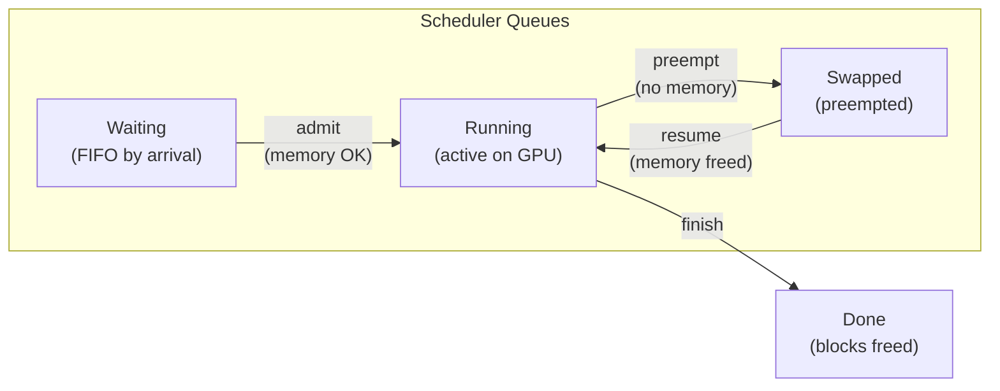
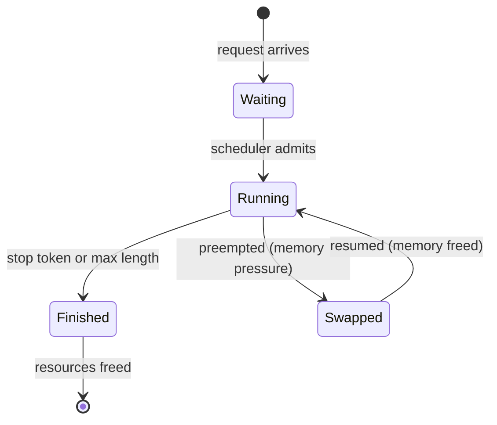
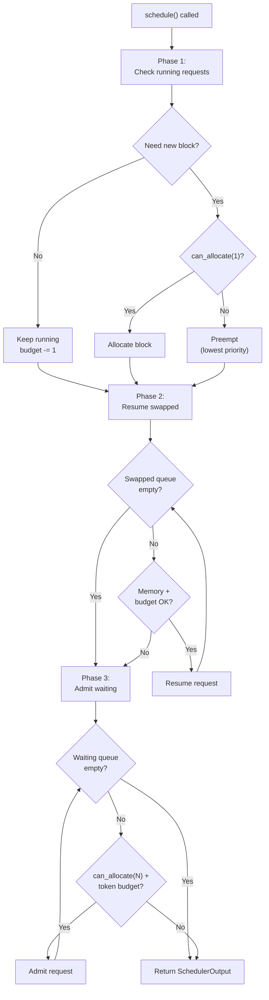
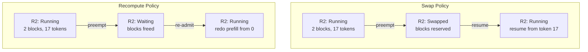

# Chapter 12: The Scheduler

---

## Seven Requests and One Tough Decision

Now your inference engine is humming along. Four requests are generating tokens on the GPU. The block allocator (Chapter 10) is handing out KV cache blocks. Continuous batching (Chapter 11) ensures that every time a request finishes, a new one slides in. Life is good.

Then three things happen at once.

Request 3, which has been running for 30 tokens, needs another KV cache block. Request 0 just finished --- its blocks are about to be freed. And two new requests are sitting in the waiting queue, each needing four blocks for their prompts.

Who gets memory first? Does Request 3 get its block before the new requests eat the free pool? If there is not enough memory for everyone, who gets evicted? Who waits?

These are not hypothetical questions. They happen every iteration. And the component that answers them is the **scheduler**.

---

## Three Queues and a GPU

The scheduler's world is organized into three queues. Every request in the system lives in exactly one of them at any given moment.

**Waiting.** Requests that have arrived but have not been scheduled yet. They are in line, ordered by arrival time. First come, first served.

**Running.** Requests actively generating tokens on the GPU. They own KV cache blocks and are consuming compute every iteration.

**Swapped.** Requests that *were* running but got kicked out because memory ran low. They are paused --- not dead, not discarded, just waiting for blocks to free up so they can resume.




**Figure 12.1** --- The scheduler's three queues. Requests flow left to right under normal operation: Waiting → Running → Done. But memory pressure can push a running request sideways into Swapped, where it pauses until blocks free up.

Chapter 11 introduced three states: Waiting, Running, Finished. Now we add a fourth --- **Swapped** --- for requests that have been preempted:




**Figure 12.2** --- The four-state SequenceStatus. The new Swapped state sits between Running and a potential return to Running. A swapped request keeps its identity and progress --- it just lost its GPU slot temporarily.

The transitions tell the story:

- `Waiting -> Running`: the scheduler has memory and batch budget, so it admits the request.
- `Running -> Swapped`: memory ran out. The scheduler preempted this request to make room for others.
- `Swapped -> Running`: memory became available. The scheduler brings the request back.
- `Running -> Finished`: the request hit a stop token or max length. Its blocks get freed.
- `Finished` is terminal. No coming back.

---

## The Schedule Step

The scheduler exposes one critical method: `schedule()`. The engine calls it once per iteration. The return value --- a `SchedulerOutput` --- tells the engine exactly what to do: which requests to prefill, which to decode, and which got preempted.

Inside `schedule()`, three phases run in order. Think of them as triage.

**Phase 1: Keep the running alive.** Each running request is about to generate one more token. That token might push it into a new KV cache block. If there is a free block, allocate it. If not, someone has to go. Preempt the lowest-priority running request (in FCFS, that is the most recently admitted one).

**Phase 2: Bring back the swapped.** Check the swapped queue. If there are enough free blocks to restore a swapped request, resume it. This takes priority over admitting brand-new requests --- a swapped request has already done partial work, and resuming it is cheaper than starting fresh.

**Phase 3: Admit new requests.** Walk the waiting queue front to back. For each request, check two things: are there enough free blocks for its prompt? Is there room in the batch (both sequence count and token budget)? If both pass, admit it. If either fails, stop --- the rest of the queue will not fit either.




**Figure 12.3** --- The three-phase schedule() algorithm. Red is preemption. Blue is resumption. Green is admission. The order is deliberate: protect running work first, then recover paused work, then start new work.

Here is the algorithm in pseudocode:

```
schedule():
    output = empty SchedulerOutput           // collects decisions for this iteration
    token_budget = max_num_batched_tokens     // max tokens the GPU processes this step
    seq_budget = max_num_seqs                 // max sequences in one batch

    // ── Phase 1: protect running requests (they already own KV blocks) ──
    still_running = []
    for group in running:                     // walk every currently-active request
        needed = blocks_for_next_token(group) // does the next token spill into a new block?
        if needed > 0 and not allocator.can_allocate(needed):
            preempt(group, output)            // out of memory → evict to swapped queue
        else:
            if needed > 0: allocate_block(group)  // claim one more KV block
            still_running.append(group)           // keep it in the batch
            token_budget -= 1                     // one decode token consumed
            seq_budget -= 1                       // one sequence slot consumed

    running = still_running                   // survivors become the new running set

    // ── Phase 2: resume swapped requests (cheaper than re-prefilling) ──
    while swapped not empty and seq_budget > 0:
        group = swapped.front()               // oldest preempted request first
        if not allocator.can_allocate(blocks_to_resume(group)):
            break                             // not enough blocks to restore its KV
        if token_budget < 1: break            // no token budget left
        swapped.pop_front()                   // remove from swapped queue
        restore_blocks(group)                 // reload its KV blocks into GPU memory
        group.status = Running                // mark active again
        running.append(group)                 // add to this iteration's batch
        token_budget -= 1                     // one decode token
        seq_budget -= 1                       // one sequence slot

    // ── Phase 3: admit new requests from waiting queue (FCFS) ──
    while waiting not empty and seq_budget > 0:
        group = waiting.front()               // next in line
        prompt_tokens = group.sequences[0].num_tokens()   // how big is its prompt?
        blocks_needed = ceil(prompt_tokens / block_size)   // KV blocks for full prompt
        if not allocator.can_allocate(blocks_needed):
            break                             // not enough free blocks
        if token_budget < prompt_tokens:
            break                             // prompt would blow the token budget
        waiting.pop_front()                   // accept the request
        allocate_blocks(group, blocks_needed) // reserve KV blocks up front
        group.status = Running                // now active
        running.append(group)                 // joins the batch
        output.new_requests.append(group)     // tell the engine this needs prefill
        output.num_prefill_tokens += prompt_tokens  // track prefill cost
        seq_budget -= 1                       // one slot used
        token_budget -= prompt_tokens         // prompt eats many tokens

    output.running_requests = running (excluding new)   // decode-only set
    output.num_decode_tokens = len(running) - len(new)  // how many decode tokens this step
    return output                             // hand off to the engine
```

Two budgets gate everything. `max_num_seqs` caps how many sequences can be in the running batch at once --- this is a GPU parallelism limit. `max_num_batched_tokens` caps the total tokens processed in one iteration --- this prevents a single huge prefill from starving all the decode requests.

---

## Memory-Aware Admission

The scheduler pseudocode above makes a promise on every line: never overcommit memory. But the scheduler itself doesn't track free blocks --- that's not its job. It delegates to a single gatekeeper: the BlockAllocator from Chapter 10. One call --- `can_allocate(n)` --- and the answer is immediate: yes or no, no negotiation.

Watch it in action. Ten blocks in the pool. Each request needs two blocks for its prompt (say, 20 tokens with block_size=16).

```
Step 1: schedule()
  R0 needs 2 blocks. can_allocate(2)? Yes (10 free). Admit. 8 free.
  R1 needs 2 blocks. can_allocate(2)? Yes (8 free).  Admit. 6 free.
  R2 needs 2 blocks. can_allocate(2)? Yes (6 free).  Admit. 4 free.
  R3 needs 2 blocks. can_allocate(2)? Yes (4 free).  Admit. 2 free.
  Batch full (max_num_seqs=4). Stop.

Step 2: all decode, no new blocks needed. R4, R5 still waiting.

Step 3: R0 finishes. Frees 2 blocks. 4 free.
  R1, R2, R3 continue. Budget: 1 seq remaining.
  R4 needs 2 blocks. can_allocate(2)? Yes (4 free). Admit! 2 free.

Step 4: all decode. R5 waiting. Budget: 0 seqs (batch full).
  R5 has to wait, even though 2 blocks are free — the batch is full.
```

Two constraints, both enforced: memory (enough blocks?) and batch size (room in the batch?). The scheduler respects whichever is tighter.

Notice the admission loop *stops* when the first request cannot fit. It does not skip ahead to try smaller requests. This is a deliberate First Come Frist Serve (FCFS) design: if Request 4 needs 5 blocks and only 3 are free, Request 5 (which might only need 1 block) does not jump the line. Fairness over efficiency. A priority scheduler could make a different choice --- but that is Exercise 1.

The token budget adds a second gate. Even with enough memory, a request with a 50-token prompt cannot enter if the token budget is already spent on running decodes. This prevents a single large prefill from consuming the entire iteration's compute budget and spiking latency for all running requests. Chapter 11 warned about this: too many prefills in one iteration and decode latency suffers. The token budget is the mechanism that prevents it.

---

## When Memory Runs Out --- Preemption

Now the interesting case. Running requests grow their KV caches token by token. Each new token might push a sequence into a new block. Eventually, the free pool runs dry.

Six blocks. Three running requests.

```
R0: 20 tokens (2 blocks)
R1: 20 tokens (2 blocks)
R2: 16 tokens (1 block)
Free: 1 block

— All decode one token —
R2 goes from 16 to 17 tokens. Block capacity was 16. Needs a second block.
can_allocate(1)? Yes (1 free). Allocate. Free: 0.

— All decode again —
Sequences grow. Eventually R0 hits 33 tokens. Needs a third block.
can_allocate(1)? No. Free: 0.
```

Memory pressure. The scheduler has two options.

**Swap policy.** Pick the lowest-priority running request (in FCFS, the most recently admitted one --- R2). Move it to the swapped queue. Its blocks are marked as reserved --- the data is still there, but the blocks are freed for others to use. When memory opens up later, R2 can resume without re-doing its prefill.

**Recompute policy.** Pick the same victim. Free *all* its blocks immediately. Move it back to the *front* of the waiting queue. When it gets re-admitted, it will have to redo its entire prefill from scratch. More wasteful, but simpler --- no need to track reserved blocks.

```
preempt(group):
    if policy == Swap:
        group.status = Swapped
        swapped.push_back(group)       // keep block table intact
    else:                               // Recompute
        free_all_blocks(group)          // give back everything
        group.status = Waiting
        waiting.push_front(group)       // front of line — re-admit first
```

Which request gets preempted? In FCFS, it is the *last admitted* --- the one with the least progress. This is the opposite of what you might expect. The intuition: a request that has been running for 200 tokens has invested 200 tokens of compute. A request that has been running for 5 tokens has invested 5. Preempting the recent arrival wastes less work.

vLLM uses this same heuristic. It is called **last-in-first-out preemption** --- the newest running request is the first to be evicted. This naturally minimizes wasted compute.

The choice between Swap and Recompute depends on the workload. Swap is better when requests have generated many tokens (lots of work to redo). Recompute is better when prompts are short and KV caches are small (cheap to redo).




**Figure 12.4** --- Two preemption policies. Swap preserves progress (resume from token 17). Recompute discards progress (redo from token 0) but reclaims blocks immediately.

---

## A Day in the Scheduler's Life

Eight blocks. Three batch slots. Four requests.


| Request | Prompt | Will generate | Total tokens |
| ------- | ------ | ------------- | ------------ |
| R0      | 4      | 30            | 34           |
| R1      | 4      | 30            | 34           |
| R2      | 4      | 5             | 9            |
| R3      | 4      | 30            | 34           |


R2 is the short one. Remember that --- it matters.

**Step 1 --- Three enter, one waits.**
No running requests. Phase 3 admits R0, R1, R2 (1 block each). R3 doesn't fit --- batch is full at 3.

```
Memory: [R0][R1][R2][ ][ ][ ][ ][ ]     3 used, 5 free
Queues:  waiting=[R3]  running=[R0,R1,R2]  swapped=[]
```

**Step 2 --- Quiet iteration.**
Everyone decodes. Each request is at ~5 tokens --- still fits in 1 block. Nothing changes. R3 waits.

```
Memory: [R0][R1][R2][ ][ ][ ][ ][ ]     3 used, 5 free
```

**Step 3 --- R2 leaves, R3 enters.**
R2 hits its stop token after 5 outputs. Its block is freed. The scheduler immediately admits R3 from the waiting queue.

```
Memory: [R0][R1][R3][ ][ ][ ][ ][ ]     3 used, 5 free
Queues:  waiting=[]  running=[R0,R1,R3]  swapped=[]
```

**Step 4 --- The squeeze.**
R0 and R1 have been growing. Both are at 33 tokens --- 3 blocks each. R3 is on 1 block. That's 7 blocks used, 1 free.

```
Memory: [R0][R0][R0][R1][R1][R1][R3][ ]     7 used, 1 free
```

R0 needs a third block. Allocated --- 0 free. Now R1 needs a third block. `can_allocate(1)`? No. Zero free.

The scheduler preempts R3 --- last in, first out. R3 moves to swapped. Its block frees. R1 gets the block.

```
Memory: [R0][R0][R0][R1][R1][R1][ ][ ]     6 used, 2 free
Queues:  waiting=[]  running=[R0,R1]  swapped=[R3]
```

**Step 5 --- The return.**
R1 finishes. Three blocks freed. Phase 2 checks swapped --- R3 is there. Enough blocks to resume? Yes. R3 comes back without redoing its prefill.

```
Memory: [R0][R0][R0][R3][R3][ ][ ][ ]     5 used, 3 free
Queues:  waiting=[]  running=[R0,R3]  swapped=[]
```

R3's journey: `Waiting → Running → Swapped → Running → Finished`. All four states. The scheduler orchestrated every transition.

---

## The Scheduler Contract

Every call to `schedule()` returns a `SchedulerOutput`. This is the contract between the scheduler and the engine. The engine does not make scheduling decisions --- it just executes whatever the output says.

```
SchedulerOutput:
    new_requests: [...]          // sequences moving Waiting -> Running (need prefill)
    running_requests: [...]      // sequences continuing to decode
    preempted_ids: [...]         // request IDs kicked out this step
    num_prefill_tokens: int      // total prompt tokens to process
    num_decode_tokens: int       // total decode tokens (1 per decode seq)
```

Here is what the SchedulerOutput looks like for each step of our simulation:


| Step | new_requests | running_requests | preempted_ids | prefill_tokens | decode_tokens |
| ---- | ------------ | ---------------- | ------------- | -------------- | ------------- |
| 1    | [R0, R1, R2] | []               | []            | 12             | 0             |
| 2    | []           | [R0, R1, R2]     | []            | 0              | 3             |
| 3    | [R3]         | [R0, R1]         | []            | 4              | 2             |
| 4    | []           | [R0, R1]         | [R3]          | 0              | 2             |
| 5    | []           | [R0, R3]         | []            | 0              | 2             |


Step 1: all prefill, no decode --- the engine processes 12 prompt tokens and generates nothing. Step 2: all decode, no prefill --- three tokens generated, one per sequence. Step 3: mixed --- R3 prefills while R0 and R1 decode, a total of 6 tokens (4 prefill + 2 decode). Step 4: preemption, R3 evicted, only 2 decode tokens. Step 5: R3 resumes from where it left off (it already prefilled, so it joins as a decode sequence).

The engine never has to understand scheduling policy. It reads the SchedulerOutput, runs the prefills, runs the decodes, and reports back which sequences finished. The scheduler handles the rest.

The Scheduler Interface has six methods:

```
Scheduler (Interface):
    schedule() -> SchedulerOutput    // the core decision
    add_request(group)               // enqueue a new request
    notify_finished(group_id)        // mark done, free resources
    num_waiting() -> int             // queue depth metrics
    num_running() -> int
    num_swapped() -> int
```

The Interface is deliberately thin. `schedule()` is the only complex method. The rest are bookkeeping. This means you can swap the FCFS scheduler for a priority-based one, a fairness-weighted one, or an SLA-aware one --- just implement the same six methods.

---

## The Spec

Everything in this chapter is formalized in `[spec/ch12/](../spec/ch12/)`:


| Artifact               | What It Contains                                                                   |
| ---------------------- | ---------------------------------------------------------------------------------- |
| `interface-spec.md`    | Scheduler trait, FcfsScheduler, SchedulerOutput, SchedulerConfig, PreemptionPolicy |
| `component-diagram.md` | State machine, three-queue architecture, algorithm flowchart                       |
| `sequence-diagram.md`  | Three-phase algorithm, preemption/recovery, multi-step lifecycle                   |
| `expected-output.txt`  | Demo output with 6 scenarios and multi-step simulation                             |
| `prompt-template.md`   | Paste into an LLM to generate an implementation                                    |


### Quick Start

1. Read `spec/ch12/interface-spec.md` --- the Scheduler trait and SchedulerOutput contracts
2. Add `Swapped` to SequenceStatus in `src/types`
3. Implement `src/scheduler/mod` (trait) and `src/scheduler/fcfs` (FCFS implementation)
4. Build the demo: `examples/ch12_the_scheduler`
5. Validate: `pytest spec/ch12/validation/`

---

## Try It Yourself

**Exercise 1: Priority Scheduling.**
Replace FCFS with a priority scheduler. Assign each request a priority (1=high, 5=low). Higher-priority requests jump the waiting queue and are the *last* to be preempted. How does this change the preemption pattern?

**Exercise 2: Token Budget Tuning.**
Set `max_num_batched_tokens` to 16, 32, 64, and 128. With a batch of requests that have 20-token prompts, how does the token budget affect how many requests can be admitted per step? What happens when a single prompt exceeds the budget?

**Exercise 3: Swap vs Recompute Breakeven.**
Run the simulation with prompts of length 10, 50, 100, and 500. For each, time how long it takes a preempted request to finish under Swap (resume from where it was) vs Recompute (redo prefill). At what prompt length does Swap become clearly better?

---

## Five Components, No Conductor

You now have a scheduler that manages three queues, respects memory limits, and handles preemption. It produces a clean `SchedulerOutput` every iteration --- a complete instruction set for the engine.

But who calls `schedule()`? Who takes the output and feeds it to the model? Who checks if a generated token is a stop token? Who frees blocks when a request finishes?

Right now, these components are five separate things sitting in separate modules. The scheduler decides. The model computes. The sampler picks. The block allocator manages memory. The tokenizer translates. But nobody is wiring them together.

Next chapter: we build the engine loop --- the conductor that calls `schedule()`, runs the forward pass, samples tokens, and checks for completion, once per iteration, forever.