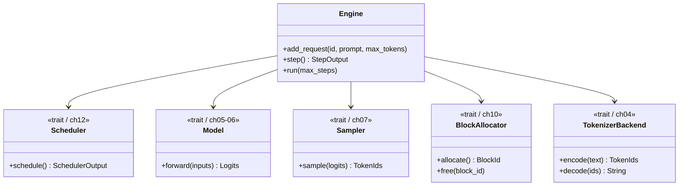
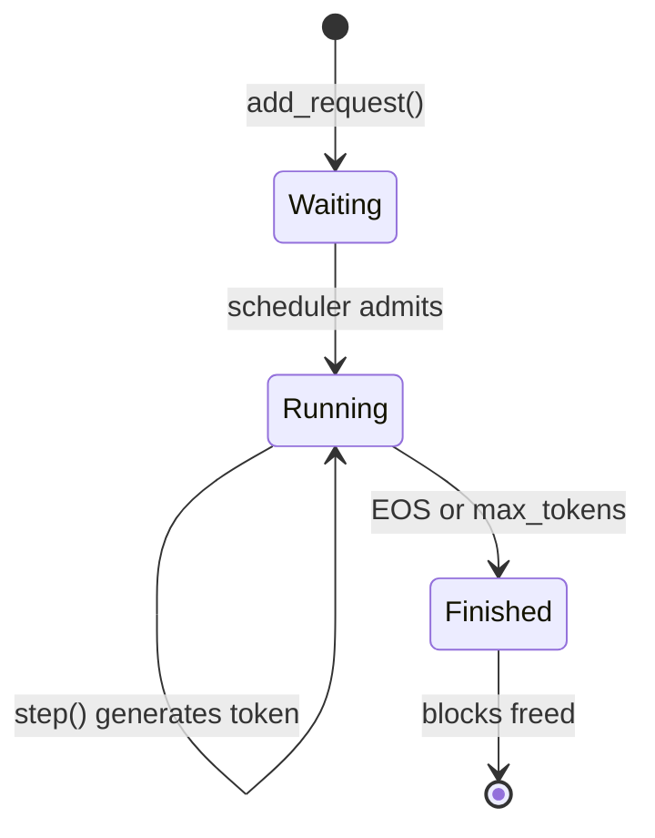
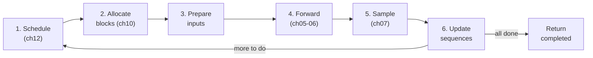
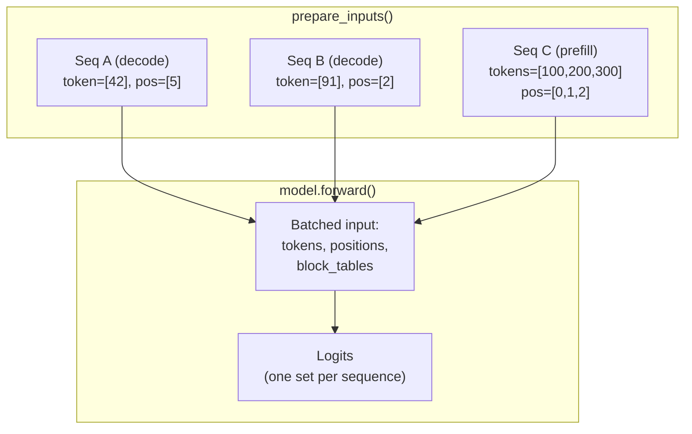
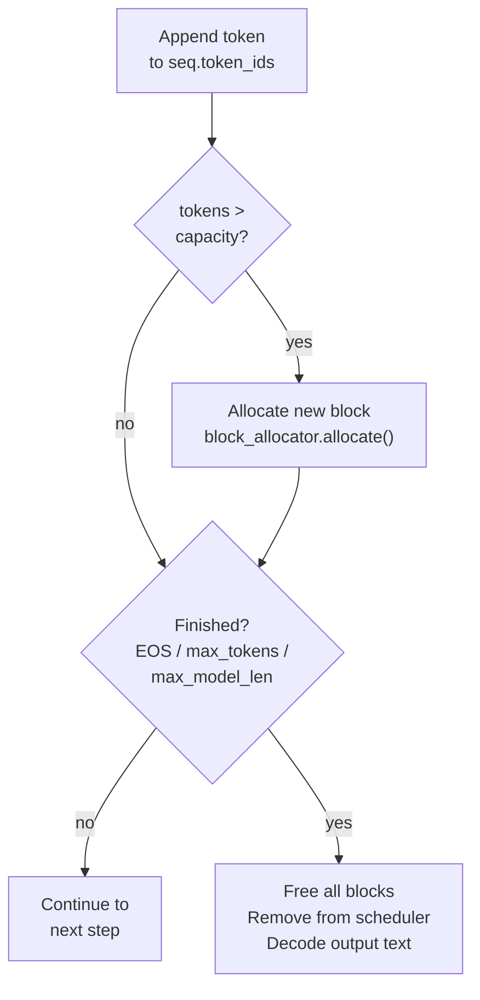
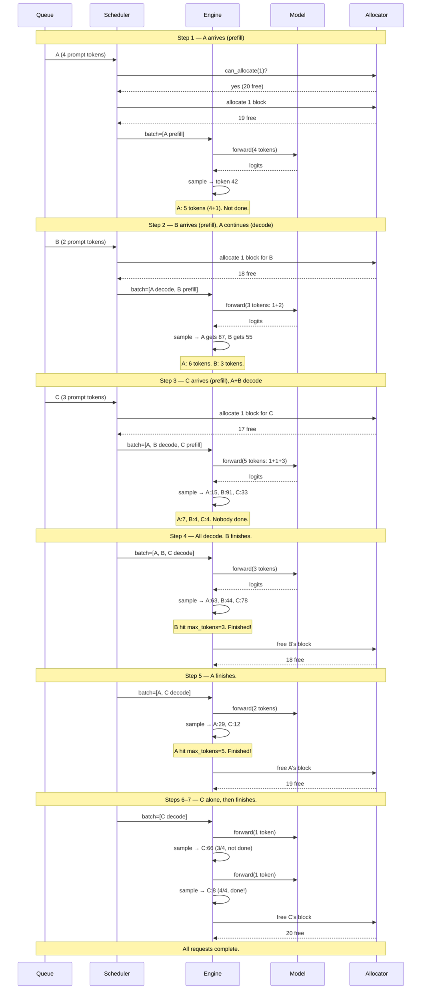
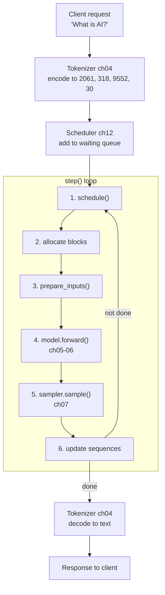

# Chapter 13: The Engine Loop

---

## Five Components, No Conductor

You have five instruments. A tokenizer that turns text into numbers and back (Chapter 4). A model that runs the forward pass and produces logits (Chapters 5-6). A sampler that picks the next token (Chapter 7). A block allocator that hands out KV cache memory in pages (Chapter 10). A scheduler that decides which requests get to run (Chapter 12).

Five components, each tested in isolation, each doing one thing well. But right now they are sitting in separate rooms. Nobody is telling the tokenizer to encode a prompt, handing those tokens to the scheduler, feeding the scheduled batch to the model, passing logits to the sampler, and checking whether the sequence is done. Nobody is running the show.

This chapter builds the conductor: the **Engine**.

The engine is not smart. It does not compute attention scores. It does not manage memory blocks. It does not decide scheduling policy. It does exactly one thing: call the right component at the right time, in the right order, in a loop. One method --- `step()` --- is the entire heartbeat of the inference server.

---

## The Engine's Inventory

Before we look at what `step()` does, let's see what the engine holds:

```
Engine:
    scheduler         // ch12 — who runs next?
    model             // ch05-06 — the forward pass
    tokenizer         // ch04 — text <-> tokens
    sampler           // ch07 — pick the next token
    block_allocator   // ch10 — KV cache memory
    sequences         // map of request_id -> SequenceData
    config            // max_seqs, block_size, etc.
```

Every field except `sequences` and `config` is a trait. The engine does not know whether the model is GPT-2 or LLaMA. It does not know whether the sampler is greedy or top-k. It does not know whether the scheduler uses FCFS or some priority scheme. It calls the interface. The implementation is someone else's problem.


**Figure 13.1** --- The Engine holds five trait-based components. It owns nothing but the loop; each component is swappable and testable in isolation.

Each request the engine tracks is a `SequenceData`:

```
SequenceData:
    request_id     // unique identifier
    token_ids      // all tokens so far (prompt + generated)
    prompt_len     // where the prompt ends and generation begins
    status         // Waiting | Running | Finished
    block_table    // ch10 BlockTable — maps tokens to physical KV cache blocks
    max_tokens     // how many tokens to generate
```

Status transitions are simple: `Waiting -> Running -> Finished`. No sequence ever goes backward. (Chapter 12's preemption can move a sequence from Running to Waiting via the swapped queue, but from the engine's perspective, the scheduler handles that internally.)


**Figure 13.2** --- Request lifecycle. Three states, one direction. A request enters as Waiting, generates tokens while Running, and exits as Finished.

---

## Six Phases of a Heartbeat

Here is `step()`. Six phases, executed once per iteration, repeated until every request is done.

```
function step() -> StepOutput:

    // === Phase 1: SCHEDULE ===
    scheduler_output = scheduler.schedule()
    // Ask the scheduler (ch12): who runs this iteration?
    // Returns: list of sequence IDs to process, which are new, which are continuing

    // === Phase 2: ALLOCATE BLOCKS ===
    for seq_id in scheduler_output.newly_scheduled:
        blocks_needed = ceil(len(sequences[seq_id].token_ids) / block_size)
        for i in 0..blocks_needed:
            block_id = block_allocator.allocate()    // ch10 — grab a free block
            sequences[seq_id].block_table.append_block(block_id)
        sequences[seq_id].status = Running

    // === Phase 3: PREPARE INPUTS ===
    (token_ids, positions, block_tables) = prepare_inputs(scheduler_output)
    // Convert sequence data into the tensors the model expects

    // === Phase 4: FORWARD PASS ===
    logits = model.forward(token_ids, positions, block_tables)
    // One batched call — the model processes all scheduled sequences at once

    // === Phase 5: SAMPLE ===
    new_tokens = sampler.sample(logits)
    // One new token per scheduled sequence

    // === Phase 6: UPDATE ===
    completed = []
    for (seq_id, token) in zip(scheduled_ids, new_tokens):
        seq = sequences[seq_id]
        seq.token_ids.append(token)              // grow the sequence
        if needs_new_block(seq):
            block_id = block_allocator.allocate() // more KV cache space
            seq.block_table.append_block(block_id)
        if is_finished(seq, token):
            seq.status = Finished
            scheduler.finish_sequence(seq_id)
            free_blocks(seq)                     // return blocks to the pool
            text = tokenizer.decode(seq.token_ids[seq.prompt_len:])
            completed.append(CompletedRequest(seq_id, text, ...))

    return StepOutput(completed, num_running, num_waiting, ...)
```

That is the entire engine. Six phases, one method, called in a loop. Let's walk through each phase in detail.


**Figure 13.3** --- The six-phase step() pipeline. Each iteration flows left to right. If sequences remain, loop back to schedule.

---

## Wiring the Pieces: Input Preparation

Phase 3 --- `prepare_inputs()` --- is where the engine earns its keep. The scheduler says *who* runs. The model needs *what* to compute. The engine translates between them.

The key distinction: **prefill** vs **decode**.

A sequence that was just admitted by the scheduler (newly scheduled) needs all its prompt tokens processed at once. This is **prefill** --- the model sees the full prompt for the first time. Every subsequent step, the sequence has already been processed up to some position; the model only needs the *last* token. This is **decode**.

```
function prepare_inputs(scheduler_output):
    token_ids = []
    positions = []
    block_tables = []

    for seq_id in scheduler_output.scheduled_seq_ids:
        seq = sequences[seq_id]

        if seq_id in scheduler_output.newly_scheduled:
            // PREFILL: feed every prompt token
            token_ids.append(seq.token_ids)               // e.g., [2061, 318, 9552, 30]
            positions.append([0, 1, ..., len-1])           // full range
        else:
            // DECODE: feed only the latest token
            token_ids.append([seq.token_ids[-1]])          // e.g., [42]
            positions.append([len(seq.token_ids) - 1])     // single position

        block_tables.append(seq.block_table.block_ids)     // ch10 — physical block mapping

    return (token_ids, positions, block_tables)
```

Here is what this looks like concretely. Imagine step 3 of our demo: request A is decoding (at position 5), request B is decoding (at position 2), and request C just arrived and needs prefill (3 prompt tokens):

```
Sequence A (decode):  token_ids=[42],           positions=[5],    blocks=[block_3]
Sequence B (decode):  token_ids=[91],           positions=[2],    blocks=[block_5]
Sequence C (prefill): token_ids=[100, 200, 300], positions=[0,1,2], blocks=[block_7]
```

The model receives one batched call with all of this. It does not know or care which sequences are prefilling vs decoding --- it just processes the tokens at the given positions, using the block tables to find KV cache data. Chapter 11's continuous batching made this possible. The engine makes it happen.


**Figure 13.4** --- Input preparation merges prefill and decode sequences into a single batched forward call. The model processes them all at once.

---

## Tokens, Blocks, and Finish Conditions

Phase 6 is where sequences grow, blocks are allocated, and requests complete. Three things happen for each sequence after sampling:

**1. Append the new token.**

```
seq.token_ids.append(new_token)
```

Simple. The sequence is now one token longer.

**2. Check if a new block is needed.**

The block table (Chapter 10) has a fixed capacity: `num_blocks * block_size`. If the sequence just grew past that capacity, it needs another block.

```
function needs_new_block(seq):
    total_tokens = len(seq.token_ids)
    capacity = seq.block_table.num_tokens_capacity()    // num_blocks * block_size
    return total_tokens > capacity
```

Example: block size is 16, the sequence has 1 block (capacity 16). After appending token 17, `total_tokens (17) > capacity (16)`, so the engine allocates another block. Now capacity is 32. The sequence can grow to 32 tokens before needing a third block.

This is where Chapter 10's block allocator meets the generation loop. Blocks are allocated *lazily* --- only when a sequence actually needs the space, not upfront for `max_seq_len`.

**3. Check finish conditions.**

```
function is_finished(seq, new_token):
    if new_token == tokenizer.eos_token_id():
        return true                                    // model says "stop"
    generated = len(seq.token_ids) - seq.prompt_len
    if generated >= seq.max_tokens:
        return true                                    // user-specified limit
    if len(seq.token_ids) >= config.max_model_len:
        return true                                    // model's context window
    return false
```

When a sequence finishes, the engine does three things:
1. Mark status as Finished
2. Tell the scheduler to remove it from the running queue
3. Free all blocks back to the allocator

That last step is critical. Every block the sequence held goes back to the free pool, immediately available for other requests. This is the lifecycle completing: blocks allocated on admission, freed on completion, recycled for the next request.


**Figure 13.5** --- The update phase decision tree. After appending a token: allocate a block if needed, then check if the sequence is done.

---

## A Request's Full Journey

Let's trace three requests through the engine from arrival to completion. This is the complete picture --- every phase, every step, all at once.

**Setup.** Three requests arrive at staggered times:

| Request | Prompt | Arrives before | max_tokens |
|---------|--------|----------------|------------|
| A       | "What is AI?" (4 tokens) | Step 1 | 5 |
| B       | "Hello world" (2 tokens) | Step 2 | 3 |
| C       | "Test prompt here" (3 tokens) | Step 3 | 4 |

Block size is 16. The allocator starts with 20 free blocks.


**Figure 13.6** --- Three requests traced through the full engine loop. Watch the batch grow (1 → 2 → 3) as requests arrive, then shrink (3 → 2 → 1) as they finish. The scheduler, allocator, and model coordinate at every step.

```
Request  Prompt  Generated  Steps Active  Finished At
───────  ──────  ─────────  ────────────  ───────────
A        4       5          1-5           Step 5
B        2       3          2-4           Step 4
C        3       4          3-7           Step 7
```

Notice how the batch size changes every step: 1, 2, 3, 3, 2, 1, 1. Requests arrive and depart at different times. The scheduler adjusts the batch, the engine calls `step()`, and everything just works. This is continuous batching in action --- not as a concept (Chapter 11), not as a scheduling algorithm (Chapter 12), but as a running system.

---

## The Complete Pipeline

Thirteen chapters. A tokenizer, a model, an attention mechanism, a KV cache, a block allocator, a scheduler, and now an engine loop tying them all together. Here is the complete pipeline --- every component you have built, and how they connect.


**Figure 13.7** --- The full engine pipeline. A request enters, gets tokenized, joins the scheduler queue, flows through the step() loop until finished, then gets decoded back to text.

Here is the component map, one row per building block:

| Component | Chapter | Responsibility |
|-----------|---------|---------------|
| Tokenizer | 4 | Text to token IDs and back |
| Model | 5-6 | Forward pass, attention, KV cache |
| Sampler | 7 | Select next token from logits |
| BlockAllocator | 10 | Paged KV cache memory management |
| Scheduler | 12 | Decide which sequences run each step |
| **Engine** | **13** | **Orchestrate all of the above** |

The engine owns nothing but the loop. Each component is a trait --- swappable, testable, independent. You could replace the greedy sampler with a temperature sampler and the engine would not notice. You could swap FCFS scheduling for a priority scheduler and the engine would not care. You could upgrade from GPT-2 to LLaMA and the only thing that changes is which model trait implementation you construct.

This is why trait-based design matters. Not for academic purity --- for practical composability. The engine is the proof.

---

## The Spec

Build these artifacts for Chapter 13:

| Artifact | Path | What it does |
|----------|------|-------------|
| Interface spec | `spec/ch13/interface-spec.md` | Engine struct, step() algorithm, data types |
| Component diagram | `spec/ch13/component-diagram.md` | Engine class structure, pipeline flow |
| Sequence diagram | `spec/ch13/sequence-diagram.md` | Single and multi-request lifecycle |
| Expected output | `spec/ch13/expected-output.txt` | Reference output for the demo |
| Prompt template | `spec/ch13/prompt-template.md` | LLM-ready prompt for implementation |
| Validation tests | `spec/ch13/validation/` | `pytest spec/ch13/validation/` |

Implementation:
1. Implement `src/engine/mod` --- the Engine struct and `step()` method
2. Build the demo: `examples/ch13_the_engine_loop`
3. Validate: `pytest spec/ch13/validation/`

---

## Try It Yourself

**Exercise 1: Throughput Tracking.**
Add a timer to each step. Measure tokens per second (total new tokens generated / total wall time). Print a running average. How does throughput change as the batch size grows and shrinks?

**Exercise 2: Request Priorities.**
Modify `add_request()` to accept a priority level (high, normal, low). Swap the FCFS scheduler for a priority-aware scheduler from Chapter 12. High-priority requests should be scheduled before normal ones, even if they arrived later. Run the staggered demo again --- does the completion order change?

**Exercise 3: Preemption in Action.**
Set `max_num_seqs=2` and add three requests before step 1. The scheduler can only run two at a time. Watch how the third request waits, and when a slot opens (a request finishes), it gets scheduled. This is Chapter 12's three-queue system at work inside the engine loop.

---

## The Orchestra Plays, but Every Musician Sounds the Same

You have a working engine. Requests arrive, get tokenized, scheduled, batched, forwarded, sampled, and completed. The pipeline is real.

But listen to the output. Every request sounds identical --- because the sampler is greedy. Argmax. Deterministic. The model always picks the single most likely next token. Run the same prompt twice, get the same output twice. There is no creativity, no variety, no control.

Real inference engines let users tune generation. Temperature scaling makes the model more or less random. Top-k filtering limits choices to the k most likely tokens. Top-p (nucleus) sampling cuts off the tail of the distribution dynamically. Repetition penalties stop the model from looping. Frequency penalties discourage common tokens.

The sampler trait is ready --- Chapter 7 designed it as a swappable interface for exactly this moment. The engine does not need to change. You just need better samplers.

Next chapter: we build them.
