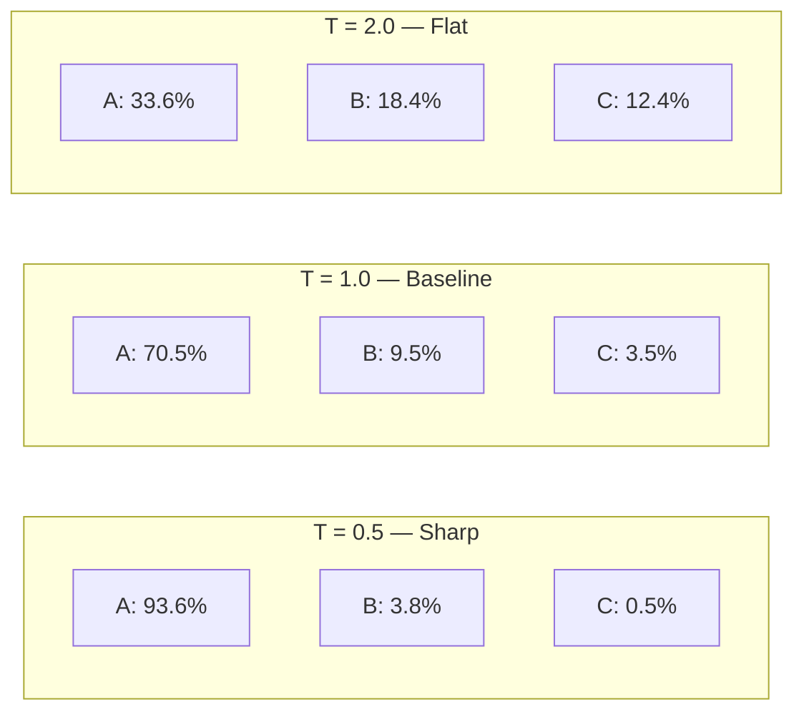
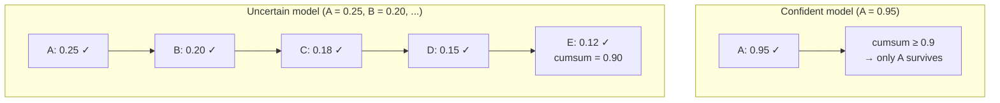
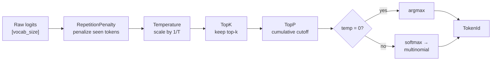
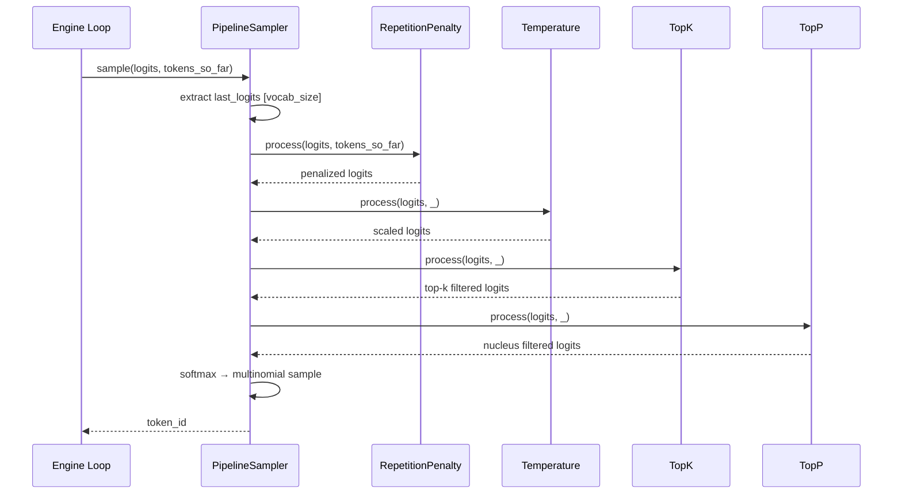

# Chapter 14: Sampling Strategies

## The Model Has Opinions. You Have a Dial.

The engine loop from Chapter 13 calls `sampler.sample(logits)` on every decode step. Since Chapter 7, that sampler has been doing one thing: argmax. Pick the highest logit. Done. Deterministic. Boring.

Ask GPT-2 to continue "The cat sat on the" and greedy decoding always produces "mat." Every time. A hundred times. A million times. The model has a rich probability distribution over 50,257 tokens --- and you are throwing away 50,256 of them.

That changes now.

This chapter builds four logits processors --- temperature, top-k, top-p, repetition penalty --- and a composable pipeline that chains them together. By the end, the same model will produce different text on every run, with the *degree* of randomness under your control. Creative writing, focused summarization, diverse brainstorming --- all from the same weights, just different sampling parameters.

---

## One Token, Fifty Thousand Candidates

After the forward pass, the LM head produces a vector of 50,257 raw scores --- logits. Higher means the model thinks that token is more likely. But "more likely" is relative. Here is a simplified example with 10 tokens:

```
Token   : [  A      B      C      D      E      F      G      H      I      J   ]
Logits  : [ 5.0    3.0    2.0    1.5    1.0    0.5    0.0   -0.5   -1.0   -2.0  ]
```

After softmax (converting logits to probabilities that sum to 1.0):

```
Token   : [  A      B      C      D      E      F      G      H      I      J   ]
Probs   : [0.705  0.095  0.035  0.021  0.013  0.008  0.005  0.003  0.002  0.001 ]
```

Token A dominates. Greedy picks A, period. But B has a 9.5% chance --- that is not nothing. If you sampled from this distribution honestly, you would get B about once every 10 tries. And sometimes B leads to a better sentence than A does.

The question is not *whether* to sample. It is *how much* randomness to allow, and *where* to draw the line between "creative" and "incoherent."

That is what sampling strategies control.

---

## Temperature --- Sharpening and Flattening

The simplest knob. Before converting logits to probabilities, divide every logit by a temperature value T:

```
function temperature_process(logits, T):
    return logits / T    // every logit divided by the same scalar
```

What does this do? Consider our example at three temperatures:

| Token | Raw logits | T=0.5 (sharp) | T=1.0 (baseline) | T=2.0 (flat) |
|-------|-----------|---------------|-------------------|--------------|
| A | 5.0 | 10.0 | 5.0 | 2.5 |
| B | 3.0 | 6.0 | 3.0 | 1.5 |
| C | 2.0 | 4.0 | 2.0 | 1.0 |

After softmax:

| Token | T=0.5 | T=1.0 | T=2.0 |
|-------|-------|-------|-------|
| A | 0.936 | 0.705 | 0.336 |
| B | 0.038 | 0.095 | 0.184 |
| C | 0.005 | 0.035 | 0.124 |


**Figure 14.1** --- Temperature controls the shape of the probability distribution. Low temperature concentrates mass on the top token; high temperature spreads it out.

Low temperature (< 1.0) *sharpens*. The top token dominates even more. The model sounds more confident, more repetitive. In the extreme, T approaching 0 is greedy decoding.

High temperature (> 1.0) *flattens*. The gap between tokens shrinks. The model sounds more creative, more surprising --- and past a point, incoherent. Every token becomes equally likely as T approaches infinity.

Temperature = 0.0 is special. Division by zero is undefined, so the pipeline handles it as a flag: skip all processors, use argmax. This gives you greedy decoding through the same interface.

Here is the thing about temperature that is easy to miss: it does not *change* which token has the highest logit. The relative ordering is preserved. What it changes is *how much the model commits* to its top choice. Temperature is a confidence dial, not a reranker.

---

## Top-K --- A Hard Cutoff

Temperature adjusts the *shape* of the distribution. Top-k adjusts the *size* of it.

```
function top_k_process(logits, k):
    if k <= 0 or k >= len(logits):
        return logits                        // disabled — pass through

    threshold = k_th_largest(logits, k)      // find the k-th highest score
    for i in 0..len(logits):
        if logits[i] < threshold:
            logits[i] = -infinity            // filtered tokens get zero probability after softmax
    return logits
```

With k=3 on our example:

```
Before: [ 5.0   3.0   2.0   1.5   1.0   0.5   0.0  -0.5  -1.0  -2.0 ]
After:  [ 5.0   3.0   2.0  -inf  -inf  -inf  -inf  -inf  -inf  -inf ]

Probabilities (after softmax of filtered logits):
  A: 0.844    B: 0.114    C: 0.042    D-J: 0.000
```

Seven tokens eliminated. The model can only pick from A, B, or C. This prevents the sampler from ever choosing a wildly improbable token --- even with high temperature, the worst you can get is token C.

The weakness of top-k: it is the same k regardless of how confident the model is. If the model is 99% sure of one token, k=50 still keeps 50 tokens in play. If the model is genuinely uncertain between 100 tokens, k=50 arbitrarily cuts half of them. The cutoff is blind to the actual distribution.

---

## Top-P --- The Smart Cutoff

Top-p (also called nucleus sampling) fixes top-k's blindness. Instead of a fixed count, it keeps the *smallest set of tokens whose cumulative probability reaches p*:

```
function top_p_process(logits, p):
    if p >= 1.0:
        return logits                         // disabled — pass through

    probs = softmax(logits)                   // need actual probabilities to compute cumulative sum
    sorted_indices = argsort(probs, descending=true)
    sorted_probs = probs[sorted_indices]

    cumsum = cumulative_sum(sorted_probs)     // [0.705, 0.800, 0.835, 0.857, ...]
    cutoff = first_index_where(cumsum >= p)   // p=0.9 → cutoff at the token that pushes past 0.9

    // Everything after the cutoff gets -infinity
    for i in (cutoff + 1)..len(sorted_indices):
        logits[sorted_indices[i]] = -infinity

    return logits
```

With p=0.9, the algorithm walks down the probability-sorted list, accumulating:

| Token | Prob | Cumulative | Keep? |
|-------|------|-----------|-------|
| A | 0.705 | 0.705 | Yes |
| B | 0.095 | 0.800 | Yes |
| C | 0.035 | 0.835 | Yes |
| D | 0.021 | 0.857 | Yes |
| E | 0.013 | 0.870 | Yes |
| F | 0.008 | 0.878 | Yes |
| G | 0.005 | 0.882 | Yes |
| H | 0.003 | 0.885 | Yes |
| I | 0.002 | 0.886 | Yes --- cumsum hits 0.9 at the boundary |
| J | 0.001 | 0.887 | Filtered |

In this flat distribution, most tokens survive. But if the model were very confident --- say A had probability 0.95 --- then only A would survive (cumsum >= 0.9 at the first token). Top-p *adapts* to the model's confidence:


**Figure 14.2** --- Top-p adapts to confidence. A confident model keeps few tokens; an uncertain model keeps many. Top-k would keep the same count either way.

This is why top-p (typically p=0.9 or p=0.95) has become the industry default for creative generation. It gives the model room to be surprising without letting it wander into the extremely unlikely tail.

---

## Repetition Penalty --- Breaking the Loop

Greedy decoding has a nasty habit: loops. "The cat sat on the mat. The cat sat on the mat. The cat sat on the mat." The model sees "The cat sat on the" and confidently predicts "mat" every time. Without intervention, the cycle repeats forever.

Repetition penalty attacks this directly. It looks at which tokens have already appeared in the generated sequence and *reduces their logits*:

```
function repetition_penalty_process(logits, token_ids_so_far, penalty):
    if penalty == 1.0:
        return logits                         // disabled

    seen = unique(token_ids_so_far)           // which tokens appeared?

    for token_id in seen:
        if logits[token_id] > 0:
            logits[token_id] /= penalty       // positive logits: divide (shrink toward 0)
        else:
            logits[token_id] *= penalty       // negative logits: multiply (push further negative)

    return logits
```

The asymmetry matters. A positive logit of 5.0 divided by 1.2 becomes 4.17 --- lower, but still positive. A negative logit of -1.0 multiplied by 1.2 becomes -1.2 --- more negative. In both cases, the token's probability after softmax decreases. This is how vLLM and HuggingFace implement it.

With penalty = 1.2 and tokens [A, B, D] already generated:

| Token | Before | After | Change |
|-------|--------|-------|--------|
| A (seen) | 5.000 | 4.167 | Reduced |
| B (seen) | 3.000 | 2.500 | Reduced |
| C (not seen) | 2.000 | 2.000 | Unchanged |
| D (seen) | 1.500 | 1.250 | Reduced |
| E (not seen) | 1.000 | 1.000 | Unchanged |

The seen tokens lose ground. Unseen tokens gain *relative* probability even though their logits did not change. The effect: the model is nudged away from repeating itself.

A penalty of 1.0 does nothing. A penalty of 1.2 is a gentle nudge. A penalty of 2.0 is aggressive --- it will actively avoid any token it has ever said, which can produce incoherent text as the model runs out of natural-sounding alternatives.

---

## The Pipeline --- Order Matters

Each processor does one thing. The power comes from *composing* them. But composition means the order matters. The output of one processor is the input to the next.


**Figure 14.3** --- The logits processor pipeline. Each stage transforms the logits; the final stage selects a token.

Why this order?

**Repetition penalty first.** It needs the raw logit scale to apply the penalty correctly. If temperature has already flattened everything, the penalty has less to work with.

**Temperature second.** It reshapes the distribution before filtering. A temperature of 0.5 sharpens the peaks, which means top-k and top-p will be more aggressive (fewer tokens survive). A temperature of 2.0 flattens, so more tokens pass through the filters. Temperature *controls how the filters behave*.

**Top-k third.** The coarse filter. Removes obviously unlikely tokens. Fast, simple, sets a hard ceiling on the number of candidates.

**Top-p last.** The fine filter. Adapts to whatever distribution remains after top-k. If top-k left 50 tokens but only 10 of them have meaningful probability, top-p trims the rest.

The abstraction that makes this composable:

```
trait LogitsProcessor:
    process(logits: FloatArray, token_ids_so_far: list[TokenId]) -> FloatArray
                    // takes logits in, returns modified logits — same shape, same contract
```

Every processor implements this trait. The pipeline is just a list:

```
function apply_pipeline(logits, token_ids_so_far, processors):
    for proc in processors:
        logits = proc.process(logits, token_ids_so_far)    // each processor transforms the logits
    return logits
```

The token generation loop from Chapter 13 does not change. It still calls `sampler.sample(logits, token_ids_so_far)`. The sampler's internals changed --- it now runs a pipeline instead of a bare argmax --- but the interface is the same. That is the whole point of the trait boundary from Chapter 7.


**Figure 14.4** --- One sampling step through the full pipeline. The engine sees a single `sample()` call; inside, four processors transform the logits before token selection.

---

## SamplingParams --- The User's Control Panel

Users do not think in terms of logits processors. They think: "I want creative output" or "I want deterministic, focused output." SamplingParams translates user intent into a processor pipeline:

```
struct SamplingParams:
    temperature: float           // default 1.0; 0.0 = greedy
    top_k: int                   // default -1 (disabled)
    top_p: float                 // default 1.0 (disabled)
    repetition_penalty: float    // default 1.0 (disabled)
    max_tokens: int              // default 200
```

### Validation

Bad parameters should fail loudly at construction, not silently produce garbage:

| Parameter | Valid range | Why |
|-----------|-------------|-----|
| temperature | >= 0.0 | Negative temperature inverts the distribution |
| top_k | -1 or >= 1 | 0 is ambiguous; -1 clearly means "disabled" |
| top_p | (0.0, 1.0] | 0 keeps nothing; > 1 is meaningless |
| repetition_penalty | >= 1.0 | < 1 would *encourage* repetition |
| max_tokens | >= 1 | Generating 0 tokens is pointless |

### Building the Pipeline

```
function build_pipeline(params: SamplingParams) -> list[LogitsProcessor]:
    processors = []

    if params.repetition_penalty > 1.0:
        processors.append(RepetitionPenaltyProcessor(params.repetition_penalty))
            // only add if penalty is active — 1.0 is identity

    if params.temperature != 0.0 and params.temperature != 1.0:
        processors.append(TemperatureProcessor(params.temperature))
            // 0.0 means greedy (handled at selection time); 1.0 is identity

    if params.top_k > 0:
        processors.append(TopKProcessor(params.top_k))
            // -1 means disabled

    if params.top_p < 1.0:
        processors.append(TopPProcessor(params.top_p))
            // 1.0 means keep everything

    return processors
```

### Common Presets

Here is how real use cases map to parameters:

| Preset | temperature | top_k | top_p | rep_penalty | Use case |
|--------|------------|-------|-------|-------------|----------|
| Greedy | 0.0 | -1 | 1.0 | 1.0 | Deterministic, testing |
| Creative | 0.9 | 50 | 0.95 | 1.1 | Stories, brainstorming |
| Focused | 0.3 | 10 | 1.0 | 1.1 | Summarization, extraction |
| Nucleus | 1.0 | -1 | 0.9 | 1.0 | Standard diverse generation |
| Code | 0.2 | 40 | 0.95 | 1.0 | Code completion |

The greedy preset builds an empty processor list and uses argmax. The creative preset builds all four processors. Same model, same weights, radically different behavior.

---

## The Spec

All implementation details for this chapter live in `spec/ch14/`:

| Artifact | Path | What it contains |
|----------|------|-----------------|
| Interface spec | `spec/ch14/interface-spec.md` | LogitsProcessor trait, all processor contracts, SamplingParams, pipeline construction |
| Component diagram | `spec/ch14/component-diagram.md` | Class diagram, pipeline data flow, temperature visualization |
| Sequence diagram | `spec/ch14/sequence-diagram.md` | Pipeline sampling flow, SamplingParams construction, greedy vs. pipeline comparison |
| Expected output | `spec/ch14/expected-output.txt` | Demo output structure and validation rules |
| Prompt template | `spec/ch14/prompt-template.md` | Copy-paste prompt for LLM-assisted implementation |
| Validation tests | `spec/ch14/validation/` | Automated checks for correctness |

To verify your implementation:

```
pytest spec/ch14/validation/
```

The tests check: all 6 parts present, temperature with probability values, top-k with filtering, top-p with cumulative probability, repetition penalty with before/after, pipeline with stages, and the "Chapter 14 complete" marker.

---

## Try It Yourself

The demo program uses mock logits --- no model needed. But once it works, wire the PipelineSampler into the engine loop from Chapter 13 and run real generation:

```
rvllm generate --prompt "Once upon a time" --temperature 0.8 --top-p 0.95
```

Run it five times. You should get five different continuations. That never happened with greedy.

**Experiment with extremes.** Set temperature to 0.1 and watch the output become nearly greedy. Set it to 2.0 and watch it become word salad. Find the sweet spot for your prompt.

**Compare top-k and top-p.** Try `--top-k 5` versus `--top-p 0.9` on the same prompt. Which produces better text? Why? (Hint: top-p adapts to confidence; top-k does not.)

**Test repetition penalty.** Generate 500 tokens with `--repetition-penalty 1.0` (disabled) and again with `--repetition-penalty 1.2`. Count how many times the same phrase appears. The difference is striking on small models like GPT-2.

---

## From Solo to Server

You now have a complete sampling pipeline. The model can generate deterministically or creatively. Repetition penalty keeps it from looping. Top-p and top-k prevent it from saying something wildly improbable. Temperature controls the overall confidence.

But there is a problem. Every parameter we just built --- temperature, top_k, top_p, repetition_penalty --- is per-request. And right now, there is no way for a *user* to send a request with those parameters. The engine runs from the command line. One prompt, one set of parameters, one response.

A real inference server needs an API. HTTP endpoints. JSON request bodies where each request carries its own SamplingParams. Streaming responses so the user sees tokens as they are generated, not all at once after a 30-second wait.

Next chapter, we build that API server. The engine loop stays the same. The sampler stays the same. We just put an HTTP layer in front of it --- and suddenly this is not a CLI tool anymore. It is a service.
