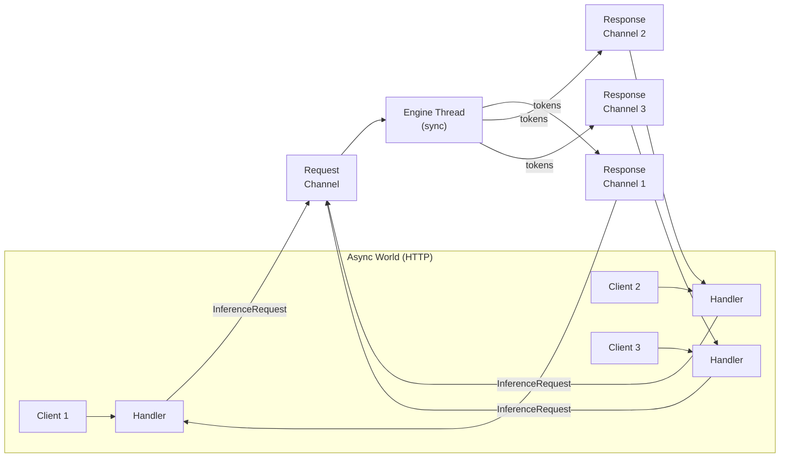
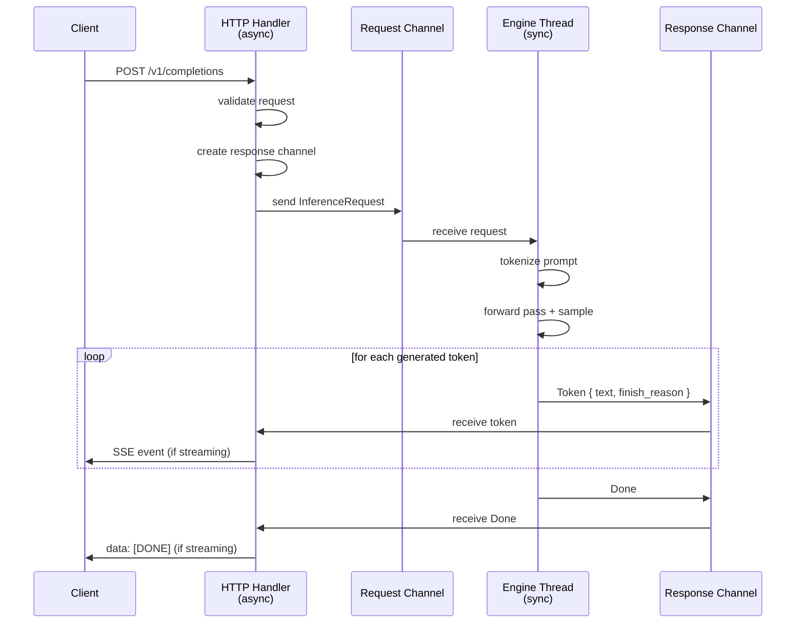
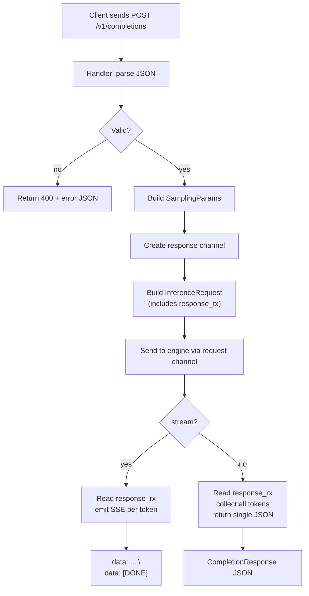

# Chapter 15: Building the API Server

## A Prompt Walks Into a Server

Right now, your inference engine lives in a terminal. You type a prompt, press enter, and tokens stream to stdout. It works. But nobody outside your machine can use it.

Open a new tab. Type this:

```
curl http://localhost:8080/v1/completions \
  -H "Content-Type: application/json" \
  -d '{"model": "gpt2", "prompt": "What is AI?", "max_tokens": 20, "stream": true}'
```

Nothing happens. Connection refused. There is no server listening. There is no HTTP layer. There is no way for a client --- a web app, a chatbot frontend, a load balancer --- to send a request and get tokens back. The engine has no front door.

This chapter builds that front door. By the end, that curl command will work. Tokens will stream back one by one, in the exact format that OpenAI clients already understand. Every tool, library, and framework built to talk to OpenAI's API will talk to yours instead.

---

## Two Worlds That Cannot Meet

Here is the core tension. An HTTP server is *asynchronous*. It juggles hundreds of connections simultaneously --- accepting requests, writing responses, managing timeouts. It spends most of its time *waiting*: waiting for bytes from the network, waiting for the application to produce a response, waiting for the client to acknowledge receipt. An async runtime excels at this. It multiplexes thousands of waiting tasks onto a handful of OS threads.

The inference engine is *synchronous*. It performs matrix multiplications, attention computations, sampling. It spends most of its time *computing*: grinding through layers of the transformer, crunching numbers as fast as the hardware allows. There is nothing to wait for --- just raw arithmetic.

These two worlds have incompatible needs. If you run a forward pass inside an async task, you block the entire async runtime. Every other HTTP connection freezes while one request's matrix multiply finishes. If you try to await a network operation inside the inference loop, you stall the GPU pipeline.

The solution: do not mix them. Keep the async world and the sync world on separate threads, and connect them with *channels*.


**Figure 15.1** --- The async/sync bridge. HTTP handlers live in the async world. The engine lives on a dedicated sync thread. A shared request channel carries work in; per-request response channels carry tokens back.

One channel carries requests *in*: all HTTP handlers share a single sender, and the engine thread holds the receiver. One channel *per request* carries tokens *out*: the handler creates it, tucks the sender inside the request, and the engine uses it to push tokens back as they are generated.

The HTTP handler never touches a tensor. The engine never touches a socket. Clean separation.

---

## The Channel Bridge

Two types flow through those channels. The first is what the handler sends to the engine:

```
struct InferenceRequest:
    request_id: string                     // unique per request — correlates logs, errors, responses
    prompt: string                         // the text to complete
    sampling_params: SamplingParams        // from Chapter 14 — temperature, top_k, top_p, repetition_penalty
    max_tokens: int                        // how many tokens to generate
    response_tx: Sender<InferenceResponse> // the engine sends results back through this
```

The `response_tx` field is the key insight. Each request carries its own return address. The engine does not need to know *which* HTTP handler is waiting --- it just writes tokens into the channel it was given.

The second type is what the engine sends back:

```
enum InferenceResponse:
    Token { text: string, finish_reason: Option<string> }
        // one generated token — finish_reason is null until the last one
    Error { message: string }
        // something went wrong — engine-side failures become client-visible errors
    Done
        // generation complete — handler can close the stream
```

The lifecycle is straightforward:

1. HTTP handler receives a request. Creates a per-request channel: `(response_tx, response_rx)`.
2. Handler builds an `InferenceRequest` with `response_tx` inside it.
3. Handler sends the request through the shared request channel.
4. Engine thread picks it up. Tokenizes the prompt. Runs the generation loop from Chapter 13, using the sampling pipeline from Chapter 14.
5. Each time the sampler produces a token, the engine decodes it and sends `Token { text, finish_reason }` through `response_tx`.
6. When generation finishes, the engine sends `Done`.
7. Meanwhile, the handler is reading from `response_rx` and converting each token into an HTTP response --- either collecting them into a single JSON body, or streaming them as SSE events.


**Figure 15.2** --- Request lifecycle from HTTP POST to final token. The handler and engine never share memory --- only channel messages cross the boundary.

---

## Speaking OpenAI

The format matters. Thousands of tools already know how to talk to OpenAI's API. If your server speaks the same dialect, every one of those tools works out of the box --- no adapters, no client libraries, no compatibility shims.

### How to read the endpoint table

Each row is one HTTP endpoint your server exposes. "Method" is the HTTP verb. "Path" is the URL suffix. The handler is the function that processes the request.

| Method | Path | Handler | Purpose |
|--------|------|---------|---------|
| POST | `/v1/completions` | `handle_completion` | Text completion --- send a prompt, get generated text back |
| POST | `/v1/chat/completions` | `handle_chat_completion` | Chat format --- send a message list, get an assistant reply |
| GET | `/v1/models` | `handle_list_models` | List loaded models |
| GET | `/health` | `handle_health` | Liveness check --- returns 200 if the server is up |

### The Completion Request

When a client sends `POST /v1/completions`, the JSON body carries everything the engine needs:

```
struct CompletionRequest:
    model: string              // required — which model to use ("gpt2")
    prompt: string             // required — the text to complete
    max_tokens: int            // optional, default 16 — how many tokens to generate
    temperature: float         // optional, default 1.0 — sampling temperature from Chapter 14
    top_k: int                 // optional, default -1 — disabled
    top_p: float               // optional, default 1.0 — disabled
    repetition_penalty: float  // optional, default 1.0 — disabled
    stream: bool               // optional, default false — SSE streaming or single response
    stop: list[string]         // optional — stop sequences (generation stops if any are produced)
```

These fields map directly to the `SamplingParams` struct from Chapter 14. The handler's job is translation: parse the JSON, validate the fields, build a `SamplingParams`, and package everything into an `InferenceRequest`.

### The Completion Response

For a non-streaming request, the server collects all tokens and returns a single JSON response:

```
{
  "id": "cmpl-abc123",
  "object": "text_completion",
  "created": 1711929600,
  "model": "gpt2",
  "choices": [
    {
      "text": " bright and full of promise",
      "index": 0,
      "finish_reason": "length"
    }
  ],
  "usage": {
    "prompt_tokens": 5,
    "completion_tokens": 5,
    "total_tokens": 10
  }
}
```

The `id` field is unique per request. The `created` field is a Unix timestamp. The `choices` array holds one entry (we generate a single completion per request). The `usage` object tells the client how many tokens were consumed.

The `finish_reason` is either `"length"` (hit `max_tokens`) or `"stop"` (hit an end-of-sequence token or a stop sequence). This matters to clients --- many retry with a higher `max_tokens` when they see `"length"`, assuming the response was truncated.

### Errors --- The OpenAI Way

Every error follows the same envelope:

```
{
  "error": {
    "message": "prompt is required",
    "type": "invalid_request_error",
    "code": null
  }
}
```

Validation failures (missing fields, out-of-range parameters) return HTTP 400 with `"invalid_request_error"`. Unknown endpoints or models return 404. Internal engine failures return 500 with `"server_error"`. Clients already know how to parse this format.

---

## Streaming --- Tokens as They Arrive

Non-streaming responses are simple but slow. The client sends a request and waits. And waits. And waits. If you are generating 200 tokens and each takes 50ms, the client stares at a blank screen for 10 seconds before anything appears.

Streaming changes that. The first token appears in ~50ms. Then another, and another, one by one. The user sees the response being written in real time. It feels fast even when total generation time is the same.

The protocol is Server-Sent Events (SSE). The server holds the HTTP connection open and pushes events through it. Each event is a line starting with `data: `, followed by a JSON payload, terminated by two newlines.

Here is what a streaming response looks like on the wire, for the prompt "The future of AI is" with `max_tokens: 5`:

```
data: {"id":"cmpl-abc123","object":"text_completion","created":1711929600,"choices":[{"text":" bright","index":0,"finish_reason":null}]}

data: {"id":"cmpl-abc123","object":"text_completion","created":1711929600,"choices":[{"text":" and","index":0,"finish_reason":null}]}

data: {"id":"cmpl-abc123","object":"text_completion","created":1711929600,"choices":[{"text":" full","index":0,"finish_reason":null}]}

data: {"id":"cmpl-abc123","object":"text_completion","created":1711929600,"choices":[{"text":" of","index":0,"finish_reason":null}]}

data: {"id":"cmpl-abc123","object":"text_completion","created":1711929600,"choices":[{"text":" promise","index":0,"finish_reason":"length"}]}

data: [DONE]
```

Every chunk shares the same `id` and `created` timestamp. The `finish_reason` is `null` until the final token, which carries `"length"` or `"stop"`. After the last token, the sentinel `data: [DONE]` tells the client the stream is over.

The HTTP headers signal that this is a stream, not a regular response:

```
Content-Type: text/event-stream
Cache-Control: no-cache
Connection: keep-alive
```

### The Handler's Streaming Loop

Here is how the handler converts channel messages to SSE events:

```
function handle_completion_streaming(request, response_rx):
    set_headers("text/event-stream", "no-cache", "keep-alive")
    completion_id = generate_unique_id("cmpl-")      // shared across all chunks
    created = current_unix_timestamp()

    loop:
        message = response_rx.receive()               // wait for next token from engine

        match message:
            Token { text, finish_reason }:
                chunk = CompletionChunk {
                    id: completion_id,
                    object: "text_completion",
                    created: created,
                    choices: [{ text: text, index: 0, finish_reason: finish_reason }]
                }
                send_sse_event(to_json(chunk))        // write "data: {...}\n\n" to client

            Error { message }:
                // mid-stream error — send as a final event, then close
                send_sse_event(to_json({ "error": { "message": message, "type": "server_error" }}))
                break

            Done:
                send_sse_event("[DONE]")              // literal sentinel — not JSON
                break
```

For non-streaming requests, the same loop runs --- but instead of sending each token immediately, it collects them into a string and returns a single `CompletionResponse` at the end.

---

## Putting It Together --- The Handler

The completion handler is the nerve center. It bridges HTTP, validation, channels, and response formatting:

```
function handle_completion(http_request, request_tx):
    // Step 1: Parse and validate
    body = parse_json(http_request.body)               // deserialize the request JSON
    if body.model is empty:
        return error_response(400, "model is required")
    if body.prompt is empty:
        return error_response(400, "prompt is required")

    // Step 2: Build sampling params (validation rules from Chapter 14)
    sampling_params = SamplingParams.new(
        temperature: body.temperature or 1.0,
        top_k: body.top_k or -1,
        top_p: body.top_p or 1.0,
        repetition_penalty: body.repetition_penalty or 1.0,
        max_tokens: body.max_tokens or 16
    )
    if sampling_params fails validation:
        return error_response(400, validation_error_message)

    // Step 3: Create the channel bridge
    (response_tx, response_rx) = create_channel()      // per-request response channel
    inference_request = InferenceRequest {
        request_id: generate_unique_id("req-"),
        prompt: body.prompt,
        sampling_params: sampling_params,
        max_tokens: body.max_tokens or 16,
        response_tx: response_tx                       // engine sends tokens back here
    }

    // Step 4: Send to engine
    request_tx.send(inference_request)                 // shared channel to engine thread

    // Step 5: Return response based on stream flag
    if body.stream:
        return handle_completion_streaming(body, response_rx)
    else:
        return handle_completion_non_streaming(body, response_rx)
```

The engine thread sits in a simple receive loop. Chapter 13's generation loop does the real work --- the API layer just delivers the request and formats the output:

```
function engine_loop(request_rx, engine):
    loop:
        request = request_rx.receive()                 // blocks until a request arrives

        tokens = engine.tokenize(request.prompt)       // tokenize the prompt
        generated_ids = []

        for step in 0..request.max_tokens:
            logits = engine.forward(tokens, generated_ids)
                // forward pass — Chapter 5 through Chapter 8
            token_id = engine.sample(logits, generated_ids, request.sampling_params)
                // sampling pipeline — Chapter 14
            token_text = engine.decode(token_id)
                // convert token ID back to text

            generated_ids.append(token_id)

            finish_reason = null
            if token_id == eos_token or step == request.max_tokens - 1:
                finish_reason = "stop" if token_id == eos_token else "length"

            request.response_tx.send(Token { text: token_text, finish_reason })
                // send token through the per-request channel

            if finish_reason is not null:
                break

        request.response_tx.send(Done)                 // signal completion
```


**Figure 15.3** --- The completion handler's decision tree. Parse, validate, bridge to the engine, then format the response based on the stream flag.

---

## Validation --- Fail Fast, Fail Clearly

Bad parameters should never reach the engine. The handler validates everything before sending the request through the channel.

| Field | Rule | Error message |
|-------|------|---------------|
| `model` | non-empty string | "model is required" |
| `prompt` | non-empty string | "prompt is required" |
| `messages` | non-empty list (chat endpoint) | "messages is required" |
| `max_tokens` | >= 1 | "max_tokens must be >= 1" |
| `temperature` | >= 0.0 | "temperature must be non-negative" |
| `top_k` | -1 or >= 1 | "top_k must be -1 (disabled) or >= 1" |
| `top_p` | 0.0 < p <= 1.0 | "top_p must be in (0.0, 1.0]" |
| `repetition_penalty` | >= 1.0 | "repetition_penalty must be >= 1.0" |

These rules mirror the `SamplingParams` validation from Chapter 14. The API layer enforces them again because the error context is different --- here, the user needs an HTTP 400 with a clear message, not a panic deep in the sampling pipeline.

---

## The Spec

All implementation details for this chapter live in `spec/ch15/`:

| Artifact | Path | What it contains |
|----------|------|-----------------|
| Interface spec | `spec/ch15/interface-spec.md` | Channel types, request/response formats, SSE protocol, endpoint contracts, error format |
| Prompt template | `spec/ch15/prompt-template.md` | Copy-paste prompt for LLM-assisted implementation |
| Validation tests | `spec/ch15/validation/` | Automated checks for correctness |

To verify your implementation:

```
pytest spec/ch15/validation/
```

The tests check: all 5 parts present, server configuration with endpoints, health check response, OpenAI-format completion response, SSE streaming with `data:` prefix and `[DONE]` sentinel, channel bridge mentions, error format with message and type, and the "Chapter 15 complete" marker.

---

## Try It Yourself

The demo program simulates the full API lifecycle without starting a real HTTP server. It exercises the types, validation, channel bridge, and SSE formatting in-process. Once the demo works, wire it up to a real HTTP framework and test with curl.

**Exercise 1: Add /v1/models.** Implement the models listing endpoint. It should return the currently loaded model in OpenAI's list format:

```
{
  "object": "list",
  "data": [
    { "id": "gpt2", "object": "model", "created": 1711929600, "owned_by": "rvllm" }
  ]
}
```

This is a read-only endpoint --- no channels, no engine interaction. Just return what you know.

**Exercise 2: Add request timeout.** If no token arrives from the engine within 30 seconds, the handler should close the response channel and return HTTP 504 (Gateway Timeout). This prevents a hung engine from holding a client connection open forever. The channel receive operation needs a deadline.

**Exercise 3: Add request logging.** For every completed request, log: the request ID, prompt length (in tokens), total tokens generated, finish reason, and wall-clock latency. Use structured logging (not string interpolation) so the fields are queryable. After running 10 requests, you should be able to answer: "What was the average latency?" and "How many requests hit the length limit?"

---

## One Server, Every Client

Your engine has a front door now. Any tool that speaks the OpenAI API --- chat UIs, agent frameworks, evaluation harnesses, load testing tools --- can point at your server and just work. The channel bridge keeps the async HTTP world and the sync inference world cleanly separated. Tokens flow from the engine through channels to SSE events, one at a time, fast enough that the user sees them appear in real time.

But watch what happens when you send 10 requests, all starting with the same system prompt: "You are a helpful assistant." Each one tokenizes that prefix independently. Each one computes the same KV cache entries for those same tokens. Ten copies of identical work. On a flagship GPU with a 16k-token system prompt, that is 10x wasted compute and 10x wasted memory.

Next chapter, we fix that. Prefix caching detects when requests share a common prompt prefix and reuses the KV cache entries instead of recomputing them. Same tokens, same keys and values --- compute them once, share them everywhere.

---

## References

### The OpenAI API Specification

1. **OpenAI API Reference — Chat Completions**. The API contract our server implements: `/v1/chat/completions` with streaming SSE, `SamplingParams` in the request body, and `finish_reason` in the response. [platform.openai.com/docs/api-reference/chat](https://platform.openai.com/docs/api-reference/chat)

### Server-Sent Events

2. **"Server-Sent Events" — W3C / WHATWG Specification**. The streaming protocol used for token-by-token delivery. Each token is a `data:` line in an SSE stream, terminated by `data: [DONE]`. [html.spec.whatwg.org/multipage/server-sent-events.html](https://html.spec.whatwg.org/multipage/server-sent-events.html)
