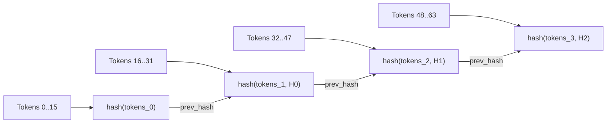
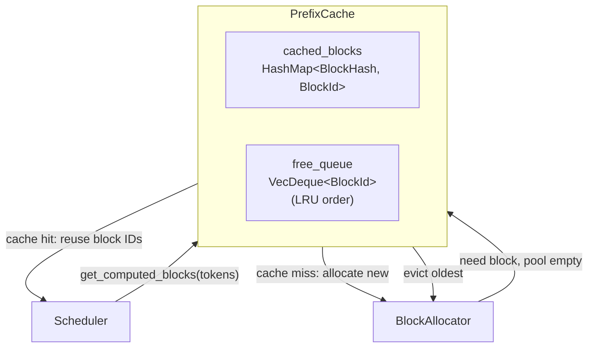
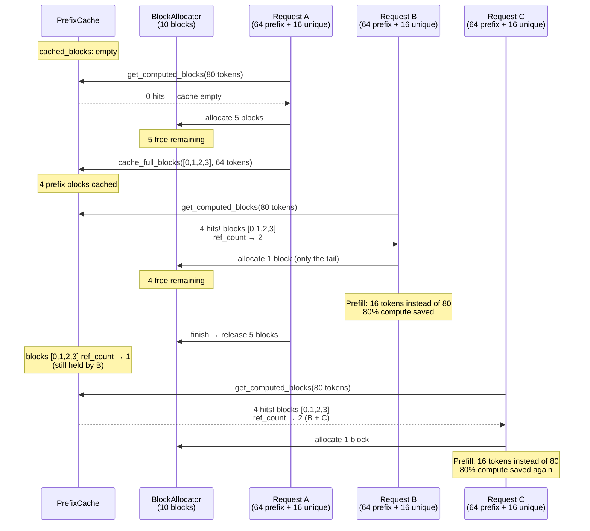

# Chapter 16: Prefix Caching

---

## Ten Requests, One System Prompt

Ten chatbot requests arrive within the same second. Every single one starts with the same 500-token system prompt:

```
"You are a helpful assistant. You answer questions clearly and concisely.
 You cite sources when possible. You never fabricate information..."
```

Five hundred tokens. Thirty-two blocks of sixteen tokens each. Each request goes through prefill --- the forward pass that computes Key and Value vectors for every token in the prompt. For a 7B model, that is roughly 50 milliseconds of GPU compute per request.

Ten requests. Same 500 tokens. Ten identical prefills. Five hundred milliseconds of work --- and 90% of it is redundant. The GPU computes the exact same Key and Value vectors ten times, storing ten identical copies across ten separate block tables.

The block allocator from Chapter 10 does not know this. Blocks are anonymous. Block 14 and Block 37 might hold identical KV data for identical tokens, but the allocator has no way to tell. It has no concept of *content identity* --- only "free" and "occupied."

---

## Anonymous Blocks, Blind Allocator

Here is what happens today when Request A and Request B share a 64-token prefix (4 blocks):

```
Request A arrives:
  allocate block 0 → compute KV for tokens 0..15
  allocate block 1 → compute KV for tokens 16..31
  allocate block 2 → compute KV for tokens 32..47
  allocate block 3 → compute KV for tokens 48..63
  allocate block 4 → compute KV for tokens 64..79 (unique tail)

Request B arrives (same 64-token prefix):
  allocate block 5 → compute KV for tokens 0..15    // same work!
  allocate block 6 → compute KV for tokens 16..31   // same work!
  allocate block 7 → compute KV for tokens 32..47   // same work!
  allocate block 8 → compute KV for tokens 48..63   // same work!
  allocate block 9 → compute KV for tokens 64..79 (different tail)
```

Eight blocks allocated, eight prefill computations, but blocks 0-3 and 5-8 contain the *same data*. Double the memory, double the compute, zero benefit. And this scales linearly --- a hundred requests with the same system prompt means a hundred redundant copies.

The allocator is not broken. It is doing exactly what Chapter 10 asked: allocate blocks, map logical to physical, free when done. The problem is that it treats every allocation as unique. It has no memory of what has been computed before.

What if it did?

---

## Content-Addressed Blocks

The insight is borrowed from content-addressable storage: instead of identifying blocks by their position (block ID 7), identify them by their *content* (the tokens they hold). Two blocks with the same content get the same identifier. When a new request needs a block, check if that content already exists. If it does, point to the existing block instead of allocating a new one.

This is prefix caching. And the mechanism that makes it work is **hash chaining**.

### Hash Chaining: Position-Aware Identity

A naive approach would hash just the tokens in each block. But that fails immediately. Consider:

```
Prompt A: "The cat sat on the mat. What is AI?"
Prompt B: "What is AI? The cat sat on the mat."
```

The tokens "What is AI?" appear in both prompts, but at *different positions*. The KV vectors for token "What" at position 5 are different from the KV vectors for "What" at position 0 --- the attention mechanism encodes position into the Key and Value computations. Same tokens, different positions, different KV data. Sharing blocks between them would produce garbage.

Hash chaining solves this by incorporating the *entire prefix history* into each block's hash:

```
hash_block(tokens, prev_hash):
    state = hash_init()

    if prev_hash is not None:
        state = hash_update(state, prev_hash)
            // chain to the previous block — encodes position implicitly

    for token in tokens:
        state = hash_update(state, token)
            // incorporate every token in this block

    return hash_finalize(state)
```

Block 0 has no predecessor, so its hash depends only on its tokens. Block 1's hash incorporates Block 0's hash. Block 2's hash incorporates Block 1's hash, which already incorporates Block 0's. Each hash encodes the *entire prefix up to and including that block*.


**Figure 16.1** --- Hash chaining. Each block's hash incorporates the previous block's hash, encoding the full prefix history. Changing one token in block 0 cascades through all subsequent hashes.

This cascade property is crucial. Change one token in block 0, and every downstream hash changes. Two sequences that diverge at any point produce different hashes from the divergence onward --- exactly matching the behavior of KV computation, where a different token at position 3 changes every subsequent Key and Value vector.

**One critical rule:** only full blocks are hashed. A partial block --- the last block in a sequence, with `num_filled < block_size` --- is still being written to. Its content is not final. Hashing it would create an entry that becomes stale the moment the next token is appended. So the partial tail block stays mutable and uncached.

---

## The PrefixCache

The PrefixCache sits between the allocator and the scheduler. It maintains a map from block hashes to physical block IDs, and an eviction queue for blocks that are no longer actively referenced but might be reused.


**Figure 16.2** --- PrefixCache structure and its relationship to the scheduler and allocator. The scheduler asks the cache before allocating; the allocator asks the cache when it needs to evict.

### The Lookup: get_computed_blocks

When a new request arrives, the scheduler asks: "how much of this prompt has already been computed?"

```
get_computed_blocks(token_ids):
    blocks = []
    prev_hash = None
    num_tokens = 0

    for chunk in split_into_full_blocks(token_ids, block_size):
        // only full blocks — the partial tail is skipped
        hash = hash_block(chunk, prev_hash)

        if hash in cached_blocks:
            block_id = cached_blocks[hash]
            ref_count[block_id] += 1
                // this block is now shared — another request points to it
            remove_from_free_queue(block_id)
                // no longer evictable — it's actively in use again
            blocks.append(block_id)
            prev_hash = hash
            num_tokens += block_size
        else:
            break
                // STOP on first miss — prefix must be contiguous
                // a hit at position 3 after a miss at position 2 is useless
                // because KV computation is sequential

    return (blocks, num_tokens)
```

The stop-on-first-miss rule is the key constraint. KV cache data is only valid if every preceding block is also valid. A cache hit at block 3 is meaningless if block 2 was a miss --- you would need to compute block 2's KV data anyway, and that computation would produce different output if the preceding context were wrong.

### Caching Completed Blocks

After a request completes prefill, its full blocks enter the cache:

```
cache_full_blocks(block_ids, token_ids):
    prev_hash = None

    for i, chunk in enumerate(split_into_full_blocks(token_ids, block_size)):
        hash = hash_block(chunk, prev_hash)
        cached_blocks[hash] = block_ids[i]
            // now discoverable by future requests with the same prefix
        prev_hash = hash

    // partial last block is NOT cached — its content may still change
```

### Eviction: LRU from the Free Queue

When a request finishes and releases its blocks, something subtle happens. Instead of returning blocks directly to the allocator's free pool, blocks with `ref_count == 0` enter the PrefixCache's free queue. They are still in `cached_blocks` --- still available for cache hits --- but marked as evictable.

```
evict():
    while free_queue is not empty:
        block_id = free_queue.pop_front()
            // oldest first — LRU policy

        if ref_count[block_id] > 0:
            continue
                // this block was reclaimed by a cache hit since it was queued
                // skip it — it's back in active use

        remove block_id from cached_blocks
            // no longer discoverable
        return block_id
            // truly free — allocator can reuse this physical block

    return None
        // nothing to evict — the system is genuinely out of memory
```

This deferred-eviction strategy is what makes prefix caching powerful. A freed block does not immediately lose its cached KV data. It lingers, waiting for a future request that might need exactly those tokens. Only when memory pressure forces the issue does the oldest unreferenced block get evicted.

---

## The Payoff: Watch It Work

Let's trace through a concrete scenario with a 10-block pool (block_size = 16) and three requests that share a 64-token system prompt (4 blocks).


**Figure 16.3** --- Three requests with a shared prefix. Request A pays the full cost. Requests B and C each skip 64 tokens of prefill by reusing cached blocks. The shared blocks have ref_count > 1 as long as multiple requests reference them.

The numbers tell the story:

| Request | Prefill tokens | Blocks allocated | Cache hits | Compute saved |
|---------|---------------|-----------------|------------|---------------|
| A | 80 | 5 | 0 | 0% |
| B | 16 | 1 | 4 | 80% |
| C | 16 | 1 | 4 | 80% |
| **Total** | **112** (vs 240) | **7** (vs 15) | **8** | **53%** |

Without prefix caching, all three requests compute 80 tokens each --- 240 total. With it, only 112 tokens are computed. The savings compound: ten requests with the same prefix would compute 80 + (9 x 16) = 224 tokens instead of 800. That is a 72% reduction.

### ref_count Through the Lifecycle

Follow one prefix block (block 0) through the entire sequence:

| Event | ref_count | In cached_blocks? | In free_queue? |
|-------|-----------|--------------------|----------------|
| Request A allocates | 1 | No | No |
| A finishes prefill, block cached | 1 | Yes | No |
| Request B cache hit | 2 | Yes | No |
| Request A finishes | 1 | Yes | No |
| Request C cache hit | 2 | Yes | No |
| Request B finishes | 1 | Yes | No |
| Request C finishes | 0 | Yes | Yes (evictable) |
| Request D cache hit | 1 | Yes | No (rescued!) |
| No more requests, pool full, evict | --- | No | No (truly free) |

The block survives four requests and one trip to the eviction queue. It gets "rescued" when Request D hits the cache before eviction runs. This is the power of deferred eviction --- recently used patterns tend to be reused soon.

---

## Where Prefix Caching Shines

Not every workload benefits equally. Prefix caching is transformative when requests share long common prefixes:

| Workload | Shared prefix | Benefit |
|----------|--------------|---------|
| Chat with system prompt | 200-2000 tokens | High --- every user message reuses the system prompt |
| Few-shot prompting | 500-4000 tokens | Very high --- examples are identical across requests |
| RAG with fixed context | 1000-8000 tokens | Massive --- the retrieved context changes slowly |
| Unique prompts (no overlap) | 0 tokens | None --- every block is a miss |
| Code completion (short prefixes) | 20-50 tokens | Low --- prefix is too short to justify cache overhead |

The worst case is no worse than no caching at all --- a miss just falls through to normal allocation. The hash computation adds negligible overhead (microseconds vs milliseconds of prefill compute).

---

## The Spec

Everything in this chapter is formalized in [`spec/ch16/`](../spec/ch16/):

| Artifact | What It Contains |
|----------|-----------------|
| `prompt-template.md` | Complete implementation prompt with PrefixCache, hash chaining, eviction, and demo scenarios |
| `validation/` | Automated tests for cache hits, eviction, hash chaining, and hit rate tracking |

### Quick Start

1. Read `spec/ch16/prompt-template.md` --- the PrefixCache contract, hash chaining algorithm, and ref_count semantics
2. Implement `src/memory/prefix_cache` with PrefixCache struct, `hash_block`, `get_computed_blocks`, `cache_full_blocks`, and `evict`
3. Modify `src/memory/block_allocator` to support ref_count increment/decrement
4. Build the demo: `examples/ch16_prefix_caching`
5. Validate: `pytest spec/ch16/validation/`

---

## Try It Yourself

**Exercise 1: Shared System Prompt.**
Two requests arrive with a 500-token system prompt (32 blocks) followed by different user messages. Request A finishes. Request B is still generating. How many blocks are shared? What is the ref_count on each shared block? What happens when Request A finishes --- do the shared blocks get freed? (Hint: ref_count drops to 1, not 0. The blocks stay active.)

**Exercise 2: Partially Overlapping Prefixes.**
Three requests:
- Request A: "You are a helpful assistant. Summarize this article: [article text]"
- Request B: "You are a helpful assistant. Translate this to French: [french text]"
- Request C: "You are a code reviewer. Review this PR: [pr text]"

Requests A and B share the prefix "You are a helpful assistant." Request C diverges earlier. Draw the hash chains for all three. Which blocks can be shared between A and B? Between A and C? Between B and C? At what block does the hash chain diverge for each pair?

**Exercise 3: Cache Salt for Multi-Tenancy.**
In a multi-tenant deployment, User X and User Y might send the same system prompt. But sharing KV cache between users could leak information through side channels (timing differences, cache hit patterns). Implement a `cache_salt` parameter that gets mixed into the hash: `hash_block(tokens, prev_hash, salt)`. Each user gets their own salt. Same tokens, different users, different hashes --- no cross-user sharing. What is the tradeoff? (Lower cache hit rate in exchange for isolation.)

---

## The Speculative Frontier

Prefix caching eliminates redundant *prefill* computation. When ten requests share a system prompt, nine of them skip straight to generating their unique tokens. The GPU does less redundant work. Memory holds fewer duplicate blocks. Throughput goes up.

But there is a different kind of underutilization that prefix caching does not touch.

During decode, the model generates one token per forward pass. One token. The GPU --- designed to process thousands of elements in parallel --- is doing a massive matrix multiplication to produce a single output. The arithmetic intensity is terrible. The hardware is starving for work.

What if you could generate *multiple* tokens per forward pass? Not by making the model faster, but by letting a smaller, cheaper model *guess* the next several tokens, and then having the big model verify them all at once?

Next chapter: speculative decoding. The small model drafts. The big model edits. And the GPU finally has enough work to stay busy.

---

## References

### Prefix Caching in Practice

1. **"SGLang: Efficient Execution of Structured Language Model Programs"** — Zheng, Yin, Xie, Cheng, Li, Stoica, Gonzalez, Zhang (2024). Introduces RadixAttention, a radix-tree based prefix caching system that automatically detects and reuses shared prefixes across requests. The hash-chaining approach in this chapter is a simplified version of the same core idea. [arxiv.org/abs/2312.07104](https://arxiv.org/abs/2312.07104)

2. **"Efficient Memory Management for Large Language Model Serving with PagedAttention"** — Kwon et al. (2023). Section 5.3 describes vLLM's automatic prefix caching (APC), where hash-based block identification enables prefix sharing without explicit user annotation. Our `PrefixCache` design follows their approach. [arxiv.org/abs/2309.06180](https://arxiv.org/abs/2309.06180)
