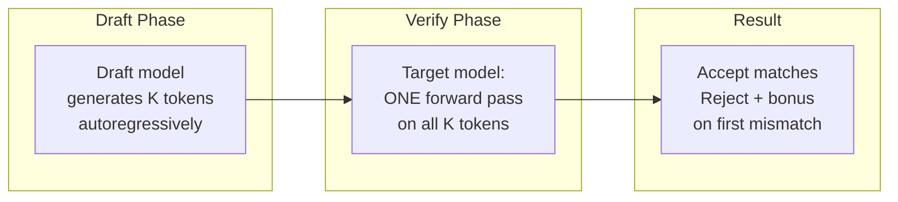
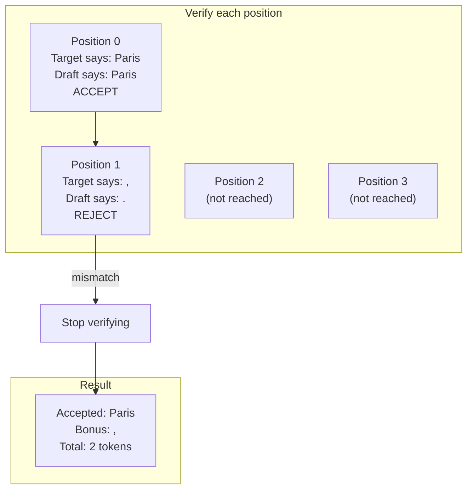
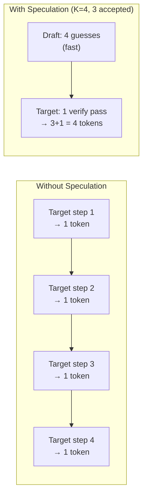
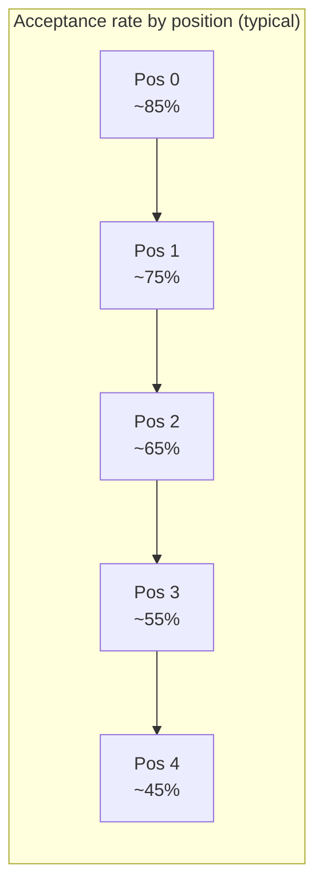

# Chapter 17: Speculative Decoding

---

## The Expensive Single Token

Watch a single decode step in slow motion.

The model has just generated token 47 of a response. The KV cache holds 46 previous layers of keys and values. To produce token 48, the GPU must:

1. Read the entire model --- billions of parameters --- from high-bandwidth memory into the compute cores.
2. Read the entire KV cache for this sequence.
3. Compute attention over all cached positions.
4. Run the feed-forward layers.
5. Project to vocabulary size.
6. Sample one token.

All of that --- gigabytes of memory transfer, millions of multiply-accumulate operations --- for a single integer. One token ID.

Here is the uncomfortable truth: the compute units barely break a sweat. The arithmetic intensity of a batch_size=1 decode step is tiny. The GPU spends most of its time *waiting for data to arrive from memory*, not doing math. The memory bus is maxed out. The ALUs are idle.

This is the memory-bound bottleneck from Chapter 1, and it has haunted every decode step since.

---

## Paying for Eight, Getting One

How bad is the waste? Consider what happens when you increase the batch size from 1 to 8 during decode:

| Batch size | Memory reads | Compute | Wall-clock time |
|-----------|-------------|---------|----------------|
| 1 | Read all weights + KV cache | 1x | ~10 ms |
| 8 | Read all weights + KV cache | 8x | ~11 ms |

The wall-clock time barely changes. The weights are the same weights regardless of batch size --- they get read once and applied to all sequences. The compute scales 8x, but since the GPU was compute-idle at batch_size=1, it absorbs the extra work for nearly free.

Batch size 1 produces 1 token in 10 ms: 100 tokens/second.
Batch size 8 produces 8 tokens in 11 ms: 727 tokens/second.

You are paying for 8 tokens' worth of memory bandwidth and getting 1. The GPU has compute capacity to process multiple tokens simultaneously --- that is exactly what prefill does. Prefill processes an entire prompt in one forward pass because all the tokens are known in advance.

But during decode, you do not know the next token until you generate it. And you cannot generate it until you run the forward pass. And you cannot run the forward pass for token N+1 until you have token N.

Or can you?

---

## What If You Guessed?

Here is the key insight behind speculative decoding: **you do not need to know the tokens --- you just need to guess them**.

If a small, cheap model can predict the next K tokens, the large target model can verify all K guesses in a single forward pass. The target model already knows how to process multiple tokens at once --- that is what prefill does. Verification is just prefill on the guessed tokens.


**Figure 17.1** --- The draft-then-verify loop. A small model guesses K tokens cheaply. The target model verifies all K in a single forward pass and produces 1 to K+1 tokens.

The draft model is small --- maybe 10x fewer parameters than the target. It runs fast precisely because it is small. Its forward pass is cheap. Let it guess.

The target model is the authority. It runs one forward pass on the K draft tokens plus the existing context. That single pass produces logits for all K+1 positions (the K draft positions plus one bonus position beyond). Then you compare: did the draft model guess correctly at each position?

If the draft guessed right, you keep the token. If it guessed wrong, you reject it and everything after it --- and you take the target model's answer at the rejection point as a bonus token.

The result: instead of 1 token per target forward pass, you get somewhere between 1 and K+1 tokens per pass. The target model runs at the same speed as before, but you extract more tokens from each pass.

---

## The Verification Algorithm

Let's make this precise. Given a draft model, a target model, a context of tokens already generated, and a speculation depth K:

```
function speculative_step(draft_model, target_model, context, K):

    // === Draft phase: small model guesses K tokens ===
    draft_tokens = []
    for i in 0..K:
        token = draft_model.generate_one(context + draft_tokens)
            // autoregressive — each guess depends on previous guesses
        draft_tokens.append(token)

    // === Verify phase: target model checks all K at once ===
    all_tokens = context + draft_tokens
    target_logits = target_model.forward(all_tokens)
        // ONE forward pass — K+1 sets of logits
        // logits[i] = target's distribution after seeing tokens 0..context_len+i

    // === Accept/reject: compare draft to target ===
    accepted = []
    for i in 0..K:
        target_token = argmax(target_logits[context_len + i])
            // what would the target model have generated at this position?
        if target_token == draft_tokens[i]:
            accepted.append(draft_tokens[i])
                // draft got it right — keep going
        else:
            accepted.append(target_token)
                // draft got it wrong — use target's answer as bonus
            return accepted
                // stop here — cannot verify past a rejection

    // === All K accepted — collect the free bonus token ===
    bonus = argmax(target_logits[context_len + K])
        // the target produced logits for one position beyond the draft
    accepted.append(bonus)
    return accepted
        // best case: K+1 tokens from one target forward pass
```

This is greedy verification --- accept only if `argmax` matches exactly. Section "Stochastic Verification" below relaxes this.

The critical property: **the output is identical to what the target model would have produced on its own.** The draft model only affects speed, never quality. If the draft guesses wrong, the target's token is used. The target is always the final authority.

---

## A Worked Example

Prompt: "The capital of France is"

The draft model (K=4) generates autoregressively:

```
Draft guess: ["Paris", ".", " It", "'s"]
```

Now the target model runs one forward pass on "The capital of France is Paris . It 's" and produces logits for each position after the prompt:


**Figure 17.2** --- Worked example. "Paris" matches --- accepted. "." vs "," --- mismatch. Verification stops. The target's "," becomes the bonus token. Two tokens from one target forward pass.

Let's trace it step by step:

| Position | Target argmax | Draft token | Match? | Action |
|----------|--------------|-------------|--------|--------|
| 0 | "Paris" | "Paris" | Yes | Accept "Paris" |
| 1 | "," | "." | No | Reject. Bonus = "," |
| 2 | --- | " It" | --- | Not reached |
| 3 | --- | "'s" | --- | Not reached |

**Result:** 1 accepted ("Paris") + 1 bonus (",") = 2 tokens in one target forward pass.

Without speculation, the target model would have produced 1 token ("Paris") in one forward pass. Speculative decoding doubled the output for this step.

On a luckier step --- say the draft guesses all 4 correctly --- you would get 5 tokens (4 accepted + 1 bonus) from a single target forward pass. That is a 5x improvement.

---

## The Speedup Arithmetic

How much faster is speculative decoding? It depends on two factors: how long the draft model takes relative to the target, and how often the draft guesses correctly.

Define:
- **K** = number of speculated tokens (the draft length)
- **alpha** = acceptance rate (fraction of draft tokens the target accepts)
- **c** = cost ratio (time for one draft step / time for one target step)

Without speculation, you get 1 token per target step. With speculation, you run K draft steps plus 1 target step, and you get (on average) `alpha * K + 1` tokens:

```
Speedup = (alpha * K + 1) / (c * K + 1)
```

Some concrete numbers:

| alpha | K | c | Tokens per cycle | Cost (target steps) | Speedup |
|-------|---|---|-----------------|---------------------|---------|
| 0.8 | 4 | 0.05 | 4.2 | 1.2 | 3.5x |
| 0.6 | 4 | 0.05 | 3.4 | 1.2 | 2.8x |
| 0.8 | 8 | 0.05 | 7.4 | 1.4 | 5.3x |
| 0.4 | 8 | 0.05 | 4.2 | 1.4 | 3.0x |
| 0.8 | 4 | 0.20 | 4.2 | 1.8 | 2.3x |

The sweet spot depends on your draft model. A tiny draft model (low c) can afford a higher K because each guess is cheap. A larger draft model (higher c) needs a higher acceptance rate to justify its cost.


**Figure 17.3** --- Four sequential decode steps vs one speculative cycle. The speculative cycle produces 4 tokens (3 accepted + 1 bonus) in roughly the time of one target step plus a small draft overhead.

---

## When Speculation Works (and When It Doesn't)

Acceptance rate is everything. And it varies wildly depending on context:

**High acceptance rate (70-90%):**
- Predictable continuations: "The United States of America" --- the draft model nails this.
- Common patterns: closing parentheses, quotation marks, standard phrases.
- Code: boilerplate, import statements, function signatures.

**Low acceptance rate (30-50%):**
- Creative writing: novel word choices that a small model cannot predict.
- Specialized knowledge: technical terms the draft model has not learned.
- High-temperature sampling: randomness makes any guess unlikely.

**The compounding problem:** each draft token depends on the previous one. If the draft gets token 2 wrong, tokens 3, 4, ... are conditioned on the wrong prefix. Acceptance rate drops with position:


**Figure 17.4** --- Acceptance rate typically decays with speculation depth. Each position is conditioned on the previous guess being correct --- errors compound.

This is why K=4 or K=5 is common in practice. Going to K=8 or K=16 adds draft cost but the later positions rarely accept. The optimal K balances draft overhead against diminishing returns.

---

## Choosing a Draft Model

The draft model needs two properties:

1. **Fast.** The whole point is that K draft steps cost much less than K target steps. A draft model that is half the size of the target is not fast enough. Aim for 10-50x fewer parameters.

2. **Similar distribution.** The closer the draft model's predictions match the target, the higher the acceptance rate. A model from the same family works well --- for example, a 125M parameter model drafting for a 7B parameter model of the same architecture.

Some options beyond small models:

| Proposer type | Speed | Quality | Notes |
|--------------|-------|---------|-------|
| Small model (same family) | Medium | High | Best acceptance rate |
| N-gram lookup | Very fast | Low-Medium | Look at last N tokens, find common continuations in the prompt |
| Retrieval from prompt | Very fast | Variable | Copy sequences that appeared earlier in the context |
| Self-draft (early exit) | Medium | Medium | Use the target model's first few layers as the draft |

The n-gram approach is worth highlighting: it requires no model at all. Look at the last 3 tokens, search the prompt for the same trigram, and propose whatever followed it. For long prompts with repetitive structure (legal documents, code with patterns), this works surprisingly well.

---

## Stochastic Verification

The algorithm above uses greedy verification: accept only if `argmax` matches exactly. This guarantees the output matches greedy decoding from the target model. But what if you are using sampling (temperature, top-p) from Chapter 14?

Greedy verification is too strict for sampling. The target model might assign 30% probability to the draft token --- a perfectly reasonable sample --- but reject it because a different token has 31% probability. You would throw away good tokens constantly.

Stochastic verification fixes this. Instead of comparing argmax, compare probabilities:

```
function stochastic_verify(target_prob, draft_prob, draft_token):
    // target_prob = probability the target model assigns to draft_token
    // draft_prob = probability the draft model assigned to draft_token

    acceptance_probability = min(1.0, target_prob / draft_prob)
        // if target likes the token MORE than the draft did → always accept
        // if target likes it LESS → accept with reduced probability

    if random() < acceptance_probability:
        return ACCEPT
    else:
        return REJECT
        // on rejection, sample from a corrected distribution
```

This preserves the *exact sampling distribution* of the target model. Not approximately --- exactly. The proof is elegant: the draft model's bias is canceled out by the acceptance ratio. The output distribution is mathematically identical to sampling from the target model directly.

The corrected distribution on rejection is:

```
corrected_prob[token] = max(0, target_prob[token] - draft_prob[token])
    // normalize to sum to 1
    // this "fills in" the probability mass that was under-represented by the draft
```

Stochastic verification typically has higher acceptance rates than greedy verification because it does not demand exact matches --- it accepts any token the target model considers reasonable.

---

## Integration with the Engine Loop

Where does speculative decoding fit in the engine from Chapter 13? It replaces the decode phase of `step()`:

```
function step():
    scheduler_output = scheduler.schedule()
        // same as before (ch12)

    for seq in scheduler_output.sequences:
        if seq.is_prefill:
            // prefill is unchanged — no speculation needed
            logits = target_model.forward(seq.prompt_tokens)
            token = sampler.sample(logits)
            seq.append(token)
        else:
            // decode: use speculation instead of single-token generation
            new_tokens = speculative_step(
                draft_model, target_model, seq.token_ids, K
            )
            for token in new_tokens:
                seq.append(token)
                if token == EOS or seq.len >= max_tokens:
                    seq.finish()
                    break
```

The scheduler, block allocator, and sampler from previous chapters remain unchanged. Speculative decoding is an optimization of the decode path --- it produces more tokens per step, but the surrounding infrastructure does not need to know how.

One subtlety: the block allocator needs to handle sequences growing by more than one token per step. Instead of allocating at most one new block per step, a sequence might need several blocks if K+1 tokens push it past multiple block boundaries. This is a minor change to the allocation logic from Chapter 10.

---

## The Spec

Implementation artifacts for this chapter live in `spec/ch17/`:

| Artifact | Path | What it contains |
|----------|------|-----------------|
| Interface spec | `spec/ch17/interface-spec.md` | DraftModel trait, speculative_step algorithm, verification logic |
| Component diagram | `spec/ch17/component-diagram.md` | Draft/target model interaction, engine integration |
| Sequence diagram | `spec/ch17/sequence-diagram.md` | Full speculative decode cycle with accept/reject |
| Expected output | `spec/ch17/expected-output.txt` | Demo output showing draft, verify, accept/reject trace |
| Prompt template | `spec/ch17/prompt-template.md` | Copy-paste prompt for LLM-assisted implementation |
| Validation tests | `spec/ch17/validation/` | Automated correctness checks |

To verify your implementation:

```
pytest spec/ch17/validation/
```

---

## Try It Yourself

**Exercise 1: Find the optimal K.**
Start with K=4. Measure tokens per second. Increase K to 5, 6, 7, 8. At some point, the extra draft overhead outweighs the diminishing acceptance rate. Plot tokens/second vs K and find the peak. It will depend on your draft/target model pair.

**Exercise 2: N-gram proposer.**
Replace the draft model with a simple n-gram lookup. Given the last 3 tokens, search the existing context for that trigram and propose whatever followed it. If no match, fall back to a unigram frequency table. Run it on a long prompt with repetitive structure (a legal contract, a code file with repeated patterns). How does the acceptance rate compare to a neural draft model?

**Exercise 3: Stochastic verification.**
Implement the stochastic acceptance criterion: accept with probability `min(1, p_target / p_draft)` instead of requiring exact argmax match. Compare the acceptance rate to greedy verification on the same prompt. Generate 1000 tokens with each method and compare the output distributions --- they should be statistically indistinguishable from direct target model sampling.

**Exercise 4: Adaptive K.**
Track the acceptance rate over a sliding window of the last 10 speculative cycles. If the acceptance rate drops below 50%, reduce K by 1. If it exceeds 80%, increase K by 1. Does adaptive K outperform fixed K across a variety of prompts?

---

## The Model Speaks Freely --- Too Freely

Speculative decoding makes generation faster by guessing ahead and verifying in bulk. The draft model proposes, the target model disposes. One forward pass, multiple tokens. The memory bus is no longer the sole bottleneck.

But speed is not the only problem with generation. Sometimes the output needs to follow rules. A JSON API must return valid JSON --- not "almost valid" JSON with a missing closing brace. A SQL generator must produce syntactically correct queries. A form filler must output dates in ISO format, not natural language.

The model does not know any of this. It produces tokens based on probability, and probability does not care about your schema. Left to its own devices, it will cheerfully generate `{"name": "Alice", "age":` and then follow up with a paragraph of prose instead of a number.

What if you could constrain the model's output --- force it to follow a grammar, match a regex, conform to a JSON schema --- without retraining it? What if, at each decode step, you could look at the set of valid next tokens and mask everything else to negative infinity before sampling?

That is guided decoding, and it is where we are headed next.

---

*Next: [Chapter 18 --- Guided Decoding](ch18-guided-decoding.md)*

---

## References

### Speculative Decoding — Foundational Papers

1. **"Fast Inference from Transformers via Speculative Decoding"** — Leviathan, Kalman, Matias (2023). One of the two independent discoveries of speculative decoding. Proves that the draft-then-verify approach produces output distributions identical to the target model (the "lossless" guarantee). The rejection sampling criterion in this chapter comes directly from this paper. [arxiv.org/abs/2211.17192](https://arxiv.org/abs/2211.17192)

2. **"Accelerating Large Language Model Decoding with Speculative Sampling"** — Chen, Borgeaud, Irving, Lespiau, Sifre, Jumper (2023). The other independent discovery, from DeepMind. Formalizes speculative sampling and proves the same distribution-preservation guarantee via a different mathematical path. [arxiv.org/abs/2302.01318](https://arxiv.org/abs/2302.01318)

### Advanced Speculative Methods

3. **"SpecInfer: Accelerating Generative Large Language Model Serving with Tree-based Speculative Inference and Verification"** — Miao, Oliaro, Zhang, Cheng, Wang, Wong, Zhu, Jia, Avestimehr (2023). Extends speculative decoding with tree-structured speculation --- multiple candidate continuations verified in parallel. Improves acceptance rates when the draft model is uncertain. [arxiv.org/abs/2305.09781](https://arxiv.org/abs/2305.09781)

4. **"Medusa: Simple LLM Inference Acceleration Framework with Multiple Decoding Heads"** — Cai, Li, Geng, Peng, Lee, Chen (2024). Eliminates the separate draft model entirely by adding lightweight prediction heads to the target model itself. Each head predicts a different future position, enabling parallel verification without a second model. [arxiv.org/abs/2401.10774](https://arxiv.org/abs/2401.10774)
