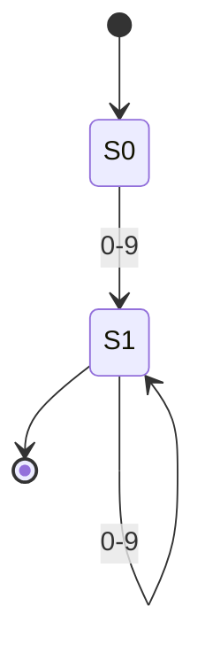
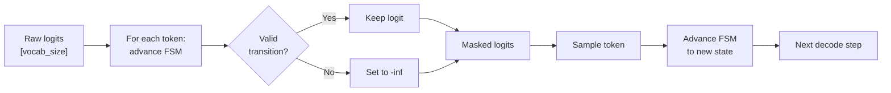
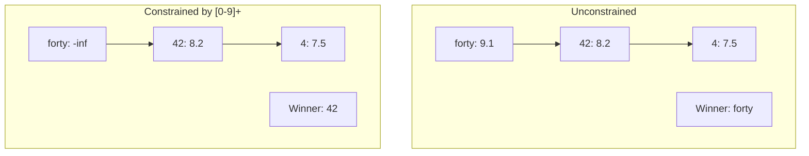
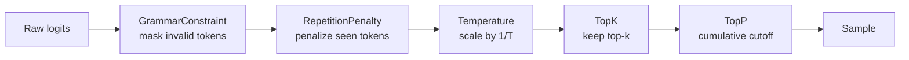

# Chapter 18: Structured Output

## You Asked for JSON. You Got Chaos.

You send a request to the model: "Return the user's name and age as JSON." The model replies:

```
{"name": "Alice", "age": twenty-three}
```

Almost valid. Almost useful. Completely broken.

Your JSON parser throws an exception. `twenty-three` is not a number. The response *looks* like JSON, but it is not JSON. You could retry --- ask the model again, maybe rephrase the prompt, maybe add "please really truly return valid JSON this time." Sometimes it works. Sometimes you retry three times and burn three forward passes before getting something parseable.

This is the fundamental tension: LLMs generate free-form text, one token at a time, with no structural guarantees. The model does not know what JSON is. It has *seen* JSON in training data and learned statistical patterns that often produce valid JSON. Often. Not always. And "often" is not good enough when your downstream code calls `json.parse()`.

You need a guarantee. Every token the model emits must be consistent with the target format. Not "probably valid." Valid. Period.

---

## The Parse-and-Retry Trap

The obvious fix is post-processing: generate the full output, try to parse it, and if parsing fails, retry. This has three problems.

**It wastes compute.** Each retry is a full forward pass through the model --- hundreds of millions of parameters, hundreds of milliseconds. If the model fails on the third retry, you have burned four times the compute of a single generation.

**It does not converge.** There is no guarantee the model will ever produce valid output. You might retry five times and get five different kinds of invalid JSON. Retry loops need a maximum, and when you hit it, you return an error to the user.

**It is all-or-nothing.** You generate the entire output, then check it. If the model produces 500 tokens of perfect JSON and then one invalid token at position 501, you throw away all 500 good tokens and start over.

The right solution is not to check *after* generation. It is to constrain *during* generation. At every decode step, before the model picks a token, ensure that only valid tokens are available to pick.

---

## Grammar as Guardrail

Here is the core idea: compile the target format into a **finite state machine** (FSM). At each decode step, the FSM tells you which tokens are valid transitions from the current state. Mask everything else. The model still generates --- it still picks the most probable token --- but it can only pick from tokens that keep the output on track.

### A Quick Tour of Finite State Machines

If you have not worked with FSMs before, they are simpler than they sound. An FSM has:

- **States** --- labeled circles (S0, S1, S2, ...). The machine is always in exactly one state.
- **Transitions** --- arrows between states, each labeled with a character. "If I am in S0 and I see a `5`, move to S1."
- **An initial state** --- where the machine starts (S0 by convention).
- **Accept states** --- if the machine ends here, the input is valid. Drawn as double circles.

That is it. No stack, no memory, no backtracking. Just: "I am in this state, I see this character, I move to that state."

Here is an FSM that matches one or more digits --- the regex `[0-9]+`:


**Figure 18.1** --- FSM for the pattern `[0-9]+`. S0 is the initial state. S1 is the accept state (double border). Any digit moves S0 to S1; more digits loop in S1. Non-digit characters have no transition --- they are rejected.

**How to read this diagram:** Start at S0. Feed in characters one at a time. If the character has an arrow, follow it. If it does not, the input is rejected. If you run out of characters and you are on an accept state (S1), the input is valid.

Feed in `"42"`: S0 --(`4`)--> S1 --(`2`)--> S1. Ended on S1, which is an accept state. Valid.

Feed in `"4a"`: S0 --(`4`)--> S1 --(`a`)--> no transition. Rejected.

Feed in `""` (empty): Start on S0, which is not an accept state. Rejected. (The `+` quantifier requires at least one digit.)

### From Characters to Tokens

Here is the trick that connects FSMs to LLM decoding. A token is not a single character --- it is a *string* of one or more characters. The token `"42"` is two characters. To check whether a token is valid from a given state, walk the FSM through *every character* of the token's string:

```
function advance(fsm, state, token_string):
    current = state
    for char in token_string:
        next = fsm.transitions.get((current, char))
        if next is None:
            return None        // no transition — token is invalid from this state
        current = next
    return current             // the state after consuming the entire token
```

If `advance` returns a state, the token is valid. If it returns `None`, the token is invalid.

For our `[0-9]+` FSM from state S0:
- Token `"4"` --- `S0 --(4)--> S1`. Valid. Lands on S1.
- Token `"42"` --- `S0 --(4)--> S1 --(2)--> S1`. Valid. Lands on S1.
- Token `"hello"` --- `S0 --(h)--> None`. Invalid. `h` has no transition from S0.
- Token `"4a"` --- `S0 --(4)--> S1 --(a)--> None`. Invalid. The `4` was fine, but `a` has no transition from S1.

### The Masking Step

At each decode step, the model produces logits --- a score for every token in the vocabulary. Normally, any token could be sampled. With grammar-constrained decoding, you add one step before sampling:

```
function grammar_mask(logits, fsm, current_state, vocab):
    for (token_id, token_str) in vocab:
        next_state = advance(fsm, current_state, token_str)
        if next_state is None:
            logits[token_id] = -infinity   // after softmax, probability becomes 0
    return logits
```

That is the entire mechanism. Check every token. Mask the invalid ones. Sample from what remains.


**Figure 18.2** --- Token masking flow. Each decode step checks every vocabulary token against the FSM, masks invalid tokens, samples from the survivors, then advances the FSM state for the next step.

After sampling, the engine advances the FSM state by the chosen token's characters. The next decode step starts from that new state, and the set of valid tokens may change.

---

## The Elegant Part

The model is still doing the creative work. It still assigns probabilities based on everything it learned in training. The grammar just narrows the candidates.

Imagine the model is answering "What is 6 times 7?" with the constraint `[0-9]+`. The logits might look like:

| Token | String | Logit | Valid? |
|-------|--------|-------|--------|
| 3912  | "42"   | 8.2   | Yes    |
| 1558  | "forty"| 9.1   | No     |
| 940   | "4"    | 7.5   | Yes    |
| 1105  | "17"   | 5.3   | Yes    |
| 2231  | "hello"| 1.0   | No     |

Without the constraint, `"forty"` wins --- it has the highest logit. With the constraint, `"forty"` is masked to `-inf`, and `"42"` wins. The model *knew* the answer was 42. The grammar just prevented it from spelling it out in English.

This is not a hack. This is the model's own knowledge, channeled through a structural constraint. The grammar does not invent content --- it shapes the form.


**Figure 18.3** --- Same logits, different valid sets. The grammar does not change the model's preferences among valid tokens --- it removes the invalid ones and lets the model choose from what remains.

---

## GrammarConstraint as a LogitsProcessor

Chapter 14 introduced the `LogitsProcessor` trait --- a simple contract: take logits in, return modified logits out. Temperature implements it. Top-k implements it. Top-p implements it. And now GrammarConstraint implements it too:

```
struct GrammarConstraint:
    fsm: SimpleFSM
    current_state: FSMState         // tracks where we are in the FSM
    vocab: list[(TokenId, String)]  // the full vocabulary with token strings

trait LogitsProcessor:
    process(logits, token_ids_so_far) -> logits

// GrammarConstraint implements LogitsProcessor
GrammarConstraint.process(logits, token_ids_so_far):
    for (token_id, token_str) in vocab:
        next_state = fsm.advance(current_state, token_str)
        if next_state is None:
            logits[token_id] = -infinity   // mask tokens that violate the grammar
    return logits                          // valid tokens keep their original logits
```

Because it implements the same trait, it plugs directly into the pipeline from Chapter 14. No changes to the sampler. No changes to the engine loop. You just add it to the processor list:


**Figure 18.4** --- GrammarConstraint in the sampling pipeline. It runs first, eliminating structurally invalid tokens before any other processor touches the logits.

Why first? Because every downstream processor should only operate on *valid* tokens. Temperature should not waste dynamic range on tokens that will be masked anyway. Top-k should count only valid tokens toward its limit. The grammar constraint narrows the universe; the other processors fine-tune within it.

### The State Advance Step

There is one wrinkle. The `LogitsProcessor` trait is stateless from the pipeline's perspective --- it takes logits in and returns logits out. But the GrammarConstraint needs to advance its internal state *after* the token is sampled. This happens outside the pipeline:

```
// Inside the engine's decode loop:
logits = model.forward(input)                  // get raw logits
logits = pipeline.apply(logits, tokens_so_far) // run all processors (including grammar)
token_id = sample(logits)                      // pick a token

// After sampling, advance the FSM
grammar_constraint.accept_token(token_id)      // move FSM to the next state
tokens_so_far.append(token_id)                 // add to history
```

The `accept_token` method walks the FSM through the sampled token's characters and updates `current_state`. The next call to `process()` will check validity from the new state.

---

## Building the FSM

The examples so far used `[0-9]+`, a two-state FSM. Real structured output requires more complex patterns. A simplified JSON object like `{"key": "value"}` might need dozens of states --- one for the opening brace, one for the quote, states for key characters, one for the colon, and so on.

A minimal regex compiler handles the basic building blocks:

```
function compile_regex(pattern) -> SimpleFSM:
    // Supported subset:
    //   Literal characters: 'a', 'b', '1'
    //   Character classes:  [0-9], [a-z], [A-Z]
    //   Quantifiers:        + (one or more), * (zero or more)
    //
    // Not a full regex engine. No alternation (|), no groups,
    // no lookahead. Enough for demonstrations and simple constraints.

    segments = parse(pattern)           // "[0-9]+" -> CharClass('0'-'9', OneOrMore)
    fsm = new SimpleFSM()
    state_counter = 0

    for segment in segments:
        if segment.quantifier == OneOrMore:
            // Two states: must match at least once, then loop
            from_state = state_counter
            to_state = state_counter + 1
            for char in segment.chars:
                fsm.add_transition(from_state, char, to_state)  // first match
                fsm.add_transition(to_state, char, to_state)    // loop for more
            state_counter += 1

        if segment.quantifier == ZeroOrMore:
            // One state: can match zero times (already accept), loop on matches
            loop_state = state_counter
            for char in segment.chars:
                fsm.add_transition(loop_state, char, loop_state)
            fsm.add_accept(loop_state)  // zero matches is valid

    fsm.add_accept(state_counter)       // final state is accept
    return fsm
```

Production systems like Outlines and lm-format-enforcer use more sophisticated techniques --- they compile JSON schemas into context-free grammars, then build pushdown automata or interleaved DFA/stack machines. But the core idea is identical: compile the constraint into a state machine, use it to mask tokens at each step.

---

## The Bitmask Optimization

There is a performance concern hiding in the masking step. For every decode step, you iterate over the entire vocabulary (50,257 tokens for GPT-2) and run the FSM on each one. That is 50,257 FSM walks per token generated.

The fix: precompute. For each FSM state, compute a bitmask of valid tokens once, before generation starts:

```
function precompute_masks(fsm, vocab) -> map[FSMState, Bitmask]:
    masks = {}
    for state in fsm.states:
        mask = new Bitmask(len(vocab))          // one bit per token
        for (token_id, token_str) in vocab:
            if fsm.advance(state, token_str) is not None:
                mask.set(token_id)              // mark as valid
        masks[state] = mask
    return masks
```

At decode time, applying the mask is a single pass over the logits array --- check the bit, set to `-inf` if zero. No FSM walks. The precomputation cost is `num_states * vocab_size` FSM walks total, paid once.

For `[0-9]+` with 2 states and 50,257 tokens, that is about 100,000 FSM walks upfront. For a 10-state FSM, about 500,000. Cheap compared to the cost of the forward pass, and it makes every subsequent decode step faster.

---

## The Spec

All implementation details for this chapter live in `spec/ch18/`:

| Artifact | Path | What it contains |
|----------|------|-----------------|
| Interface spec | `spec/ch18/interface-spec.md` | SimpleFSM, GrammarConstraint, compile_regex, pipeline integration |
| Prompt template | `spec/ch18/prompt-template.md` | Copy-paste prompt for LLM-assisted implementation |
| Validation tests | `spec/ch18/validation/` | Automated checks for correctness |

To verify your implementation:

```
pytest spec/ch18/validation/
```

The tests check: FSM construction, token masking, unconstrained vs. constrained comparison, pipeline integration, and the completion marker.

---

## Try It Yourself

**Exercise 1: Count the states.** Build an FSM for a simplified JSON pattern: `{"key": "value"}` where `key` and `value` are one or more lowercase letters (`[a-z]+`). How many states does this FSM need? (Hint: each literal character is a state, plus the character-class loops.) What happens when the model reaches the `:` state --- how many vocabulary tokens are valid?

**Exercise 2: The empty valid set.** What happens if the grammar is so restrictive that *no* tokens are valid from the current state? Every logit is `-inf`. Softmax of all `-inf` is undefined (0/0). How should the system handle this? Options: (a) return an error and stop generation, (b) fall back to unconstrained for one step, (c) emit a special "grammar failure" token. Which is safest? Which preserves the structural guarantee?

**Exercise 3: Memory math.** The bitmask precomputation stores one bit per token per state. For `vocab_size = 50,257` and an FSM with 10 states:
- How many total bits? `10 * 50,257 = 502,570 bits`
- How many bytes? `502,570 / 8 = 62,821 bytes`, about 61 KB.
- Now imagine a complex JSON schema compiles to 500 states. How much memory? About 3 MB. Still tiny compared to model weights. But what about a grammar with 10,000 states? At what point does precomputation become impractical, and you need to fall back to on-the-fly FSM walks?

---

## One GPU Is Not Enough

Your engine now generates structured, streaming, efficient text. Sampling strategies from Chapter 14 control creativity. Grammar constraints from this chapter guarantee structure. The model's knowledge flows through a format you can parse, every time.

But there is a problem that no amount of clever decoding can solve. The model you are running --- GPT-2 at 500MB --- fits comfortably on a single GPU. A 70-billion-parameter model does not. Its weights alone consume 140 GB in fp16. No single GPU has that much memory.

You need to split the model across multiple GPUs. Split the layers, split the attention heads, split the work. Next chapter: tensor parallelism.

---

## References

### Grammar-Constrained Decoding

1. **"Efficient Guided Generation for Large Language Models"** — Willard, Louf (2023). The Outlines paper. Formalizes the FSM-based approach to constrained decoding: compile a regex or grammar into a finite-state machine, precompute valid token masks per state, apply masks at each decode step. Our `GrammarConstraint` design follows this approach directly. [arxiv.org/abs/2307.09702](https://arxiv.org/abs/2307.09702)

2. **"Guidance"** — Microsoft (2023). A framework for interleaving generation with constraints using a context-free grammar. Takes a different approach from Outlines --- embeds constraints into a template language rather than compiling to an FSM. [github.com/guidance-ai/guidance](https://github.com/guidance-ai/guidance)

### JSON Schema and Structured Output

3. **"Introducing Structured Outputs in the API"** — OpenAI (2024). Production implementation of guaranteed JSON schema adherence. Demonstrates that grammar-constrained decoding is practical at scale without significant latency overhead. [openai.com/index/introducing-structured-outputs-in-the-api](https://openai.com/index/introducing-structured-outputs-in-the-api/)
