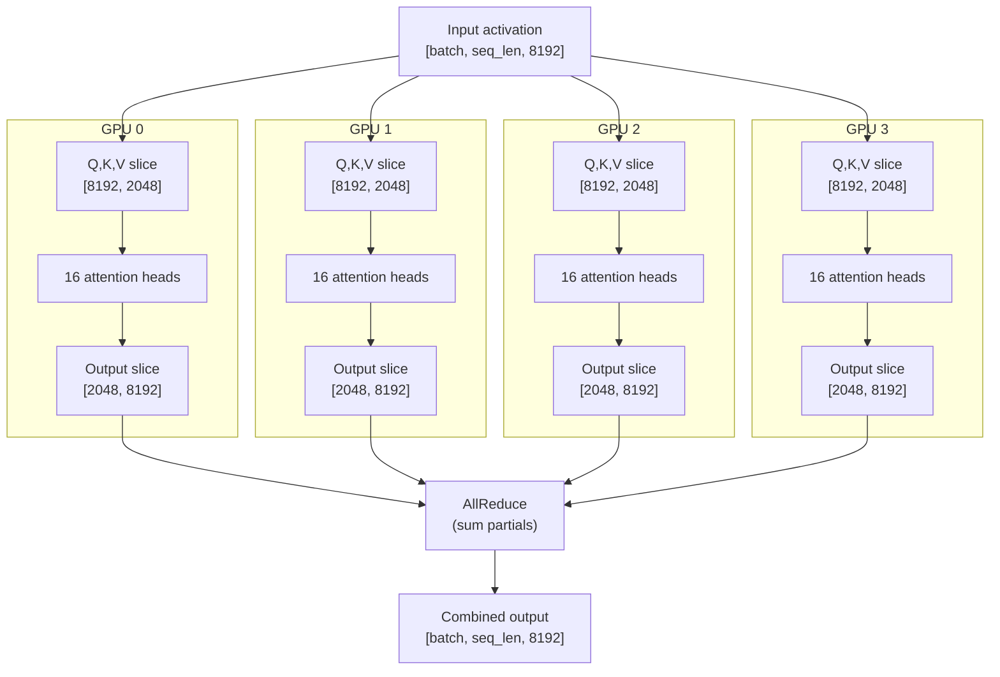
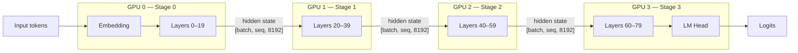
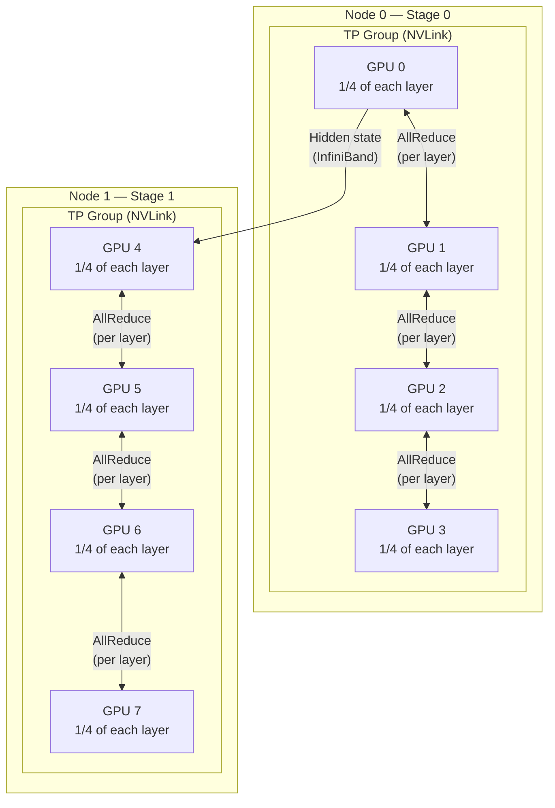

# Chapter 19: Parallelism

## The Model Does Not Fit

You try to load LLaMA-70B. The model has 70 billion parameters. In 16-bit precision, that is 140 GB of weight data --- just the weights, before a single byte of KV cache, activations, or optimizer state. Your GPU has 80 GB of memory.

The model does not fit.

This is not a memory optimization problem. No amount of clever caching or batching fixes the fact that 140 GB does not go into 80 GB. You need more than one GPU. And the moment you need more than one GPU, you face a question that has shaped the design of every large-scale inference engine: *how do you split a transformer?*

There are two answers. Both work. Both have costs. And in production, you usually need both at the same time.

---

## The Splitting Problem

A transformer is a stack of identical layers. Each layer has attention heads and an MLP. Each of those has weight matrices --- large ones. For LLaMA-70B, the hidden dimension is 8,192. The Q, K, V projections are each `[8192, 8192]`. The MLP up-projection is `[8192, 28672]`. These are the matrices you need to split.

But splitting is not free. The moment you put half a matrix on GPU 0 and the other half on GPU 1, the two GPUs need to talk to each other. And that communication has a cost --- bandwidth, latency, synchronization. The art of parallelism is choosing *where* to split so that the communication cost is minimized and the compute stays balanced.

Two strategies. One splits within layers (tensor parallelism). The other splits between layers (pipeline parallelism). Let's build both.

---

## Tensor Parallelism: Splitting Inside the Layer

The idea: take a single weight matrix and divide it across multiple GPUs. Each GPU holds a slice of the matrix, computes on its slice, and then the results are combined.

Consider the Q projection in an attention layer. The weight matrix is `[hidden_dim, hidden_dim]` --- for LLaMA-70B, that is `[8192, 8192]`. With 4 GPUs, each GPU holds a `[8192, 2048]` slice.

This works because the Q projection is followed by a reshape into attention heads. LLaMA-70B has 64 attention heads. With TP=4, each GPU gets 16 heads. The input flows through all 4 GPUs in parallel, each computing its 16 heads of Q, K, and V. Each GPU runs attention independently on its heads --- no communication needed during the attention computation itself.

The catch comes at the output projection. After attention, each GPU has partial results that must be combined. The output projection weight matrix is split by *rows* rather than columns. Each GPU multiplies its local attention output by its row-slice of the output weight, producing a partial sum. Then all GPUs must sum their partial results together.

This "everyone contributes a piece, then we add them all up" operation is called **AllReduce**.


**Figure 19.1** --- Tensor parallelism in an attention layer. The Q, K, V weights are split by columns (each GPU gets a subset of attention heads). The output projection is split by rows. After the output projection, AllReduce sums the partial results across all GPUs.

The MLP works the same way. The up-projection is column-parallel (each GPU gets a slice of the intermediate dimension). The down-projection is row-parallel. Another AllReduce after the down-projection.

That means **two AllReduce operations per transformer layer** --- one after attention, one after the MLP. For a 70B model with 80 layers, that is 160 AllReduce calls per forward pass.

### The Communication Bill

How much data does each AllReduce move? The result tensor has shape `[batch_size, seq_len, hidden_dim]`. In ring-AllReduce (the standard algorithm), each GPU sends and receives `2 * (N-1)/N` times the tensor size, where N is the number of GPUs.

```
function tp_allreduce_volume(batch_size, seq_len, hidden_dim, num_gpus, dtype_bytes):
    tensor_bytes = batch_size * seq_len * hidden_dim * dtype_bytes
    // ring-AllReduce: each GPU sends (N-1)/N of the data, twice (reduce + broadcast)
    per_gpu_bytes = tensor_bytes * 2 * (num_gpus - 1) / num_gpus
    return per_gpu_bytes

// LLaMA-70B, batch=8, seq_len=1 (decode step), TP=4, fp16
volume = tp_allreduce_volume(8, 1, 8192, 4, 2)
// = 8 * 1 * 8192 * 2 = 131,072 bytes per tensor
// * 2 * 3/4 = 196,608 bytes per AllReduce per GPU
// * 2 AllReduces per layer = 393,216 bytes per layer per GPU
// * 80 layers = 31,457,280 bytes ≈ 30 MB per forward pass per GPU
```

Thirty megabytes per forward pass sounds manageable. On NVLink (~600 GB/s bidirectional between GPUs within a node), that takes about 50 microseconds. Tensor parallelism is fast --- *if* you have fast interconnect.

On PCIe (~64 GB/s), that same transfer takes 470 microseconds. Per layer. Per forward pass. The communication overhead dominates the compute. This is why tensor parallelism demands NVLink or equivalent --- PCIe simply cannot keep up.

---

## Pipeline Parallelism: Splitting Between Layers

The second strategy takes the opposite approach. Instead of splitting every layer across GPUs, assign entire layers to different GPUs.

LLaMA-70B has 80 transformer layers. With 4 GPUs:

- **Stage 0** (GPU 0): Embedding + layers 0--19
- **Stage 1** (GPU 1): Layers 20--39
- **Stage 2** (GPU 2): Layers 40--59
- **Stage 3** (GPU 3): Layers 60--79 + LM head

Each stage processes its layers, then passes the hidden state to the next stage. The hidden state is one tensor: `[batch_size, seq_len, hidden_dim]`. No AllReduce, no partial sums --- just a point-to-point send from one GPU to the next.


**Figure 19.2** --- Pipeline parallelism. Each GPU owns a contiguous group of layers. Hidden states flow between stages as point-to-point transfers. Communication happens only at stage boundaries --- three transfers total for four stages, versus 160 AllReduces for TP=4.

The bandwidth requirement is dramatically lower. Each stage boundary transfers one hidden state tensor: `batch_size * seq_len * hidden_dim * dtype_bytes`. For our example: `8 * 1 * 8192 * 2 = 131 KB`. Three boundaries, three transfers: under 400 KB per forward pass. This works fine over InfiniBand (~200 GB/s between nodes) or even PCIe.

But pipeline parallelism has a different problem. A much bigger one.

---

## The Pipeline Bubble

Watch what happens when a single batch flows through a 4-stage pipeline:

```
Time step:    1         2         3         4
Stage 0:     Batch 1    ·         ·         ·
Stage 1:      ·        Batch 1    ·         ·
Stage 2:      ·         ·        Batch 1    ·
Stage 3:      ·         ·         ·        Batch 1

·  = idle
```

At any given moment, **only one stage is working**. Stage 0 processes batch 1 and passes it to Stage 1. Then Stage 0 has nothing to do. Stage 1 passes to Stage 2. Now Stages 0 and 1 are idle. By the time Stage 3 finishes, the pipeline has spent 12 out of 16 slot-timesteps idle.

**Utilization: 25%.** One divided by the number of stages. This is the **pipeline bubble** --- the startup and drain cost of filling and emptying the pipeline.

```mermaid
gantt
    title Pipeline Bubble — 1 Batch, 4 Stages
    dateFormat X
    axisFormat %s

    section Stage 0
    Batch 1           :active, 0, 1
    Idle              :crit, 1, 4

    section Stage 1
    Idle              :crit, 0, 1
    Batch 1           :active, 1, 2
    Idle              :crit, 2, 4

    section Stage 2
    Idle              :crit, 0, 2
    Batch 1           :active, 2, 3
    Idle              :crit, 3, 4

    section Stage 3
    Idle              :crit, 0, 3
    Batch 1           :active, 3, 4
```


**Figure 19.3** --- The pipeline bubble with a single batch. Each stage processes one batch and then sits idle. With 4 stages, utilization is 1/4 = 25%. Three-quarters of the GPU time is wasted.

This is not a theoretical concern. Seventy-five percent idle time is catastrophic. You have four GPUs, and you are getting the throughput of one. Pipeline parallelism with a single batch is almost never worth doing.

---

## Filling the Bubble

The fix is exactly what you would expect: send more batches. While Stage 1 is processing Batch 1, Stage 0 can start Batch 2. While Stage 2 processes Batch 1 and Stage 1 processes Batch 2, Stage 0 starts Batch 3. The pipeline fills up. Every stage stays busy.

This is **microbatching** --- splitting the work into multiple smaller batches that can overlap in the pipeline.

```
Time step:    1         2         3         4         5         6         7
Stage 0:     B1        B2        B3        B4         ·         ·         ·
Stage 1:      ·        B1        B2        B3        B4         ·         ·
Stage 2:      ·         ·        B1        B2        B3        B4         ·
Stage 3:      ·         ·         ·        B1        B2        B3        B4

·  = idle
```

With 4 batches and 4 stages, the pipeline takes 7 timesteps. The total work is 16 batch-stage units. The idle slots are 6 (the triangle at the start and end). Utilization: `16 / (4 * 7)` = 57%.

With 8 batches:

```
Time step:    1    2    3    4    5    6    7    8    9   10   11
Stage 0:     B1   B2   B3   B4   B5   B6   B7   B8    ·    ·    ·
Stage 1:      ·   B1   B2   B3   B4   B5   B6   B7   B8    ·    ·
Stage 2:      ·    ·   B1   B2   B3   B4   B5   B6   B7   B8    ·
Stage 3:      ·    ·    ·   B1   B2   B3   B4   B5   B6   B7   B8

Utilization: 32 / (4 * 11) = 72.7%
```

The pattern is clear. More microbatches means higher utilization. The formula:

```
function pp_utilization(num_stages, num_microbatches):
    total_timesteps = num_stages + num_microbatches - 1
    useful_work = num_stages * num_microbatches
    total_slots = num_stages * total_timesteps
    // the bubble is the startup + drain triangle at the edges
    return useful_work / total_slots

// Examples:
pp_utilization(4, 1)   // = 4 / (4 * 4)   = 0.25    = 25%
pp_utilization(4, 4)   // = 16 / (4 * 7)  = 0.571   = 57%
pp_utilization(4, 8)   // = 32 / (4 * 11) = 0.727   = 73%
pp_utilization(4, 16)  // = 64 / (4 * 19) = 0.842   = 84%
pp_utilization(4, 32)  // = 128 / (4 * 35) = 0.914  = 91%
pp_utilization(4, 64)  // = 256 / (4 * 67) = 0.955  = 96%
```

The utilization converges toward `num_microbatches / (num_stages + num_microbatches - 1)`. As the number of microbatches grows large relative to the number of stages, the bubble overhead vanishes.

```mermaid
gantt
    title Microbatching — 4 Batches, 4 Stages
    dateFormat X
    axisFormat %s

    section Stage 0
    B1 :active, 0, 1
    B2 :active, 1, 2
    B3 :active, 2, 3
    B4 :active, 3, 4
    Idle :crit, 4, 7

    section Stage 1
    Idle :crit, 0, 1
    B1 :active, 1, 2
    B2 :active, 2, 3
    B3 :active, 3, 4
    B4 :active, 4, 5
    Idle :crit, 5, 7

    section Stage 2
    Idle :crit, 0, 2
    B1 :active, 2, 3
    B2 :active, 3, 4
    B3 :active, 4, 5
    B4 :active, 5, 6
    Idle :crit, 6, 7

    section Stage 3
    Idle :crit, 0, 3
    B1 :active, 3, 4
    B2 :active, 4, 5
    B3 :active, 5, 6
    B4 :active, 6, 7
```


**Figure 19.4** --- Microbatching fills the pipeline. With 4 batches and 4 stages, utilization rises from 25% to 57%. The idle triangles (startup and drain) shrink as more microbatches are added. With 32+ microbatches, utilization exceeds 90%.

In practice, continuous batching (Chapter 11) naturally produces a stream of microbatches. The scheduler feeds the pipeline continuously. The bubble is a concern at startup and shutdown, not during steady-state serving.

---

## Putting Them Together: TP + PP

Real deployments rarely use one strategy alone. Tensor parallelism is fast but requires expensive interconnect. Pipeline parallelism is bandwidth-efficient but wastes time in the bubble. The solution: use both, each where it excels.

The standard pattern for multi-node deployments:

- **Tensor parallelism within a node** --- GPUs connected by NVLink (600 GB/s). Fast enough for per-layer AllReduce.
- **Pipeline parallelism across nodes** --- Nodes connected by InfiniBand (200--400 GB/s). Only passes hidden states between stages.

Consider LLaMA-70B on 2 nodes, each with 4 GPUs:

```
Node 0 (GPUs 0-3): Stage 0 — Layers 0-39, TP=4
Node 1 (GPUs 4-7): Stage 1 — Layers 40-79, TP=4
```

Within each node, the 4 GPUs share each layer's weights via tensor parallelism. Each GPU holds 1/4 of each weight matrix in its stage. Between nodes, hidden states flow via pipeline parallelism --- one transfer at the stage boundary.


**Figure 19.5** --- Combined TP+PP for LLaMA-70B on 8 GPUs across 2 nodes. Within each node, 4 GPUs share layer weights via tensor parallelism with NVLink AllReduce. Between nodes, hidden states flow via pipeline parallelism over InfiniBand. This matches communication patterns to interconnect bandwidth.

Memory per GPU: 140 GB of weights / 8 GPUs = 17.5 GB per GPU. On 80 GB A100s, that leaves 62.5 GB per GPU for KV cache, activations, and overhead. Plenty of room.

---

## The Decision Table

When should you use which strategy? The answer depends on model size, GPU count, and interconnect bandwidth.

| Scenario | Strategy | Why |
|----------|----------|-----|
| Model fits on 1 GPU | No parallelism | Communication overhead is pure waste |
| Model fits on 1 node (2--8 GPUs) | TP only | NVLink is fast enough; no pipeline bubble |
| Model needs 2+ nodes | TP within node + PP across | Match bandwidth to communication pattern |
| Very deep model, slow interconnect | PP only | Minimize communication volume |
| Very wide model (huge hidden dim) | TP first | The weight matrices are the bottleneck |

A rule of thumb: **increase TP until you saturate your interconnect bandwidth, then add PP stages for additional scale.**

For LLaMA-70B specifically:

| Config | GPUs | Memory per GPU | Notes |
|--------|------|---------------|-------|
| TP=2 | 2 | 70 GB | Tight on 80 GB A100 |
| TP=4 | 4 | 35 GB | Comfortable, single node |
| TP=4, PP=2 | 8 | 17.5 GB | Two nodes, high throughput |
| TP=8 | 8 | 17.5 GB | Single node with 8-way NVLink |
| TP=8, PP=2 | 16 | 8.75 GB | Maximum throughput |

---

## A Timeline Calculator

Here is a function that visualizes how microbatches flow through a pipeline. It prints a grid showing which stage processes which batch at each timestep.

```
function pp_timeline(num_stages, num_microbatches):
    total_time = num_stages + num_microbatches - 1

    // build the grid: grid[stage][time] = batch number or "·"
    grid = empty 2D array [num_stages][total_time]

    for batch in 0..num_microbatches:
        for stage in 0..num_stages:
            t = batch + stage            // each batch enters the next stage one timestep later
            grid[stage][t] = batch + 1   // 1-indexed batch label

    // count useful vs total slots
    useful = num_stages * num_microbatches
    total = num_stages * total_time
    bubble = total - useful              // the idle slots in the startup/drain triangles
    utilization = useful / total

    print grid
    print "Bubble: {bubble} idle slots out of {total} ({utilization:.1%} utilization)"

// Example: pp_timeline(4, 6)
//
// Time:    1    2    3    4    5    6    7    8    9
// Stage 0: B1   B2   B3   B4   B5   B6    ·    ·    ·
// Stage 1:  ·   B1   B2   B3   B4   B5   B6    ·    ·
// Stage 2:  ·    ·   B1   B2   B3   B4   B5   B6    ·
// Stage 3:  ·    ·    ·   B1   B2   B3   B4   B5   B6
//
// Bubble: 12 idle slots out of 36 (66.7% utilization)
```

---

## The Spec

All implementation details for this chapter live in `spec/ch19/`:

| Artifact | Path | What it contains |
|----------|------|-----------------|
| Interface spec | `spec/ch19/interface-spec.md` | TP weight splitting, AllReduce interface, PP stage assignment, communication patterns |
| Component diagram | `spec/ch19/component-diagram.md` | TP group layout, PP stage diagram, combined TP+PP topology |
| Sequence diagram | `spec/ch19/sequence-diagram.md` | Forward pass through TP layers, microbatch flow through PP stages |
| Expected output | `spec/ch19/expected-output.txt` | Demo output for TP communication calculator, PP utilization calculator, timeline visualization |
| Prompt template | `spec/ch19/prompt-template.md` | Copy-paste prompt for LLM-assisted implementation |
| Validation tests | `spec/ch19/validation/` | Automated checks for correctness |

To verify your implementation:

```
pytest spec/ch19/validation/
```

### Quick Start

1. Read `spec/ch19/interface-spec.md` --- the TP and PP interfaces
2. Implement the AllReduce volume calculator and PP utilization calculator
3. Build the timeline visualization
4. Validate: `pytest spec/ch19/validation/`

---

## Try It Yourself

**Exercise 1: AllReduce Volume for LLaMA-70B.**
Calculate the AllReduce data volume per forward pass for LLaMA-70B with TP=8. Hidden dimension is 8,192, 80 layers, fp16 (2 bytes per element). Assume batch_size=1, seq_len=1 (a single decode step). How much data crosses the NVLink bus per layer? Per forward pass? Now increase batch_size to 32 --- how does the volume change? At what batch size does communication time exceed 10% of a 1ms-per-layer compute time on NVLink?

**Exercise 2: Pipeline Utilization.**
With 4 pipeline stages and 1 microbatch, utilization is 25%. How many microbatches do you need to reach 90% utilization? Use the formula: `utilization = M / (S + M - 1)` where M is microbatches and S is stages. Solve for M. Then verify with `pp_utilization(4, M)`.

**Exercise 3: Design a 16-GPU Configuration.**
You have 16 GPUs across 2 nodes (8 per node, NVLink within, InfiniBand between). LLaMA-70B needs 140 GB of weights. Design the TP+PP configuration. Consider: (a) TP=8, PP=2 --- each node is one PP stage, (b) TP=4, PP=4 --- four stages with 4-way TP each, (c) TP=16, PP=1 --- all GPUs in one TP group (requires cross-node AllReduce). Which configuration would you choose and why? Calculate memory per GPU and communication patterns for each option.

---

## You Built an Inference Engine

Look at what you have.

Chapter 5 brought weight tensors to life --- embedding, LayerNorm, MLP, the first forward pass. Chapter 6 added attention, the mechanism that lets tokens see each other. Chapters 7 and 8 wired it all into a working model that generates real text. Chapters 9 and 10 solved the memory problem with PagedAttention --- blocks instead of contiguous buffers. Chapter 11 introduced continuous batching so the GPU never sits idle. Chapter 12 built the scheduler. Chapter 13 assembled the engine loop. Chapter 14 gave the model a creative voice with sampling strategies.

And then Part IV. An API server (Chapter 15). Prefix caching to skip redundant computation (Chapter 16). Speculative decoding to beat the memory bandwidth wall (Chapter 17). Structured output to make the model follow a schema (Chapter 18). And now parallelism --- the final piece, letting one model span an entire datacenter.

That is vLLM. Not the code --- the ideas. PagedAttention, continuous batching, prefix caching, speculative decoding, tensor and pipeline parallelism. These are the ideas that make large-scale LLM inference possible. You did not just read about them. You built them, one chapter at a time, from first principles.

Next chapter: where the field is going, and where your engine can go next.

---

## References

### Tensor Parallelism

1. **"Megatron-LM: Training Multi-Billion Parameter Language Models Using Model Parallelism"** — Shoeybi, Patwary, Puri, Micikevicius, Catanzaro (2019). The paper that introduced the column/row partitioning strategy for tensor parallelism in Transformers. Our AllReduce-based attention and MLP splitting follows their approach directly. [arxiv.org/abs/1909.08053](https://arxiv.org/abs/1909.08053)

### Pipeline Parallelism

2. **"GPipe: Efficient Training of Giant Neural Networks using Pipeline Parallelism"** — Huang, Cheng, Bapna, Firat, Chen, Chen, Lee, Ngiam, Le, Wu, Chen (2019). Introduced microbatching to reduce the pipeline bubble. The bubble analysis and microbatch scheduling in this chapter follow GPipe's approach. [arxiv.org/abs/1811.06965](https://arxiv.org/abs/1811.06965)

### Combined Parallelism Strategies

3. **"DeepSeek-V3 Technical Report"** — DeepSeek (2024). A production example of combining TP, PP, and expert parallelism (for MoE models) at massive scale. Demonstrates the real-world tradeoffs of choosing TP and PP dimensions based on interconnect topology. [arxiv.org/abs/2412.19437](https://arxiv.org/abs/2412.19437)
