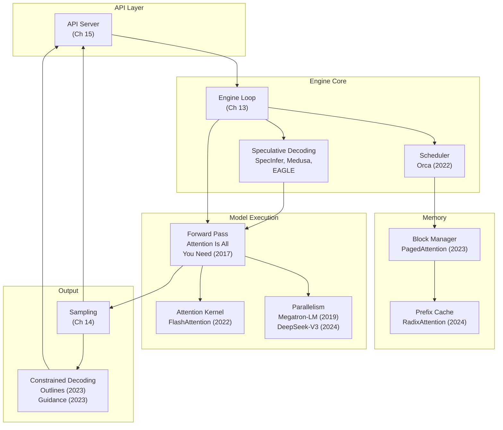

# Chapter 20: Where to Go From Here

---

## You Built the Thing

Nineteen chapters ago, you stared at four integers.

```
[2061, 318, 9552, 30]
```

"What is AI?" --- carved into token IDs by a tokenizer you had not yet built, fed into a model you had not yet loaded, processed by an engine that did not exist. The entire system was a black box. You knew it turned text into text. You did not know how.

Now you do.

You loaded 148 weight tensors from a GPT-2 checkpoint and verified every name and shape. You built embedding lookups, LayerNorm, MLPs, and the causal self-attention mechanism that lets each token look back at every token before it. You assembled those pieces into a full forward pass, watched `[2061, 318, 9552, 30]` enter as four bare integers and emerge as 50,257 logit scores, and sampled the next token.

Then you broke it.

You measured the KV cache: 3.1 GB for a single LLaMA-7B sequence at 2,048 tokens. You watched memory fragment as requests arrived and departed at different times. You solved it the way an operating system solves it --- paging. Virtual blocks mapped to physical blocks, a block table indirecting every attention lookup, memory utilization jumping from 20% to 96%.

You built a scheduler that juggles dozens of concurrent requests, deciding on every iteration which sequences run, which wait, and which get preempted when memory runs out. You wired it into a continuous batching loop that never idles --- new requests join mid-batch, finished requests leave without stalling anyone else.

You gave the model taste. Temperature, top-k, top-p, repetition penalty --- four knobs that turn a deterministic parrot into a creative writer, a focused summarizer, or a diverse brainstormer. Same weights, different sampling parameters, radically different output.

You put a front door on it. An HTTP server that speaks the OpenAI protocol, streaming tokens back through server-sent events so every existing client library works without modification.

You made it share. Automatic prefix caching with a radix tree, so a thousand requests starting with the same system prompt reuse one copy of those cached keys and values instead of recomputing them a thousand times.

You made it speculate. A small draft model guessing five tokens ahead, the target model verifying them in a single forward pass, throughput nearly doubling without changing a single weight.

You taught it to follow rules. Finite state machines tracking which tokens are legal at every position in a JSON schema, masking the logits so the model literally cannot produce malformed output.

You split it across devices. Tensor parallelism sharding matrix multiplications across GPUs, pipeline parallelism breaking the model into stages, expert parallelism routing MoE tokens to specialized subnetworks.

From four integers to a distributed, speculative, grammar-constrained, continuously-batched inference server. That is what you built.

---

## The Papers Behind the Engine

Every component you built has a paper behind it. Some you implemented faithfully. Others you simplified. All of them are worth reading now --- because now you have the context to understand them.

### Attention and Compute

**Attention Is All You Need** (Vaswani et al., 2017). The paper that started everything. Multi-head self-attention, positional encoding, the encoder-decoder transformer. Chapters 5 and 6 implemented the decoder half --- the part that matters for generative inference. The key insight: attention replaces recurrence entirely, allowing parallel computation over the full sequence during prefill.

**FlashAttention: Fast and Memory-Efficient Exact Attention with IO-Awareness** (Dao et al., 2022). Chapter 6 showed you the standard attention algorithm: compute QK^T, apply softmax, multiply by V. FlashAttention computes the same result but tiles the computation to minimize reads from GPU high-bandwidth memory. Same math, 2--4x faster, because the bottleneck was never the arithmetic --- it was the memory traffic.

**FlashAttention-2** (Dao, 2023). Better work partitioning across thread blocks and within each attention head. If FlashAttention made attention IO-aware, FlashAttention-2 made it parallelism-aware.

### Memory Management

**Efficient Memory Management for Large Language Model Serving with PagedAttention** (Kwon et al., 2023). The vLLM paper. Chapters 9 and 10 are essentially a from-scratch implementation of this work. The key insight: treat the KV cache like virtual memory. Fixed-size blocks, a page table, allocate on demand, free on completion. Memory utilization goes from "waste half of a $30,000 GPU" to "waste almost nothing."

### Scheduling and Batching

**Orca: A Distributed Serving System for Transformer-Based Generative Models** (Yu et al., 2022). The paper that made continuous batching mainstream. Chapters 11 and 12 implemented its core idea: schedule at the iteration level, not the request level. A new request does not wait for the entire batch to finish --- it joins on the next iteration. Simple insight, massive throughput improvement.

### Speculative Methods

**SpecInfer: Accelerating Generative Large Language Model Serving with Tree-based Speculative Inference and Verification** (Miao et al., 2023). Chapter 17 implemented the linear version of speculative decoding. SpecInfer extends it to trees --- the draft model proposes multiple continuation paths, and the target model verifies them all in one pass. More candidates, higher acceptance rates.

**Medusa: Simple LLM Inference Acceleration Framework with Multiple Decoding Heads** (Cai et al., 2024). What if you did not need a separate draft model? Medusa adds lightweight prediction heads to the target model itself. Each head predicts a future token position. No draft model to load, no draft model to synchronize. Chapter 17's architecture supports this as a variant.

**EAGLE: Speculative Sampling Requires Rethinking Feature Uncertainty** (Li et al., 2024). Instead of drafting at the token level, EAGLE drafts at the feature level --- using the target model's own hidden states as input to a lightweight predictor. Highest acceptance rates of any speculative method, because the draft has access to the target model's internal representations, not just its vocabulary.

### Prefix and Cache Optimization

**SGLang: Efficient Execution of Structured Language Model Programs** (Zheng et al., 2024). Chapter 16's radix tree for automatic prefix sharing comes from SGLang's RadixAttention. The insight: when many requests share a common prefix (system prompt, few-shot examples), store the KV cache once and let everyone share it. A radix tree makes lookup and eviction natural.

### Structured Generation

**Efficient Guided Generation for Large Language Models** (Willard & Louf, 2023). The Outlines paper. Chapter 18 implemented its core idea: precompute a finite state machine from a regular expression or grammar, then at each decode step, mask the logits to only allow tokens that keep the output on a valid path. Constrained generation without modifying the model.

**Guidance** (Microsoft, 2023). Token-level grammar enforcement using context-free grammars. Where Outlines handles regular expressions, Guidance handles richer grammars --- nested JSON, recursive structures, programming languages. Chapter 18's FSM approach is the foundation; grammars are the extension.

### Scaling

**Megatron-LM: Training Multi-Billion Parameter Language Models Using Model Parallelism** (Shoeybi et al., 2019). Written for training, but the tensor and pipeline parallelism strategies transfer directly to inference. Chapter 19 used Megatron's column/row parallel linear layer split --- the same partitioning that lets you shard a 70B model across eight GPUs.

**DeepSeek-V3 Technical Report** (DeepSeek, 2024). Mixture-of-Experts at scale, with expert parallelism and load balancing. Chapter 19's expert parallelism section draws from this work. The challenge: route tokens to the right experts on the right devices without creating communication bottlenecks.

---

## The Map

Here is where each paper lands on the engine architecture from Chapter 2:


**Figure 20.1** --- Papers mapped to engine components. Every optimization in the literature targets one of these boxes.

---

## Open Problems

The papers above are solved problems. These are not.

### Disaggregated Serving

Prefill is compute-bound: the GPU crunches through the entire prompt in one massive forward pass. Decode is memory-bound: each step generates one token but must read the entire KV cache. These two phases want different hardware. Disaggregated serving splits them --- prefill runs on compute-optimized nodes, decode runs on memory-optimized nodes, and the KV cache transfers between them. Splitwise and DistServe are early systems exploring this split. The scheduler from Chapter 12 would need to become a distributed coordinator.

### KV Cache Compression

Chapter 1's memory math assumed FP16 keys and values. What if you quantized them to FP8 or INT4? The KV cache shrinks 2--4x with minimal quality loss, letting you serve longer sequences or more concurrent requests on the same hardware. The challenge is doing the quantization and dequantization fast enough that it does not become a new bottleneck --- and knowing when quality loss crosses the line from "minimal" to "unacceptable."

### Long-Context Serving

Remember the KV cache arithmetic from Chapter 1? Scale it to a million tokens. A single LLaMA-7B sequence at 1M tokens would need roughly 1.5 TB of KV cache. That is not a typo. Hierarchical attention, sliding windows, sparse attention patterns, and hybrid architectures (some layers attend globally, some locally) are all active research directions. The block manager from Chapter 10 would need to become hierarchical too.

### Multi-Modal Inference

Images, audio, and video interleaved with text. A single request might contain a 1024x1024 image (encoded as hundreds of visual tokens), a paragraph of text, and another image. The prefill characteristics are wildly different for each modality --- visual tokens are dense and uniform, text tokens are sparse and variable. The scheduler, memory manager, and forward pass all need to handle heterogeneous inputs.

### Heterogeneous Hardware

Mix GPU types within a cluster. Offload cold KV cache blocks to CPU memory or NVMe. Run prefill on H100s and decode on L40s. Deploy on TPUs, AWS Trainium, or custom accelerators. The trait-based abstractions from this book --- `ComputeBackend`, `DeviceMemory`, `AttentionKernel` --- are not academic exercises. They are the interface boundary that makes heterogeneous deployment possible without rewriting the engine.

### Inference-Time Compute Scaling

The newest frontier. Instead of making the model bigger, spend more compute at inference time. Chain-of-thought reasoning, self-verification, tree search over multiple candidate responses, iterative refinement. The model calls itself repeatedly, branching and backtracking. The serving engine is no longer a simple pipeline --- it is a runtime for inference programs. The engine loop from Chapter 13, designed for linear autoregressive decoding, would need to support branching execution graphs.

---

## Now What

Here is the thing nobody tells you about learning a system by building it: the understanding compounds.

A new paper drops on arxiv. "Disaggregated Prefill-Decode Serving with Asymmetric KV Cache Transfer." Before this book, that title is word soup. Now you read it and you know exactly what they mean. Prefill is compute-bound (Chapter 1). Decode is memory-bound (Chapter 1). The KV cache is the thing being transferred (Chapter 9). "Asymmetric" means different hardware for each phase. You know where it fits in the architecture. You know which component it modifies. You know what the baseline comparison should be.

That is the difference between reading about a system and building it.

Every new inference engine --- every new optimization, every new serving framework --- is a rearrangement of the pieces you already understand. Schedulers, block managers, attention kernels, sampling pipelines, parallelism strategies. The vocabulary is fixed. The design space is combinatorial. And you have built one working point in that space from scratch.

The next paper is not a mystery. It is a diff against your implementation.

Go read it.

---

## References

All papers referenced throughout this chapter, collected here for convenience.

### Foundational Architecture

1. **"Attention Is All You Need"** — Vaswani, Shazeer, Parmar, Uszkoreit, Jones, Gomez, Kaiser, Polosukhin (2017). The Transformer. [arxiv.org/abs/1706.03762](https://arxiv.org/abs/1706.03762)

### Attention Optimization

2. **"FlashAttention: Fast and Memory-Efficient Exact Attention with IO-Awareness"** — Dao, Fu, Ermon, Rudra, Ré (2022). IO-aware attention that avoids materializing the full attention matrix. [arxiv.org/abs/2205.14135](https://arxiv.org/abs/2205.14135)

3. **"FlashAttention-2: Faster Attention with Better Parallelism and Work Partitioning"** — Dao (2023). Improved GPU occupancy and work partitioning. [arxiv.org/abs/2307.08691](https://arxiv.org/abs/2307.08691)

### Memory Management and Serving

4. **"Efficient Memory Management for Large Language Model Serving with PagedAttention"** — Kwon, Li, Zhuang, Sheng, Zheng, Yu, Gonzalez, Zhang, Stoica (2023). PagedAttention and vLLM. [arxiv.org/abs/2309.06180](https://arxiv.org/abs/2309.06180)

5. **"Orca: A Distributed Serving System for Transformer-Based Generative Models"** — Yu, Jeong, Shin, Park (2022). Iteration-level scheduling (continuous batching). [usenix.org/system/files/osdi22-yu.pdf](https://www.usenix.org/system/files/osdi22-yu.pdf)

### Speculative Decoding

6. **"SpecInfer: Accelerating Generative Large Language Model Serving with Tree-based Speculative Inference and Verification"** — Miao et al. (2023). Tree-structured speculation. [arxiv.org/abs/2305.09781](https://arxiv.org/abs/2305.09781)

7. **"Medusa: Simple LLM Inference Acceleration Framework with Multiple Decoding Heads"** — Cai et al. (2024). Draft-free speculative decoding with auxiliary heads. [arxiv.org/abs/2401.10774](https://arxiv.org/abs/2401.10774)

8. **"EAGLE: Speculative Sampling Requires Rethinking Feature Uncertainty"** — Li et al. (2024). Feature-level draft prediction for higher acceptance rates. [arxiv.org/abs/2401.15077](https://arxiv.org/abs/2401.15077)

### Structured Generation and Serving Frameworks

9. **"SGLang: Efficient Execution of Structured Language Model Programs"** — Zheng, Yin, Xie, Cheng, Li, Stoica, Gonzalez, Zhang (2024). RadixAttention and structured language model programs. [arxiv.org/abs/2312.07104](https://arxiv.org/abs/2312.07104)

10. **"Efficient Guided Generation for Large Language Models"** — Willard, Louf (2023). FSM-based constrained decoding (Outlines). [arxiv.org/abs/2307.09702](https://arxiv.org/abs/2307.09702)

11. **"Guidance"** — Microsoft (2023). Template-based constrained generation. [github.com/guidance-ai/guidance](https://github.com/guidance-ai/guidance)

### Parallelism

12. **"Megatron-LM: Training Multi-Billion Parameter Language Models Using Model Parallelism"** — Shoeybi, Patwary, Puri, Micikevicius, Catanzaro (2019). Tensor parallelism for Transformers. [arxiv.org/abs/1909.08053](https://arxiv.org/abs/1909.08053)

13. **"DeepSeek-V3 Technical Report"** — DeepSeek (2024). Combined TP, PP, and expert parallelism at scale. [arxiv.org/abs/2412.19437](https://arxiv.org/abs/2412.19437)
