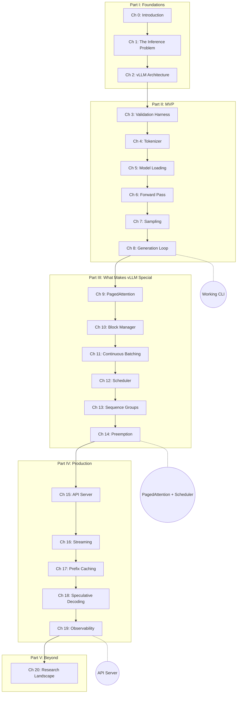

# Preface

## A Blinking Cursor

You open a chat interface. A blinking cursor. You type:

> "What is AI?"

You hit enter. Half a second of silence. Then tokens start streaming back — word by word, fast enough to feel like a conversation. "Artificial intelligence is..."

Behind that experience, something extraordinary is happening. An inference engine is making hundreds of decisions per second. It is managing gigabytes of memory, scheduling work across hardware, choosing which request to advance next, and streaming results back — all while keeping latency low enough that you never notice.

You have just witnessed the most complex data pipeline most developers will never see.

And you are about to build one.

---

## The Black Box

Most developers treat inference engines as black boxes. You send a prompt to an API. Text comes back. The mental model looks like this:

**Figure 0.1** — The inference engine as a black box.

That red box in Figure 0.1? It is doing more work than most web applications do in an hour. Between your prompt and the response, the engine is:

- **Tokenizing** your text into integer IDs
- **Running** dozens of matrix multiplications across transformer layers
- **Managing** a cache of key-value vectors that grows with every generated token
- **Deciding** which of many concurrent requests gets GPU time next
- **Allocating** and freeing memory blocks in real time
- **Sampling** from probability distributions to pick each token
- **Streaming** partial results back before generation is even finished

Every one of these operations interacts with the others. Memory management affects scheduling. Scheduling affects latency. Latency affects how many requests you can batch together. Batching affects throughput. Throughput determines whether you need one GPU or ten.

This is not a simple pipeline. It is a system. And systems reward understanding.

---

## What If You Built One?

What if you built one yourself?

Not a toy. Not a wrapper around someone else's library. A real inference engine that implements the same ideas as [vLLM](https://github.com/vllm-project/vllm) — the most widely deployed open-source LLM serving system. An engine with PagedAttention, continuous batching, a proper scheduler, and streaming responses.

Here is the twist: **this book does not hand you the code.**

Each chapter gives you:

| What You Get | What It Does |
|---|---|
| **Chapter prose** | Explains the concept — why it matters, how it works, what the tradeoffs are |
| **Diagrams** | Component diagrams, sequence diagrams, data flows — the architecture made visual |
| **Interface specs** | The types, methods, and contracts your code must satisfy |
| **Expected output** | What "correct" looks like — exact output to match |
| **Validation tests** | Automated checks (pytest) that verify your implementation |
| **Prompt template** | A ready-to-paste prompt for an LLM to generate a starting point |

You choose the language. You choose the approach. The spec is your blueprint; the implementation is yours.

### Why specs instead of code?

Code ages. APIs change. Dependencies break. But the *architecture* of LLM inference — the KV cache, PagedAttention, continuous batching, the scheduler — those ideas are stable. They will outlast any specific framework.

By working from specs, you:

1. **Understand deeper** — generating code from a spec forces you to grapple with the design, not just copy syntax
2. **Learn transferable ideas** — the concepts work in any language
3. **Use modern tools naturally** — LLMs are excellent at generating code from well-written specs. This book is designed for that workflow

---

## The Roadmap

You will learn and build the engine in five parts, each one layering on the last (Figure 0.2):

**Figure 0.2** — Book roadmap from foundations to production.

**By Chapter 8**, you will have a working inference engine that loads a real model and generates text from a prompt. It will be simple — one request at a time, no paging, greedy decoding — but it will work end to end.

**By Chapter 14**, your engine will have the same core architecture as vLLM: PagedAttention for memory efficiency, continuous batching for throughput, and a scheduler that juggles dozens of concurrent requests.

**By Chapter 19**, it will serve HTTP requests with streaming responses, just like the real thing.

---

## The Running Example

Throughout this book, we use a single prompt as our running example:

> "What is AI?" — token IDs: `[2061, 318, 9552, 30]`

You will see these four tokens everywhere. They will flow through tokenizers, embedding tables, transformer layers, KV caches, block tables, and schedulers. By the end, you will be able to trace the complete journey of these four integers through every component of your engine.

---

## Four Tokens In, Hundreds Out

In the next chapter, we look at what actually happens when an LLM generates text — and discover why it is surprisingly hard to do efficiently. The answer involves a data structure called the KV cache, and it will haunt us for the rest of this book.

Four tokens go in. Hundreds come out. And every single one of them demands reading gigabytes of cached data from GPU memory. The math is alarming. Let's see it.

---

*Next: [Chapter 0 — Setup](ch00-setup.md) (optional) | [Chapter 1 — The LLM Inference Problem](ch01-the-llm-inference-problem.md)*
