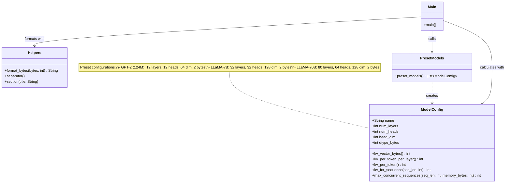
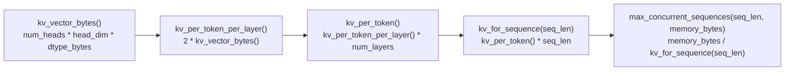

# Chapter 1: Component Diagram

## KV Cache Memory Calculator — Class Structure

## Method Chain (smallest unit to largest)

## Preset Models

| Model | num_layers | num_heads | head_dim | dtype_bytes |
|-------|-----------|-----------|----------|-------------|
| GPT-2 (124M) | 12 | 12 | 64 | 2 |
| LLaMA-7B | 32 | 32 | 128 | 2 |
| LLaMA-70B | 80 | 64 | 128 | 2 |
