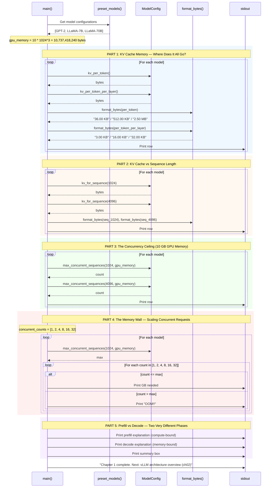

# Chapter 1: Sequence Diagram

## Program Flow

```mermaid
sequenceDiagram
    participant M as main()
    participant P as preset_models()
    participant C as ModelConfig
    participant F as format_bytes()
    participant O as stdout

    M->>P: Get model configurations
    P-->>M: [GPT-2, LLaMA-7B, LLaMA-70B]

    Note over M: gpu_memory = 10 * 1024^3 = 10,737,418,240 bytes

    rect rgb(240, 248, 255)
        Note over M,O: PART 1: KV Cache Memory — Where Does It All Go?
        loop For each model
            M->>C: kv_per_token()
            C-->>M: bytes
            M->>C: kv_per_token_per_layer()
            C-->>M: bytes
            M->>F: format_bytes(per_token)
            F-->>M: "36.00 KB" / "512.00 KB" / "2.50 MB"
            M->>F: format_bytes(per_token_per_layer)
            F-->>M: "3.00 KB" / "16.00 KB" / "32.00 KB"
            M->>O: Print row
        end
    end

    rect rgb(255, 248, 240)
        Note over M,O: PART 2: KV Cache vs Sequence Length
        loop For each model
            M->>C: kv_for_sequence(1024)
            C-->>M: bytes
            M->>C: kv_for_sequence(4096)
            C-->>M: bytes
            M->>F: format_bytes(seq_1024), format_bytes(seq_4096)
            M->>O: Print row
        end
    end

    rect rgb(240, 255, 240)
        Note over M,O: PART 3: The Concurrency Ceiling (10 GB GPU Memory)
        loop For each model
            M->>C: max_concurrent_sequences(1024, gpu_memory)
            C-->>M: count
            M->>C: max_concurrent_sequences(4096, gpu_memory)
            C-->>M: count
            M->>O: Print row
        end
    end

    rect rgb(255, 240, 240)
        Note over M,O: PART 4: The Memory Wall — Scaling Concurrent Requests
        Note over M: concurrent_counts = [1, 2, 4, 8, 16, 32]
        loop For each model
            M->>C: max_concurrent_sequences(1024, gpu_memory)
            C-->>M: max
            loop For each count in [1, 2, 4, 8, 16, 32]
                alt count <= max
                    M->>O: Print GB needed
                else count > max
                    M->>O: Print "OOM!!"
                end
            end
        end
    end

    rect rgb(248, 240, 255)
        Note over M,O: PART 5: Prefill vs Decode — Two Very Different Phases
        M->>O: Print prefill explanation (compute-bound)
        M->>O: Print decode explanation (memory-bound)
        M->>O: Print summary box
    end

    M->>O: "Chapter 1 complete. Next: vLLM architecture overview (ch02)"
```
