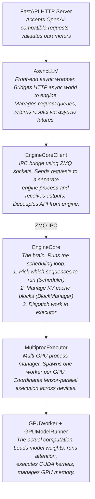
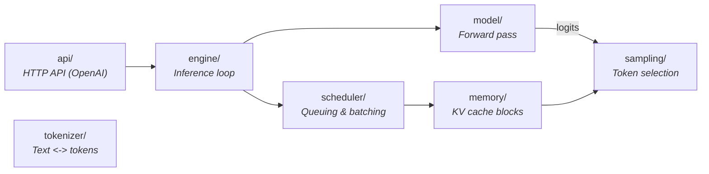
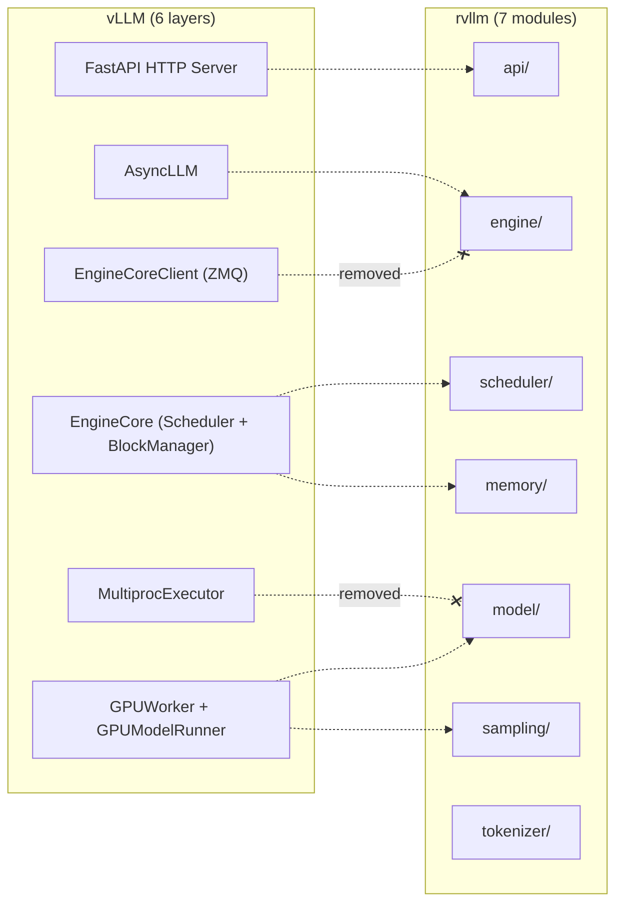

# Chapter 2: Component Diagrams

## vLLM's Six-Layer Architecture

A request passes through six layers in production vLLM. Each layer adds a capability (async handling, IPC, scheduling, multi-GPU, execution):

**Legend:** Blue = API/async layers. Orange = distributed plumbing (removed in rvllm). Green = core logic.

## rvllm's Seven-Module Architecture

rvllm strips away the distributed-systems plumbing and exposes the seven concepts you need to understand LLM inference:

## Mapping: vLLM Layers to rvllm Modules

Two vLLM layers vanish entirely in rvllm:
- **EngineCoreClient (ZMQ IPC)** -- we run in a single process
- **MultiprocExecutor** -- we target a single GPU
