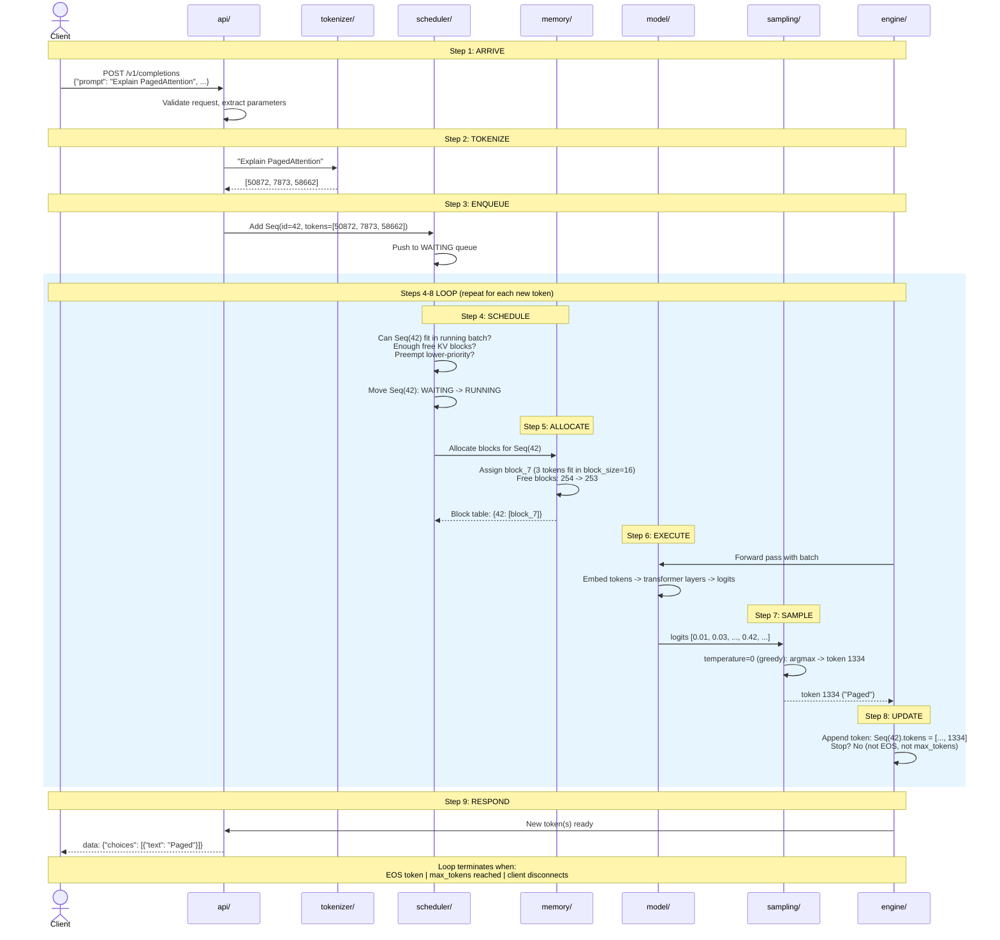

# Chapter 2: Request Lifecycle Sequence Diagram

## The 9-Step Request Lifecycle

A single request -- "Explain PagedAttention" -- traced through rvllm's modules.

## Step Summary

| Step | Name | Module | Action |
|------|------|--------|--------|
| 1 | ARRIVE | api/ | HTTP POST received, request validated |
| 2 | TOKENIZE | tokenizer/ | Text converted to token IDs |
| 3 | ENQUEUE | scheduler/ | Sequence added to WAITING queue |
| 4 | SCHEDULE | scheduler/ | Sequence moved WAITING -> RUNNING |
| 5 | ALLOCATE | memory/ | KV cache blocks assigned |
| 6 | EXECUTE | model/ | Forward pass produces logits |
| 7 | SAMPLE | sampling/ | Next token selected from logits |
| 8 | UPDATE | engine/ | Token appended, stop criteria checked |
| 9 | RESPOND | api/ | Token streamed back to client |

Steps 4-8 repeat for every generated token until EOS, max_tokens, or client disconnect.
