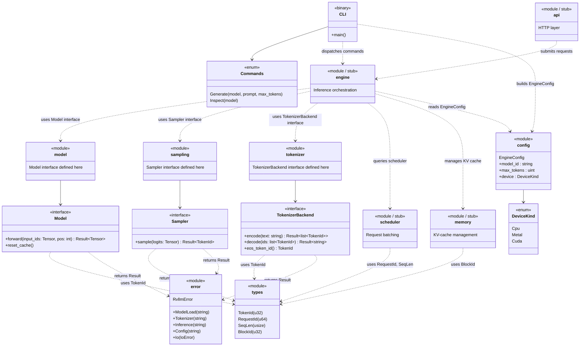

# Chapter 3 -- Component Diagram

## Module Structure and Dependencies

## Reading Guide

The diagram above captures the full module layout at the end of Chapter 3.
Every box marked **stub** contains no business logic -- it exists only to
establish the module boundary and make the project compile.

**Key relationships:**

| Arrow style | Meaning |
|-------------|---------|
| Solid (`-->`) | "owns" or "contains" |
| Dashed (`..>`) | "depends on" or "uses" |

**Newtypes** (`TokenId`, `RequestId`, `SeqLen`, `BlockId`) live in `types` and
are imported by any module that needs them. They wrap a single primitive and
exist to prevent accidental mix-ups at module boundaries.

**Error** is a single enum (`RvllmError`) with one variant per failure domain.
All modules convert their internal errors into this enum so callers have one
type to match on.

**Interfaces** are the primary design tool. `Model`, `Sampler`, and
`TokenizerBackend` define the contracts that concrete implementations will
fill in later chapters. At this stage they have no implementors.
