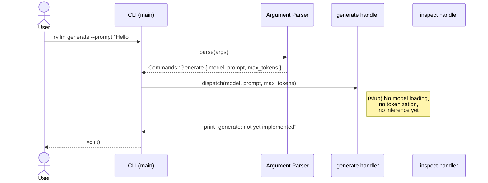
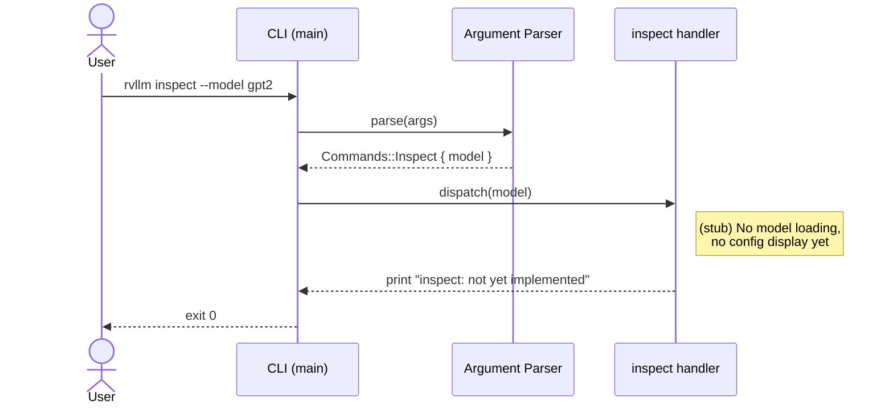
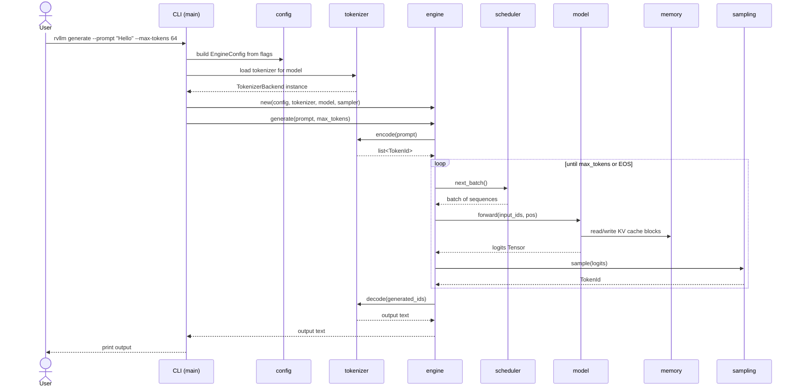
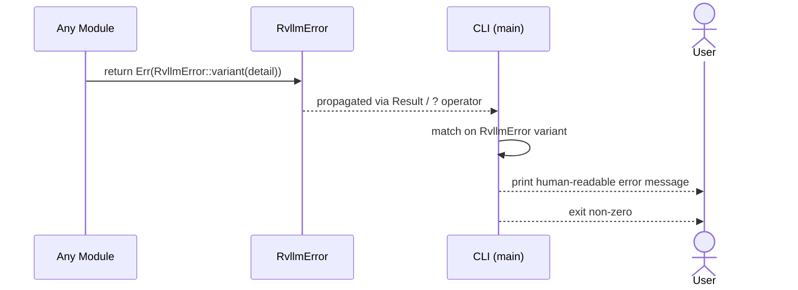

# Chapter 3 -- Sequence Diagrams

## CLI Dispatch Flow

The binary parses command-line arguments, matches on the subcommand, and
dispatches. At this stage every path hits a stub that prints a message and
exits cleanly.

## Future Flow (what the stubs will become)

This diagram shows the full pipeline that later chapters will fill in.
Chapter 3 establishes the module boundaries; the arrows below show where
data will eventually flow.

## Error Propagation

Any module can fail. Errors propagate upward through `Result`, converted
into `RvllmError` variants, until the CLI catches them and prints a
user-facing message.

