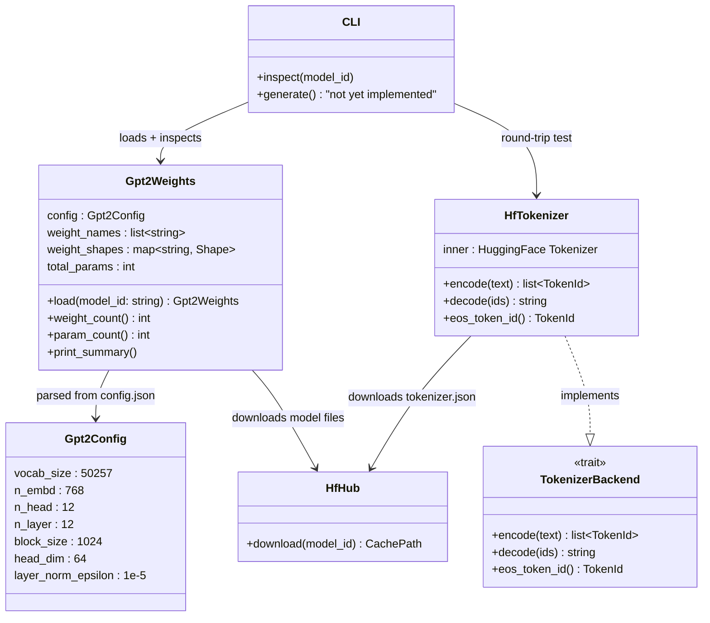

# Chapter 4 -- Component Diagram: Downloading a Brain

## Model Loading Architecture


**Figure 4.1** — Chapter 4 architecture: loading and inspecting only. No layers, no forward pass.

## Weight Structure Map

```
model.safetensors (148 tensors, ~124M params)
├── Embeddings (2 tensors)
│   ├── transformer.wte.weight  [50257, 768]  ← token embedding
│   └── transformer.wpe.weight  [1024, 768]   ← position embedding
│
├── Blocks 0-11 (12 × 12 = 144 tensors)
│   └── transformer.h.{i}
│       ├── ln_1.weight [768]        ← pre-attention LayerNorm
│       ├── ln_1.bias [768]
│       ├── attn.c_attn.weight [768, 2304]  ← QKV (Conv1D!)
│       ├── attn.c_attn.bias [2304]
│       ├── attn.c_proj.weight [768, 768]   ← output proj (Conv1D!)
│       ├── attn.c_proj.bias [768]
│       ├── ln_2.weight [768]        ← pre-MLP LayerNorm
│       ├── ln_2.bias [768]
│       ├── mlp.c_fc.weight [768, 3072]    ← MLP up (Conv1D!)
│       ├── mlp.c_fc.bias [3072]
│       ├── mlp.c_proj.weight [3072, 768]  ← MLP down (Conv1D!)
│       └── mlp.c_proj.bias [768]
│
├── Final LayerNorm (2 tensors)
│   ├── transformer.ln_f.weight [768]
│   └── transformer.ln_f.bias [768]
│
└── LM Head: tied to transformer.wte.weight (no separate tensor)
```
**Figure 4.2** — All 148 weight tensors in GPT-2 124M. Conv1D weights are stored transposed compared to standard linear layers.
