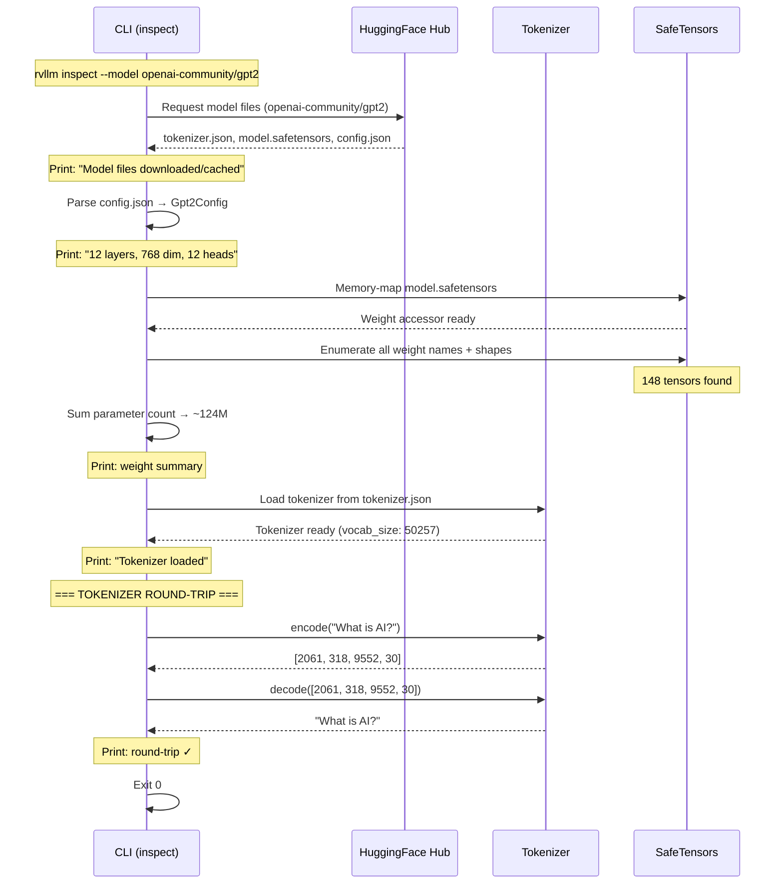
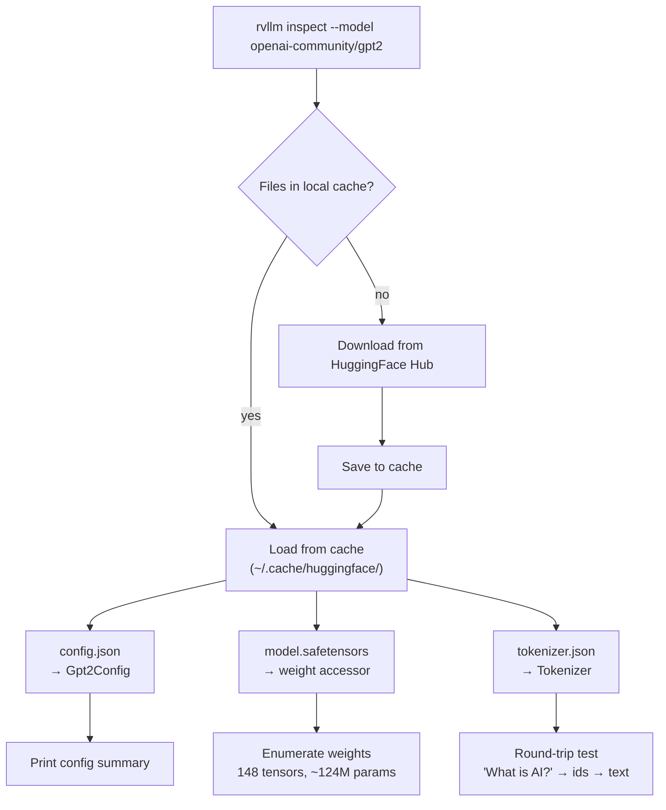

# Chapter 4 -- Sequence Diagram: Downloading a Brain

## Diagram 1: Model Loading and Inspection

**Figure 4.3** — The `inspect` subcommand flow: download, parse config, enumerate weights, test tokenizer.

## Diagram 2: File Download and Caching

**Figure 4.4** — File caching flow. First run downloads; subsequent runs load from cache.
