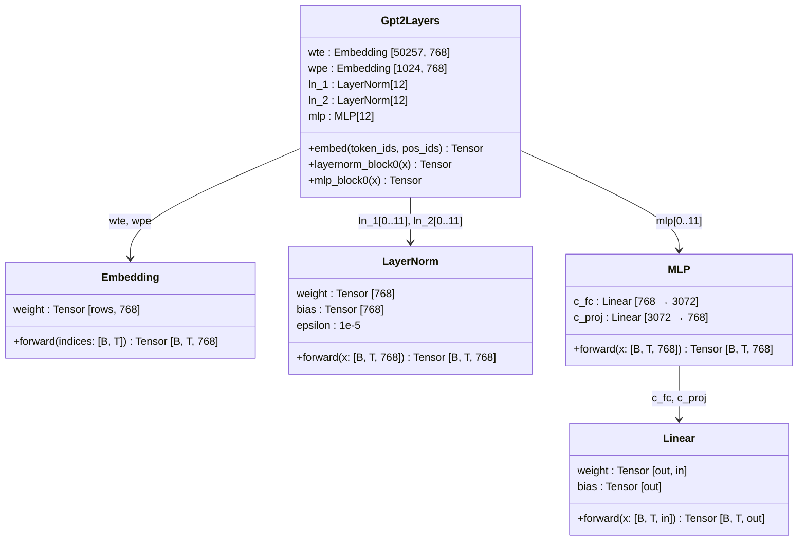
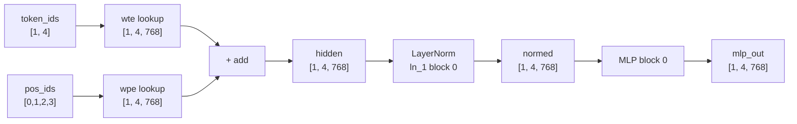
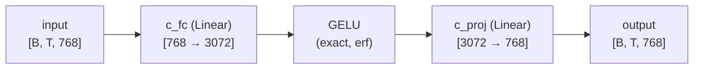

# Chapter 5 -- Component Diagram: The Building Blocks

## Layer Components


**Figure 5.1** — Layer components implemented in this chapter. Attention is deferred to Chapter 6.

## Data Flow: Partial Forward Pass


**Figure 5.2** — The partial forward pass verified in this chapter. Each box prints tensor stats.

## MLP Internal Data Flow


**Figure 5.3** — MLP internal computation. The hidden dimension expands 4x then contracts back.

## Conv1D Transpose on Load

```
On disk (Conv1D format):        After transpose (standard Linear):
┌──────────────────────┐        ┌──────────────────────┐
│  [768, 3072]         │  ───►  │  [3072, 768]         │
│  (in_features first) │        │  (out_features first) │
└──────────────────────┘        └──────────────────────┘

Computation with standard Linear:
  output = input @ weight.T + bias
         = input @ [3072, 768].T + bias
         = input @ [768, 3072] + bias
         = [B, T, 3072]  ✓
```
