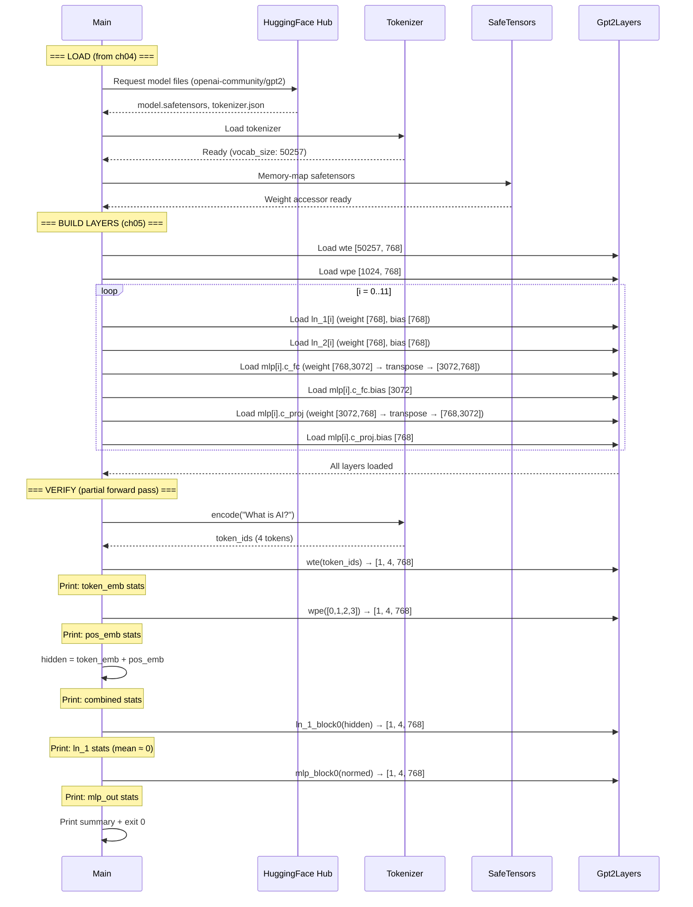
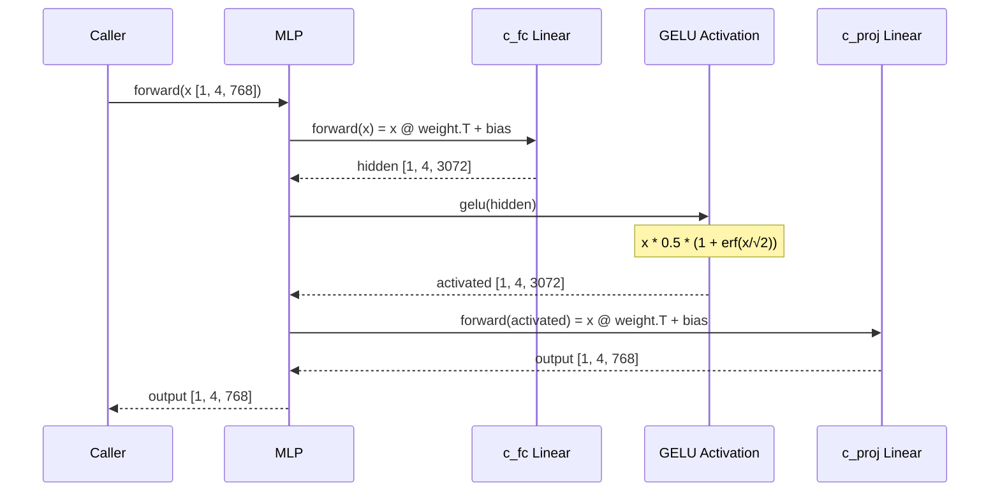

# Chapter 5 -- Sequence Diagram: The Building Blocks

## Diagram 1: Extended Inspect Flow

**Figure 5.4** — The extended `inspect` flow. Chapters 4's loading is followed by layer construction and a verification forward pass.

## Diagram 2: MLP Forward Pass Detail

**Figure 5.5** — MLP computation detail. The hidden dimension expands 4x (768→3072) then contracts back.
