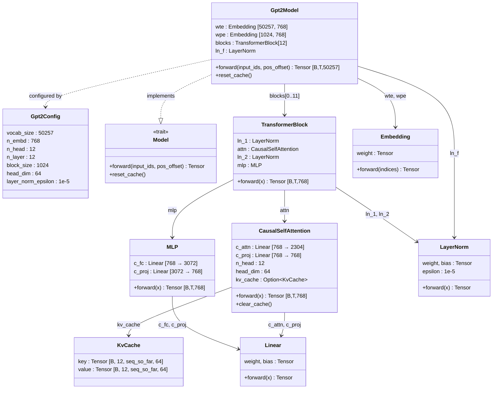
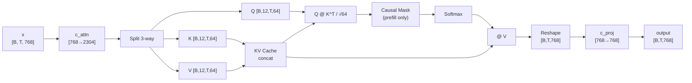
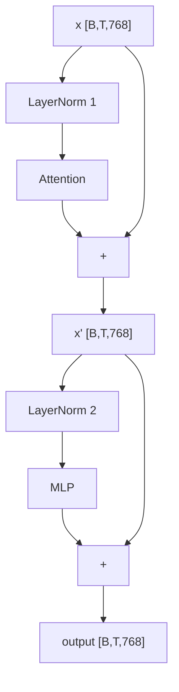

# Chapter 6 -- Component Diagram: Where the Model Learns to Look Back

## Full GPT-2 Architecture

**Figure 6.1** — Complete GPT-2 architecture. New in this chapter: CausalSelfAttention, TransformerBlock, Gpt2Model (implements Model trait).

## Attention Data Flow

**Figure 6.2** — CausalSelfAttention data flow showing QKV split, KV cache, masking, and output projection.

## Pre-Norm Residual Block

**Figure 6.3** — Pre-norm residual pattern. LayerNorm precedes each sublayer; the residual adds the **original** (unnormalized) input.
