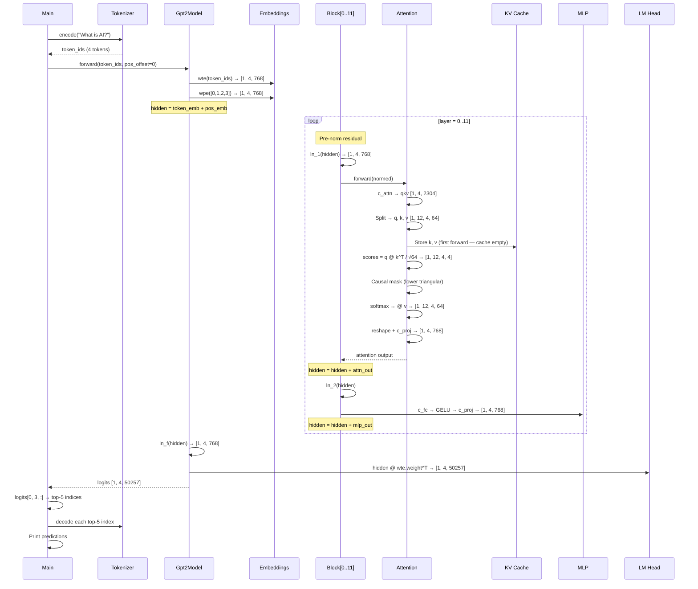
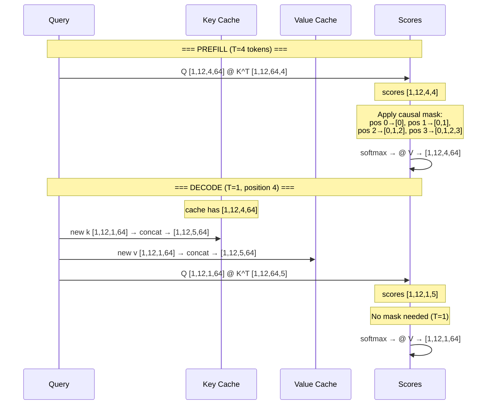

# Chapter 6 -- Sequence Diagram: Where the Model Learns to Look Back

## Diagram 1: Full Forward Pass

**Figure 6.4** — Complete forward pass through all 12 blocks. The KV cache is populated during this first (prefill) pass.

## Diagram 2: Attention Detail — Prefill vs Decode

**Figure 6.5** — Prefill processes all tokens with causal masking; decode processes one token reading from the growing KV cache.
