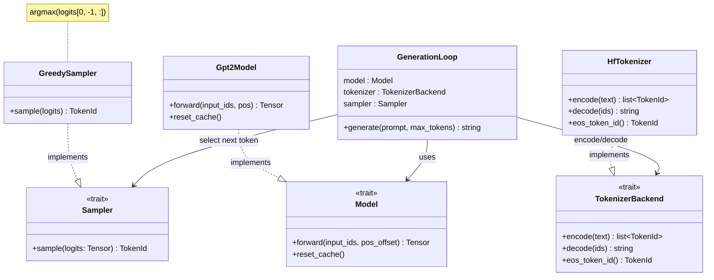
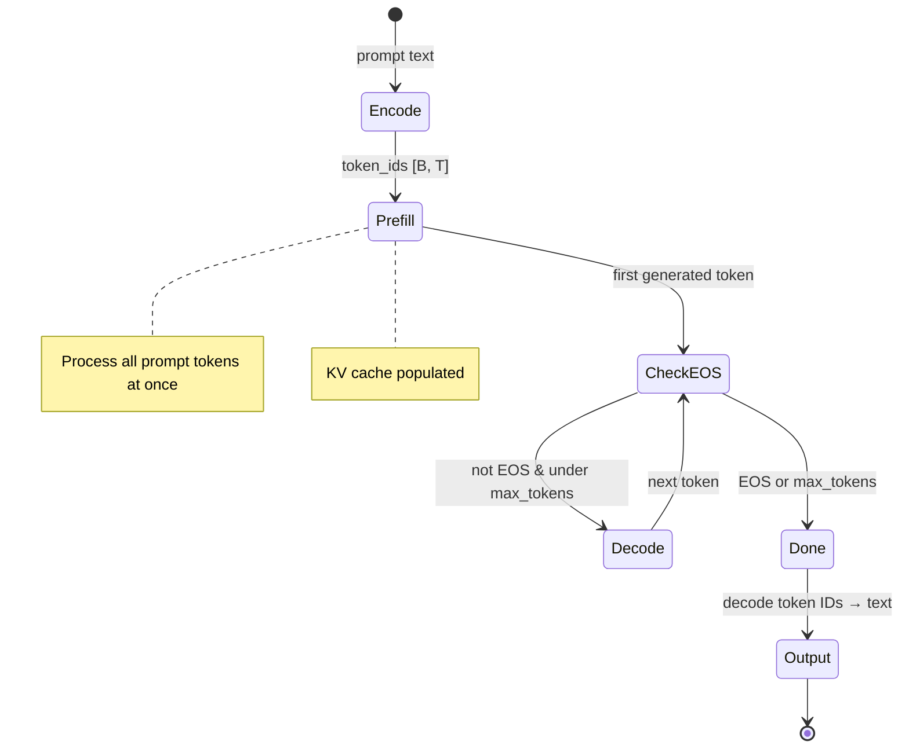
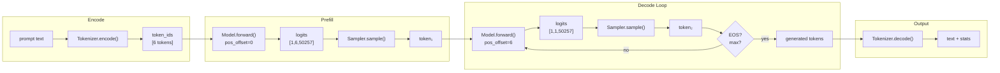

# Chapter 7 -- Component Diagram: The Skeleton Speaks

## Generation Pipeline

**Figure 7.1** — Generation pipeline components. GreedySampler is new in this chapter; Model and TokenizerBackend were implemented in ch04-06.

## Generation Loop State Machine

**Figure 7.2** — Generation loop state machine. Prefill runs once; decode loops until EOS or max_tokens.

## Data Flow Through Generation

**Figure 7.3** — End-to-end data flow from prompt text to generated output.
