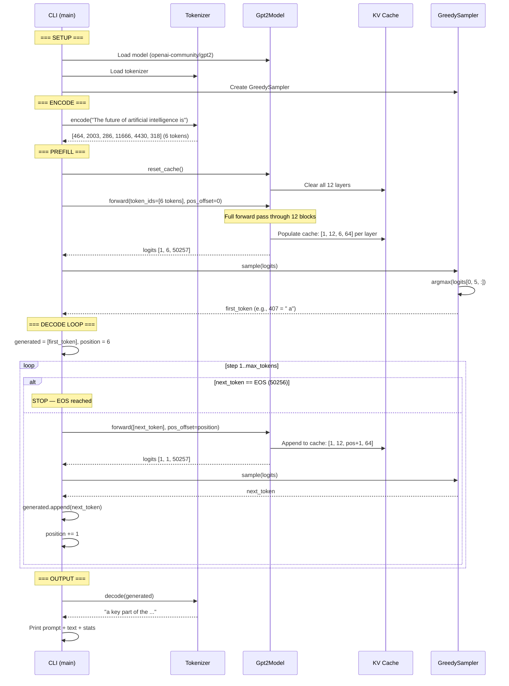
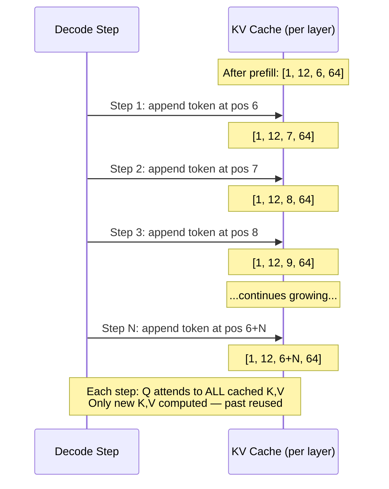

# Chapter 7 -- Sequence Diagram: The Skeleton Speaks

## Diagram 1: Full Generation Flow

**Figure 7.4** — Complete generation flow: encode → prefill → decode loop → output.

## Diagram 2: KV Cache Growth During Generation

**Figure 7.5** — KV cache grows by one position per decode step. This is why generation without a cache would be O(n²) — each step would recompute all previous attention.
