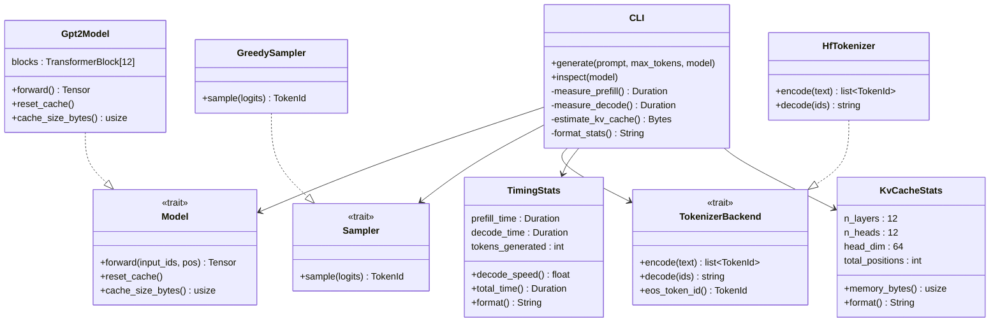
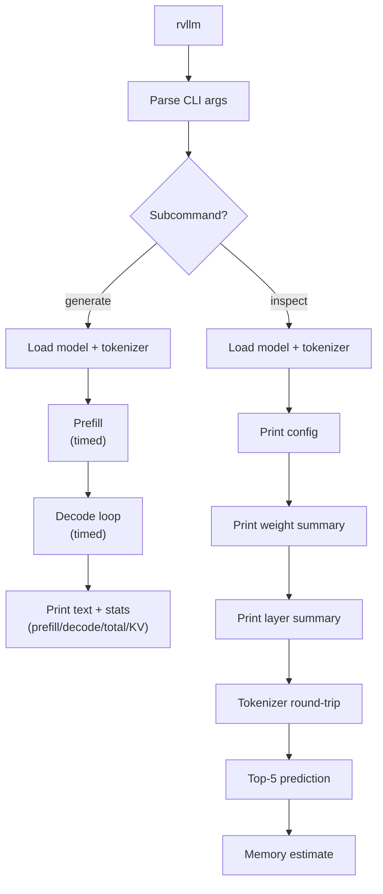

# Chapter 8 -- Component Diagram: Fit and Finish

## MVP Architecture (Complete)

**Figure 8.1** — MVP architecture with timing and KV cache stats. New in ch08: TimingStats, KvCacheStats, cache_size_bytes() on Model trait.

## CLI Subcommand Flow

**Figure 8.2** — Both `generate` and `inspect` subcommands, showing the MVP's complete CLI surface.
