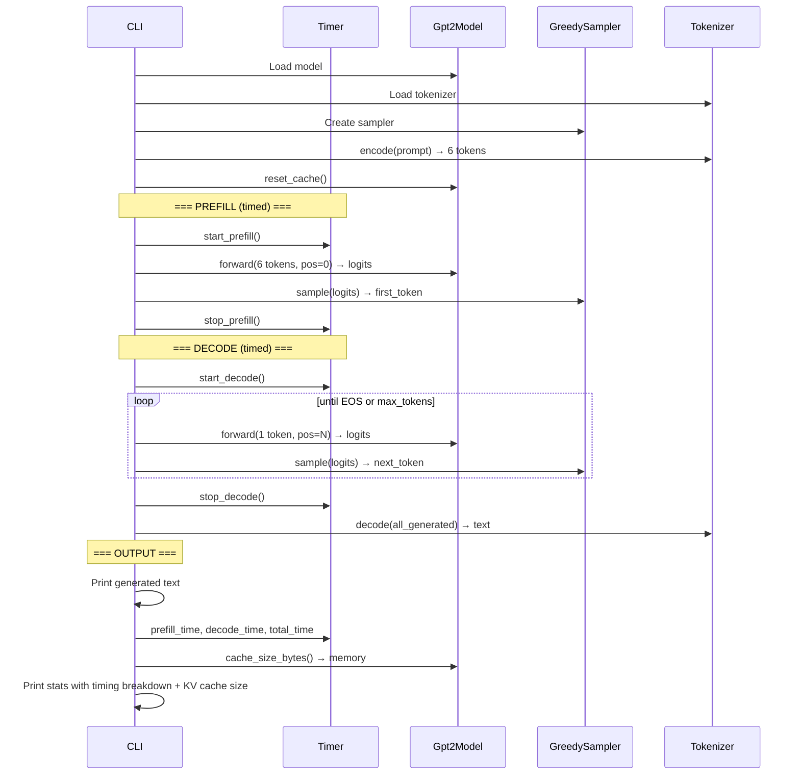
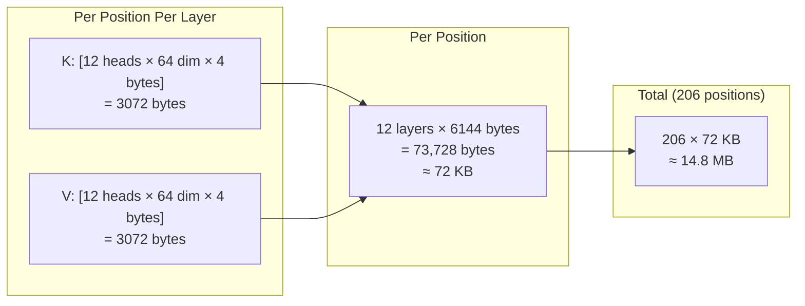

# Chapter 8 -- Sequence Diagram: Fit and Finish

## Diagram 1: Generate with Timing Breakdown

**Figure 8.3** — Generation flow with separate prefill and decode timing plus KV cache memory reporting.

## Diagram 2: KV Cache Memory Calculation

**Figure 8.4** — KV cache memory breakdown for GPT-2 with a 206-position sequence (6 prompt + 200 generated).
