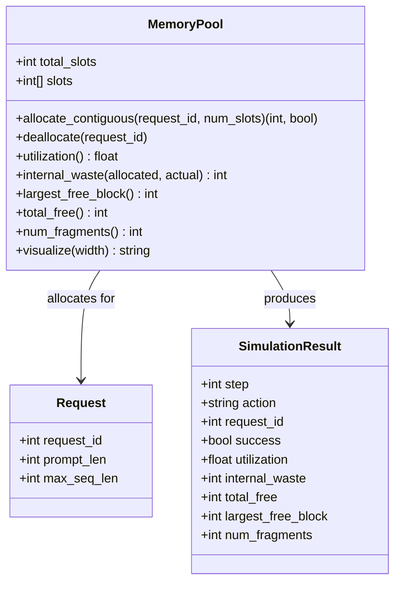
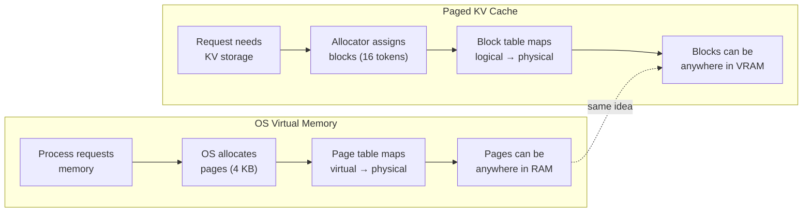

# Chapter 9: Component Diagram

## Memory Pool Simulator — Class Structure

**Figure 9.1** — Memory pool simulator components. The pool manages slot-level allocation; requests describe what each sequence needs; results capture the state after each operation.

## Fragmentation Types

```mermaid
graph TB
    subgraph "Internal Fragmentation"
        A1["Request A<br/>needs 10 tokens"] --> A2["Allocated 30 slots<br/>(max_seq_len)"]
        A2 --> A3["20 slots wasted<br/>inside the allocation"]
    end

    subgraph "External Fragmentation"
        B1["45 free slots<br/>scattered across pool"] --> B2["Largest contiguous<br/>block = 15"]
        B2 --> B3["Request needs 25<br/>contiguous slots"]
        B3 --> B4["ALLOCATION FAILS<br/>despite free memory"]
    end

    subgraph "Paged Solution (Ch 10)"
        C1["Request needs<br/>10 tokens"] --> C2["Allocate 1 block<br/>(16 tokens)"]
        C2 --> C3["< 1 block wasted<br/>blocks non-contiguous"]
    end
```

**Figure 9.2** — The two types of memory fragmentation and how paging solves both. Internal waste comes from over-allocation; external waste comes from scattered free space.

## The OS Analogy

**Figure 9.3** — The operating system solved memory fragmentation with paging. PagedAttention applies the same idea to KV caches: fixed-size blocks, a mapping table, and non-contiguous allocation.
