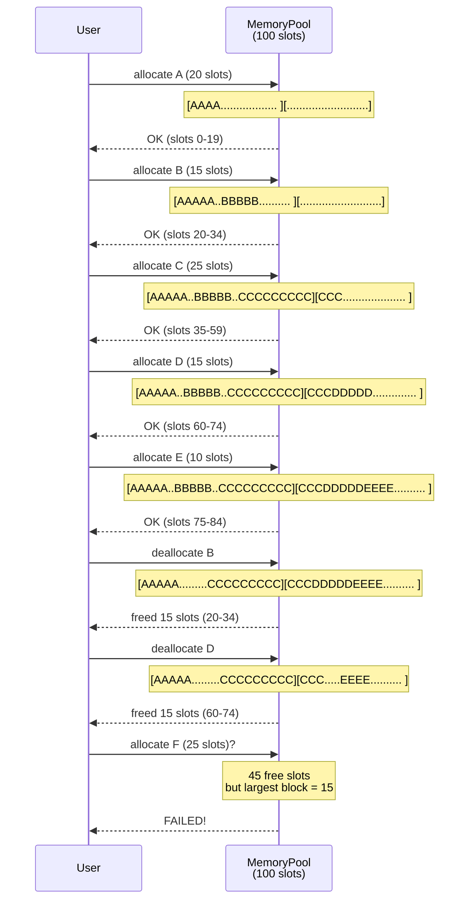
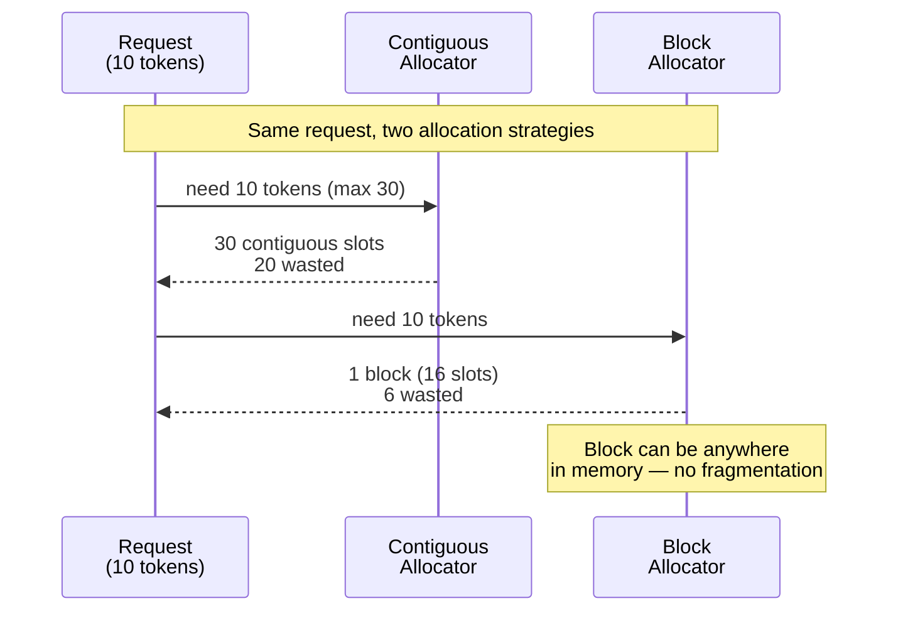

# Chapter 9: Sequence Diagram

## Scenario 2: External Fragmentation Sequence

**Figure 9.4** — External fragmentation in action. After B and D depart, 45 slots are free but split into 3 fragments. Request F needs 25 contiguous slots — impossible.

## Contiguous vs Paged Allocation

**Figure 9.5** — Contiguous allocation reserves for the worst case (max_seq_len). Paged allocation only allocates what's needed, one block at a time.
