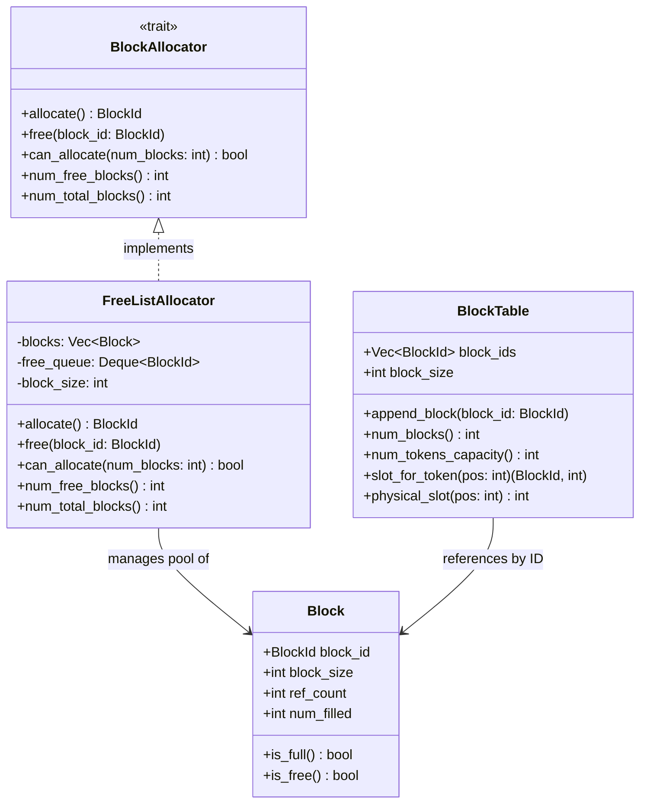
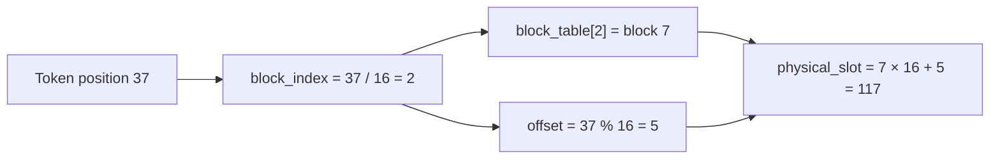
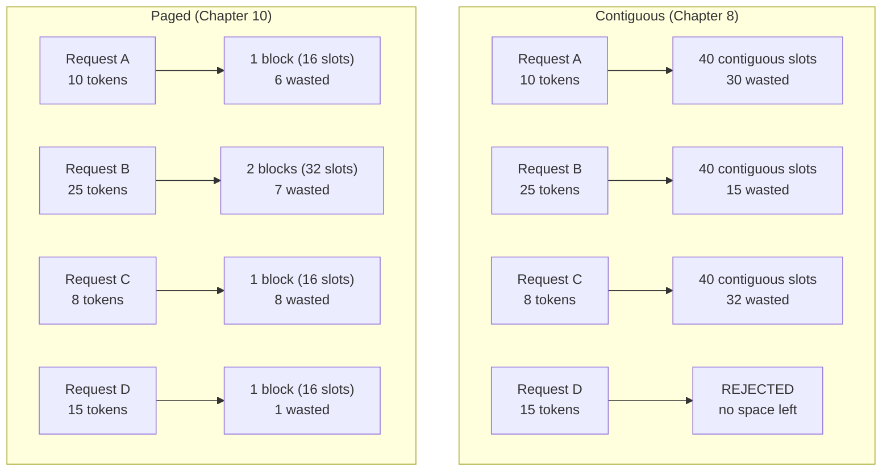

# Chapter 10: Component Diagram

## Block-Based KV Cache — Class Structure

**Figure 10.1** — PagedAttention class structure. The allocator manages a pool of blocks; each sequence holds a block table mapping logical positions to physical blocks.

## Slot Mapping: Virtual to Physical

**Figure 10.2** — Slot mapping formula. A token position is split into block index and offset, then the block table maps logical block to physical block ID.

## Contiguous vs Paged Allocation

**Figure 10.3** — Same four requests, two allocation strategies. Contiguous rejects D; paged serves all four with room to spare.
