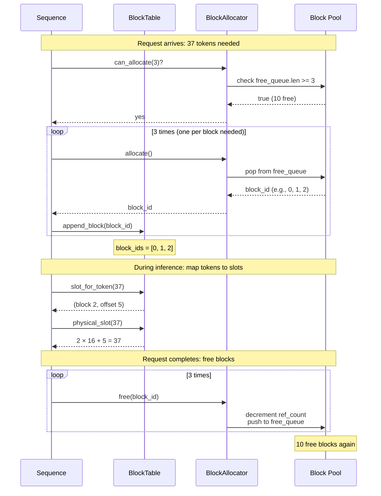
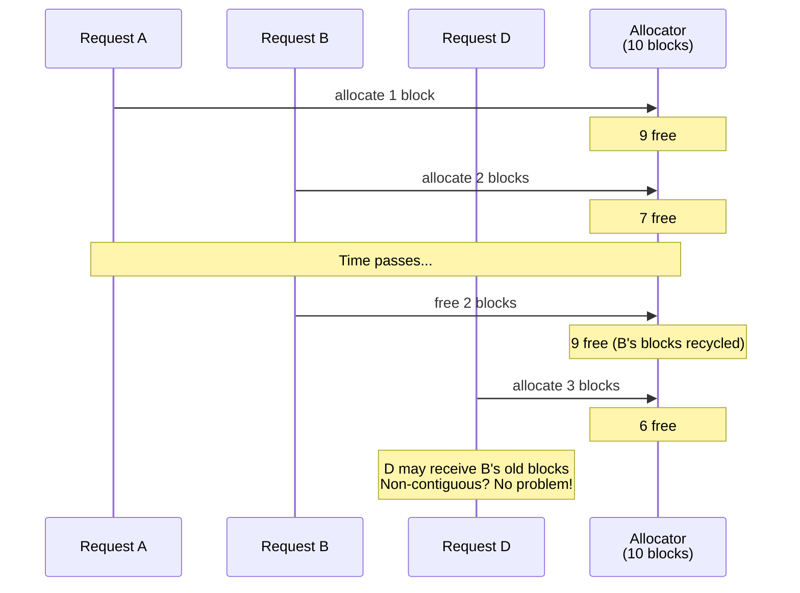

# Chapter 10: Sequence Diagram

## Block Allocation Lifecycle

**Figure 10.4** — Block allocation lifecycle. Allocate blocks on arrival, map tokens to physical slots during inference, free blocks on completion.

## Arrival and Departure — Block Reuse

**Figure 10.5** — Block reuse after deallocation. D's blocks may include B's recycled blocks. Unlike contiguous allocation, there is no fragmentation concern.
