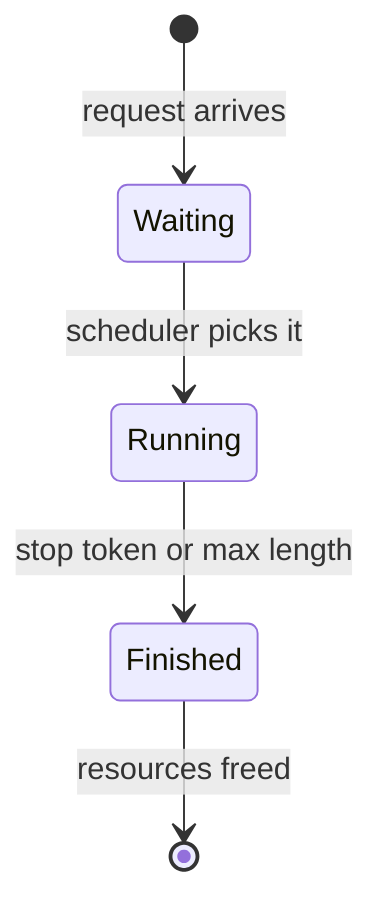
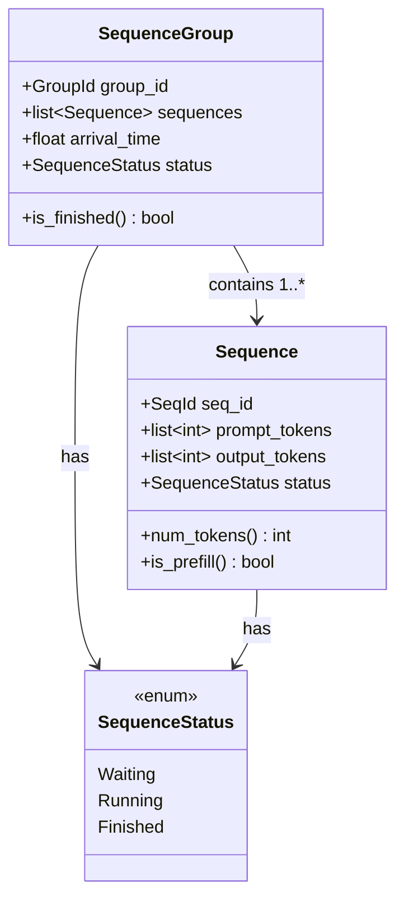
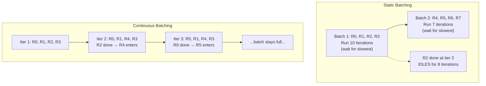
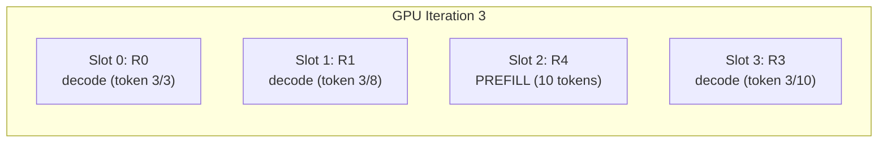

# Chapter 11: Component Diagram

## SequenceStatus State Machine

**Figure 11.1** --- SequenceStatus lifecycle. A request moves through three states, never backward. Chapter 12 adds a Swapped state for preemption.

## SequenceGroup Structure

**Figure 11.2** --- SequenceGroup and Sequence types. A group contains one or more sequences (beam search produces multiple). Each tracks its own status and token counts.

## Static vs Continuous Batching

**Figure 11.3** --- Static batching runs each batch to completion, leaving idle slots. Continuous batching swaps requests every iteration, keeping the batch full.

## Mixed Batch: Prefill + Decode

**Figure 11.4** --- A mixed batch at iteration 3. Three requests are in decode phase (generating one token each), while R4 just entered and runs prefill (processing all prompt tokens at once). The scheduler manages both in the same GPU pass.
