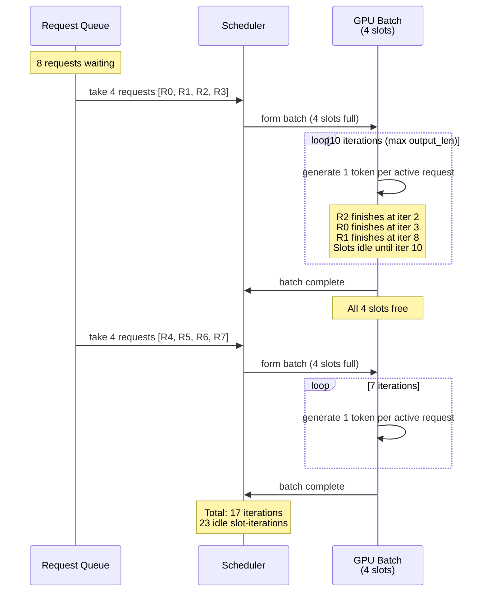
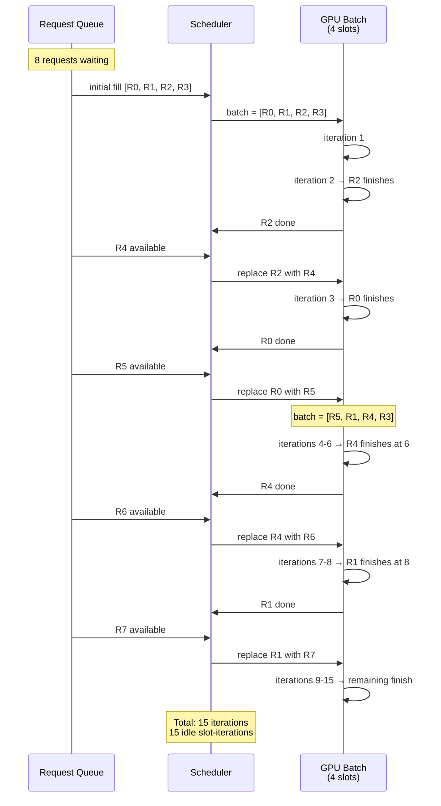
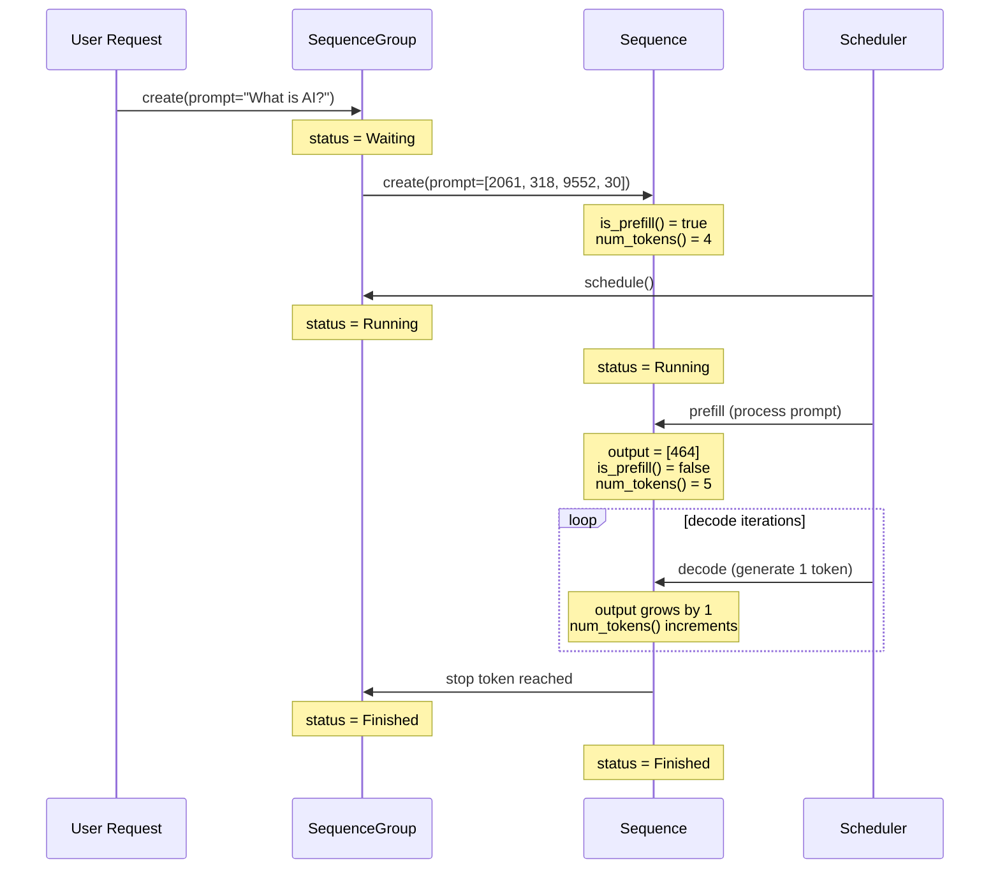

# Chapter 11: Sequence Diagram

## Static Batching Flow

**Figure 11.5** --- Static batching sequence. The scheduler waits for the entire batch to finish before forming a new one. Fast requests idle while waiting for the slowest.

## Continuous Batching Flow

**Figure 11.6** --- Continuous batching sequence. The scheduler checks every iteration. When a request finishes, it is immediately replaced by a waiting request. The batch stays full as long as requests are queued.

## Sequence Lifecycle

**Figure 11.7** --- Sequence lifecycle within a SequenceGroup. The sequence transitions from Waiting through Running (prefill then decode) to Finished. The group's status mirrors its sequences.
