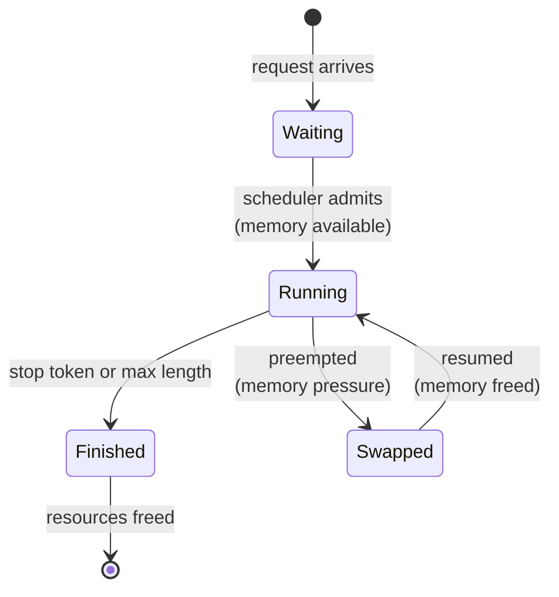
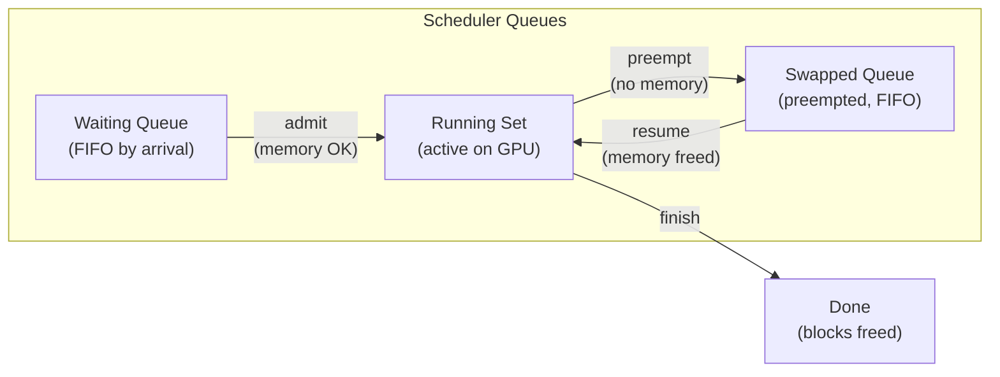
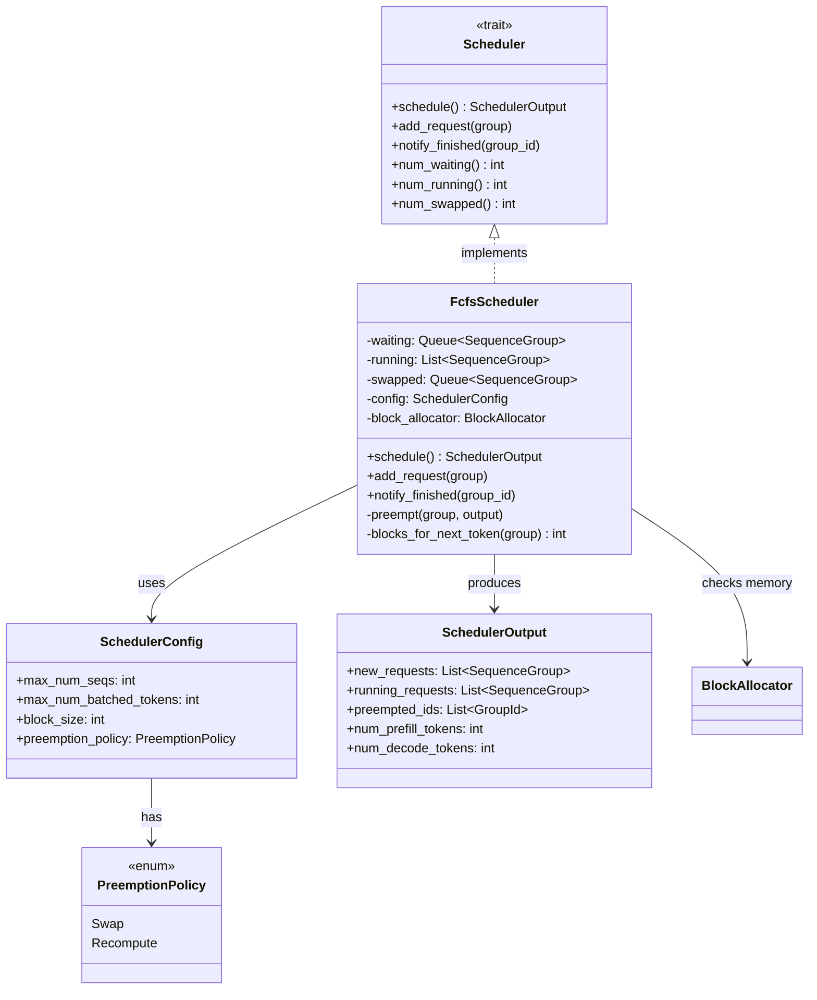
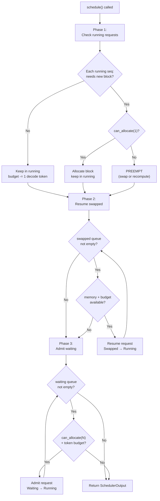
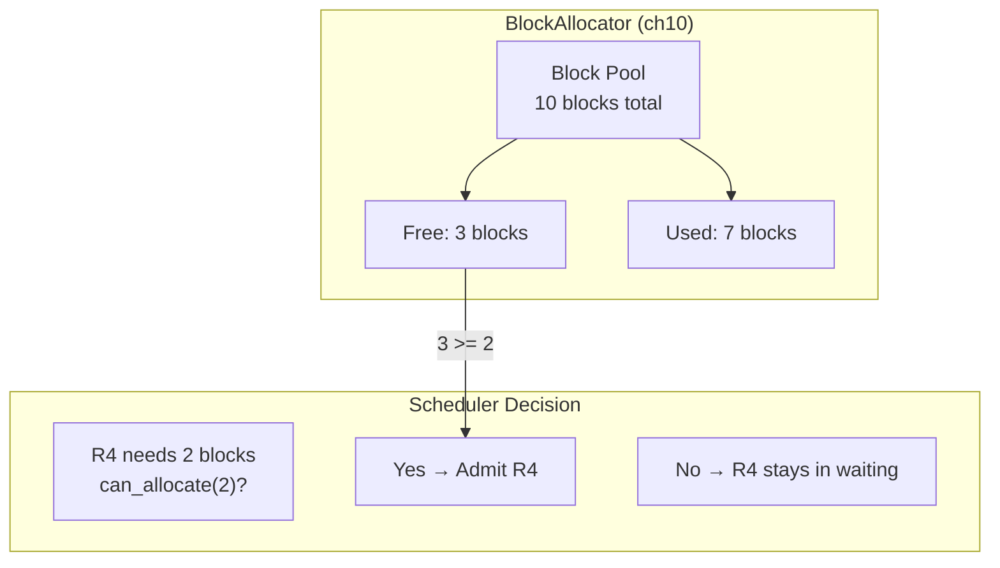

# Chapter 12: Component Diagram

## SequenceStatus State Machine (Updated)

**Figure 12.1** --- Updated SequenceStatus with Swapped state. A running request can be preempted to Swapped when memory runs out, then resumed when blocks become available. Chapter 11's three-state machine becomes four.

## Three-Queue Architecture

**Figure 12.2** --- The scheduler's three queues. Requests flow from Waiting to Running when admitted. Under memory pressure, Running requests can be preempted to Swapped. When memory frees up, Swapped requests resume.

## Scheduler Class Structure

**Figure 12.3** --- Scheduler class hierarchy. The Scheduler trait defines the interface. FcfsScheduler implements it with three queues and FCFS ordering. It consults the BlockAllocator before admitting requests.

## Schedule Algorithm Flow

**Figure 12.4** --- The schedule() algorithm in three phases. Phase 1 ensures running requests can continue (preempting if not). Phase 2 tries to resume swapped requests. Phase 3 admits new requests from the waiting queue. Each phase respects both memory and batch-size budgets.

## Memory-Aware Admission

**Figure 12.5** --- Memory-aware admission. The scheduler asks the BlockAllocator if enough free blocks exist before admitting a request. This prevents overcommitting GPU memory.
