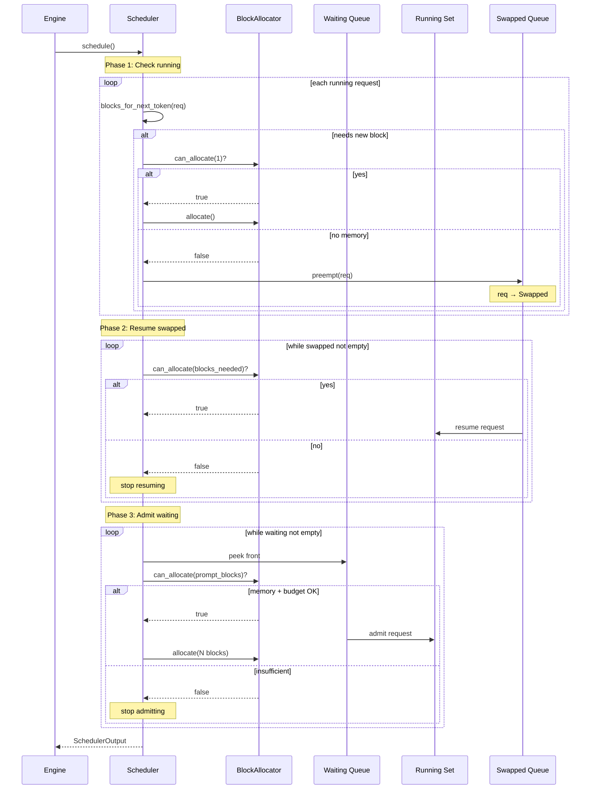
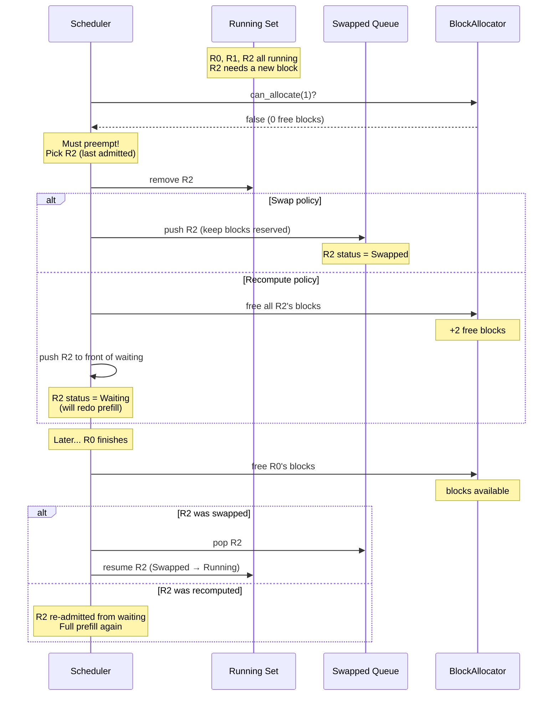
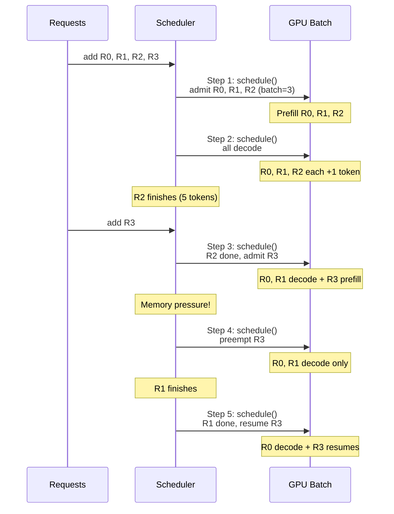

# Chapter 12: Sequence Diagram

## Schedule Step — Three-Phase Algorithm

**Figure 12.6** --- The three-phase schedule() algorithm. Phase 1 ensures running requests can continue (preempting if memory is exhausted). Phase 2 tries to bring back swapped requests. Phase 3 admits new requests from the waiting queue. The BlockAllocator gates every admission.

## Preemption and Recovery

**Figure 12.7** --- Preemption and recovery under both policies. Swap preserves block assignments for fast resume. Recompute frees blocks immediately but requires re-doing prefill when the request is re-admitted.

## Multi-Step Lifecycle

**Figure 12.8** --- Five-step lifecycle showing the full range of scheduler actions: admission, decoding, finishing, preemption, and resumption. R3's journey through Waiting, Running, Swapped, and back to Running demonstrates the four-state machine.
