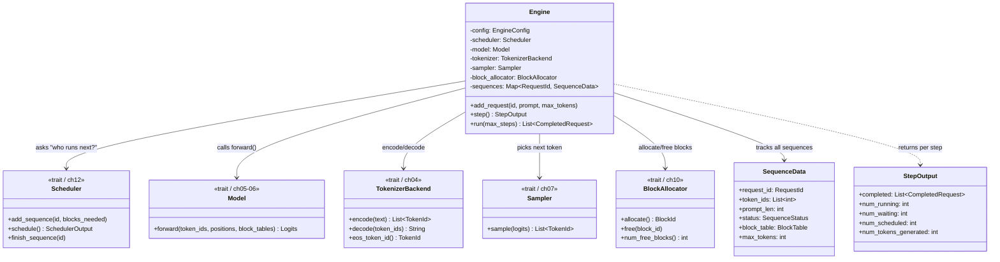
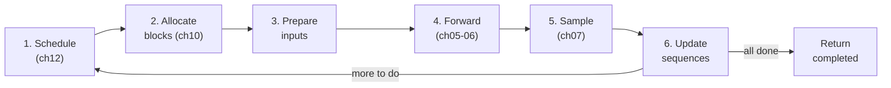
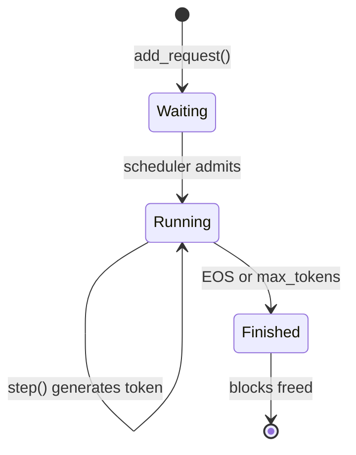

# Chapter 13: Component Diagram

## Engine — The Orchestrator

**Figure 13.1** — Engine class structure. The Engine holds references to five trait-based components (scheduler, model, tokenizer, sampler, block allocator) and a map of sequence data. The `step()` method orchestrates them all.

## The step() Pipeline

**Figure 13.2** — The six phases of `step()`. Each iteration flows left to right: schedule, allocate, prepare, forward, sample, update. If sequences remain, loop back to schedule.

## Request Lifecycle State Machine

**Figure 13.3** — Sequence lifecycle. A request starts as Waiting, moves to Running when the scheduler admits it, stays Running while generating tokens, and transitions to Finished when a stop condition is met.
