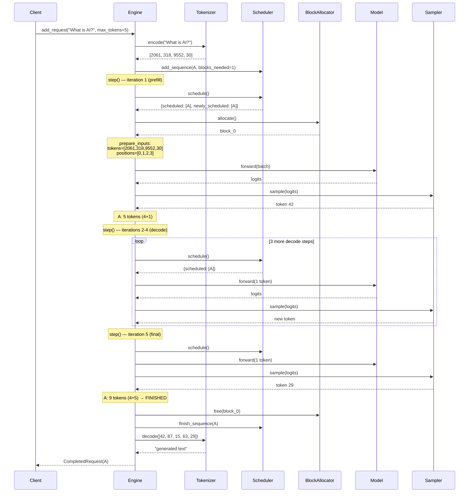
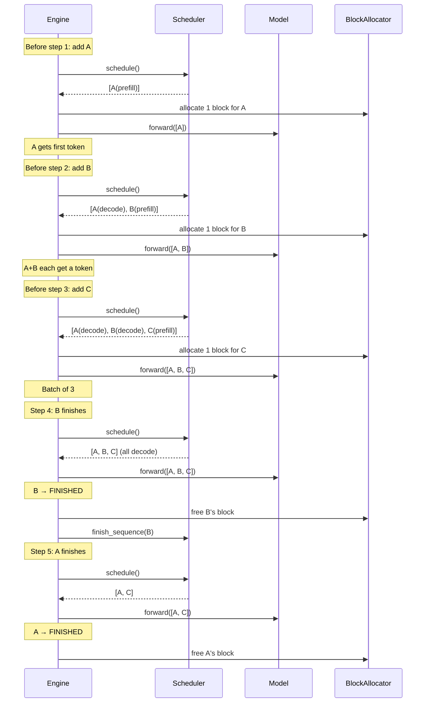

# Chapter 13: Sequence Diagram

## Single Request — Full Lifecycle

**Figure 13.4** — Full lifecycle of a single request through the engine. Five step() iterations: one prefill, four decodes. Blocks are allocated on admission and freed on completion.

## Multiple Requests — Staggered Batching

**Figure 13.5** — Staggered arrivals. Requests join the batch at different steps. The batch grows as requests arrive and shrinks as requests finish. The scheduler and block allocator handle the bookkeeping; the engine just calls step().
