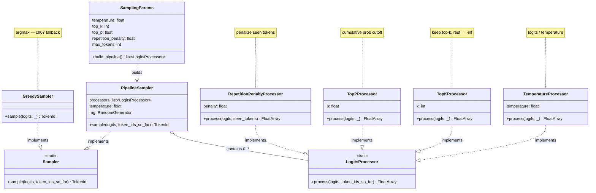
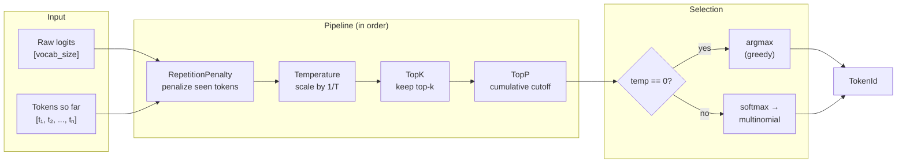
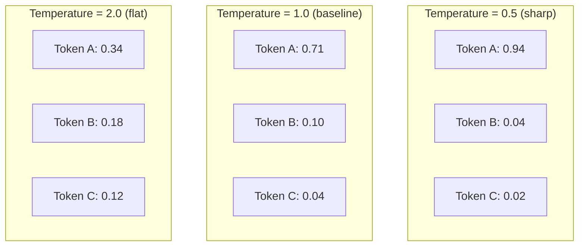

# Chapter 14 -- Component Diagram: Sampling Strategies

## LogitsProcessor Pipeline

**Figure 14.1** — Sampling pipeline components. LogitsProcessor is the new trait; each strategy implements it. PipelineSampler composes processors and implements the Sampler trait from ch07.

## Pipeline Data Flow

**Figure 14.2** — Data flow through the sampling pipeline. Processors transform logits in sequence; final selection is either greedy (argmax) or stochastic (multinomial).

## Temperature Effect on Distribution

**Figure 14.3** — Temperature controls the sharpness of the probability distribution. Lower temperature concentrates probability on the top token; higher temperature spreads it out.
