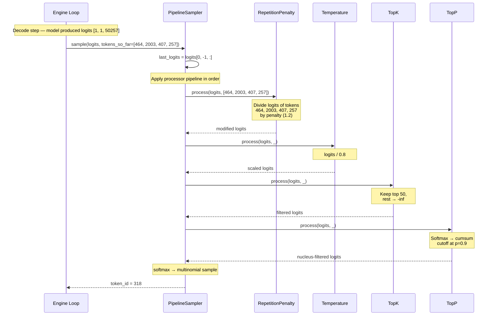
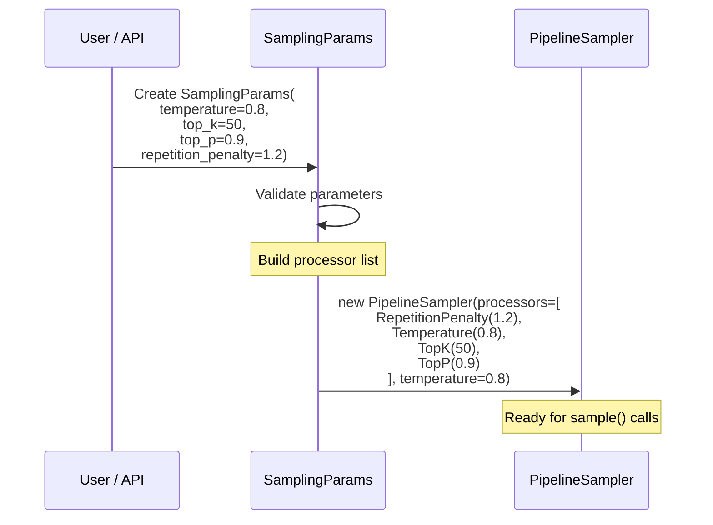
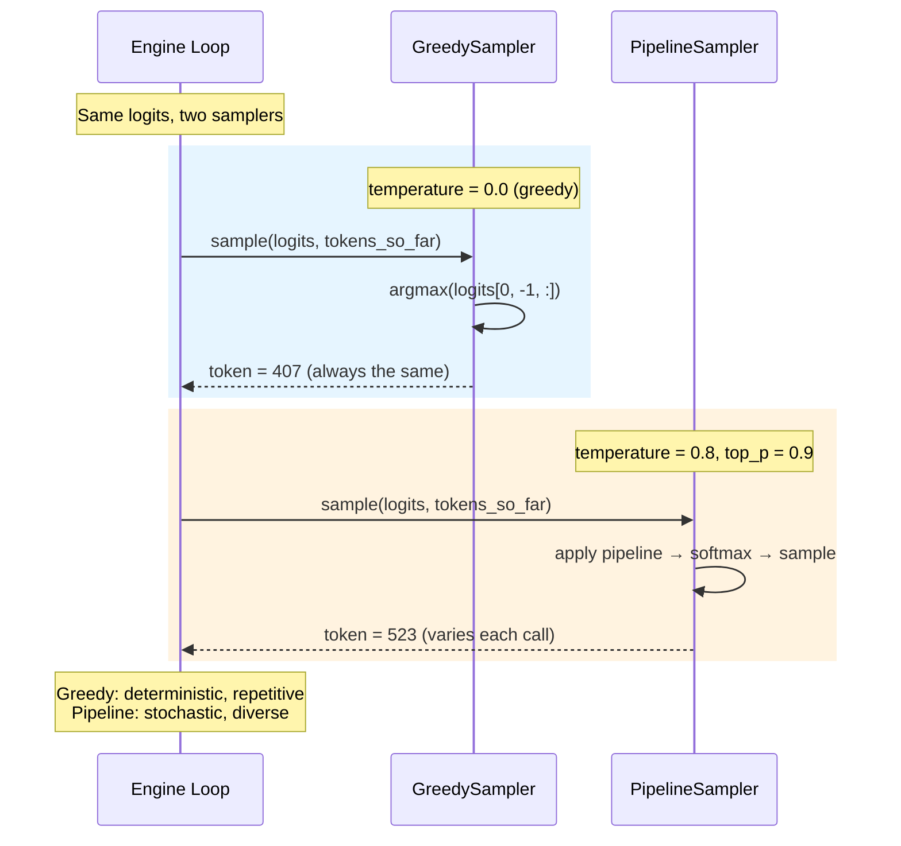

# Chapter 14 -- Sequence Diagram: Sampling Strategies

## Diagram 1: Pipeline Sampling Flow

**Figure 14.4** — A single sampling step through the full pipeline. Each processor transforms the logits in order: repetition penalty, temperature, top-k, top-p. Then softmax and multinomial selection.

## Diagram 2: SamplingParams → Pipeline Construction

**Figure 14.5** — SamplingParams validates user input and constructs the pipeline sampler with the correct processors in order.

## Diagram 3: Greedy vs. Pipeline Sampling

**Figure 14.6** — Greedy always returns the same token. Pipeline sampling introduces controlled randomness for more diverse output.
